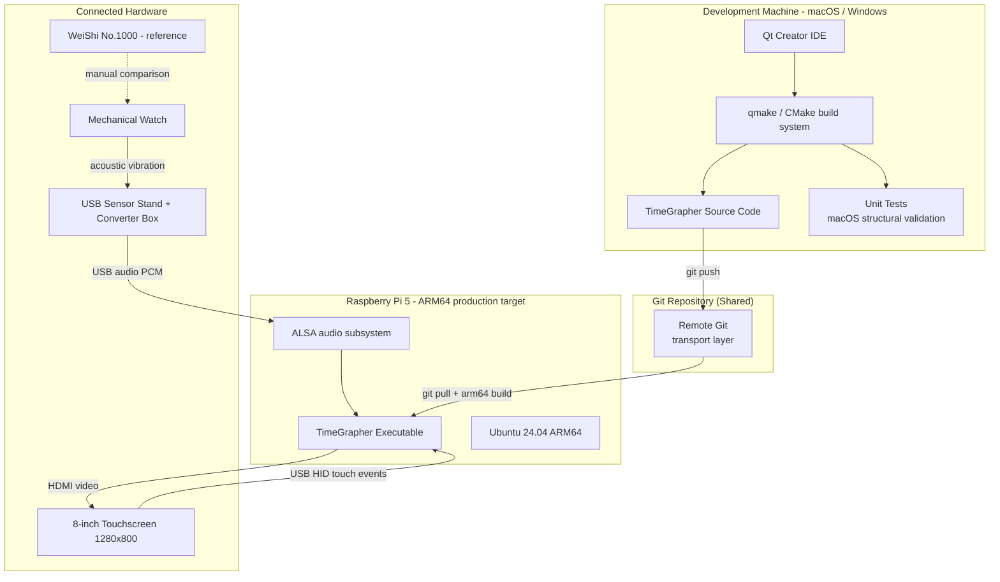

# Deployment View: Build-Deploy Pipeline

This view shows which hardware nodes run which software artifacts and what the deploy path is from the developer's machine to the Raspberry Pi 5. It answers: "How does code built on macOS reach the target hardware for experiments and the final demo?"

## Element Catalog

#### Dev Machine (macOS / Windows)
- Primary development environment: Qt Creator, C++17 toolchain.
- Runs the full build, unit tests, and structural validation (layered rule checks, DSM verification).
- Executes macOS-side experiments (e.g., EXP-03 baseline latency measurements).
- Does **not** require microphone hardware for structural validation — `SimWorker` provides a synthetic signal.

#### Git Repository (Shared)
- The transport layer between dev machine and RPi.
- Dev machine pushes; RPi pulls. No file transfer or re-imaging required.
- Keeps the deploy cycle to two commands on the RPi: `git pull` and rebuild.

#### Raspberry Pi 5 (Target Hardware)
- ARM64, Ubuntu 24.04, 4-core Cortex-A76, 8 GB RAM.
- Runs the production binary: AudioCapture via ALSA, DSPWorker, Qt 6 GUI.
- Used for all hardware experiments (EXP-01, EXP-02, EXP-03 RPi runs) and the M3 final demo.
- **Constraint**: AGC must be disabled on every boot (`alsamixer`) — AGC enabled causes Amplitude and Beat Error measurements to be unreliable.
- Thermal throttling at 85°C observed in EXP-02 baseline runs — active cooling required for sustained operation.

#### USB Sensor Stand + Converter Box
- Appears to the OS as a USB Audio Class device accessed via ALSA.
- Supplies PCM samples at the configured sample rate (default 96,000 sps per ADR-001).

#### 8-inch Touchscreen (1280×800)
- Receives rendered GUI frames via HDMI. Sends touch events back via USB HID.
- No software runs on the display itself.

#### WeiShi No.1000
- Standalone commercial watch timing machine used as the accuracy reference.
- Not integrated into TimeGrapher software. Comparison performed manually by the operator for EXP-01 (QAS-2).

## Deploy Cycle

The standard cycle from code change to RPi validation:

1. Dev machine: edit → build → run unit tests (macOS toolchain)
2. Dev machine: `git push`
3. RPi: `git pull`
4. RPi: build (arm64 toolchain)
5. RPi: run experiment or validate

**Why this shortens the cycle**: structural validation (layer rule violations, API contracts) runs on macOS. The RPi is reserved for hardware-dependent experiments and the final demo. No repeated re-imaging or manual file transfers.

## Boot Checklist (Every RPi Session)

| Step | Action | Reason |
|------|--------|--------|
| 1 | `alsamixer` → disable AGC | AGC on → Amplitude and Beat Error unreliable |
| 2 | Confirm sample rate in ALSA config | Must match ADR-003 decision (96 kHz or 48 kHz fallback) |
| 3 | Attach heatsink / fan | Prevents thermal throttle at 85°C during sustained experiment runs |
| 4 | `./run_exp.sh` | Structured CSV logging for EXP analysis |

## Hardware Component Allocation

| Hardware | Software Component | Communication |
|----------|-------------------|---------------|
| RPi 5 (ARM64, 8 GB) | All runtime components | — (host node) |
| USB Sensor Stand + Converter | AudioCapture (LiveCapture via ALSA) | USB Audio Class |
| 8-inch Touchscreen (1280×800) | Qt GUI rendering | HDMI video out + USB HID touch in |
| Dev Machine (macOS / Windows) | Qt Creator, build toolchain | git push/pull deploy only |
| WeiShi No.1000 (standalone) | Not integrated | Manual reference comparison |

## Related ADRs
- [ADR-001 — DSP Offload Thread](../ADRs/ADR001-dsp-offload-thread.md) — thread model confirmed on macOS; RPi confirmation via EXP-02 and EXP-03
- [ADR-004 — Qt as Application Framework](../ADRs/ADR004-qt-framework.md)

## Related Views
- [Context Diagram](context-diagram.md)
- [Runtime View](runtime-view.md) — shows the runtime components that execute on the RPi node
- [Module View](module-view.md) — module structure validated on dev machine before RPi deployment
