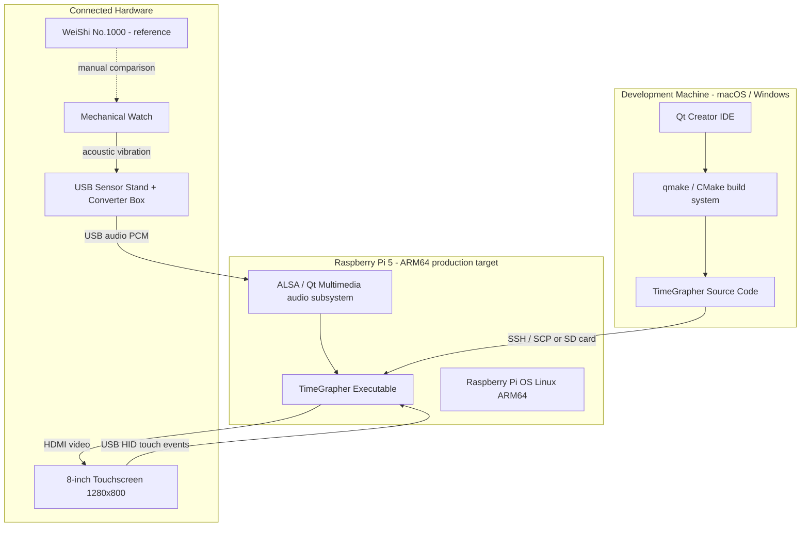

# Deployment View

This view shows where software components are allocated on hardware nodes and how those nodes communicate at runtime. The TimeGrapher system runs as a **single native Qt executable** on Raspberry Pi 5; no network services or containers are involved.

## Element Catalog

#### Raspberry Pi 5 (ARM64, 8 GB RAM)
- The sole production runtime node.
- Hosts the complete TimeGrapher executable and all Qt runtime libraries.
- Thermal throttling at 85°C was observed in EXP-02 baseline; a heatsink or fan is required for sustained operation.

#### TimeGrapher Executable
- A single Qt binary deployed to RPi.
- Manages three OS threads at runtime: Audio Thread, DSP Thread, and UI Thread (see [Runtime View](runtime-view.md)).
- No network communication; all data stays on-device.

#### USB Sensor Stand + Converter Box
- Appears to the OS as a USB Audio Class device accessed via ALSA.
- Supplies PCM samples at the configured sample rate (default 96,000 sps) to AudioCapture.

#### Development Machine
- Used only at build time; no runtime role.
- Qt Creator cross-compiles the ARM64 binary, which is then transferred to RPi via SSH / SCP or SD card.

## Hardware Component Allocation

| Hardware | Software Component | Communication |
|----------|-------------------|---------------|
| RPi 5 (ARM64, 8 GB) | All runtime components | — (host node) |
| USB Sensor Stand + Converter | AudioCapture (LiveCapture) | USB Audio via ALSA |
| 8-inch Touchscreen (1280×800) | Qt GUI rendering | HDMI video out + USB HID touch in |
| Dev Machine (macOS / Windows) | Qt Creator, build toolchain | SSH / SCP deploy only |
| WeiShi No.1000 (standalone) | Not integrated | Manual reference comparison |

## Communication Channels

| Channel | Protocol | Latency Concern |
|---------|----------|-----------------|
| Watch → Converter | Physical vibration | Mechanical coupling must be secure |
| Converter → RPi | USB Audio (ALSA, PCM) | Buffer size determines capture latency; contributes to QAS-3 budget |
| RPi → Touchscreen | HDMI | 60 Hz display refresh; within QAS-3 process-to-display budget |
| Touch → RPi | USB HID | Negligible for UI interaction |
| Dev Machine → RPi | SSH / SCP | One-time deploy; not a runtime channel |

## Related ADRs
- [ADR 004 — Qt as Application Framework](../ADRs/ADR004-qt-framework.md)

## Related Views
- [Context Diagram](context-diagram.md)
- [Runtime View](runtime-view.md)
