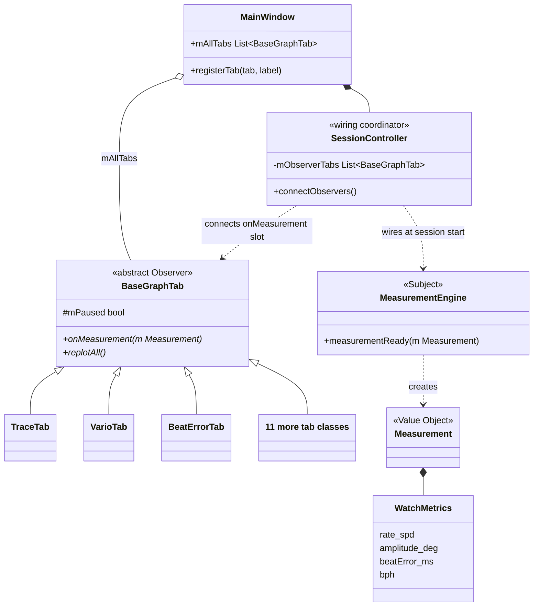

# Decomposition View — Graph Tab (Observer Pattern)

This view decomposes the Presentation layer into its internal components, focusing on the `BaseGraphTab` interface and the `MainWindow` tab registry. It answers the question: **What must a developer implement to add a new graph tab?**

> `MeasurementEngine` has no compile-time knowledge of any tab. `SessionController` is the wiring coordinator — it connects the `measurementReady` signal to every tab's `onMeasurement` slot at session start. Per-beat delivery is Qt signal-slot only.

## Element Catalog

#### BaseGraphTab (abstract class / Observer)
- Abstract C++ base class that every graph tab must implement.
- Defines the Observer contract: `onMeasurement(Measurement)` — wired by `SessionController` to `MeasurementEngine::measurementReady`.
- Lazy Rendering contract ([ADR-002](../ADRs/ADR002-lazy-rendering.md)): `onMeasurement()` accumulates data always; skips `replotAll()` when the tab is not visible. On tab switch, `showEvent()` triggers a catch-up `replotAll()`.
- No direct reference to Signal Processing or Acquisition layers.

#### MainWindow (tab registry)
- Owns `mAllTabs` and the `registerTab()` entry point — the single place where a new tab is registered.
- Adding a new tab requires exactly three changes in `MainWindow`: declare a member, construct and register it, include its header.

#### SessionController (wiring coordinator)
- Stores the observer list from `connectObservers()`; applies Qt `connect()` calls at session start.
- Not in the per-beat data path after wiring completes.
- `MeasurementEngine` emits `measurementReady` only; it never references a tab type.

#### 14 Concrete Tab Implementations

| Group | Tab | Display purpose |
|-------|-----|-----------------|
| Signal / Scope | TraceTab | Raw waveform trace |
| | RateScopeTab | Rate deviation scope |
| | SweepScopeTab | Sweep oscilloscope |
| | FilterScopeTab | Filtered signal scope |
| | BeatNoiseScopeTab | Beat noise scope |
| | SoundPrintTab | Acoustic fingerprint |
| Measurement | VarioTab | Rate deviation (s/d) |
| | BeatErrorTab | Beat error (ms) |
| | EscapementTab | Escapement analysis |
| | LongTermTab | Long-term rate trend |
| | SequenceTab | Beat sequence |
| Analysis | SpectrogramTab | Frequency spectrogram |
| | WaveformCompTab | Waveform comparison |
| | RadarChartTab | Multi-metric radar |

## Behavior

**Tab registration (once at startup)**:
`MainWindow` calls `SessionController.connectObservers(mAllTabs)`. `SessionController` stores the list; no Qt `connect()` calls yet.

**Session start (each time the user clicks Start)**:
`SessionController` iterates `mObserverTabs` and connects `MeasurementEngine::measurementReady` → `BaseGraphTab::onMeasurement` (×14) via `QueuedConnection`. Also connects the Results label as a second observer.

**Per-beat delivery**:
`MeasurementEngine` emits `measurementReady(Measurement)`. Qt dispatches to all 14 tab slots and the Results label on the main thread. Each tab applies the visibility guard before rendering.

**Tab switch catch-up**:
When the user switches to a tab, `showEvent()` fires `replotAll()` immediately — the newly visible tab shows the latest data in the next event loop iteration.

**Extension cost validated (EXP-04)**:

| Measure | Target | Result |
|---------|:------:|:------:|
| Files changed per new tab | ≤ 3 | ✅ 2–3 |
| Signal Processing / Acquisition refs from Presentation | 0 | ✅ 0 (DSM verified) |
| Observer contract compliance (14 tabs) | 100% | ✅ 37 unit tests passing |

## Related ADRs
- [ADR-006 — BaseGraphTab Observer Pattern](../ADRs/ADR006-observer-pattern.md)
- [ADR-002 — Lazy Rendering](../ADRs/ADR002-lazy-rendering.md)
- [ADR-003 — Four-Layer Architecture](../ADRs/ADR003-layered-architecture.md)

## Related Views
- [Module View](module-view.md)
- [Runtime View](runtime-view.md)
