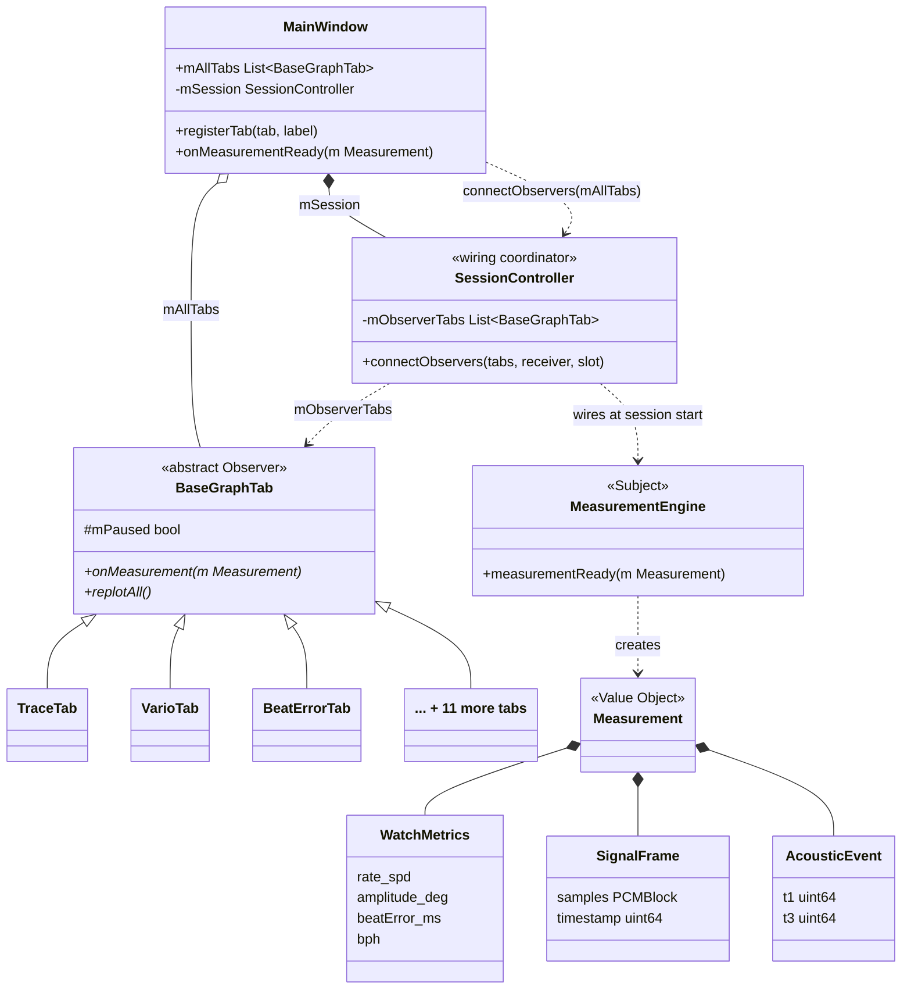

# Decomposition View — Graph Tab (Observer Pattern)

This view decomposes the Presentation layer into its internal components, focusing on the `BaseGraphTab` interface and the `MainWindow` tab registry. It answers the question: **What must a developer implement to add a new graph tab?**

> `MeasurementEngine` has no compile-time knowledge of any tab. `SessionController` is the wiring coordinator — it stores `mObserverTabs` and applies `connect()` at session start. Per-beat delivery is Qt signal-slot only.

## Element Catalog

#### BaseGraphTab (abstract class / Observer)
- Abstract C++ base class that every graph tab must implement.
- Key slot: `onMeasurement(Measurement)` — wired from `MeasurementEngine::measurementReady` via `SessionController` at session start.
- Lazy Rendering contract ([ADR-002](../ADRs/ADR002-lazy-rendering.md)): `onMeasurement()` accumulates data always; skips `replotAll()` when the tab is not visible. `showEvent()` triggers a catch-up `replotAll()` when the tab becomes visible.
- No direct reference to Signal Processing or Acquisition layers.

#### MainWindow (tab registry + results observer)
- Owns `mAllTabs` and the `registerTab()` entry point — the single place where a new tab is registered.
- Calls `SessionController::connectObservers(mAllTabs)` at startup.
- `onMeasurementReady(m)` updates the Results label — a second observer on the same `measurementReady` signal.

#### SessionController (wiring coordinator)
- Stores the observer list from `connectObservers()`; applies Qt `connect()` calls at session start.
- Not in the per-beat data path after wiring completes.
- `MeasurementEngine` emits `measurementReady` only; it has zero compile-time knowledge of any tab type.

#### Measurement (Value Object)
- Immutable struct carrying three sub-objects per beat: `WatchMetrics` (rate, amplitude, beat error, BPH), `SignalFrame` (PCM samples + timestamp), and `AcousticEvent` (T1 and T3 timestamps).
- Passed by value via `QueuedConnection` — each tab receives its own copy; mutation by one tab cannot affect another.

#### 14 Concrete Tab Implementations

| Group | Tab | Display purpose |
|-------|-----|-----------------|
| Signal / Scope | TraceTab | Raw waveform trace |
| | RateScopeTab | Rate deviation scope |
| | SweepScopeTab | Sweep oscilloscope |
| | FilterScopeTab | Filtered signal scope |
| | BeatNoiseScopeTab | Beat noise scope |
| | SoundPrintTab | Acoustic fingerprint |
| Measurement | VarioTab | Rate deviation (s/d) |
| | BeatErrorTab | Beat error (ms) |
| | EscapementTab | Escapement analysis |
| | LongTermTab | Long-term rate trend |
| | SequenceTab | Beat sequence |
| Analysis | SpectrogramTab | Frequency spectrogram |
| | WaveformCompTab | Waveform comparison |
| | RadarChartTab | Multi-metric radar |

## Behavior — Three Wiring Phases

**Phase 1 — Register observers (once at startup)**:
`MainWindow` calls `SessionController.connectObservers(mAllTabs)`. `SessionController` stores the list in `mObserverTabs`. No Qt `connect()` calls yet.

**Phase 2 — Wire signal-slot (each session start)**:
When the user clicks Start, `SessionController` iterates `mObserverTabs` and calls `connect(MeasurementEngine::measurementReady, tab::onMeasurement, QueuedConnection)` for each of the 14 tabs. Also connects the Results label as a second observer on the same signal.

**Phase 3 — Deliver measurement (per DSP block)**:
`MeasurementEngine` emits `measurementReady(Measurement)`. Qt dispatches to all 14 tab slots and the Results label on the main thread. Each tab applies the visibility guard before rendering. Non-visible tabs accumulate data only.

**Tab switch catch-up**:
When the user switches to a tab, `showEvent()` fires `replotAll()` immediately — the newly visible tab shows the latest data in the next event loop iteration.

## Extension Cost (EXP-04 Verified)

| Measure | Target | Result |
|---------|:------:|:------:|
| Files changed per new tab | ≤ 3 | ✅ 2–3 (header + source + registration) |
| Signal Processing / Acquisition refs from Presentation | 0 | ✅ 0 — DSM verified |
| Observer contract compliance (all 14 tabs) | 100% | ✅ TestAddedTabs 20/20 · TestGraphTabs 17/17 (37 test cases) |

## Related ADRs
- [ADR-006 — BaseGraphTab Observer Pattern](../ADRs/ADR006-observer-pattern.md)
- [ADR-002 — Lazy Rendering](../ADRs/ADR002-lazy-rendering.md)
- [ADR-003 — Four-Layer Architecture](../ADRs/ADR003-layered-architecture.md)

## Related Views
- [Module View](module-view.md)
- [Runtime View](runtime-view.md)
