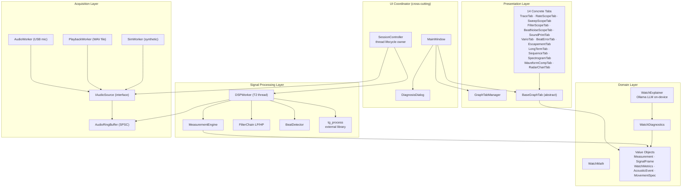

# Module View — 4-Layer Allowed-to-Use

This view shows the four-layer module structure of the TimeGrapher system and the allowed dependency directions between layers. It is the primary tool for enforcing modifiability: any new graph tab must be added to the Presentation layer only, with zero changes to lower layers.

## Element Catalog

#### UI Coordinator (cross-cutting — not a numbered layer)
- `MainWindow`: Qt top-level window; owns the tab registry (`mAllTabs`) and the `registerTab()` entry point. Reduced from ~949 lines to ~750 lines after `SessionController` extraction (i1 refactor).
- `SessionController`: extracted from `MainWindow` to own the Audio Thread (T1) and DSP Thread (T2) lifecycle. Not in the per-beat data path after session start.
- `DiagnosisDialog`: displays watch diagnosis results from `WatchDiagnostics`; reads from the Domain layer only.

#### Acquisition Layer
- `IAudioSource`: abstract Qt interface for all audio input sources — decouples audio source selection from the rest of the system.
- `AudioWorker`: live USB microphone via ALSA.
- `PlaybackWorker`: reads a pre-recorded WAV file for offline testing.
- `SimWorker`: generates a synthetic watch-like signal; used for structural validation on macOS without microphone hardware.
- `AudioRingBuffer`: lock-free SPSC ring buffer; the only data path between the Audio Thread and the DSP Thread (see [ADR-005](../ADRs/ADR005-ring-buffer-connector.md)).

#### Signal Processing Layer
- `DSPWorker`: runs on a dedicated thread (T2) introduced by [ADR-001](../ADRs/ADR001-dsp-offload-thread.md). Reads PCM from `AudioRingBuffer`; drives the full DSP pipeline; emits `measurementReady` to the Qt main thread via `QueuedConnection`. Directly owns `MeasurementEngine` — they form a single T2 pipeline unit.
- `MeasurementEngine`: computes Rate (s/d), Amplitude (°), Beat Error (ms), and BPH from the `BeatEvent` stream. Classified here (not Domain) because it is owned and driven by `DSPWorker` within the T2 loop.
- `FilterChain`: applies LP/HP biquad filter cascade to raw PCM samples.
- `BeatDetector`: detects onset and peak of T1(A) and T3(C) acoustic events.
- `tg_process`: external library in `src/external/`; called by `DSPWorker` within the T2 DSP loop.

#### Domain Layer
- Contains pure computation and value objects only: `WatchMath`, `WatchDiagnostics` (rule-based diagnosis), `WatchExplainer` (Ollama LLM, on-device), and five Value Objects (`Measurement`, `SignalFrame`, `WatchMetrics`, `AcousticEvent`, `MovementSpec`).
- No thread ownership, no Qt signal emission, no display logic.
- `WatchDiagnostics` reads the `Measurement` VO produced by Signal Processing. `WatchExplainer` reads the diagnosis result.

#### Presentation Layer
- `BaseGraphTab`: abstract C++ base class (Observer) for all graph tab widgets. Establishes the measurement-delivery contract and the lazy rendering contract ([ADR-006](../ADRs/ADR006-observer-pattern.md)).
- **14 concrete tabs**: TraceTab, RateScopeTab, SweepScopeTab, FilterScopeTab, BeatNoiseScopeTab, SoundPrintTab, VarioTab, BeatErrorTab, EscapementTab, LongTermTab, SequenceTab, SpectrogramTab, WaveformCompTab, RadarChartTab.
- Each tab is allowed to reference Domain only; references to Signal Processing or Acquisition are forbidden.

## Behavior — Dependency Rules

**Allowed-to-use rule**: each layer may only reference the layer immediately below it. No upward or skip-layer dependencies are permitted.

**Adding a new graph tab** (≤ 3 file change rule):

| Step | Files |
|------|-------|
| Implement BaseGraphTab subclass | NewTab.h + NewTab.cpp |
| Register in MainWindow | 1 line in MainWindow.cpp |
| **Total** | **≤ 3** |

Zero changes to Domain, Signal Processing, or Acquisition layers required.

**Tab addition history** (observed across three sprint rounds):

| Batch | Tabs added | Files changed per tab |
|-------|:----------:|:---------------------:|
| W2 Sprint 1 | 11 (baseline) | 2 |
| W2 Sprint 2 | +2 → 13 | 2 |
| W3 Sprint 1 | +1 → 14 | 3 ¹ |

¹ RadarChartTab reads per-position data from SequenceTab directly (not via `measurementReady`) — SequenceTab modified to expose `capturedReadings()` and `sequenceUpdated()`.

**Dependency Structure Matrix** (actual include-path trace, M2 verified):

| Used ↓ \ Using → | Presentation | UI Coord | Sig.Proc | Domain | Acquisition |
|---|:---:|:---:|:---:|:---:|:---:|
| Presentation | — | 0 | 0 | 0 | 0 |
| UI Coord | 0 | — | 0 | 0 | 0 |
| Signal Processing | 1 | 1 | — | 0 | 0 |
| Domain | 1 | 1 | 1 | — | 0 |
| Acquisition | 0 | 1 | 1 | 0 | — |

All 1s are in the lower triangle — no layer violations. Domain column is all 0 — no upward dependency. ✅

## Related ADRs
- [ADR-001 — DSP Offload Thread](../ADRs/ADR001-dsp-offload-thread.md)
- [ADR-002 — Lazy Rendering](../ADRs/ADR002-lazy-rendering.md)
- [ADR-003 — Four-Layer Architecture](../ADRs/ADR003-layered-architecture.md)
- [ADR-006 — BaseGraphTab Observer Pattern](../ADRs/ADR006-observer-pattern.md)

## Related Views
- [Runtime View](runtime-view.md)
- [Graph Tab Decomposition View](graph-tab-view.md)
- [Deployment View](deployment-view.md)
