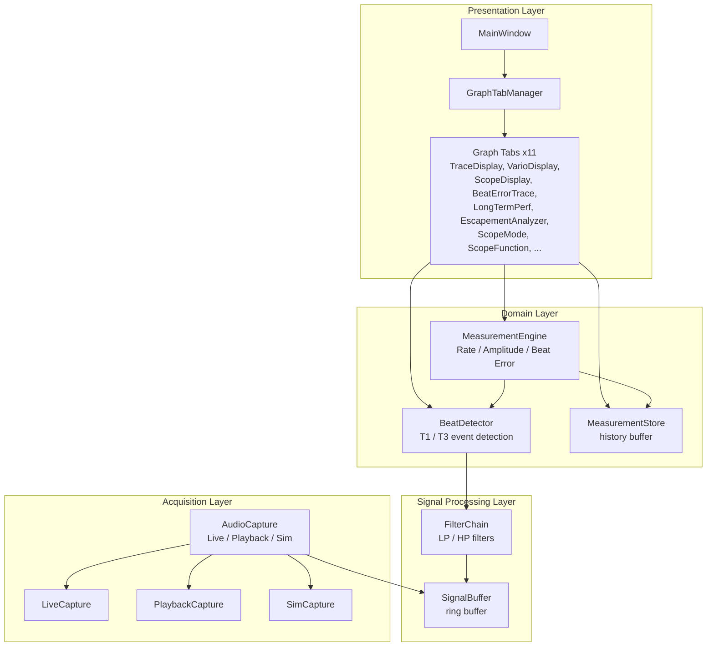

# Module View

The TimeGrapher codebase is organized into four layers. Each layer depends only on the layer below it; no upward or sideways dependencies are permitted. This structure is the foundation of the Extensibility quality attribute (QAS-5): a new graph tab is added exclusively in the Presentation layer without touching any other layer.

## Element Catalog

### Acquisition Layer

| Module | Responsibility |
|--------|---------------|
| `AudioCapture` | Abstracts over Live / Playback / Sim input modes; produces PCM blocks for the signal processing layer |
| `LiveCapture` | Captures audio from USB microphone via ALSA / Qt Multimedia |
| `PlaybackCapture` | Reads a pre-recorded PCM file at playback speed |
| `SimCapture` | Generates a synthetic watch-like signal for offline testing |

### Signal Processing Layer

| Module | Responsibility |
|--------|---------------|
| `SignalBuffer` | Thread-safe ring buffer; decouples the PCM producer (Acquisition) from the DSP consumer (Domain) |
| `FilterChain` | Applies LP / HP biquad filter cascade to raw PCM samples; cutoffs configured via ControlPanel |

### Domain Layer

| Module | Responsibility |
|--------|---------------|
| `BeatDetector` | Detects onset and peak of T1(A) and T3(C) acoustic events; produces a BeatEvent per beat |
| `MeasurementEngine` | Computes Rate (s/d), Amplitude (°), Beat Error (ms), and BPH from the BeatEvent stream |
| `MeasurementStore` | Append-only history buffer; provides thread-safe history queries for long-horizon graph tabs |

### Presentation Layer

| Module | Responsibility |
|--------|---------------|
| `MainWindow` | Top-level Qt window; hosts GraphTabManager and ControlPanel |
| `GraphTabManager` | Receives Measurement signals; routes data to the currently visible tab; manages tab lifecycle |
| Graph Tabs (×11) | Each tab visualizes a specific aspect of measurement data from MeasurementEngine or MeasurementStore |

## Related ADRs
- [ADR 003 — Four-Layer Architecture](../ADRs/ADR003-layered-architecture.md)
- [ADR 005 — Ring Buffer as Thread Boundary Connector](../ADRs/ADR005-ring-buffer-connector.md)

## Related Views
- [Runtime View](runtime-view.md)
- [Deployment View](deployment-view.md)
