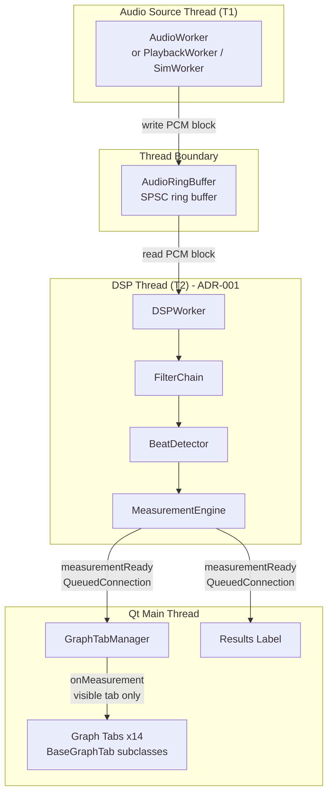
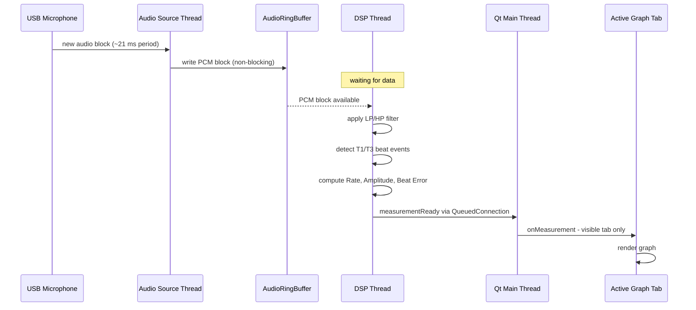

# Runtime View — DSP Pipeline Thread Model

This view shows the runtime component-and-connector structure of the audio processing pipeline. It captures which components exist at runtime, which threads they run on, and how data flows between them. It is the primary view for reasoning about real-time performance and latency.

## Element Catalog

#### Audio Source Thread (T1)
- Runs `AudioWorker` (live USB mic via ALSA), `PlaybackWorker` (WAV file), or `SimWorker` (synthetic).
- Produces one PCM block approximately every 21 ms at 96 kHz and writes it to `AudioRingBuffer`.
- Hard real-time constraint: must complete the write within the block period or the block is dropped.

#### AudioRingBuffer (Thread Boundary Connector)
- SPSC (single-producer single-consumer) ring buffer; the only data path between T1 and T2.
- Non-blocking write — T1 never blocks even if T2 is momentarily slow.
- See [ADR-005](../ADRs/ADR005-ring-buffer-connector.md) for design rationale.

#### DSP Thread (T2)
- Dedicated Qt thread introduced by [ADR-001](../ADRs/ADR001-dsp-offload-thread.md) to eliminate Qt event-loop blocking from the audio path.
- Reads PCM from `AudioRingBuffer`; runs `FilterChain` → `BeatDetector` → `MeasurementEngine`; emits `measurementReady` to the Qt main thread via `Qt::QueuedConnection`.
- **Measured impact**: wait_ms 77.4 ms → 0.03 ms (×2,600); deadline miss 43% → 0% (EXP-03).

#### Qt Main Thread
- Receives `Measurement` via `QueuedConnection`; routes to `GraphTabManager` and the Results label.
- `GraphTabManager` delivers to the currently visible tab only — [ADR-002](../ADRs/ADR002-lazy-rendering.md) Lazy Rendering.
- No further thread crossings downstream.

## Key Timing Metrics (EXP-03 RPi Results)

| Metric | Before ADR-001 | After ADR-001 + ADR-002 | Change |
|--------|:--------------:|:-----------------------:|:------:|
| wait_ms avg (queue wait) | 77.4 ms | 0.03 ms | ×2,600 |
| Deadline miss (21.33 ms) | 43% | 0% | Eliminated |
| Render calls per beat (replot/beat) | 8.22 | 1.20 | ↓85% |
| E2E latency avg | 80.1 ms | 2.2 ms | ↓97% |
| E2E latency max | 258.7 ms | 4.8 ms | ↓98% |

## Connector Types

| Connector | Type | Between | Properties |
|-----------|------|---------|------------|
| AudioRingBuffer | SPSC ring buffer ([ADR-005](../ADRs/ADR005-ring-buffer-connector.md)) | T1 → T2 | Non-blocking write; backpressure absorbed by buffer; drop-oldest policy |
| Qt QueuedConnection | Qt cross-thread signal | T2 → Qt Main Thread | Thread-safe FIFO; no manual locking; bounded by Qt event loop |
| Direct call | Synchronous within T2 | FilterChain → BeatDetector → MeasurementEngine | No synchronization needed |
| Qt QueuedConnection | Qt cross-thread signal | T2 → Results label | Second observer on the same `measurementReady` signal |

## Behavior — Live Beat Processing Sequence

## Related ADRs
- [ADR-001 — DSP Offload Thread](../ADRs/ADR001-dsp-offload-thread.md)
- [ADR-002 — Lazy Rendering](../ADRs/ADR002-lazy-rendering.md)
- [ADR-005 — Ring Buffer as Thread Boundary Connector](../ADRs/ADR005-ring-buffer-connector.md)

## Related Views
- [Module View](module-view.md)
- [Graph Tab Decomposition View](graph-tab-view.md)
- [Deployment View](deployment-view.md)
