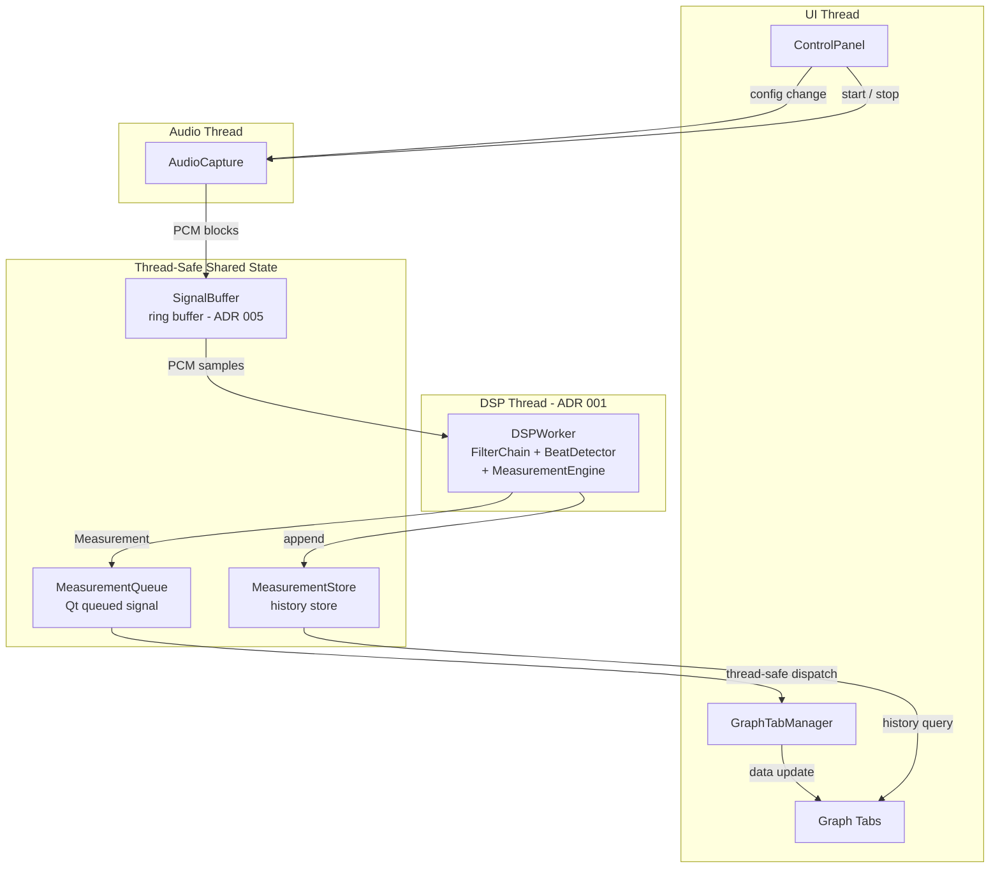
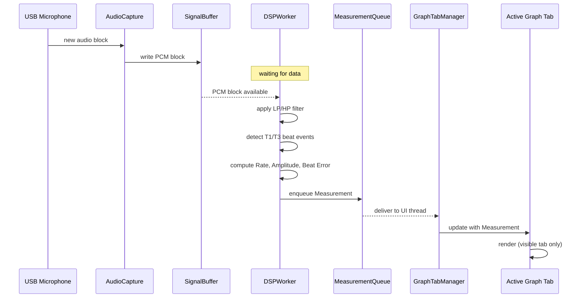

# Runtime View (Component & Connector View)

This view shows the runtime structure of the TimeGrapher system: which components run at execution time, in which threads, and how they communicate. The key architectural concern is thread-safe data flow from audio capture through the DSP pipeline to the UI.

## Element Catalog

#### AudioCapture (Audio Thread)
- Runs the ALSA / Qt Multimedia capture loop; writes fixed-size PCM blocks into the SignalBuffer.
- Does not perform any DSP; its only job is to keep the ring buffer filled without interruption.
- Receives configuration changes (sample rate, mode) from ControlPanel.

#### DSPWorker (DSP Thread)
- Introduced by [ADR 001](../ADRs/ADR001-dsp-offload-thread.md) to eliminate Qt event-loop blocking from the audio path.
- Owns the full DSP pipeline: FilterChain → BeatDetector → MeasurementEngine.
- Reads PCM blocks from SignalBuffer; publishes Measurement objects via MeasurementQueue to the UI thread.

#### GraphTabManager (UI Thread)
- Receives Measurement objects via Qt's queued signal mechanism (thread-safe cross-thread dispatch).
- Routes each measurement to the currently visible tab only — see [ADR 002](../ADRs/ADR002-lazy-rendering.md).
- On tab switch, triggers a catch-up repaint so the newly visible tab immediately shows the latest data.

#### Graph Tabs (UI Thread)
- Each tab visualizes a specific aspect of measurement data.
- Short-horizon tabs (Trace, Vario, BeatError) consume live Measurement objects from GraphTabManager.
- Long-horizon tabs (LongTerm, Spectrogram, WaveformComparison) query MeasurementStore for historical data on demand.

## Connector Types

| Connector | Type | Between | Properties |
|-----------|------|---------|------------|
| SignalBuffer | Ring buffer ([ADR 005](../ADRs/ADR005-ring-buffer-connector.md)) | AudioCapture → DSPWorker | Non-blocking write; backpressure absorbed by buffer depth |
| MeasurementQueue | Qt queued signal | DSPWorker → GraphTabManager | Thread-safe cross-thread dispatch; no manual locking needed |
| MeasurementStore | RW-locked shared store | DSPWorker → Graph Tabs | DSP thread appends; UI thread reads on demand |
| Direct call | Synchronous within DSP thread | FilterChain → BeatDetector → MeasurementEngine | No synchronization needed |
| Qt Signal (direct) | Synchronous Qt signal | ControlPanel → AudioCapture | UI-to-audio configuration updates |

## Behavior — Live Beat Processing Sequence

## Related ADRs
- [ADR 001 — DSP Offload Thread](../ADRs/ADR001-dsp-offload-thread.md)
- [ADR 002 — Lazy Rendering](../ADRs/ADR002-lazy-rendering.md)
- [ADR 004 — Qt as Application Framework](../ADRs/ADR004-qt-framework.md)
- [ADR 005 — Ring Buffer as Thread Boundary Connector](../ADRs/ADR005-ring-buffer-connector.md)

## Related Views
- [Module View](module-view.md)
- [Deployment View](deployment-view.md)
