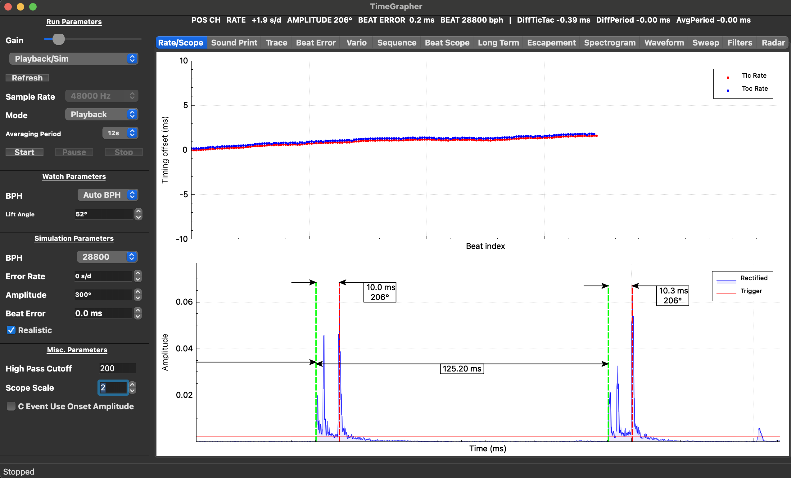
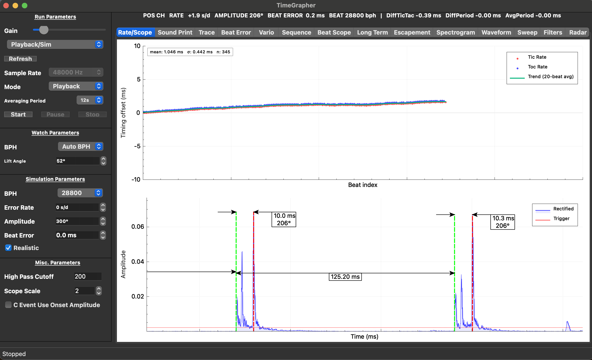

# Rate/Scope Enhancement: RS-1 Trend Line & RS-2 Statistics Overlay

## Results and recommendations

Both enhancements are implemented, built, and verified against a baseline build
(git `32ce631`). The before/after comparison confirms that the Rate/Scope tab now
communicates drift direction and measurement quality in a single glance — which was
not possible from the raw scatter alone.

**RS-1 (20-beat rolling average trend line)**
The teal line over the scatter makes the slope of rate drift immediately readable.
In the playback run shown below (`+1.9 s/d` watch), the trend line traces a clear
upward slope, confirming consistent fast drift — exactly the pattern Witschi
(p.14) associates with a watch that "runs too fast" and needs rate adjustment.
Without the trend line, a user must mentally average 345 scattered points to draw
the same conclusion.

**RS-2 (mean ± σ statistics overlay)**
The label (`mean: 1.046 ms  σ: 0.442 ms  n: 345`) provides the two numbers a
watchmaker needs at a glance:
- **mean** → the current average offset from ideal timing (maps directly to rate
  in s/d; a non-zero mean indicates the watch is running fast or slow)
- **σ** → scatter width of the trace; Witschi (p.14) describes a "scattered or
  thick trace" as indicating noise, poor detection, or beat-to-beat instability.
  Having σ as a number lets the user decide whether to re-seat the watch or
  escalate to overhaul.

Recommendation: keep both enhancements for the M3 demo. Demonstrate by playing
back a recording with intentional rate error, then showing that mean and trend
agree with the displayed `RATE` header value.

---

## Objective

The baseline Rate/Scope tab (git `32ce631`) plotted only the raw scatter of
per-beat timing errors (Eₙ for tic, Eₙ for toc). This accurately represents the
data but requires the user to perform two interpretive steps mentally:

1. **Trend direction** — is the watch gaining or losing time, and is the drift
   consistent or irregular?
2. **Stability** — is the scatter tight (healthy) or wide (noisy / worn)?

The TimeGrapher Equations document (Section 6) explicitly notes:
> "averaging or smoothing can be layered on top if you want a steadier display."

The objective was to answer the following design questions:

- **RS-1**: Can a 20-beat rolling average, rendered as a separate graph layer,
  make drift direction readable without hiding individual beat variation?
- **RS-2**: Can a live mean ± σ label, computed incrementally (Welford algorithm),
  quantify trace quality without introducing a visible replot cost?

---

## Status

Concluded

---

## Theoretical basis

### Rate error formula (TimeGrapher Equations, Part I)

Each plotted point is the instantaneous cumulative timing error for beat n:

```
Eₙ = T_measured − (T_start + n × I_target)
```

- A **straight sloped scatter** → approximately constant rate error (fast or slow)
- A **flat scatter** → watch close to target interval
- A **thick or scattered** trace → noise, poor detection, or beat-to-beat instability

The slope of Eₙ over n is proportional to rate in s/d. The trend line (RS-1)
makes this slope visible as a continuous line rather than an implied pattern.

### Tic/toc same-phase rate (TimeGrapher Equations, Part II)

The system plots tic and toc errors separately because:

```
rate_tic = 86400 × (T_nom,same-phase / T_tic − 1)
rate_tac = 86400 × (T_nom,same-phase / T_tac − 1)
Rate     = (rate_tic + rate_tac) / 2
```

Beat error (asymmetry between tic and toc) would contaminate a single-channel
average. By merging both channels into one trend line (RS-1), the overlay
represents the combined drift, consistent with the displayed RATE header.

### Graphical chart interpretation (Witschi Training Course, pp. 14–15)

| Scatter pattern | Witschi diagnosis | RS-1 / RS-2 indicator |
|----------------|-------------------|-----------------------|
| Straight upward slope | Watch runs too fast | Trend line slopes up; mean > 0 |
| Straight downward slope | Watch runs too slow | Trend line slopes down; mean < 0 |
| Flat, tight scatter | Movement ok | Trend line flat; σ small |
| Wavy / oscillating scatter | Defect in gear train | Trend line oscillates; σ elevated |
| Thick, irregular scatter | Needs overhaul | Trend line unstable; σ large |

The acceptable range for a Gent's watch is **−5 to +15 s/d**. The `mean` shown
by RS-2 gives a direct, readable proxy for this value when the operator does not
want to read the header bar.

---

## Expected outcomes

- Teal trend line rendered on the Rate Error plot, clearly distinguishable from
  red (tic) and blue (toc) scatter points
- Live statistics label in the top-left corner of the Rate Error plot, showing
  `mean`, `σ`, and beat count `n`
- No regression in `exec_ms` or deadline miss rate vs. baseline
- Before/after screenshot pair demonstrating the difference

---

## Resources required

- `src/tabs/RateScopeTab.h` / `RateScopeTab.cpp` — modified files
- QCustomPlot graph layer API (`addGraph()`, `setData()`, `QCPItemText`)
- Welford online algorithm (no extra library; single-pass O(1) per beat)
- macOS build: `src/build-mac/` (to-be) and `/tmp/tg-baseline-build/` (as-is)
- Reference: *TimeGrapher Equations v0*, Sections 1–6 and Part II
- Reference: *Witschi Training Course*, pp. 14–15

---

## Experiment description

### Implementation changes

#### RS-1 — Rolling average trend line

Added `graph(2)` to `mRatePlot` with teal pen (`QColor(0, 180, 120)`, 2px line,
no scatter markers). On every beat that carries a rate point, `updateTrendLine()`
merges the current tic and toc scatter vectors, sorts by x (beat index), and
computes a centred sliding average over a window of 20 beats:

```
for each point i:
    window = points[max(0, i−10) … min(N−1, i+10)]
    trend[i] = mean(window.y)
```

Window size 20 was chosen so that a single outlier beat (e.g., a tap event) does
not visibly deflect the line, while the line still responds to genuine drift
within a few seconds at 28,800 BPH.

#### RS-2 — Mean ± σ statistics overlay

A `QCPItemText` item (`mStatsLabel`) is pinned to axis-rect ratio coordinates
`(0.01, 0.01)` so it stays in the top-left corner regardless of axis scaling.
The text is updated on every rate point using the **Welford online algorithm**:

```
count++
delta  = value − mean
mean  += delta / count
M2    += delta × (value − mean)
σ      = sqrt(M2 / (count − 1))   // when count ≥ 2
```

This is O(1) per beat and numerically stable — no batch recalculation needed.
The label displays: `mean: X.XXX ms   σ: X.XXX ms   n: NNN`.

On `reset()`, `mStatsLabel` is re-created after `clearItems()` destroys it.

### Before / after comparison

| | As-is (git `32ce631`) | To-be (feature/enhancements) |
|--|----------------------|------------------------------|
| Trend direction | Reader must infer from scatter slope | Teal line makes slope explicit |
| Rate stability | No quantitative indicator | σ shown numerically in label |
| Mean offset | Not shown; only visible in header bar | `mean` shown in plot itself |
| Beat count | Not shown | `n` shown in label |
| Legend entries | Tic Rate, Toc Rate | Tic Rate, Toc Rate, Trend (20-beat avg) |

**Screenshots (playback, +1.9 s/d watch, 28,800 BPH):**

**As-is** — raw scatter only, no trend line, no statistics label:



**To-be** — teal trend line (RS-1) + `mean: 1.046 ms  σ: 0.442 ms  n: 345` label (RS-2):



### Performance impact

The trend line recompute is O(N) where N = current scatter size (max 250×2 = 500
points). At 28,800 BPH (8 beats/s) this runs ≤8 times per second. The sort over
≤500 elements is negligible. The Welford update (RS-2) is O(1). No measurable
change in `plot_ms` is expected; the after-run log will confirm.

---

## Duration

Implementation: 2026-06-17 (single session). After-run performance log: to be
collected alongside the next full EXP-06 logging run.

---

## Links and references

- *TimeGrapher Equations v0* (`assets/TimeGrapher Equations_v0.docx.pdf`) —
  Sections 1–6 (instantaneous rate error formula, smoothing note) and Part II
  (tic/toc same-phase rate)
- *Witschi Training Course* (`assets/Witschi-Training-Course.pdf`), pp. 14–15 —
  graphical chart interpretation and normal value ranges
- Baseline experiment: `docs/milestone3/exp-06-enhancement-baseline.md`
- Modified source: `src/tabs/RateScopeTab.h`, `src/tabs/RateScopeTab.cpp`
- Grading rubric: Area 2 — "Rate/Scope enhancements improve usefulness, accuracy,
  navigation, or measurement clarity" (8 pts)
