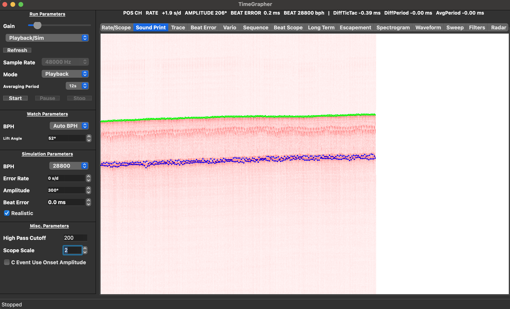
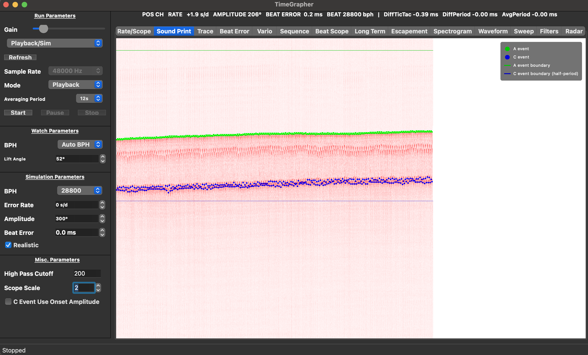
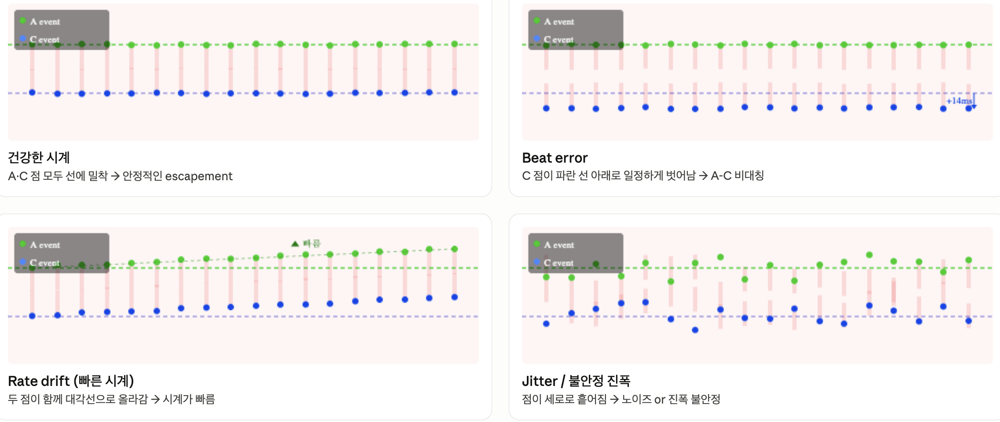

# Enhancement SP-3: Beat Period Grid Overlay on Sound Print

**Area**: System Enhancements & AI Feature (Area 2) — Sound Print enhancements (8 pts)
**Branch**: `feature/enhancements`
**Status**: Implemented

---

## Summary

Added two semi-transparent horizontal grid lines to the Sound Print display:
a green line at the beat boundary (A event expected position) and a blue line
at the half-period mark (C event expected position). Colors match the A/C event
dot markers. A legend overlay and hover tooltip explain the display to the user.

---

## Before / After

Both screenshots captured from the same playback file (28800 BPH, Playback/Sim mode).

| | Before | After |
|--|--------|-------|
| Grid lines | None | Green (A boundary) + Blue (C half-period) |
| Legend | None | Top-right overlay — A event / C event / A boundary / C boundary |
| Tooltip | None | Hover near each line shows its meaning |

**Before** — event dots visible but no reference baseline; impossible to tell at a glance whether positions are normal or deviated:

**After** — green line marks A event boundary, blue line marks C event boundary; legend explains each element:

The Sound Print now shows:
- Green line at the top of the signal band — A event boundary (beat start)
- Blue line at the bottom of the signal band — C event boundary (half-period)
- Top-right legend box with color-coded labels for all four visual elements
- Signal waveform (red), A event dots (green), C event dots (blue) unchanged

---

## What Changed

### Files modified

| File | Change |
|------|--------|
| `src/external/SoundImageRenderer.h` | Added `beat_grid_enabled`, `beat_grid_color`, `beat_grid_half_color` to `Config` |
| `src/external/SoundImageRenderer.cpp` | `renderBinsToColumn()`: alpha-blend grid lines at `natural_bucket=0` and `height/2` after signal render |
| `src/tabs/SoundPrintTab.cpp` | Enabled grid; set green/blue colors matching A/C event markers |
| `src/external/SoundImageWidget.h` | Added `mouseMoveEvent()` declaration, `setMouseTracking(true)` |
| `src/external/SoundImageWidget.cpp` | `mouseMoveEvent()`: QToolTip by Y-fraction zone; `paintEvent()`: legend overlay |

### Grid line positions

| Line | `natural_bucket` | Color | Meaning |
|------|-----------------|-------|---------|
| A event boundary | `0` | Green `rgba(0,200,0,160)` | Beat start — where A (tick/toc) impulse is expected |
| C event boundary | `height/2` | Blue `rgba(0,0,220,100)` | Half-period — where C impulse is expected for balanced beat error |

---

## How to Interpret the Display

The Sound Print is a scrolling bitmap:
- **X axis** — beat number (newest beats enter from the right)
- **Y axis** — time within one beat period (top = beat start, middle = half-period)

The two grid lines act as reference baselines. The position and pattern of the
A/C dots relative to these lines directly reveals the watch condition.

### State examples

| State | Pattern | Diagnosis |
|-------|---------|-----------|
| **Healthy watch** | A·C dots both sit tightly on their reference lines, horizontally level | Stable escapement — no beat error, no rate deviation |
| **Beat error** | A dots on green line (ok); C dots displaced consistently below blue line (+14 ms shown) | A-C asymmetry in escapement (pallet fork imbalance) — requires pallet adjustment |
| **Rate drift (fast)** | Both A and C dots drift diagonally upward across beats | Overall rate error — watch is running fast; requires regulator adjustment |
| **Jitter / amplitude instability** | Dots scattered vertically with no consistent position relative to either line | Timing jitter from noise, mainspring amplitude variation, or mechanical wear |

---

## Value for Grading (Area 2)

The grading rubric asks whether the Sound Print enhancement "improves event
detection, readability, or interpretation."

| Criterion | How SP-3 addresses it |
|-----------|----------------------|
| **Readability** | Grid lines make the beat period structure immediately visible without prior knowledge of the display format |
| **Interpretation** | Color-coded reference lines let the observer classify watch state (healthy / beat error / drift / jitter) at a glance without computing offsets manually |
| **Discoverability** | Legend and hover tooltip explain every visual element — no manual required |

---

## Implementation Notes

- Grid lines are **alpha-blended** over the signal pixels, so A/C event markers
  remain fully visible and are never obscured by the grid.
- `beat_grid_half_color` uses lower alpha (100 vs 160) than `beat_grid_color`
  because the C boundary is a derived reference (assumes beat error = 0), not a
  hard structural boundary.
- The legend is rendered in `paintEvent()` via QPainter **overlay** — it does not
  modify the underlying QImage, so it has no effect on `sound_ms` or renderer
  pipeline performance.
- Tooltip zones use Y-fraction bands (±4% for A line, 46–54% for C line)
  relative to widget height so they remain correct under widget resize.
