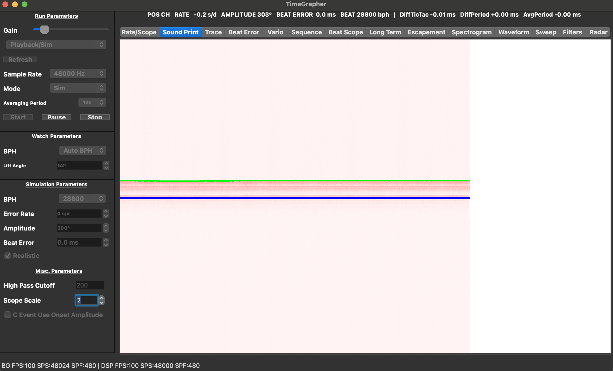
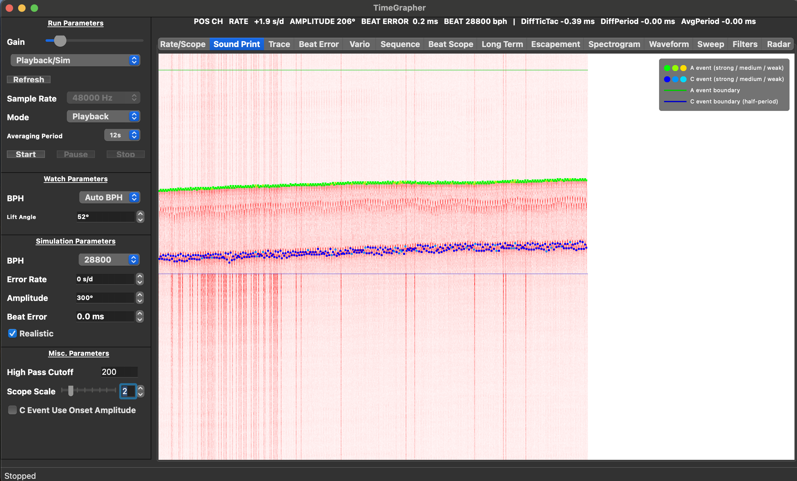
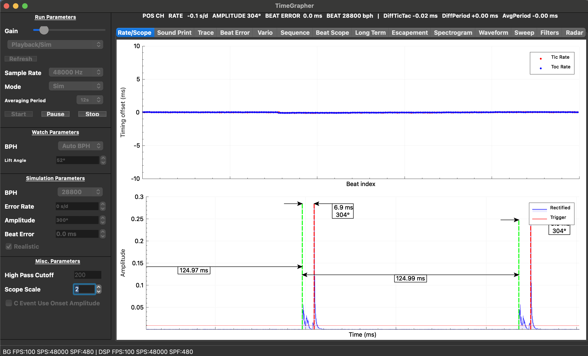
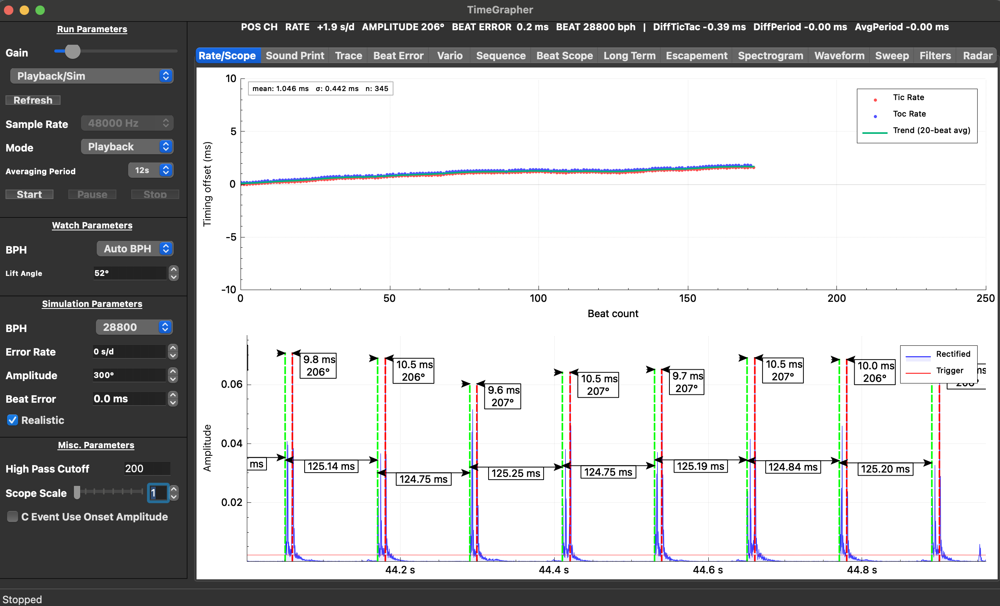
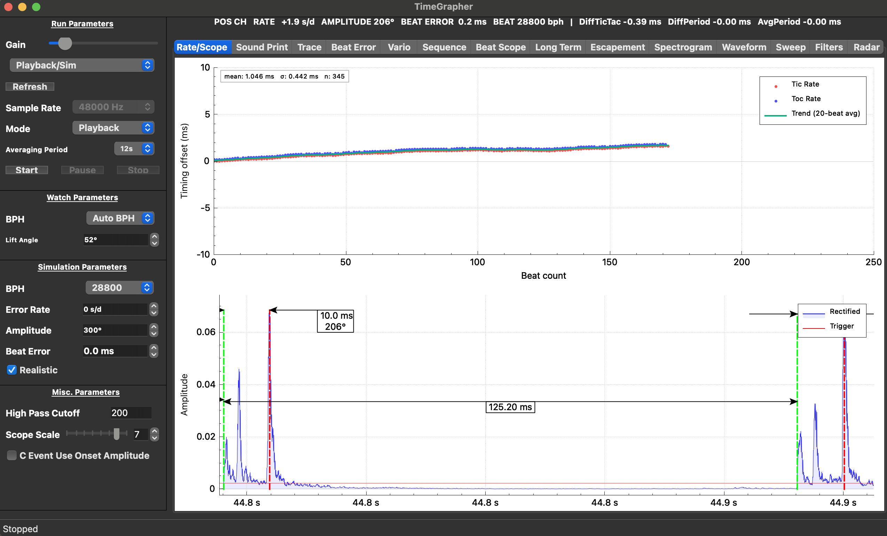

# System Enhancement Proposals — Area 2 (Sound Print & Rate/Scope)

**Milestone**: M3 Final Demo  
**Grading area**: Area 2 — System Enhancements & AI Feature (25 pts total)  
**Target**: Sound Print (8 pts) + Rate/Scope (8 pts)  
**Branch**: `feature/enhancements`  
**Baseline**: `git 5ff5a70` — see `docs/milestone3/exp-06-enhancement-baseline.md`

---

## Overview

| ID | Area | Enhancement | Status | Detail doc |
|----|------|-------------|--------|------------|
| SP-1 | Sound Print | Per-column dynamic normalization | **Implemented** | this doc |
| SP-2 | Sound Print | A/C event confidence color gradient | **Implemented** | this doc |
| SP-3 | Sound Print | Beat period grid overlay | **Implemented** | `enhancement-sp3-beat-grid.md` |
| RS-1 | Rate/Scope | Rolling average trend line | **Implemented** | `enhancement-rs1-rs2-rate-scope.md` |
| RS-2 | Rate/Scope | Mean ± σ statistics overlay | **Implemented** | `enhancement-rs1-rs2-rate-scope.md` |
| RS-4 | Rate/Scope | Scope zoom slider | **Implemented** | this doc |
| RS-5 | Rate/Scope | Click-to-sync between rate plot and scope | **Implemented** | `enhancement-rs1-rs2-rate-scope.md` |

Grading criterion:
- **Excellent** (7–8 pts): clearly improved, fully functional, meaningfully more useful than baseline
- **Strong** (5–6 pts): clear improvements with minor limitations
- **Moderate** (3–4 pts): some improvements, limited scope
- **Minimal** (1–2 pts): small change, little practical improvement

---

## Before / After Tracking

Baseline screenshots and performance log captured 2026-06-17 (SIM, 28800 BPH, 48000 Hz):

| Baseline artifact | Path |
|------------------|------|
| Rate/Scope screenshot | `src/logs/EXP-06/screenshots/baseline_rate_scope.png` |
| Sound Print screenshot | `src/logs/EXP-06/screenshots/baseline_sound_print.png` |
| Performance CSV | `src/logs/EXP-06/log_20260617_045128_baseline.csv` |
| Analysis plot | `src/logs/EXP-06/log_20260617_045128_baseline.png` |

After each enhancement, add:
- `src/logs/EXP-06/screenshots/<id>_after.png`
- One row in `experiment-results.md` under EXP-06

Baseline performance numbers to beat/match:

| Metric | Baseline avg | Baseline max |
|--------|-------------|-------------|
| `exec_ms` | 0.094 ms | 13.2 ms |
| `sound_ms` | 0.000 ms | 0.000 ms |
| `plot_ms` | 0.007 ms | 70.5 ms |
| Deadline misses | 1 / 9611 | — |

---

## SP-1: Per-Column Dynamic Normalization

### Problem

`SoundImageRenderer` uses a fixed gamma (`cfg.gamma = 0.5f`) applied uniformly
across all columns. When signal amplitude varies — different microphone distances,
watch positions, or acoustic environments — some columns are nearly invisible
(faint signal washed out) while others are over-saturated. This makes it hard to
read event patterns across the full Sound Print width.

### Proposed change

Compute the peak amplitude of each column's samples before mapping to pixel
brightness, then normalize that column's values against its own peak.

```cpp
// In SoundImageRenderer::processSamples() / renderBinsToColumn()
float colPeak = *std::max_element(bins.begin(), bins.end());
float scale   = (colPeak > 1e-6f) ? 1.0f / colPeak : 1.0f;
for (auto &b : bins) b *= scale;  // normalize before gamma
```

Add a config flag `per_column_normalize` (default `true`) so it can be toggled.

### Expected improvement

- Faint columns become readable at same brightness as loud columns
- Sound Print pattern is consistent regardless of mic distance
- Grading keyword: **readability**

### Files to modify

| File | Change |
|------|--------|
| `src/external/SoundImageRenderer.h` | Add `bool per_column_normalize = true` to `Config` |
| `src/external/SoundImageRenderer.cpp` | Normalize bins per column before gamma curve |
| `src/tabs/SoundPrintTab.cpp` | Enable flag in `reset()` config |

### Before / after screenshots

SP-1 and SP-2 share the same after screenshot since both affect the Sound Print display.

**Before** — fixed gamma, binary marker colors (green/blue only):



**After** — per-column normalization (SP-1) + confidence color gradient (SP-2) + beat grid (SP-3):



### Performance expectation

One `max_element` pass over ~64 bins per column. Negligible; `sound_ms` expected
to stay at sub-millisecond. Confirm with after-run log.

---

## SP-2: A/C Event Confidence Color Gradient

### Problem

A and C event markers are currently drawn in fixed binary colors (green for A,
blue for C) regardless of peak amplitude. A barely-detected event looks identical
to a strong, clean event. Users cannot distinguish reliable detections from marginal
ones without looking at the scope waveform separately.

### Proposed change

Map each event's normalized peak amplitude to a color gradient:

| Amplitude range | A event color | C event color |
|----------------|---------------|---------------|
| Strong (≥ 0.7) | Pure green `rgb(0, 255, 0)` | Pure blue `rgb(0, 0, 255)` |
| Medium (0.4–0.7) | Yellow-green `rgb(150, 255, 0)` | Cyan `rgb(0, 150, 255)` |
| Weak (< 0.4) | Yellow `rgb(255, 220, 0)` | Light cyan `rgb(0, 220, 255)` |

Amplitude is normalized against the session's running peak (`mPeakAmplitude`).

```cpp
// In SoundPrintTab::onMeasurement()
for (const AcousticEvent &ev : m.events) {
    float norm = (mPeakAmplitude > 0) ? ev.peakValue / mPeakAmplitude : 1.0f;
    QRgb color = ev.isA ? confidenceColorA(norm) : confidenceColorC(norm);
    if (ev.isA)
        mRenderer.markAEventAbsoluteSampleIndex(ev.samplePos, color, 3);
    else
        mRenderer.markCEventAbsoluteSampleIndex(ev.samplePos, color, 3);
}
```

### Expected improvement

- Weak/marginal detections are visually distinct → event detection quality visible at a glance
- Amplitude variation patterns (e.g., mainspring winding down) become readable in the print
- Grading keywords: **event detection**, **interpretation**

### Files to modify

| File | Change |
|------|--------|
| `src/tabs/SoundPrintTab.h` | Add `mPeakAmplitude`, `confidenceColorA()`, `confidenceColorC()` |
| `src/tabs/SoundPrintTab.cpp` | Update `onMeasurement()`, add color helper methods |

### Before / after screenshots

See SP-1 section — both SP-1 and SP-2 are visible in the same after screenshot (`sp12-after-sound-print.png`).

### Performance expectation

O(1) per event (simple amplitude comparison). No measurable overhead.

---

## RS-4: Scope Zoom Slider

### Problem

`mScopeScale` controls the scope window width (samples visible = `sampleRate /
mScopeScale`). Currently it is only settable via a spinbox in `MainWindow.ui`
(labeled "Scope Scale") and has no real-time feedback. Users cannot quickly zoom
in to inspect a single beat or zoom out to see multi-beat context without
navigating to the settings area and typing a value.

### Proposed change

Add a horizontal slider directly below or beside the scope plot, ranging from 1×
to 8× (fine to wide window), with a live label showing the resulting time window
in milliseconds.

```
[←   Scope Window: 250 ms   →]
 1   2   3   4   5   6   7   8
```

Slider `valueChanged` signal connects to `RateScopeTab::setScopeScale(int)` so
the scope redraws immediately on drag.

The existing `setScopeScale()` slot in `RateScopeTab` already accepts the value —
only the UI wiring needs to be added.

```cpp
// MainWindow.cpp — connect new slider
connect(ui->scopeZoomSlider, &QSlider::valueChanged,
        mRateScopeTab, &RateScopeTab::setScopeScale);
connect(ui->scopeZoomSlider, &QSlider::valueChanged, this, [this](int v) {
    int windowMs = 1000 / v;          // approx for 48kHz
    ui->scopeZoomLabel->setText(QString("Scope window: ~%1 ms").arg(windowMs));
});
```

### Expected improvement

- One-drag zoom in/out without leaving the measurement view
- Grading keywords: **navigation**, **measurement clarity**

### Files to modify

| File | Change |
|------|--------|
| `src/ui/MainWindow.ui` | Add `QSlider` (scopeZoomSlider, 1–8) + `QLabel` (scopeZoomLabel) in Rate/Scope layout |
| `src/ui/MainWindow.cpp` | Wire slider → `setScopeScale()` + update label |
| `src/ui/MainWindow.h` | No change needed (slot already exists in RateScopeTab) |

### Before / after screenshots

**Before** — scope window fixed, no slider:



**After (Scope=1, narrow)** — single beat visible in detail; slider at leftmost position:



**After (Scope=7, wide)** — ~125 ms window showing multiple beats; slider at right:



### Performance expectation

Slider drag triggers `setScopeScale()` + one `replot()`. Identical to current
spinbox behavior. No measurable overhead.

---

## Implementation Priority

Recommended order, balancing impact vs. effort:

```
        SP-1  ✅ done  (Dynamic normalization — per_column_normalize in SoundImageRenderer)
        SP-2  ✅ done  (Confidence color — confidenceColorA/C in SoundPrintTab)
        SP-3  ✅ done
        RS-1  ✅ done
        RS-2  ✅ done
        RS-4  ✅ done  (Scope slider — UI only, existing slot)
        RS-5  ✅ done  (Click-to-sync — rate plot ↔ scope waveform)
```

---

## Demo Script (Area 2)

1. Show **Sound Print before** screenshot on slide → explain binary markers, no grid
2. Show **Sound Print after** (SP-1 + SP-2 + SP-3) → "normalization makes faint signals readable;
   confidence gradient shows detection quality; grid anchors every beat period"
3. Switch to Rate/Scope tab → show **RS-1 trend line** tracking drift slope
4. Point to **RS-2 statistics label** → "mean and σ in one glance"
5. Drag **RS-4 zoom slider** to 1× (narrow) → show single-beat detail; drag to 8× → show 8-beat context
6. State the problem each enhancement solved and reference the baseline screenshots

---

## Links and references

- Grading rubric: `assets/Draft LG SW Architect Final Demo.pdf` — Area 2 (p. 1)
- Baseline doc: `docs/milestone3/exp-06-enhancement-baseline.md`
- SP-3 detail: `docs/milestone3/enhancement-sp3-beat-grid.md`
- RS-1/RS-2 detail: `docs/milestone3/enhancement-rs1-rs2-rate-scope.md`
- *Witschi Training Course* pp. 14–15 — chart pattern interpretation
- *TimeGrapher Equations v0* — rate error formula, smoothing note
