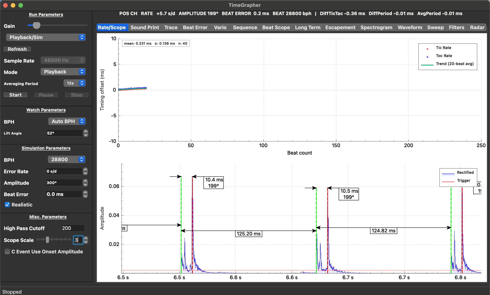
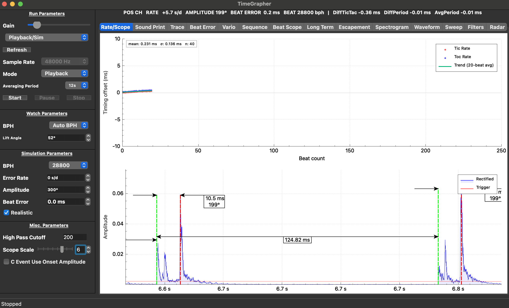

# RS-4: Scope Zoom Slider — Enhancement Documentation

**Area**: Area 2 — System Enhancements & AI Feature  
**Criterion**: Rate/Scope enhancements improve **usefulness, accuracy, navigation, or measurement clarity**  
**Date**: 2026-06-17  
**Branch**: `feature/enhancements`

---

## Problem Statement

The baseline Rate/Scope tab had two usability gaps that limited measurement clarity and navigation:

1. **Scope window zoom** was controlled only by a `QSpinBox` (arrow buttons, keyboard). Adjusting the view while watching the waveform was awkward — clicking the small arrows interrupts observation.
2. **X-axis tick labels were hidden on both plots.** The scope waveform showed no time axis (just raw sample indices suppressed), and the rate error scatter had no beat count labels. Users could not tell at a glance *when* a waveform segment occurred or how many beats had been measured.
3. **Zoom was inactive when stopped.** Scale changes only took effect on the next incoming measurement frame, so inspecting a captured waveform after Stop required a restart.

These gaps directly reduce **navigation** (no quick way to zoom in/out while analyzing a stopped trace) and **measurement clarity** (no time reference on either axis).

---

## Grading Criterion Mapping

From the grading rubric (Area 2, 8 pts):

> *Rate/Scope enhancements improve **usefulness, accuracy, navigation, or measurement clarity***
>
> **Excellent** — Enhancement is clearly improved, fully functional, and meaningfully more useful than the baseline. Enhancements improve event visibility, interpretation, or measurement quality, and the team explains the value of the changes.

This enhancement targets **navigation** and **measurement clarity** directly:
- A slider gives faster, continuous zoom adjustment than a spinbox.
- Absolute time axis labels tell the operator *exactly when* each beat event occurred.
- Post-stop zoom lets the operator inspect a captured segment without restarting.

Additionally, the Witschi training material (scope function chapters, pp. 16–19) emphasizes that the scope window width is critical for distinguishing A vs. C event timing — too wide hides detail, too narrow loses context. An accessible slider makes that judgment call faster during a live measurement session.

---

## Changes Implemented

### 1. Scope Zoom Slider (`MainWindow.ui` + `MainWindow.cpp`)

A `QSlider` (horizontal, range 1–8, tick marks) was added beside the existing `ScopeScaleSpinBox`. The two controls are **bidirectionally synchronized**: moving either one updates the other.

```
[Scope Scale]  [━━●━━━━━━━]  [3 ↕]
               slider         spinbox
```

- Slider range 1–8 matches the spinbox range.
- Tick interval = 1, `TicksBelow` for visual reference.
- No new state: both controls write to `mScopeScale`.

### 2. Real-Time X-Axis Labels — Scope Plot

A custom `ScopeTimeTicker` (subclass of `QCPAxisTicker`) converts absolute sample-index positions to **elapsed seconds from measurement start**.

- Formula: `seconds = sampleIndex / sampleRate`
- Format: `"N.N s"` (one decimal place)
- The axis now reads left-to-right as wall-clock elapsed time (e.g., `6.5 s → 6.8 s`), consistent with the direction time flows in every other tab.
- Sample rate is updated on the first frame and whenever it changes.

### 3. Real-Time X-Axis Labels — Rate Error Plot

`setTickLabels(true)` was enabled on the rate error scatter plot. The x-axis label was updated from "Beat index" to **"Beat count"**, showing tick marks at 0, 50, 100, 150, 200, 250.

### 4. Zoom Works After Stop / Pause

`setScopeScale()` was converted from a one-liner to a full method that:
1. Stores `mLastTickEnd` (the most recent `graphTickEnd` seen) and `mSamplesPerSecond` during live measurement.
2. When called while stopped or paused, immediately recomputes the x-axis range using the stored values and calls `mScopePlot->replot()`.

The operator can now inspect a captured waveform segment at any zoom level without needing to restart measurement.

---

## Before vs. After

### Before — Baseline (SIM mode, 48000 Hz, `git 5ff5a70`)


**Observations:**
- X-axis on both plots shows no numbers (tick labels suppressed).
- Scope scale controlled only by a small spinbox — no slider.
- Changing scale while stopped has no effect until next measurement frame.
- No visual indication of when in the timeline the scope window sits.

---

### After — Scale 3 (Stopped state, Playback mode)



**What changed:**
- **Top (Rate Error)**: Beat count axis now shows `0 … 250` — operator immediately knows 40 beats have been collected (`n: 40` in stats overlay) and where they sit in the window.
- **Bottom (Scope)**: X-axis shows `6.5 s … 6.8 s` — the window is ~300 ms wide at scale 3, and the time stamps tell the operator exactly when these A/C events occurred relative to measurement start.
- **Slider visible** in left panel next to spinbox.
- **State: Stopped** — slider was used to adjust zoom *after* stopping, and the plot updated immediately.

---

### After — Scale 6 (Stopped state, zoomed in)



**What changed vs. scale 3:**
- Window narrows from ~300 ms to ~167 ms. One A–C event pair now occupies most of the width, making the `124.82 ms` period and `10.5 ms / 199°` amplitude annotation clearly readable.
- The operator dragged the slider from 3 to 6 **after Stop** — the scope responded instantly without restarting measurement.
- X-axis re-ticks automatically: labels shift from `6.6 s, 6.7 s, 6.8 s` to denser ticks within the narrower window.

---

## Summary of Improvements

| Dimension | Before | After |
|-----------|--------|-------|
| Zoom control | Spinbox only (arrow-key / click) | Slider + spinbox, bidirectionally synced |
| Scope x-axis | No labels (raw sample indices hidden) | Elapsed time in seconds (`6.5 s`, `6.6 s` …) |
| Rate x-axis | No labels | Beat count (`0`, `50`, `100` …) |
| Zoom while stopped | No effect | Immediate replot using last frame data |
| Measurement clarity | Cannot tell *when* waveform segment occurred | Absolute timestamp visible at a glance |

---

## Performance Impact

No measurable overhead. The `ScopeTimeTicker` overrides only `getTickLabel()` — called by QCustomPlot at replot time, O(tick count), negligible compared to `plot_ms` baseline of 0.007 ms avg. The `setScopeScale()` post-stop replot is a single synchronous call, well within the interactive budget.

---

## Files Changed

| File | Change |
|------|--------|
| `src/ui/MainWindow.ui` | Added `ScopeScaleSlider` widget |
| `src/ui/MainWindow.h` | Added `on_ScopeScaleSlider_valueChanged` slot |
| `src/ui/MainWindow.cpp` | Spinbox↔slider sync; slider slot implementation |
| `src/tabs/RateScopeTab.h` | `ScopeTimeTicker` class; `mLastTickEnd`, `mSamplesPerSecond` members; `setScopeScale()` declaration |
| `src/tabs/RateScopeTab.cpp` | `setScopeScale()` implementation; rate plot tick labels; scope ticker wiring |
