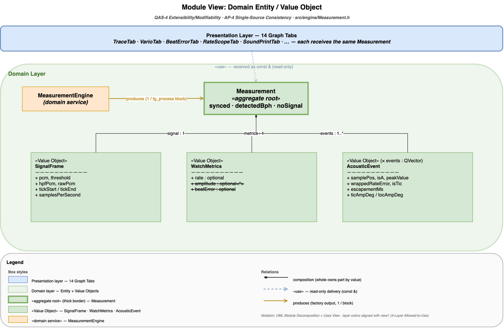
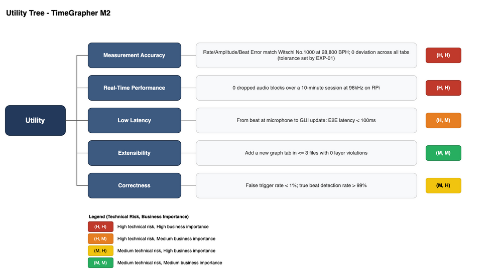
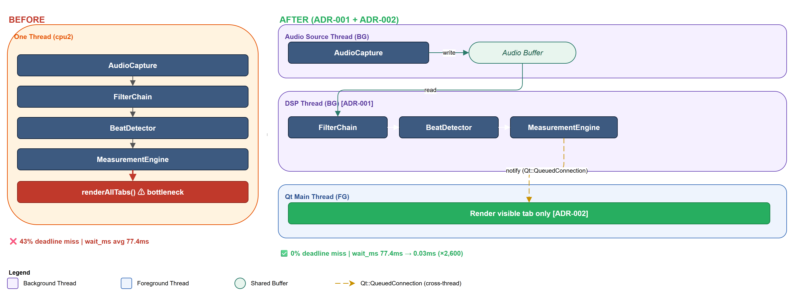

# TimeGrapher — Milestone 3 (Final Demo)

**Team**: Blue Sky (Team 3) | **Date**: 2026-07-01

Team members:
- HUNG SON TONG
- DONG HO SHIN
- GYEONGJIN SHIN
- JIMIN LEE
- KYUDAE BAHN
- SUNGHO SHIN
- TAEJOON SONG

Repository: [Ji-Min-Lee/2026-3-sw-architect-studio-project](https://github.com/Ji-Min-Lee/2026-3-sw-architect-studio-project)

Kanban Board: [GitHub Project #3](https://github.com/users/Ji-Min-Lee/projects/3/views/2)

---

## Requirements

This section contains the requirements elicited from the project plan and grading rubric
provided by CMU MSE / LG Software Architectures Training Program, along with assumptions
the team made during elaboration. These requirements were the primary drivers for all
architectural decisions in this proposal.

- [Functional Requirements](references/requirments/functional-requirements.md)
- [Quality Attribute Scenarios](references/qa/README.md) — six QAS covering real-time performance, latency, extensibility, correctness, measurement accuracy, and long-term session performance

---

## Architecture

The following architecture views document the software architecture designed to address
TimeGrapher's quality attribute requirements. Together they show the module decomposition,
runtime thread model, dependency inversion strategy, deployment pipeline, and domain
entity structure. The full view set also includes allocation views and a dedicated
LongTermTab downsampling view; see [Architecture Views](references/views/README.md).

<table>
<tr>
  <td align="center">
    <a href="references/views/view-layered-4layer.md">Layered: 4-Layer Allowed-to-Use<br>
    </a>
  </td>
  <td align="center">
    <a href="references/views/view-cc-dsp-pipeline.md">C&C: DSP Pipeline Thread Model<br>
    </a>
  </td>
</tr>
<tr>
  <td align="center">
    <a href="references/views/view-decomposition-graph-tab.md">Decomposition: Graph Tab (Observer)<br>
    </a>
  </td>
  <td align="center">
    <a href="references/views/view-iaudiosource.md">Module: IAudioSource Dependency Inversion<br>
    </a>
  </td>
</tr>
<tr>
  <td align="center">
    <a href="references/views/view-deployment-build-pipeline.md">Deployment: Build-Deploy Pipeline<br>
    </a>
  </td>
  <td align="center">
    <a href="references/views/view-domain-entity-vo.md">Domain Entity &amp; Value Object Model<br>
    </a>
  </td>
</tr>
</table>

---

## Architecture Evaluation

The architecture was evaluated using **ATAM** (Architecture Tradeoff Analysis Method).
The evaluation identified the DSP + GUI single-thread coupling as the primary risk,
resolved by ADR-001 (T2 Offload Thread) and ADR-002 (Lazy Rendering), cutting deadline
misses from 43% to 0% and queue wait time by ×2,600.

See [atam-evaluation-v3.md](references/atam-evaluation-v3.md) for the full evaluation,
including utility tree, sensitivity points, tradeoff points, and risk themes.

<table>
<tr>
  <td align="center">
    <a href="references/atam-evaluation-v3.md">ATAM Utility Tree<br>
    </a>
  </td>
  <td align="center">
    <a href="references/atam-evaluation-v3.md">ATAM Before / After<br>
    </a>
  </td>
</tr>
</table>

---

## Experiments

Six technical experiments were conducted to validate architectural decisions and
resolve identified risks before committing to design choices.

| ID | Title | QAS | Status |
|----|-------|-----|--------|
| [EXP-01](references/experiments/exp-01-accuracy-weishi-comparison.md) | Accuracy vs. WeiShi Reference Device | QAS-5 | ✅ Done |
| [EXP-02](references/experiments/exp-02-realtime-dropped-block.md) | Real-Time Block Drop Under Load | QAS-1, QAS-2 | ✅ Done |
| [EXP-03](references/experiments/exp-03-latency-e2e.md) | End-to-End Latency Measurement | QAS-1, QAS-2 | ✅ Done |
| [EXP-04](references/experiments/exp-04-extensibility-observer-pattern.md) | Extensibility — Observer Pattern | QAS-3 | ✅ Done |
| [EXP-05](references/experiments/exp-05-correctness-detector-optimization.md) | Detector Parameter Optimization Under Noise | QAS-4, QAS-5 | ✅ Done |
| [EXP-06](references/experiments/exp-06-longterm-aging.md) | Long-Term Aging Test — Bucket Downsampling Efficiency | QAS-6 | ✅ Concluded |

See [planned-experiments.md](references/experiments/planned-experiments.md) for the
original experiment plan and rationale.

---

## ADRs

The linked ADRs record the main architectural decisions, including context, options
considered, and rationale.

- ADR-001 — [T2 DSP Offload Thread](references/adr/ADR-001-t2-dsp-offload-thread.md)
- ADR-002 — [R1 Lazy Rendering (skip replot for non-visible tabs)](references/adr/ADR-002-r1-lazy-rendering.md)
- ADR-003 — [Audio Sample Rate Selection for RPi 5 (96 kHz)](references/adr/ADR-003-sample-rate-selection.md)
- ADR-004 — [R2 Timer-Decoupled Rendering](references/adr/ADR-004-r2-timer-decoupled-rendering.md)
- ADR-005 — [IAudioSource Dependency Inversion (P1)](references/adr/ADR-005-p1-iaudiosource-dependency-inversion.md)
- ADR-006 — [BaseGraphTab Observer Pattern and Tab Registration (AP-3)](references/adr/ADR-006-basegraphtab-observer-pattern.md)
- ADR-007 — [Time-Based Bucket Downsampling for LongTermTab](references/adr/ADR-007-longtermtab-downsampling.md)
- ADR-008 — [WatchMath Pure Calculation Module Isolation](references/adr/ADR-008-watchmath-module-isolation.md)
- ADR-009 — [FilterChain Design — HPF + Envelope Detector](references/adr/ADR-009-filterchain-design.md)

---

## Risk Register

See [risks.md](references/risks.md) for the full register of technical and non-technical
risks, their resolution status, and the experiments or architectural decisions that closed them.

---

## Traceability: QAS → Risk → Experiment → ADR

### QAS-1 — Real-Time Performance *(Priority 1)*

| Risk | Description | Experiment | Result | ADR |
|------|-------------|-----------|--------|-----|
| [TR-02](references/risks.md) | Single-threaded pipeline saturates cpu2; 43% deadline miss on RPi | [EXP-03](references/experiments/exp-03-latency-e2e.md) | wait_ms 420ms → **0.013ms** (×32,000) | [ADR-001](references/adr/ADR-001-t2-dsp-offload-thread.md) T2 DSP Offload Thread ✅ |
| [TR-03](references/risks.md) | Signal backlog accumulates unbounded under single-threaded load | [EXP-03](references/experiments/exp-03-latency-e2e.md) | Backlog 0% (macOS + RPi) | [ADR-001](references/adr/ADR-001-t2-dsp-offload-thread.md) T2 DSP Offload Thread ✅ |
| [TR-04](references/risks.md) | `replot()` in exec path consumes 79% of exec budget | [EXP-03](references/experiments/exp-03-latency-e2e.md) | replot/beat 8.22 → **1.20** (↓85%) | [ADR-002](references/adr/ADR-002-r1-lazy-rendering.md) R1 Lazy Rendering ✅ |

### QAS-2 — Low Latency and Low Number of Missed Beats *(Priority 2)*

| Risk | Description | Experiment | Result | ADR |
|------|-------------|-----------|--------|-----|
| [TR-01](references/risks.md) | RPi cannot sustain 96kHz audio capture alongside Qt GUI | [EXP-02](references/experiments/exp-02-realtime-dropped-block.md) | Dropped=0 at 48k/96k/192k | [ADR-003](references/adr/ADR-003-sample-rate-selection.md) 96kHz Accepted ✅ |
| TR-02/03 | Single-threaded capture-to-process latency | [EXP-03](references/experiments/exp-03-latency-e2e.md) | E2E avg **2.05ms** on RPi | [ADR-001](references/adr/ADR-001-t2-dsp-offload-thread.md) T2 + AudioRingBuffer ✅ |

### QAS-3 — Extensibility / Modifiability *(Priority 3)*

| Risk | Description | Experiment | Result | ADR |
|------|-------------|-----------|--------|-----|
| [TR-06](references/risks.md) | Layer refactoring introduces regression in existing DSP behavior | — | 142 unit tests (10 binaries) all passing ✅ | 4-Layer Allowed-to-Use enforced |
| [TR-07](references/risks.md) | Residual coupling survives refactoring | — | Compiler catches upward dependency ✅ | Allowed-to-use rule + per-layer include restriction |
| [TR-08](references/risks.md) | New tab requires data not in current Domain output | [EXP-04](references/experiments/exp-04-extensibility-observer-pattern.md) | All 14 tabs implemented within the target change budget ✅ | [ADR-006](references/adr/ADR-006-basegraphtab-observer-pattern.md) BaseGraphTab Observer |
| — | Audio source extension touches multiple unrelated components | [EXP-04](references/experiments/exp-04-extensibility-observer-pattern.md) | Adding `NetworkWorker` reduced to ≤ 2 files | [ADR-005](references/adr/ADR-005-p1-iaudiosource-dependency-inversion.md) IAudioSource Dependency Inversion ✅ |

### QAS-4 — Correctness *(Priority 4)*

| Risk | Description | Experiment | Result | ADR |
|------|-------------|-----------|--------|-----|
| [TR-05](references/risks.md) | Filter defaults reject beat signal at edge BPH values | [EXP-05](references/experiments/exp-05-correctness-detector-optimization.md) | onset=0.08, min_peak=0.10 confirmed ✅ | Default parameters locked in `Detector.cpp` |
| [NTR-07](references/risks.md) | Equation-level derivations difficult to verify manually | — | 142 unit tests across 10 binaries provide an architectural safety net ✅ | [ADR-008](references/adr/ADR-008-watchmath-module-isolation.md) WatchMath module isolation |

### QAS-5 — Measurement Accuracy *(Priority 5 — Usability)*

| Risk | Description | Experiment | Result | ADR |
|------|-------------|-----------|--------|-----|
| — | Accuracy vs. WeiShi reference device unvalidated | [EXP-01](references/experiments/exp-01-accuracy-weishi-comparison.md) | Validation against reference device completed ✅ | — |
| [NTR-07](references/risks.md) | Equation-level derivations difficult to verify manually | — | Test suite provides safety net (142 tests / 10 binaries) | [ADR-008](references/adr/ADR-008-watchmath-module-isolation.md) |

### QAS-6 — Long-Term Session Performance *(Priority 4)*

| Risk | Description | Experiment | Result | ADR |
|------|-------------|-----------|--------|-----|
| — | Multi-day sessions may accumulate unbounded plot points and degrade GUI responsiveness | [EXP-06](references/experiments/exp-06-longterm-aging.md) | Worst case stays bounded at **840 points per series / 2,520 total points** over 7 days ✅ | [ADR-007](references/adr/ADR-007-longtermtab-downsampling.md) Time-Based Bucket Downsampling ✅ |

---

## Document Structure

```
docs/milestone3/final/
├── README.md                              ← this file — full traceability map
├── assets/                               ← view diagrams (.drawio + .png), charts
└── references/
    ├── qa/                               ← QA scenario files (qas-1 ~ qas-6)
    ├── risks.md                          ← full risk register
    ├── atam-evaluation-v3.md             ← ATAM architecture evaluation
    ├── views/                            ← architecture view index + detailed view files
    ├── experiments/                      ← experiment files (EXP-01 ~ EXP-06)
    ├── adr/                              ← ADR files (ADR-001 ~ ADR-009)
    └── requirments/                      ← functional requirements
```
