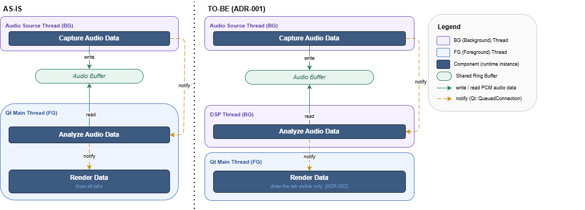
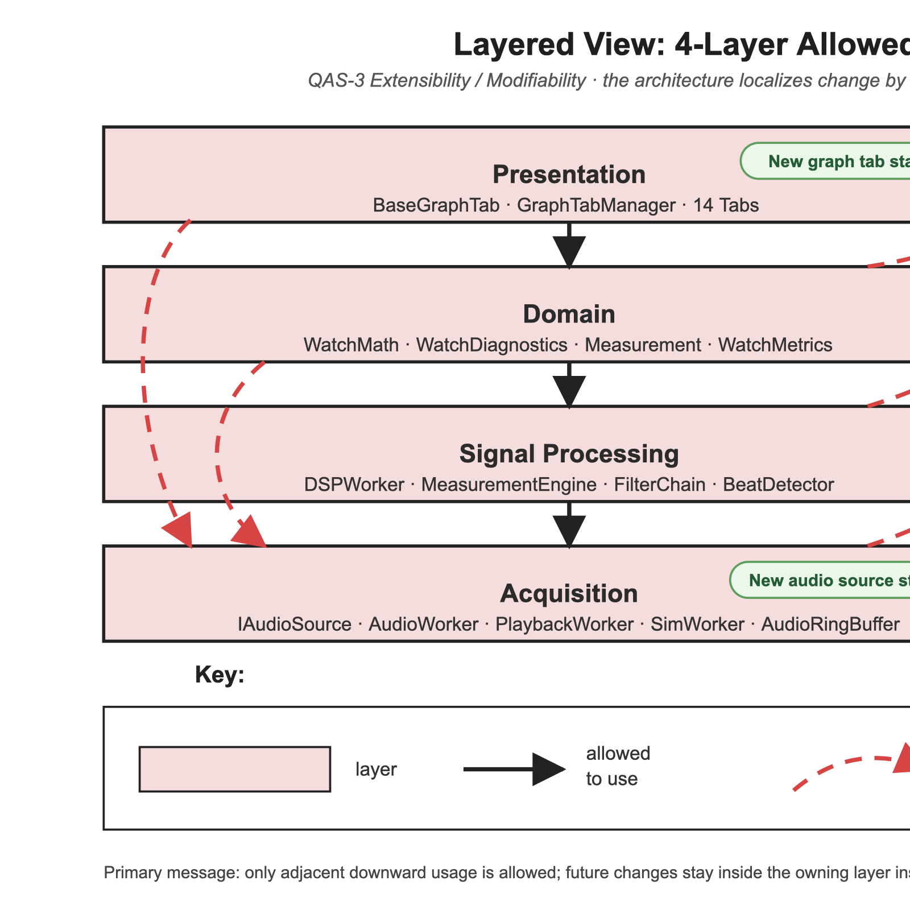
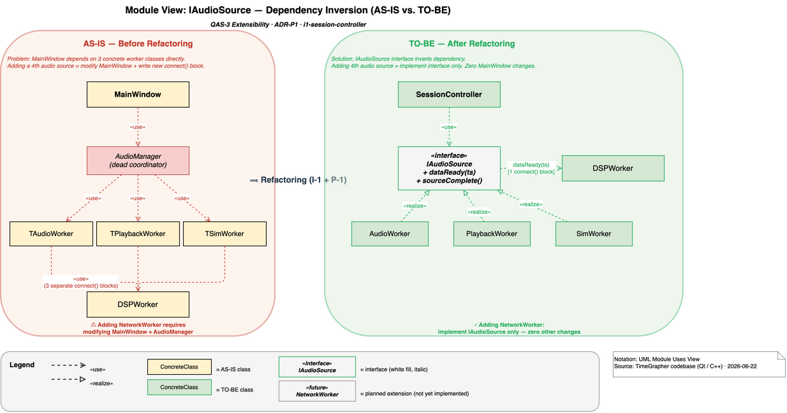
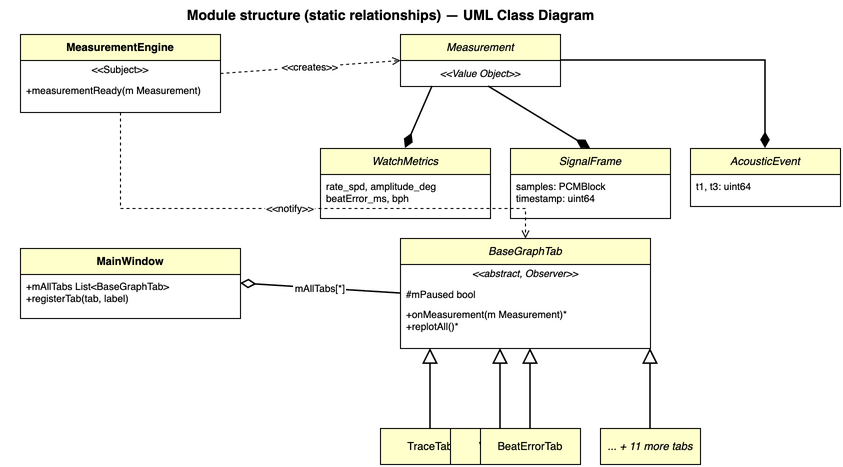
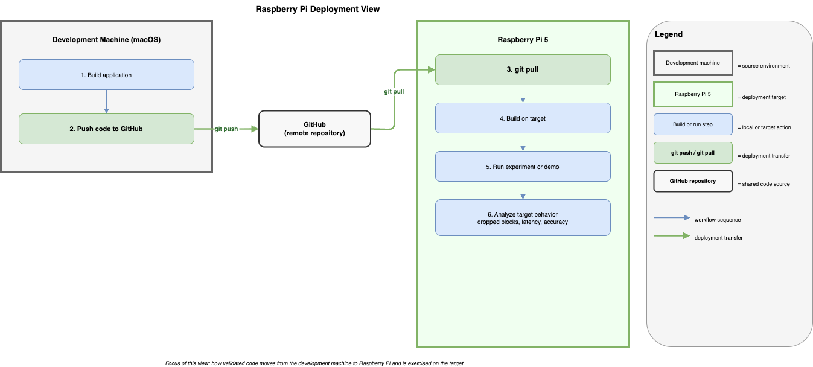

# Architecture Views — TimeGrapher

Five views covering Latency, Correctness, Extensibility, and Deployability.  
Each view follows the **Merson 7-section template** and targets a specific QA.

---

## [C&C View: DSP Pipeline Thread Model](view-cc-dsp-pipeline.md)

> QA: Real-time Performance · Low Latency (QAS-1, QAS-2)

---

## [Layered and Module Decomposition View](view-layered-4layer.md)

> QA: Extensibility / Modifiability (QAS-3)

---

## [Module View: IAudioSource Dependency Inversion](view-iaudiosource.md)

> QA: Extensibility / Modifiability (QAS-3)

---

## [Graph Tab Module Uses View](view-decomposition-graph-tab.md)

> QA: Correctness · Extensibility (QAS-4, QAS-3)

---

## [Raspberry Pi Deployment View](view-deployment-build-pipeline.md)

> QA: Deployability

---

## [Pre-commit Correctness Gate View](view-allocation-implementation.md)

> QA: Correctness (QAS-4) · Commit-time enforcement view

Shows how formula and calculation regressions are blocked before commit acceptance through the local `pre-commit` gate. Focuses on `TestWatchMath` and `TestMeasurementEngine` as the structural enforcement path for QAS-4 Sub-1.

---

## [Allocation View: Work Assignment Style — Sprint & Team Structure](view-allocation-work-assignment.md)

> QA: All QAS · Style: 작업할당 스타일

Architecture elements → Organizational units (team1, team2, milestones, sprints). Shows who owns what, when it lands, and how scope is gated between Milestone 2 (06-22) and Milestone 3 Demo (07-01).
