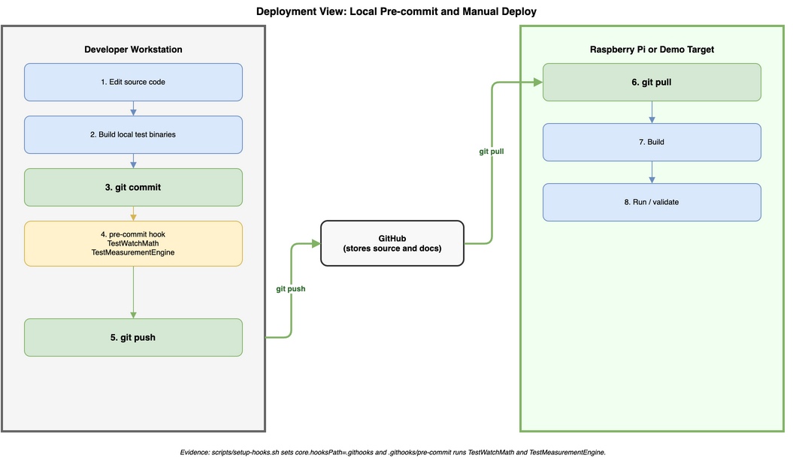

# TimeGrapher Local Pre-commit Correctness Gate View

This view shows the current enforcement path for correctness before deployment: formula and measurement regressions are checked on the developer machine at commit time, then code is pushed and deployed manually. The main architectural message is that **QAS-4 Sub-1 is enforced structurally before code reaches the shared repository or target device**. This view is not the final proof of measurement accuracy; that evidence comes from the related experiments.

[Open draw.io source](../../assets/view6-precommit-local-deployment.drawio)

## Element Catalog

#### Developer workstation
- Hosts the only repository-defined correctness gate that is evidenced in code today.
- Runs the shared Git hook configured by `scripts/setup-hooks.sh`.

#### Pre-commit correctness gate
- Implemented in `.githooks/pre-commit`.
- Executes `TestWatchMath` and `TestMeasurementEngine` before the commit is accepted.
- Catches formula-level regressions in `WatchMath` and basic end-to-end calculation regressions in `MeasurementEngine`.

#### GitHub repository
- Acts as the shared source repository after the local gate passes.
- In this view, it is a transfer point, not a separate validation node.

#### Raspberry Pi or demo target
- Receives changes through the manual `git pull -> build -> run` path.
- Hardware-dependent validation happens after the local correctness gate, not instead of it.

## Behavior

The important trace is:

1. A developer changes `src/engine` code or related tests.
2. The developer builds local test binaries.
3. `git commit` triggers `.githooks/pre-commit`.
4. The hook runs `TestWatchMath` and `TestMeasurementEngine`.
5. Only after that gate passes does the code move to `git push`.
6. Deployment to Raspberry Pi or the demo environment remains manual.

This means the architecture does not rely on target-device testing to catch the first class of correctness defects. Formula regressions are intended to be stopped earlier, at commit time.

## Related QA, Risks, and Experiments

- [QAS-4: Correctness](../qa/qas-4-correctness.md) — this view supports **Sub-Requirement 1: Calculation Accuracy — Testability**, especially the requirement that formula deviations be revealed before the commit is accepted.
- [Risk Register](../risks.md) — this view is part of the mitigation story for [NTR-07](../risks.md), where formula complexity is controlled through automated commit-time checking rather than manual reasoning alone.
- [EXP-06: Witschi Accuracy Comparison](../experiments/exp-06-accuracy-witschi-comparison.md) — provides the external accuracy evidence that this view does not provide.
- [EXP-04: Detector Parameter Optimization Under Noise](../experiments/exp-04-correctness-detector-optimization.md) — provides the detector-correctness evidence for noisy conditions, complementary to the formula gate shown here.

## Related ADRs

- [ADR-008: WatchMath Module Isolation](../adr/ADR-008-watchmath-module-isolation.md) — the key decision that makes `TestWatchMath` fast, deterministic, and suitable for commit-time enforcement.

## Related views

- [Deployment View: Build-Deploy Pipeline](view-deployment-build-pipeline.md) — continues the flow after the local gate passes and the code moves toward the target device.
- [Layered and Module Decomposition View](view-layered-4layer.md) — shows where `WatchMath` sits structurally as an isolated domain module.
