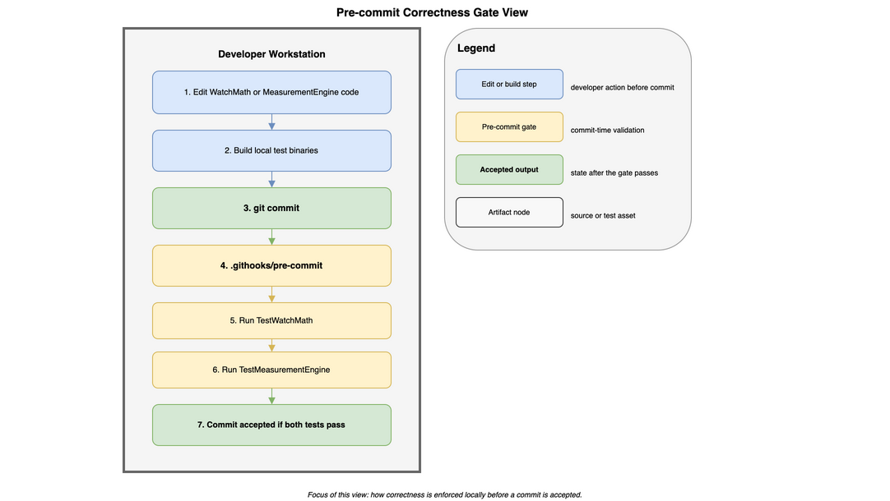

# Pre-commit Correctness Gate View

This view shows how TimeGrapher enforces formula and calculation correctness before a change is accepted into version control. Its main message is simple: **the first line of defense against correctness regressions is the local pre-commit gate, not target-device testing**. This is the architectural enforcement mechanism behind QAS-4 Sub-1.

[Open draw.io source](../../assets/allocation-precommit-gate.drawio)

## Element Catalog

#### Developer Workstation
- The commit-time correctness gate runs on the developer machine.
- `scripts/setup-hooks.sh` configures `core.hooksPath` so the shared repository hook is used consistently.

#### Pre-commit Hook
- Implemented in `.githooks/pre-commit`.
- Invoked automatically by `git commit`.
- Stops the commit when a required correctness test fails.

#### `TestWatchMath`
- The fast, deterministic formula-level gate.
- Validates isolated `WatchMath` functions, which is the key mechanism behind QAS-4 Sub-1 testability.

#### `TestMeasurementEngine`
- The broader calculation path gate.
- Checks that the measurement pipeline still produces coherent outputs after code changes.

## Behavior

The important trace is:

1. A developer changes `WatchMath`, `MeasurementEngine`, or their related tests.
2. The developer builds the local test binaries.
3. `git commit` invokes `.githooks/pre-commit`.
4. The hook runs `TestWatchMath`.
5. The hook runs `TestMeasurementEngine`.
6. The commit is accepted only if both tests pass.

This view intentionally stops at commit acceptance. It does not describe deployment, target hardware validation, or external accuracy comparison.

## Related ADRs

- [ADR-008: WatchMath Module Isolation](../adr/ADR-008-watchmath-module-isolation.md) — makes `WatchMath` directly testable and therefore suitable for commit-time enforcement.

## Related views

- [Raspberry Pi Deployment View](view-deployment-build-pipeline.md) — shows what happens after validated code is pushed and deployed to the target device.
- [Layered and Module Decomposition View](view-layered-4layer.md) — shows `WatchMath` as an isolated domain module rather than a Qt- or hardware-coupled implementation detail.

## Related QA, Risks, and Experiments

- [QAS-4: Correctness](../qa/qas-4-correctness.md) — this view supports **Sub-Requirement 1: Calculation Accuracy — Testability**, especially the requirement that formula deviations be revealed before commit acceptance.
- [Risk Register](../risks.md) — this view contributes to the mitigation of `NTR-07`, where formula complexity is controlled through automated checking rather than manual inspection alone.
- [EXP-04: Detector Parameter Optimization Under Noise](../experiments/exp-04-correctness-detector-optimization.md) — complementary correctness evidence for the detector side of QAS-4.
- [EXP-06: Witschi Accuracy Comparison](../experiments/exp-06-accuracy-witschi-comparison.md) — external accuracy evidence that complements, but does not replace, this structural gate.
