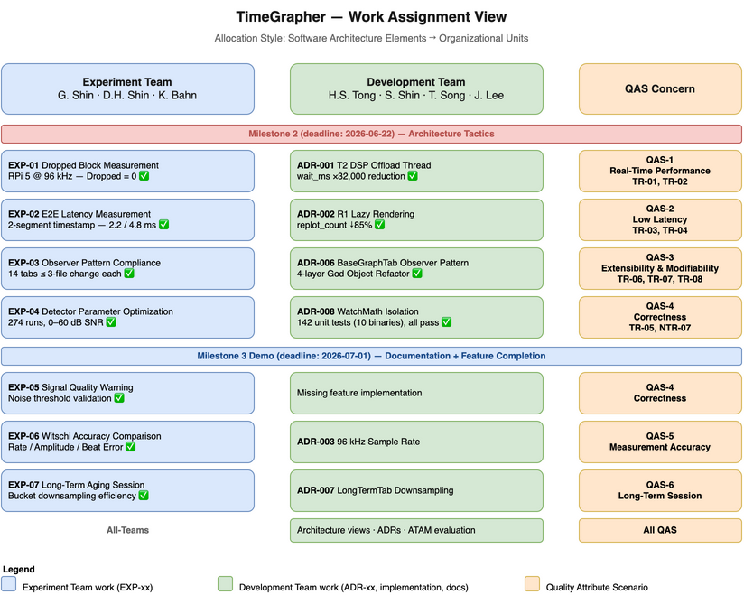

# Work Assignment View

This view shows which team owns which architectural concerns, mapped to Quality Attribute Scenarios and milestones. Its main message is: **the Experiment Team and Development Team operated in parallel, each owning specific QAS concerns, so that every architectural tactic decision was independently validated by experimental evidence — no tactic was accepted without an experiment result, preventing confirmation bias where the implementer also controls the evidence.**

## Element Catalog

#### Experiment Team — Gyeongjin Shin, Dong Ho Shin, Kyudae Bahn
Owns all QA validation experiments across both milestones. Each experiment produces pass/fail evidence that either confirms or refutes the architectural tactic chosen by the Development Team.

#### Development Team — Hung Son Tong, Sungho Shin, Taejoon Song, Jimin Lee
In M2, owns all tactic implementation decisions (ADRs) and code-level enforcement. In M3, the team shifts to two additional responsibilities: (1) writing all architecture documentation (views, ADRs, ATAM evaluation), and (2) implementing missing functional features not completed in M2.

#### Work Assignment Mapping

**Milestone 2 — Architecture Tactics**

| Experiment (Experiment Team) | Decision / Implementation (Development Team) | QAS | Risk |
|------------------------------|----------------------------------------------|-----|------|
| [EXP-01](../experiments/exp-01-realtime-dropped-block.md) Dropped Block | [ADR-001](../adr/ADR-001-t2-dsp-offload-thread.md) T2 DSP Offload Thread | [QAS-1](../qa/qas-1-real-time-performance.md) | TR-01, TR-02 |
| [EXP-02](../experiments/exp-02-latency-e2e.md) E2E Latency | [ADR-002](../adr/ADR-002-r1-lazy-rendering.md) R1 Lazy Rendering | [QAS-2](../qa/qas-2-low-latency-and-low-number-of-missed-beats.md) | TR-03, TR-04 |
| [EXP-03](../experiments/exp-03-extensibility-observer-pattern.md) Observer Cost | [ADR-006](../adr/ADR-006-basegraphtab-observer-pattern.md) BaseGraphTab, 4-layer refactor | [QAS-3](../qa/qas-3-extensibility-modifiability.md) | TR-06, TR-07, TR-08 |
| [EXP-04](../experiments/exp-04-correctness-detector-optimization.md) Detector Optimization | [ADR-008](../adr/ADR-008-watchmath-module-isolation.md) WatchMath Isolation | [QAS-4](../qa/qas-4-correctness.md) | TR-05, NTR-07 |

**Milestone 3 — Documentation + Feature Completion**

| Experiment (Experiment Team) | Development Team | QAS |
|------------------------------|------------------|-----|
| [EXP-05](../experiments/exp-05-noise-threshold-popup.md) Signal Quality Warning | Missing feature implementation | [QAS-4](../qa/qas-4-correctness.md) |
| [EXP-06](../experiments/exp-06-accuracy-witschi-comparison.md) Witschi Accuracy | [ADR-003](../adr/ADR-003-sample-rate-selection.md) 96 kHz Sample Rate | [QAS-5](../qa/qas-5-measurement-accuracy-error-detection-handling.md) |
| [EXP-07](../experiments/exp-07-longterm-aging.md) Long-Term Aging | [ADR-007](../adr/ADR-007-longtermtab-downsampling.md) LongTermTab Downsampling | [QAS-6](../qa/qas-6-long-term-session-performance.md) |
| — | Architecture views, ADRs, ATAM evaluation | All QAS |

## Related ADRs

- [ADR-001: T2 DSP Offload Thread](../adr/ADR-001-t2-dsp-offload-thread.md)
- [ADR-002: R1 Lazy Rendering](../adr/ADR-002-r1-lazy-rendering.md)
- [ADR-003: Sample Rate Selection](../adr/ADR-003-sample-rate-selection.md)
- [ADR-006: BaseGraphTab Observer Pattern](../adr/ADR-006-basegraphtab-observer-pattern.md)
- [ADR-007: LongTermTab Downsampling](../adr/ADR-007-longtermtab-downsampling.md)
- [ADR-008: WatchMath Module Isolation](../adr/ADR-008-watchmath-module-isolation.md)

## Related views

- [Pre-commit Correctness Gate View](view-allocation-implementation.md) — correctness enforcement at commit time (QAS-4 Sub-1)
- [Raspberry Pi Deployment View](view-deployment-build-pipeline.md) — hardware targets these teams built for

## Related QA, Risks, and Experiments

- [QA README](../qa/README.md) — governing QAS hierarchy (QAS-5 Accuracy as top-level goal)
- [Risk Register](../risks.md) — all risks in this view are resolved as of M3
- [Planned Experiments](../experiments/planned-experiments.md) — experiment dependency order and pass conditions
