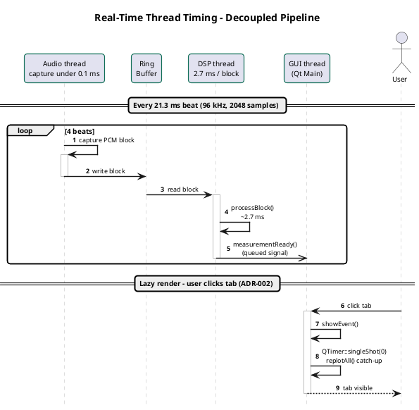
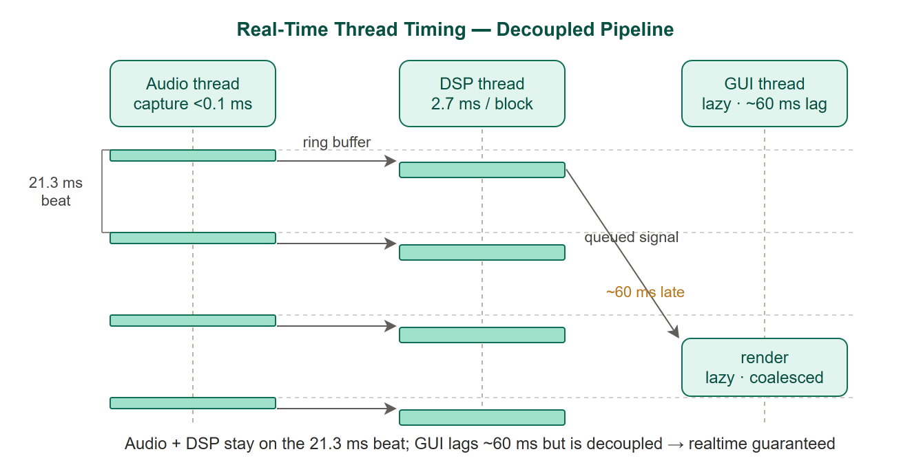

# DSP Pipeline Thread Model View

This view shows the runtime component-and-connector structure of the audio processing pipeline. It captures which components exist at runtime, which threads they run on, and how data flows between them via connectors (ring buffer, Qt QueuedConnection). It is the primary view for reasoning about real-time performance and latency.

<div align="center">


</div>

## Element Catalog

#### Audio Source Thread
- Dedicated Qt thread running `AudioWorker` (or `PlaybackWorker` / `SimWorker`).
- Produces one PCM block (~21ms at 96kHz) per callback and writes it to the Audio Buffer.
- Real-time constraint: must complete the write within the callback period or the block is dropped.

#### Audio Buffer (Audio Source Thread → DSP Thread boundary)
- SPSC ring buffer (also referred to as Ring Buffer in timing diagrams); the only data path between Audio Source Thread and DSP Thread.
- Uses a mutex for index sync only — data copy is always lock-free.

#### DSP Thread [ADR-001]
- Dedicated Qt thread introduced to offload signal processing from the Qt main thread.
- Reads PCM from the Audio Buffer; runs `FilterChain` → `BeatDetector` → `MeasurementEngine`; emits `measurementReady`.
- Delivers measurement result to Qt Main Thread via `Qt::QueuedConnection`.
- Result: wait_ms 77.4ms → 0.03ms (×2,600); deadline miss 43% → 0%.

#### Qt Main Thread
- Receives measurement result via `QueuedConnection`; renders graph tabs.
- No further thread crossings downstream.

## Behavior

**Normal beat processing path** — data flows through three stages in a fixed sequence every ~21 ms:

```
AudioWorker (Audio Source Thread, ~21 ms period)
    │  write PCM block
    ▼
Audio Buffer (SPSC ring buffer)
    │  read PCM block
    ▼
DSPWorker (DSP Thread) [ADR-001]
    │  FilterChain → BeatDetector → MeasurementEngine
    └─▶ emit measurementReady(Measurement) →[Qt::QueuedConnection]→ Qt Main Thread
```

Each stage hands off to the next via a non-blocking connector (ring buffer or queued signal), so no thread waits on another.

**Thread timing — per-beat detail** — shows actual durations and the decoupled GUI lazy-render path ([ADR-002](../adr/ADR-002-r1-lazy-rendering.md)):

<div align="center">





</div>

Audio and DSP finish their per-block work (capture < 0.1 ms, DSP ≈ 2.7 ms) inside every 21.3 ms beat, so the deadline is met on every block. The GUI thread renders lazily (~60 ms behind) but that lag never propagates upstream — the ring buffer and the queued signal absorb both hand-offs, so a slow GUI cannot stall capture or DSP. Real-time correctness depends only on the audio and DSP threads staying on the beat.

Rendering on the Qt Main Thread is detailed in the [Graph Tab Module Uses View](view-decomposition-graph-tab.md). Measured results: [EXP-02: End-to-End Latency](../experiments/exp-02-latency-e2e.md).

## Related ADRs

- [ADR-001: T2 DSP Offload Thread](../adr/ADR-001-t2-dsp-offload-thread.md) — introduces `DSPWorker` thread and Audio Buffer ring buffer
- [ADR-002: R1 Lazy Rendering](../adr/ADR-002-r1-lazy-rendering.md) — `isVisible()` guard removing `replot()` from exec path
- [ADR-003: Audio Sample Rate Selection](../adr/ADR-003-sample-rate-selection.md) — determines block period (96kHz → ~21ms) and Beat Error resolution

## Related views

- [Layered and Module Decomposition View](view-layered-4layer.md) — module structure that this runtime view instantiates
- [Graph Tab Module Uses View](view-decomposition-graph-tab.md) — detail of the Presentation layer components at the right end of this pipeline
- [Raspberry Pi Deployment View](view-deployment-build-pipeline.md) — shows which hardware nodes run the threads depicted here
