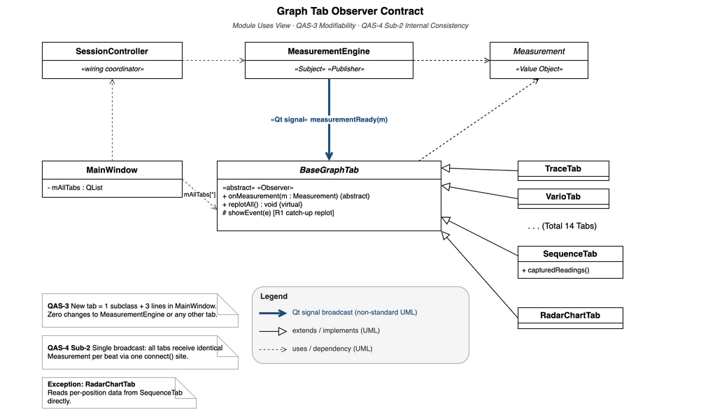

# Graph Tab Module Uses View

This view decomposes the Presentation layer into its internal components, focusing on the `BaseGraphTab` interface and the `MainWindow` tab registry. It answers two questions:

- **QAS-3 (Extensibility):** "What must a developer implement to add a new graph tab?"
- **QAS-4 Sub-2 (Reliability):** "How does the architecture guarantee all 14 tabs display consistent values derived from a single data source?"

[Open draw.io source](../../assets/module-uses-graph-tab.drawio)



> No compile-time link `MeasurementEngine → BaseGraphTab`. `SessionController` is the wiring coordinator — it stores `mObserverTabs` and applies `connect()` at session start. Per-beat delivery remains Qt signal-slot only.

## Element Catalog

#### BaseGraphTab (abstract class / Observer / Subscriber)
- Abstract C++ base class that every graph tab must implement.
- Key slot: `onMeasurement(const Measurement& m)` — wired from `MeasurementEngine::measurementReady` via `SessionController`.
- `isVisible()` guard inside `onMeasurement()` skips `replot()` for non-visible tabs (ADR-002 R1), reducing replot/beat from 8.22 to 1.20 (↓85%).
- `showEvent()` triggers `replotAll()` for a catch-up frame when the tab becomes visible.
- No direct reference to Signal Processing or Acquisition layers.
- **QAS-4 Sub-2 (Reliability):** Every tab subscribes to the same `MeasurementEngine::measurementReady` signal via `Qt::QueuedConnection`. No tab holds a private or duplicate data source — deviation between any two tabs displaying the same metric is 0 at all times.

#### MainWindow (tab registry + results observer)
- Owns `mAllTabs` and `registerTab()` — single point of tab registration.
- Calls `SessionController::connectObservers(mAllTabs, this, onMeasurementReady)` at startup.
- `onMeasurementReady(m)` updates the Results label (second Observer on the same signal).

#### SessionController (wiring coordinator)
- Stores observer list from `connectObservers()`; applies `connect()` in `startSourceThread()`.
- Not in the per-beat data path after wiring completes.
- `MeasurementEngine` has zero compile-time knowledge of tabs — emits signal only; `SessionController` wires the abstract `onMeasurement` slot → Subject and Observer decoupled at build time.
- **QAS-4 Sub-2 (Reliability):** The single `connect()` loop in `startSourceThread()` is the only wiring site for all 14 tabs. Combined with `IAudioSource` (ADR-005), all three input modes (mic/WAV/Sim) enter the DSP chain through this identical path, ensuring no mode-specific divergence upstream of the tabs.

#### Concrete Tab Implementations (14 tabs)
Each extends `BaseGraphTab`:

| Group | Tab Class | Display | Note |
|-------|-----------|---------|------|
| Signal / Scope | `TraceTab` | Raw waveform trace | |
| | `RateScopeTab` | Rate deviation scope | |
| | `SweepScopeTab` | Sweep oscilloscope | |
| | `FilterScopeTab` | Filtered signal scope | |
| | `BeatNoiseScopeTab` | Beat noise scope | |
| | `SoundPrintTab` | Acoustic fingerprint | |
| Measurement | `VarioTab` | Rate deviation (s/d) | |
| | `BeatErrorTab` | Beat error (ms) | |
| | `EscapementTab` | Escapement analysis | |
| | `LongTermTab` | Long-term rate trend | |
| | `SequenceTab` | Beat sequence | |
| Analysis / AI | `SpectrogramTab` | Frequency spectrogram | |
| | `WaveformCompTab` | Waveform comparison | |
| | `RadarChartTab` | Multi-metric radar | ⚠ Exception: reads per-position data directly from `SequenceTab::capturedReadings()`, not via `measurementReady`. This is the only inter-tab dependency in the system and partially bypasses the QAS-4 Sub-2 single-source principle for this tab. |

Adding a new tab = 1 new subclass + 3 lines in `MainWindow` → zero changes to `MeasurementEngine` or any other tab (ADR-006).

Observer contract compliance validated by AI-generated unit tests (see Behavior section).
Structurally, this is a publish-subscribe / observer arrangement in the sense described
by the architecture and design-pattern literature [Bass21] [Gamma94].

## Behavior

Beat-event delivery sequence:

```
MainWindow
    -> SessionController::connectObservers(mAllTabs, this, onMeasurementReady)

SessionController
    -> MeasurementEngine::startSourceThread() / connect(...)

loop [for each registered tab]
    MeasurementEngine
        ->> BaseGraphTab::onMeasurement(m)

MeasurementEngine
    ->> ResultsSummary::onMeasurementReady(m)
```

Every tab in `mAllTabs` receives the identical `Measurement` object within the same Qt event loop cycle. No tab reads from `MeasurementEngine` directly or maintains a secondary data path — the single `connect()` site in `SessionController` is the only wiring path, satisfying **QAS-4 Sub-2** (ADR-006, ADR-005).

Exception: `RadarChartTab` supplements beat data with position-level readings pulled directly from `SequenceTab::capturedReadings()`. This is the only inter-tab dependency in the system and does not affect the consistency guarantee for the remaining 13 tabs.

Measured results: → [EXP-03: Observer Pattern Compliance](../experiments/exp-03-extensibility-observer-pattern.md)

## Related ADRs

- [ADR-006: BaseGraphTab Observer Pattern](../adr/ADR-006-basegraphtab-observer-pattern.md) — rationale for the `BaseGraphTab` interface and `registerTab()` registration pattern
- [ADR-005: IAudioSource Dependency Inversion](../adr/ADR-005-p1-iaudiosource-dependency-inversion.md) — ensures all three input modes share the identical `SessionController` wiring path; prerequisite for QAS-4 Sub-2 single-source guarantee upstream of this view
- [ADR-002: R1 Lazy Rendering](../adr/ADR-002-r1-lazy-rendering.md) — `isVisible()` guard in `onMeasurement()`; `showEvent()` catch-up via `replotAll()`
- [ADR-004: R2 Timer-Decoupled Rendering](../adr/ADR-004-r2-timer-decoupled-rendering.md) — conditional replacement for ADR-002 if EXP-04 confirms R1 insufficient

## Related views

- [Layered and Module Decomposition View](view-layered-4layer.md) — parent view; shows where Presentation fits in the full layer stack
- [DSP Pipeline Thread Model View](view-cc-dsp-pipeline.md) — shows the runtime path that produces the `Measurement` struct consumed here

## References

- [Bass21] L. Bass, P. Clements, R. Kazman. *Software Architecture in Practice*, Fourth Edition. Addison-Wesley, 2021.
- [Gamma94] E. Gamma et al. *Design Patterns: Elements of Reusable Object-Oriented Software*. Addison-Wesley, 1994.
