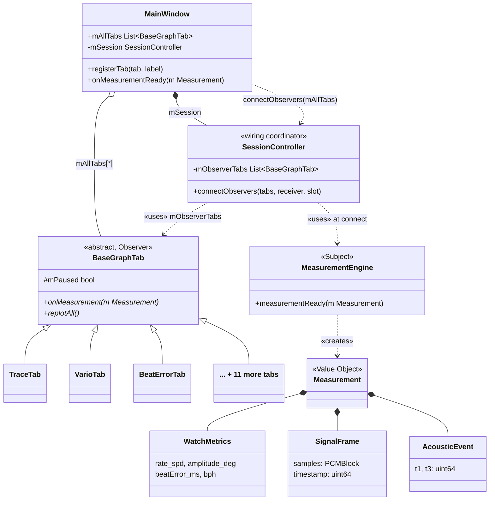
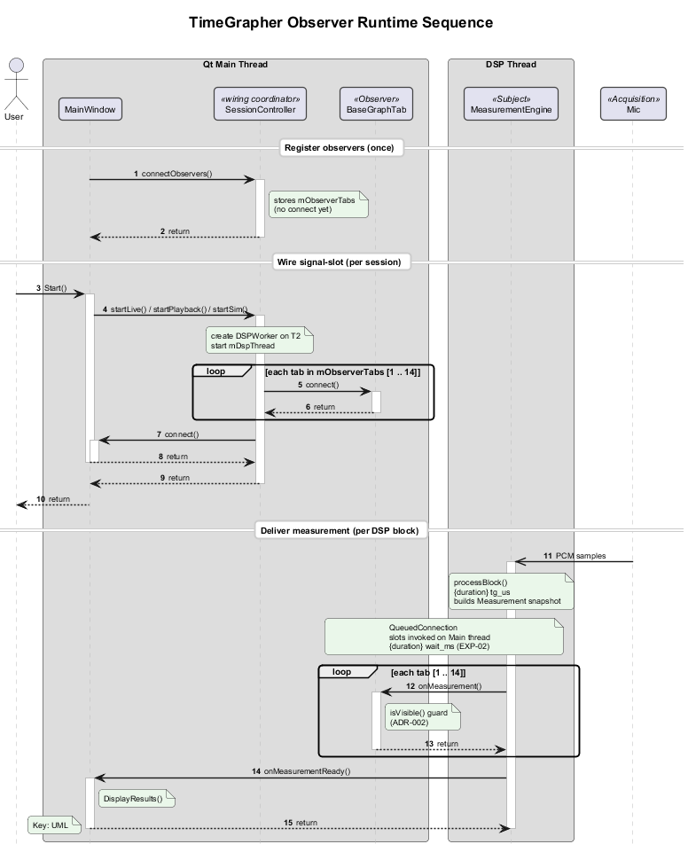

# Decomposition View: Graph Tab

This view decomposes the Presentation layer into its internal components, focusing on the `BaseGraphTab` interface and the `MainWindow` tab registry. It answers: "What must a developer implement to add a new graph tab?"



> No compile-time link `MeasurementEngine → BaseGraphTab`. `SessionController` is the wiring coordinator — it stores `mObserverTabs` and applies `connect()` at session start. Per-beat delivery remains Qt signal-slot only.

## Element Catalog

#### BaseGraphTab (abstract class / Observer)
- Abstract C++ base class that every graph tab must implement.
- Key slot: `onMeasurement(const Measurement& m)` — wired from `MeasurementEngine::measurementReady` via `SessionController`.
- `isVisible()` guard inside `onMeasurement()` skips `replot()` for non-visible tabs (ADR-002 R1), reducing replot/beat from 8.22 to 1.20 (↓85%).
- `showEvent()` triggers `replotAll()` for a catch-up frame when the tab becomes visible.
- No direct reference to Signal Processing or Acquisition layers.

#### MainWindow (tab registry + results observer)
- Owns `mAllTabs` and `registerTab()` — single point of tab registration.
- Calls `SessionController::connectObservers(mAllTabs, this, onMeasurementReady)` at startup.
- `onMeasurementReady(m)` updates the Results label (second Observer on the same signal).

#### SessionController (wiring coordinator)
- Stores observer list from `connectObservers()`; applies `connect()` in `startSourceThread()`.
- Not in the per-beat data path after wiring completes.
- `MeasurementEngine` has zero compile-time knowledge of tabs — emits signal only; `SessionController` wires the abstract `onMeasurement` slot → Subject and Observer decoupled at build time.

#### Concrete Tab Implementations (14 tabs)
Each extends `BaseGraphTab`:

| Group | Tab Class | Display |
|-------|-----------|---------|
| Signal / Scope | `TraceTab` | Raw waveform trace |
| | `RateScopeTab` | Rate deviation scope |
| | `SweepScopeTab` | Sweep oscilloscope |
| | `FilterScopeTab` | Filtered signal scope |
| | `BeatNoiseScopeTab` | Beat noise scope |
| | `SoundPrintTab` | Acoustic fingerprint |
| Measurement | `VarioTab` | Rate deviation (s/d) |
| | `BeatErrorTab` | Beat error (ms) |
| | `EscapementTab` | Escapement analysis |
| | `LongTermTab` | Long-term rate trend |
| | `SequenceTab` | Beat sequence |
| Analysis / AI | `SpectrogramTab` | Frequency spectrogram |
| | `WaveformCompTab` | Waveform comparison |
| | `RadarChartTab` | Multi-metric radar |

Adding a new tab = 1 new subclass + 3 lines in `MainWindow` → zero changes to `MeasurementEngine` or any other tab (ADR-006).

Observer contract compliance validated by AI-generated unit tests (see Behavior section).

## Behavior

**Runtime wiring** — [TimeGrapher Observer Runtime Sequence](../../assets/view2b-observer-runtime.puml):



Three phases (autonumbered UML sequence; lifelines left → right: **User** · Qt Main Thread · **MeasurementEngine** · **Mic**):

1. **Register observers (once)** — `MainWindow` → `SessionController.connectObservers()`; stores `mObserverTabs` only (no `connect` yet)
2. **Wire signal-slot (per session)** — **User** `Start()` → each session start registers Qt `connect()`: `MeasurementEngine::measurementReady` → `BaseGraphTab::onMeasurement` (×14) and → `MainWindow::onMeasurementReady()`; `QueuedConnection` (DSP Thread → Main Thread)
3. **Deliver measurement (per DSP block)** — **Mic** `PCM samples` → DSP Thread `processBlock()` → Main Thread `onMeasurement()` ×14 + `onMeasurementReady()`

**Normal data flow per DSP block** (phase 3):

```
Mic                                      [Acquisition]
    │  PCM samples
    ▼
MeasurementEngine::processBlock()          [DSP Thread]
    ▼  QueuedConnection → Qt Main Thread
    ├─▶ BaseGraphTab::onMeasurement()      [×14 tabs; isVisible() guard — ADR-002]
    └─▶ MainWindow::onMeasurementReady()   [DisplayResults()]
```

**Tab switch catch-up (ADR-002 R1):**

```
User switches to tab T
    → T::showEvent()
    → T::replotAll()           ← catch-up frame when tab becomes visible
```

**Observer contract validation (NTR-07 risk mitigation)**: AI-generated unit tests verify structural correctness — every tab receives the same `Measurement`, does not mutate it, and honors the `BaseGraphTab` interface contract.

Measured results: → [EXP-03: Observer Pattern Compliance](../experiments/exp-03-extensibility-observer-pattern.md)

## Related ADRs

- [ADR-006: BaseGraphTab Observer Pattern](../adr/ADR-006-basegraphtab-observer-pattern.md) — rationale for the `BaseGraphTab` interface and `registerTab()` registration pattern
- [ADR-002: R1 Lazy Rendering](../adr/ADR-002-r1-lazy-rendering.md) — `isVisible()` guard in `onMeasurement()`; `showEvent()` catch-up via `replotAll()`
- [ADR-004: R2 Timer-Decoupled Rendering](../adr/ADR-004-r2-timer-decoupled-rendering.md) — conditional replacement for ADR-002 if EXP-04 confirms R1 insufficient

## Related views

- [Layered View: 4-Layer Allowed-to-Use](view-layered-4layer.md) — parent view; shows where Presentation fits in the full layer stack
- [C&C View: DSP Pipeline Thread Model](view-cc-dsp-pipeline.md) — shows the runtime path that produces the `Measurement` struct consumed here
