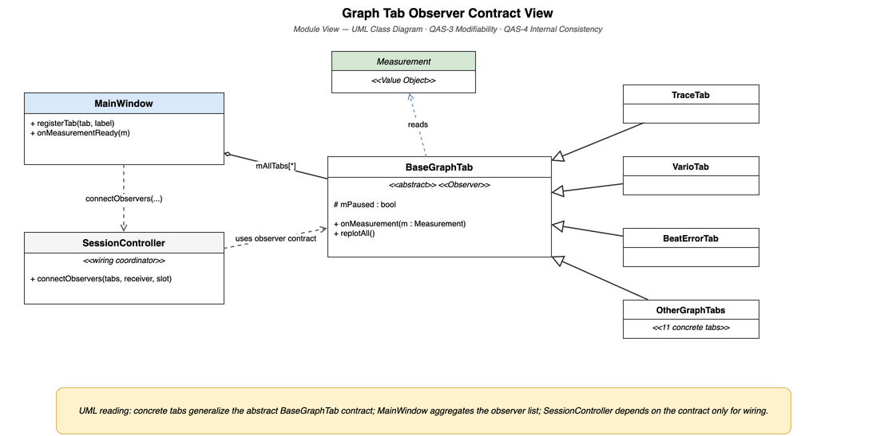
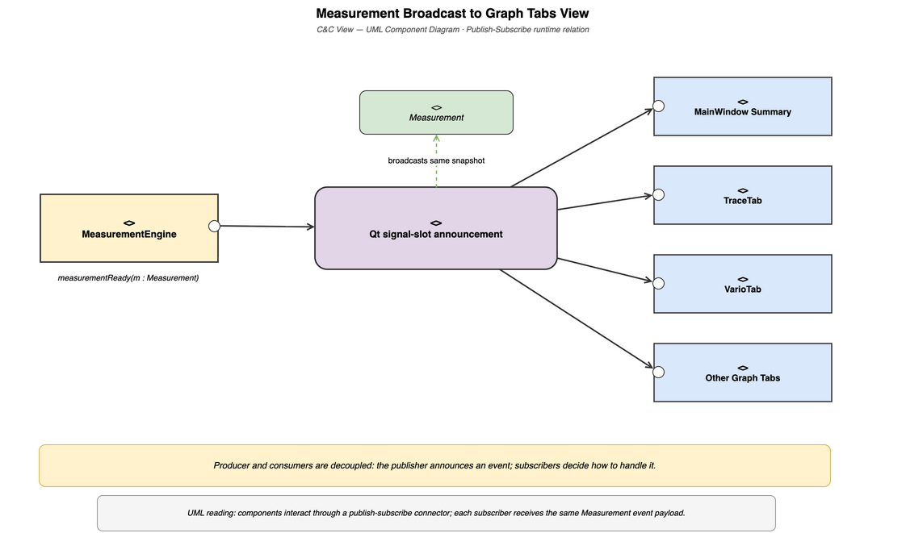

# Decomposition View: Graph Tab

This view documents the observer-based tab design with two complementary views. The first is a static module view showing the shared tab contract. The second is a runtime C&C view showing how one `Measurement` snapshot is distributed to all subscribers.

## Graph Tab Observer Contract View

[Open draw.io source](../../assets/view2-graph-tab-observer-contract.drawio)

This module view shows the static observer contract inside Presentation. It answers: "What common contract does every graph tab implement, and which modules own registration and wiring responsibilities?"

## Element Catalog

#### `BaseGraphTab` (abstract observer contract)
- The single extension contract for graph tabs.
- Every graph tab implements `onMeasurement(const Measurement& m)` and its own rendering logic.
- Shared tab behavior is centralized here rather than duplicated across concrete tabs.

#### Concrete graph tabs
- `TraceTab`, `VarioTab`, `BeatErrorTab`, and the remaining graph tabs all extend `BaseGraphTab`.
- Adding a new tab means adding one more implementation of the same contract, not changing existing tabs.

#### `MainWindow` (tab registry + results observer)
- Owns `mAllTabs` and `registerTab()` as the single registration point.
- Also subscribes separately to update the summary/results display.

#### `SessionController` (wiring coordinator)
- Stores the observer list and applies `connect()` when a session starts.
- Exists to wire publisher to subscribers without making the publisher depend on tab classes.

## Measurement Broadcast to Graph Tabs View

[Open draw.io source](../../assets/view2-measurement-broadcast-to-graph-tabs.drawio)

This C&C view shows the runtime publish-subscribe relation. It answers: "How does one published `Measurement` reach many tabs and the summary display without coupling `MeasurementEngine` to concrete tab implementations?"

## What These Views Establish

- One shared observer contract governs all graph tabs.
- One published `Measurement` snapshot is broadcast to all tab subscribers and to the summary display.
- `MeasurementEngine` depends on the event type, not on tab implementations.
- Adding a new tab means adding a new subscriber, not modifying the publisher.
- All displays derive from the same `Measurement`, supporting internal consistency.

Observer contract compliance and tab extension cost are verified in [EXP-04: Observer Pattern Compliance](../experiments/exp-04-extensibility-observer-pattern.md).

## Related ADRs

- [ADR-006: BaseGraphTab Observer Pattern](../adr/ADR-006-basegraphtab-observer-pattern.md) — rationale for the `BaseGraphTab` interface and `registerTab()` registration pattern

## Related views

- [Layered View: 4-Layer Allowed-to-Use](view-layered-4layer.md) — parent view; shows where Presentation fits in the full layer stack
- [C&C View: DSP Pipeline Thread Model](view-cc-dsp-pipeline.md) — shows the runtime path that produces the `Measurement` struct consumed here
- [Module View: Domain Entity / Value Object](view-domain-entity-vo.md) — shows the structure of the `Measurement` snapshot delivered through this observer design
