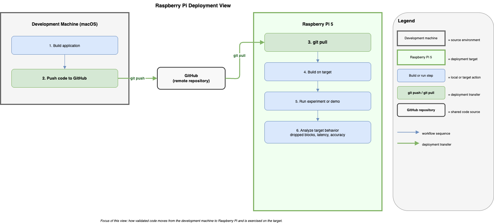

# Raspberry Pi Deployment View

This view shows how validated TimeGrapher code moves from the development machine to the Raspberry Pi target and where target-dependent validation happens. Its main message is that **deployment and target validation are separate concerns from commit-time correctness enforcement**. The Raspberry Pi is the place where runtime feasibility, hardware interaction, and end-to-end measurement behavior are confirmed.

[Open draw.io source](../../assets/deployment-raspberry-pi.drawio)

## Element Catalog

#### Development Machine
- Source environment where code is built and then pushed to the shared repository.
- Upstream structural validation happens here before the deployment path begins.

#### GitHub Repository
- Shared transport point between the development machine and the Raspberry Pi.
- Supports the push/pull deployment path without manual file transfer.

#### Raspberry Pi 5
- Target deployment node for live audio capture and runtime validation.
- Runs the build that interacts with ALSA, the microphone, and the full GUI pipeline.

#### Target Validation Stage
- The point where hardware-dependent evidence is collected.
- This is where dropped-block behavior, latency behavior, and Witschi-comparison readiness are validated.

## Behavior

The important trace is:

1. The development machine builds the application.
2. The code is pushed to GitHub.
3. The Raspberry Pi pulls the updated code.
4. The Raspberry Pi builds the target binary.
5. The Raspberry Pi runs the experiment or demo scenario.
6. Target behavior is then analyzed.

This view intentionally starts after source-level correctness validation. It is about deployment and target execution, not about commit-time gating.

## Related ADRs

- [ADR-003: Audio Sample Rate Selection](../adr/ADR-003-sample-rate-selection.md) — determines the target sample rate and explains why Raspberry Pi confirmation was required.
- [ADR-001: T2 DSP Offload Thread](../adr/ADR-001-t2-dsp-offload-thread.md) — part of the runtime architecture whose behavior must be validated on the target device.

## Related views

- [Pre-commit Correctness Gate View](view-allocation-implementation.md) — shows the earlier correctness gate that happens before code reaches the deployment path.
- [DSP Pipeline Thread Model View](view-cc-dsp-pipeline.md) — shows the runtime components that execute after deployment on the Raspberry Pi.

## Related QA, Risks, and Experiments

- [QAS-1: Real Time Performance](../qa/qas-1-real-time-performance.md) — this view provides the deployment context in which dropped-block validation is performed on Raspberry Pi.
- [QAS-5: Measurement Accuracy, Error Detection, and Handling](../qa/qas-5-measurement-accuracy-error-detection-handling.md) — this view provides the target environment in which final user-visible measurement behavior is validated.
- [Risk Register](../risks.md) — this deployment path is part of the mitigation story for `TR-01`, `TR-02`, and related target-hardware risks.
- [EXP-01: RPi Real-Time Performance](../experiments/exp-01-realtime-dropped-block.md) — validates that the deployed target can sustain the required sample rate without dropped blocks.
- [EXP-02: End-to-End Latency](../experiments/exp-02-latency-e2e.md) — validates that the deployed target meets the runtime latency target after architectural tactics are applied.
- [EXP-06: Witschi Accuracy Comparison](../experiments/exp-06-accuracy-witschi-comparison.md) — provides the final external accuracy evidence on the deployed target setup.
