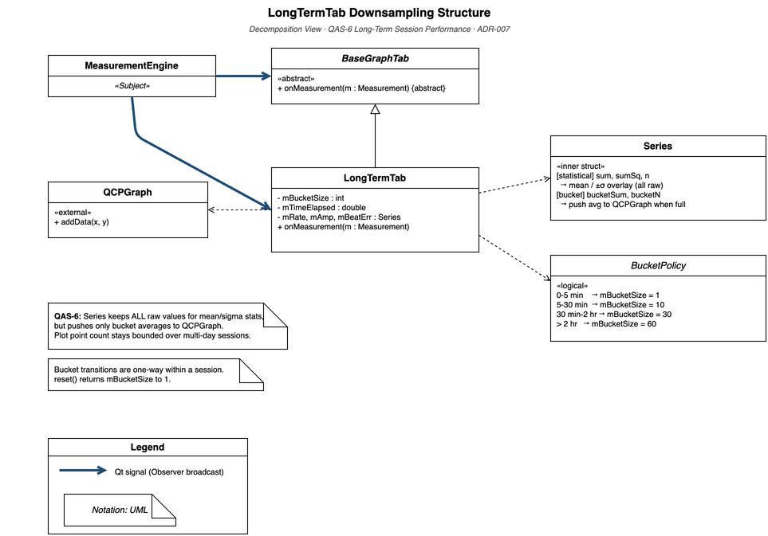
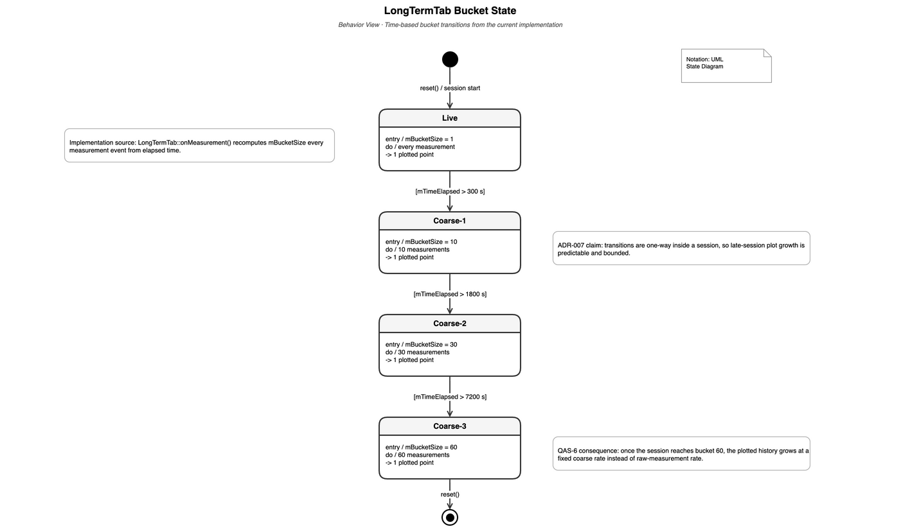

# LongTermTab Downsampling Decomposition View

This view decomposes `LongTermTab` into its internal structural elements, focusing on
the adaptive bucket aggregation strategy (`mBucketSize`) and the three-series layout.

Its message is simple: `LongTermTab` keeps **all raw measurements for statistics**, but
only commits **bucketed averages** to the plotted traces. That is how the design supports
the Long-Term Performance Graph requirement without letting plot size grow without bound.

It answers: "How does `LongTermTab` keep the plotted point count bounded over multi-day
sessions while maintaining meaningful long-term trends and accurate statistical overlays?"

[Open draw.io source](../../assets/module-decomposition-longtermtab.drawio)

## Element Catalog

#### LongTermTab
The sole concrete class in this view. Subscribes to `MeasurementEngine::measurementReady`
via the `BaseGraphTab` observer contract. Maintains three `Series` objects (rate, amplitude,
beat error) and the shared `mBucketSize` scalar. Every `onMeasurement()` call:
1. Advances `mTimeElapsed` by the PCM block duration.
2. Calls `addPoint()` for each available metric.
3. Recomputes `mBucketSize` from `BucketPolicy`.
4. Updates the summary label.
5. Rescales and queues a repaint (guarded by `isVisible()` / `mPaused`).

This is the element that turns the QAS-6 performance concern into a local implementation
rule: older history is shown more coarsely, but the session summary still reflects all
raw samples.

#### Series (inner struct)
Dual-purpose accumulator:
- **Statistical track** (`sum`, `sumSq`, `n`): accumulates every raw value; never reset
  between buckets. Used for the running mean dotted line and ±σ band overlay.
- **Bucket track** (`bucketSum`, `bucketN`): accumulates values within one bucket window.
  When `bucketN == mBucketSize`, the average is pushed to `QCPGraph` and the bucket resets.

This separation ensures the mean/σ overlay is computed over all raw measurements while
the plotted trace is coarsened to stay within the point-count budget.

#### BucketPolicy (logical, not a class)
The four-threshold mapping from `mTimeElapsed` to `mBucketSize`, applied unconditionally
in `onMeasurement()`. The policy is monotonically non-decreasing: once coarsened, it never
returns to a finer granularity within a session (bucket transitions are one-way).

| Phase | Elapsed time | `mBucketSize` | Plot frequency |
|-------|-------------|:-------------:|:-------------:|
| Live  | 0–5 min     | 1             | every measurement |
| Coarse-1 | 5–30 min | 10           | 1 per 10 measurements |
| Coarse-2 | 30 min–2 hr | 30         | 1 per 30 measurements |
| Coarse-3 | > 2 hr   | 60            | 1 per 60 measurements |

#### QCustomPlot / QCPGraph
Third-party plotting library. `QCPGraph::addData()` appends a `(x, y)` point to an
internal `QCPDataContainer`. Render time scales linearly with the number of stored points.
All `replot()` calls from `LongTermTab` use `rpQueuedReplot` to coalesce multiple
same-frame update requests.

## Related Requirement and QA

- [Functional Requirements](../requirments/functional-requirements.md#long-term-performance-graph)
  — this view explains the implementation behind "Record and display rate, amplitude, and
  beat error change over an extended period" and "Benefit from reduced update frequency as
  elapsed time increases".
- [QAS-6: Long-Term Session Performance](../qa/qas-6-long-term-session-performance.md) —
  this is the primary view for explaining why multi-day sessions remain bounded and usable.
- [EXP-07: Long-Term Aging Test](../experiments/exp-07-longterm-aging.md) — validates the
  point-count bound explained by this view.

## Behavior

### State: mBucketSize transitions

[Open draw.io source](../../assets/cc-longtermtab-downsampling-state.drawio)

Transitions are **one-way** within a session. `reset()` returns `mBucketSize` to 1.

## Related ADRs

- [ADR-007: LongTermTab Downsampling](../adr/ADR-007-longtermtab-downsampling.md) —
  rationale for time-based over point-count-based thresholds; justification of the four
  threshold values; rejected alternatives. This view is the structural realization of that
  decision.
- [ADR-006: BaseGraphTab Observer Pattern](../adr/ADR-006-basegraphtab-observer-pattern.md) —
  `LongTermTab` inherits from `BaseGraphTab`; `onMeasurement()` is the observer hook.
- [ADR-002: R1 Lazy Rendering](../adr/ADR-002-r1-lazy-rendering.md) —
  `isVisible()` guard and `rpQueuedReplot` in `onMeasurement()` follow the R1 contract.

## Related Views

- [Graph Tab Module Uses View](view-decomposition-graph-tab.md) — shows `LongTermTab`
  within the full 14-tab observer hierarchy alongside all other `BaseGraphTab` subclasses.
- [DSP Pipeline Thread Model View](view-cc-dsp-pipeline.md) — runtime thread model; `LongTermTab`
  runs on the Qt main thread and receives `Measurement` objects via `Qt::QueuedConnection`
  from the `DSPWorker` thread.
