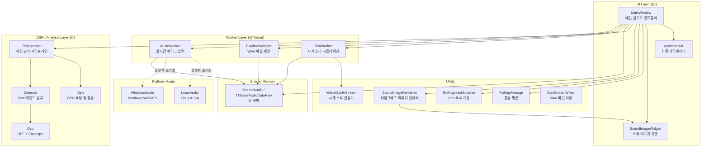
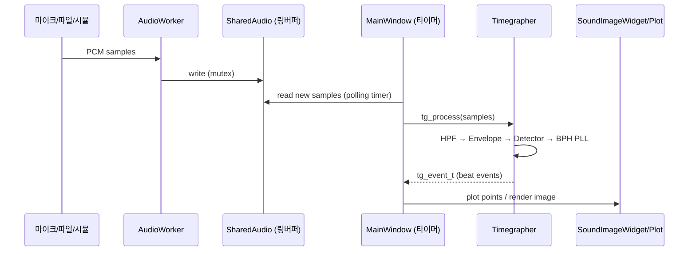

# 모듈 뷰 / Module View

## 레이어 구조 / Layer Diagram

**한국어**

아래 다이어그램은 TimeGrapher 소스코드의 모듈을 레이어 기준으로 분류한 것이다.

**English**

The diagram below categorizes TimeGrapher source modules by layer.

---

## 모듈별 책임 / Module Responsibilities

| 모듈 / Module | 타입 / Type | 책임 / Responsibility |
|---|---|---|
| `MainWindow` | Qt UI | 전체 앱 오케스트레이션, 사용자 이벤트 처리, 분석 루프 / Full app orchestration, user event handling, analysis loop |
| `AudioWorker` | QThread Worker | QAudioSource로 마이크 PCM 수집 → SharedAudio 링버퍼에 쓰기 / Collect mic PCM via QAudioSource → write to SharedAudio ring buffer |
| `PlaybackWorker` | QThread Worker | WAV 파일 읽기 → SharedAudio 링버퍼에 쓰기 / Read WAV file → write to SharedAudio ring buffer |
| `SimWorker` | QThread Worker | WatchSynthStream 합성 신호 → SharedAudio 링버퍼에 쓰기 / WatchSynthStream synthesized signal → write to SharedAudio ring buffer |
| `SharedAudio` | 공유 메모리 / Shared Memory | Worker 3종과 MainWindow 사이 락 기반 링 버퍼 / Mutex-based ring buffer between 3 Workers and MainWindow |
| `Timegrapher` | C DSP 코어 / C DSP Core | HPF → Envelope → Detector → BPH PLL 전체 파이프라인 / Full pipeline: HPF → Envelope → Detector → BPH PLL |
| `Detector` | C 모듈 / C Module | 서브샘플 정확도로 A(onset)/C(peak) 이벤트 감지 / Sub-sample accurate A(onset)/C(peak) event detection |
| `Dsp` | C 모듈 / C Module | 1차 HPF + 엔벨로프 follower (LPF) / First-order HPF + envelope follower (LPF) |
| `Bph` | C 모듈 / C Module | 후보 BPH 목록 매칭, 위상 스코어로 BPH 잠금 / Candidate BPH list matching, phase-score-based BPH lock |
| `RollingLeastSquares` | C++ Util | 슬라이딩 윈도우 선형회귀 → rate(초/일) 추세 / Sliding-window linear regression → rate (s/day) trend |
| `RollingAverage` | C++ Util | 슬라이딩 윈도우 평균 → beat error smoothing / Sliding-window mean → beat error smoothing |
| `SoundImageRenderer` | C++ Util | PCM 샘플 → 타임그래프 이미지 (DC 보정, 컬럼 렌더링) / PCM samples → timegrapher image (DC correction, column rendering) |
| `SoundImageWidget` | Qt Widget | SoundImageRenderer가 만든 QImage를 화면에 표시 / Displays QImage produced by SoundImageRenderer |
| `WatchSynthStream` | C 합성기 / C Synthesizer | 시계 beat 파라미터(BPH, rate error, jitter 등)로 PCM 생성 / Generate PCM from watch beat parameters (BPH, rate error, jitter, etc.) |
| `WavStreamWriter` | C++ Util | float PCM 스트림을 WAV 파일로 저장 / Save float PCM stream to WAV file |
| `WindowsAudio` / `LinuxAudio` | 플랫폼 / Platform | WASAPI/ALSA로 마이크 AGC/볼륨 직접 제어 / Direct mic AGC/volume control via WASAPI/ALSA |

---

## 핵심 데이터 흐름 / Core Data Flow

**한국어**

세 가지 입력 소스(마이크, WAV 파일, 시뮬레이션)는 모두 `SharedAudio` 링버퍼를 통해 동일한 분석 파이프라인으로 전달된다.

**English**

All three input sources (mic, WAV file, simulation) feed the same analysis pipeline through the `SharedAudio` ring buffer.

---

## 주요 관찰 / Key Observations

**한국어**

- **DSP 코어** (`Timegrapher`, `Detector`, `Dsp`, `Bph`)는 순수 C로 작성되어 Qt와 완전히 분리되어 있다. 플랫폼 이식성이 높다.
- **Worker 3종** (Audio/Playback/Sim)은 모두 `SharedAudio` 링버퍼를 통해 MainWindow와 통신하며, 입력 소스를 교체해도 파이프라인이 동일하게 동작한다.
- **MainWindow**가 분석 루프(타이머 기반), UI 업데이트, WAV 저장을 모두 조율하는 God Object 구조다. 향후 아키텍처 리팩토링의 주요 대상이다.

**English**

- **DSP core** (`Timegrapher`, `Detector`, `Dsp`, `Bph`) is written in pure C, fully decoupled from Qt. High platform portability.
- **Three Workers** (Audio/Playback/Sim) all communicate with MainWindow via the `SharedAudio` ring buffer; swapping input sources does not change the downstream pipeline.
- **MainWindow** is a God Object that orchestrates the analysis loop (timer-based), UI updates, and WAV recording. It is the primary candidate for future architectural refactoring.
