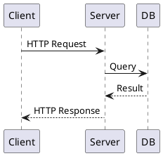
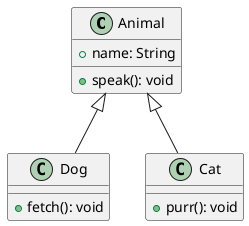
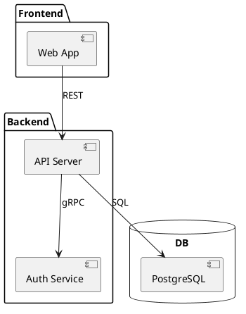
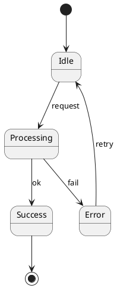

# PlantUML 렌더링 테스트

VS Code에서 PlantUML 플러그인 설치 후 아래 다이어그램이 렌더링되는지 확인.

- [PlantUML (jebbs)](https://marketplace.visualstudio.com/items?itemName=jebbs.plantuml)
- [PlantUML Markdown Preview](https://marketplace.visualstudio.com/items?itemName=yss-tazawa.plantuml-markdown-preview)

---

## 1. Sequence Diagram

---

## 2. Class Diagram

---

## 3. Component Diagram

---

## 4. State Diagram

