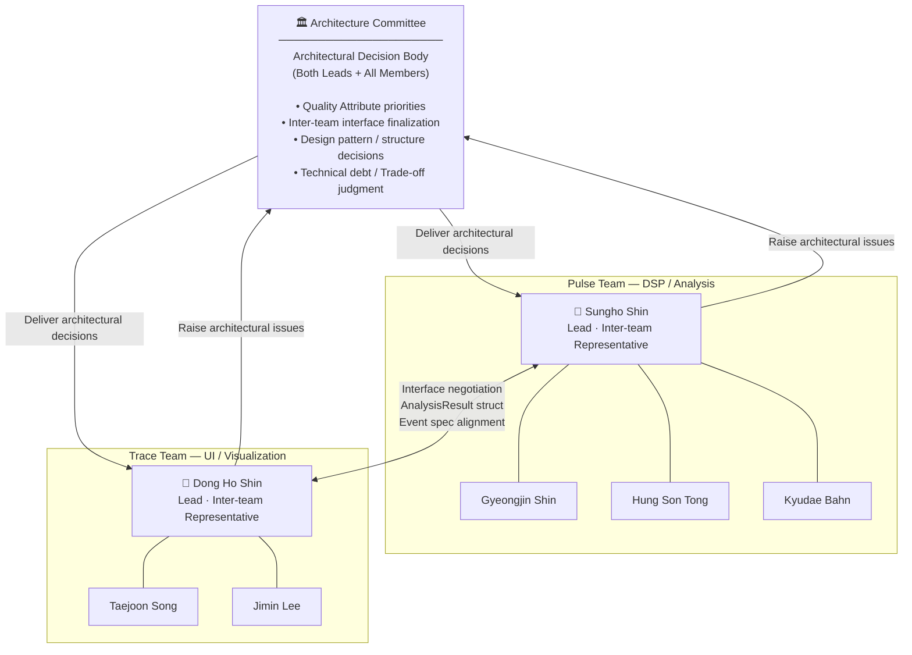

# Team Structure and Roles

> **Date**: 2026-06-04

---

## 1. Team Assignment

Seven members are organized into two functional teams:
**Pulse Team** responsible for signal processing and analysis, and **Trace Team** responsible for visualization and UI.

| Team Name | Role | Lead | Members |
|---|---|---|---|
| **Pulse Team** | DSP / Analysis | **Sungho Shin** | Gyeongjin Shin, Hung Son Tong, Kyudae Bahn |
| **Trace Team** | UI / Visualization | **Dong Ho Shin** | Taejoon Song, Jimin Lee |

---

## 2. Role Structure Diagram



---

## 3. Team Responsibilities

| Item | Pulse Team | Trace Team |
|---|---|---|
| **Lead** | Sungho Shin | Dong Ho Shin |
| **Members** | Gyeongjin Shin<br/>Hung Son Tong<br/>Kyudae Bahn | Taejoon Song<br/>Jimin Lee |
| **Core Responsibility** | PCM → Beat Event detection<br/>Rate / Amplitude / Beat Error computation | 11 graph mode implementation<br/>Qt touchscreen UI |
| **Deliverables** | `tg_event_t`, `AnalysisResult`<br/>Detection accuracy validation report | Display mode screens<br/>Real-time graph rendering |
| **Inter-team Role** | Provide analysis result spec<br/>Notify interface changes in advance | Request data based on UI needs<br/>Feed back rendering performance issues |

---

## 4. Inter-team Interface

The data structures produced by Pulse Team are the sole input to Trace Team.
Any change to the interface spec must be agreed upon through the Architecture Committee before being applied.

```
Pulse Team (DSP / Analysis)
    │
    │  AnalysisResult {
    │      tg_event_t  events[]      // A/C beat events
    │      double      rate_spd      // Rate (s/d)
    │      double      amplitude_deg // Amplitude (°)
    │      double      beat_error_ms // Beat Error (ms)
    │      int         bph           // Beats Per Hour
    │      bool        synced        // BPH lock status
    │  }
    │
    ▼
Trace Team (UI / Visualization)
```

---

## 5. Architecture Committee Operations

When inter-team architectural issues arise, the Architecture Committee is convened for a decision.
All decisions must be recorded under `docs/` and shared with both teams.

| Item | Details |
|---|---|
| **Members** | Both leads (Sungho Shin, Dong Ho Shin) + relevant members per agenda |
| **Trigger** | Interface change / QA conflict / design direction decision needed |
| **Agenda** | `AnalysisResult` interface spec finalization<br/>Sample rate strategy / graph data format / performance targets |
| **Decision** | Both leads agree → share with all → reflect in `docs/` |
