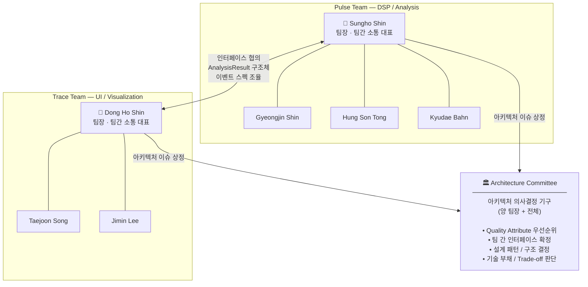

# 팀 구성 및 역할 구조 / Team Structure and Roles

> **작성일 / Date**: 2026-06-04

---

## 1. 팀 편성 / Team Assignment

**한국어**

전체 7인을 기능 단위 기준으로 2개 팀으로 편성한다.
신호 처리 및 분석을 담당하는 **Pulse Team**과 시각화 및 UI를 담당하는 **Trace Team**으로 구성한다.

**English**

Seven members are organized into two functional teams:
**Pulse Team** responsible for signal processing and analysis, and **Trace Team** responsible for visualization and UI.

| 팀명 / Team Name | 역할 / Role | 팀장 / Lead | 팀원 / Members |
|---|---|---|---|
| **Pulse Team** | DSP / Analysis | **Sungho Shin** | Gyeongjin Shin, Hung Son Tong, Kyudae Bahn |
| **Trace Team** | UI / Visualization | **Dong Ho Shin** | Taejoon Song, Jimin Lee |

---

## 2. 역할 구조도 / Role Structure Diagram



---

## 3. 팀별 역할 상세 / Team Responsibilities

**한국어**

각 팀의 핵심 책임, 산출물, 팀간 소통 역할을 아래 표에 정리한다.

**English**

The table below summarizes each team's core responsibilities, deliverables, and inter-team communication role.

| 항목 / Item | Pulse Team | Trace Team |
|---|---|---|
| **팀장 / Lead** | Sungho Shin | Dong Ho Shin |
| **팀원 / Members** | Gyeongjin Shin<br/>Hung Son Tong<br/>Kyudae Bahn | Taejoon Song<br/>Jimin Lee |
| **핵심 책임 / Core Responsibility** | PCM → Beat Event 검출<br/>Rate / Amplitude / Beat Error 계산<br/>PCM → Beat Event detection<br/>Rate / Amplitude / Beat Error computation | 11개 그래프 모드 구현<br/>Qt 터치스크린 UI<br/>11 graph mode implementation<br/>Qt touchscreen UI |
| **주요 산출물 / Deliverables** | `tg_event_t`, `AnalysisResult`<br/>검출 정확도 검증 결과<br/>Detection accuracy validation report | 각 Display Mode 화면<br/>실시간 그래프 렌더링<br/>Display mode screens<br/>Real-time graph rendering |
| **팀간 소통 역할 / Inter-team Role** | Analysis 결과 스펙 제공<br/>인터페이스 변경 사전 공지<br/>Provide analysis result spec<br/>Notify interface changes in advance | UI 요구사항 기반 데이터 요청<br/>렌더링 성능 이슈 피드백<br/>Request data based on UI needs<br/>Feed back rendering performance issues |

---

## 4. 팀 간 인터페이스 / Inter-team Interface

**한국어**

Pulse Team이 생산하는 데이터 구조가 Trace Team의 유일한 입력이다.
인터페이스 스펙 변경은 반드시 Architecture Committee를 통해 합의 후 적용한다.

**English**

The data structures produced by Pulse Team are the sole input to Trace Team.
Any change to the interface spec must be agreed upon through the Architecture Committee before being applied.

```
Pulse Team (DSP / Analysis)
    │
    │  AnalysisResult {
    │      tg_event_t  events[]      // A/C beat events
    │      double      rate_spd      // Rate (s/d)
    │      double      amplitude_deg // Amplitude (°)
    │      double      beat_error_ms // Beat Error (ms)
    │      int         bph           // Beats Per Hour
    │      bool        synced        // BPH lock status
    │  }
    │
    ▼
Trace Team (UI / Visualization)
```

---

## 5. Architecture Committee 운영 / Architecture Committee Operations

**한국어**

팀간 아키텍처 이슈가 발생할 경우 Architecture Committee를 소집하여 결정한다.
결정 사항은 반드시 `docs/`에 기록하고 양 팀에 공유한다.

**English**

When inter-team architectural issues arise, the Architecture Committee is convened for a decision.
All decisions must be recorded under `docs/` and shared with both teams.

| 항목 / Item | 내용 / Details |
|---|---|
| **구성 / Members** | 양 팀장 (Sungho Shin, Dong Ho Shin) + 안건 관련 팀원<br/>Both leads + relevant members per agenda |
| **소집 조건 / Trigger** | 팀 간 인터페이스 변경 / QA 충돌 / 설계 방향 결정 필요 시<br/>Interface change / QA conflict / design direction decision needed |
| **주요 의제 / Agenda** | `AnalysisResult` 인터페이스 스펙 확정<br/>샘플레이트 전략 / 그래프 데이터 포맷 / 성능 목표 조정<br/>Interface spec finalization / sample rate strategy / graph data format / performance targets |
| **결정 방식 / Decision** | 양 팀장 합의 → 전체 공유 → `docs/` 반영<br/>Both leads agree → share with all → reflect in `docs/` |
