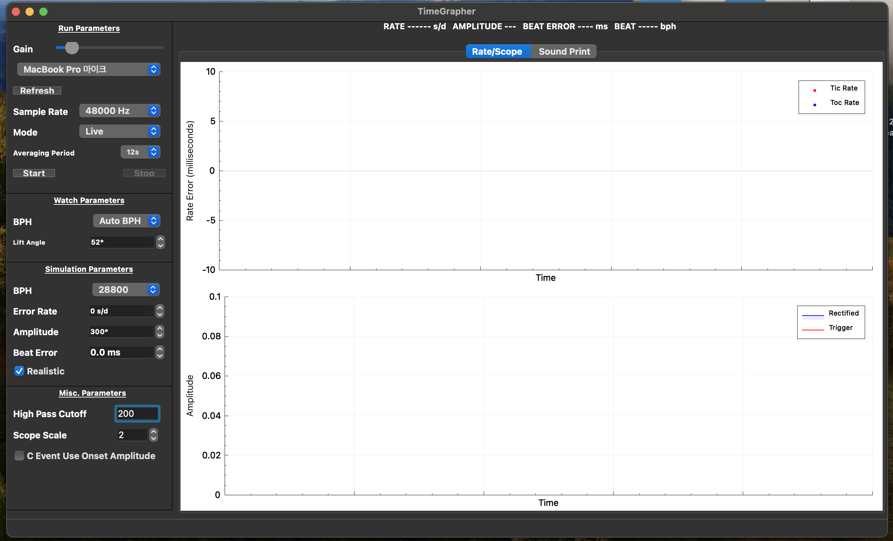

# PC Build Verification Record (macOS)

> Windows CLI verification is documented separately: `pc-build-verification-windows.md`

**Date**: 2026-05-28  
**Author**: Jimin Lee  
**Target**: TimeGrapher_v10.5_Student

---

## Environment

| Item | Version |
|------|---------|
| OS | macOS 14.6.1 (Sonoma, Build 23G93) |
| Compiler | Apple clang 15.0.0 (clang-1500.3.9.4) |
| Qt | 6.11.1 (macOS, `~/Qt/6.11.1/macos`) |
| CMake | 3.30.5 (Qt bundle, `~/Qt/Tools/CMake`) |
| Qt Creator | `~/Qt/Qt Creator.app` (installation confirmed) |

---

## Procedure

### 1. Extract Source Archive

```bash
unzip TimeGrapher_v10.5_Student.zip -d ~/Desktop/2026_architect/TimeGrapher
```

Result: all source files extracted under `TimeGrapher/TimeGrapher/`

### 2. CMake Configuration

```bash
mkdir -p ~/Desktop/2026_architect/TimeGrapher/build
cd ~/Desktop/2026_architect/TimeGrapher/build
~/Qt/6.11.1/macos/bin/qt-cmake ../TimeGrapher -DCMAKE_BUILD_TYPE=Release
```

Result:
```
-- The CXX compiler identification is AppleClang 15.0.0.15000309
-- Found Threads: TRUE
-- Found WrapOpenGL: TRUE
-- Found Cups: libcups 2.3.4
-- Configuring done (4.3s)
-- Generating done (1.8s)
-- Build files have been written to: .../TimeGrapher/build
```

### 3. Build (Release)

```bash
cmake --build . --config Release -j$(sysctl -n hw.ncpu)
```

Result:
```
[100%] Built target TimeGrapher
```

- Errors: **none**
- Warnings: 6 Qt 6.9/6.13 deprecated API warnings in `qcustomplot.cpp` (third-party, can be ignored)
  - `toTimeSpec` → `toTimeZone` recommended
  - `startOfDay` → QTimeZone parameter recommended
  - `mirrored` → `flipped(Qt::Orientations)` recommended

### 4. Run

```bash
open ~/Desktop/2026_architect/TimeGrapher/build/TimeGrapher.app
```

Result: **TimeGrapher GUI launched successfully**



> - Gain: MacBook Pro microphone (auto-detected via macOS CoreAudio)
> - Sample Rate: 48000 Hz, Mode: Live
> - Rate/Scope and Sound Print tabs displayed correctly
> - Rate Error graph and Amplitude graph rendering confirmed

---

## Artifacts

| File | Size | Path |
|------|------|------|
| TimeGrapher (binary) | 4.1 MB | `build/TimeGrapher.app/Contents/MacOS/TimeGrapher` |
| TimeGrapher.app (bundle) | — | `build/TimeGrapher.app/` |

---

## macOS Notes

- `LinuxAudio.cpp` is harmlessly skipped on macOS due to the `#if defined(Q_OS_LINUX)` guard
- macOS does not require `libasound2-dev` (uses CoreAudio; handled automatically by Qt Multimedia)
- Windows-only link libraries (`winmm`, `Ole32`, `Uuid`, `Propsys`) are also skipped via conditional compilation

---

## Conclusion

`TimeGrapher_v10.5_Student` macOS build and launch **succeeded** ✓
