# TimeGrapher 도메인 지식 / Domain Knowledge

> **출처**: `TimeGrapher Equations_v0.docx.pdf`, `Witschi-Training-Course.pdf`

---

## 1. 기계식 시계 구조 / Mechanical Watch Structure

**태엽 → 기어트레인 → 탈진기 → 밸런스휠+헤어스프링 → 시침 구동**  
**Mainspring → Gear train → Escapement → Balance wheel + Hairspring → Hand drive**

- 진동 주파수 / Frequency: 2.5–5 Hz = 18,000–36,000 bph
- 진동(oscillation): A→B→A (왕복 / full swing)
- 진동수(vibration): A→B (반왕복 / half swing)

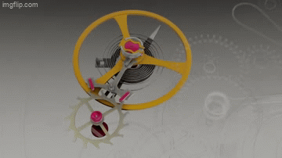
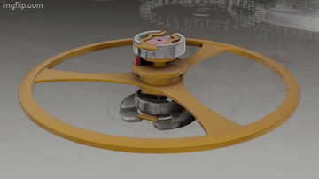

---

## 2. 비트 소음 이벤트 A/B/C / Beat Noise Events

한 비트(tic 또는 tac)마다 3개의 충격음이 발생한다.  
Each beat (tic or tac) produces 3 distinct acoustic events.

| 이벤트 | 발생 원인 | 사용 용도 |
|:---:|---|:---:|
| **A** | 임펄스 핀 → 팔레트 포크 / Impulse pin strikes pallet fork | 레이트·비트오차 / Rate, Beat error |
| **B** | 이스케이프 휠 치아 → 팔레트 스톤 임펄스면 | 미사용 / Not used |
| **C** | 치아 → 잠금면 + 레버 → 뱅킹핀 / Locking plane + banking pin | 진폭 / Amplitude |

[비트 소음 구성](domain_asset/witschi_p11_01.jpg)

 
 
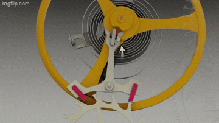

---

## 3. 핵심 측정값 / Key Measured Parameters

| 파라미터 | 정의 | 단위 | 정상범위 (남성용) |
|---|---|:---:|:---:|
| **Rate** | 실제 vs 이상 주기 차이 평균 / Avg. deviation from nominal | s/day | −5 ~ +15 |
| **Beat Error** | 반-비트 간격 비대칭 / Half-beat asymmetry | ms | 0.0 – 0.5 |
| **Amplitude** | 밸런스휠 최대 각도 / Max balance wheel angle | ° | 250 – 330 (H) |

---

## 4. 레이트 오차 수식 / Rate Error Formula

**순간 오차 / Instantaneous error:**
```
E_n = T_measured − (T_start + n × I_target)
```
- `T_start` : 첫 비트 앵커 타임스탬프 / First beat anchor timestamp
- `I_target` : 이상적 비트 간격 / Ideal beat interval (28,800 bph → 125 ms)
- 직선 기울기 = 일정 레이트 오차 / Straight slope = constant rate error
- 평탄 = 정확 / Flat = on rate · 흩어짐 = 노이즈 / Scattered = noise

 
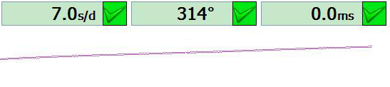 
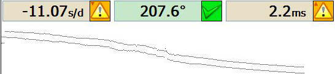

---

## 5. 교번 이벤트 레이트 계산 / Rate from Alternating A Events

```
틱 위상 / Tic phase  : A₀, A₂, A₄, …   T_tic,k = A₂(k+1) − A₂k
택 위상 / Tac phase  : A₁, A₃, A₅, …   T_tac,k = A₂k+3   − A₂k+1

rate_tic/tac = (T_nom − T_tic/tac) / T_nom × 86400   [s/day]
Rate = (rate_tic + rate_tac) / 2
```
- 28,800 bph → T_nom = 250 ms
- 틱·택 분리 이유: 비트 오차로 인한 비대칭 오염 제거 / Separates beat-error asymmetry

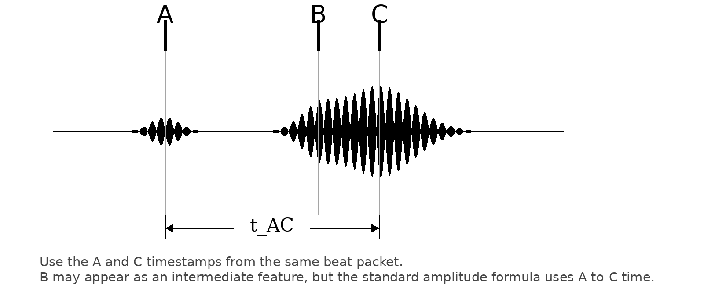

---

## 6. 비트 오차 수식 / Beat Error Formula

```
t1 = A₁ − A₀  (첫 반-비트 / 1st half-beat)
t2 = A₂ − A₁  (둘째 반-비트 / 2nd half-beat)
BE = |t1 − t2| / 2
```

| BE (ms) | 상태 / Status |
|:---:|---|
| 0.0 | 완전 대칭 / Perfect |
| 0.0 – 0.5 | 정상 / Normal |
| > 1.0 | 조정 필요 / Needs adjustment |
| > 3.0 | 즉시 조정 / Immediate action |

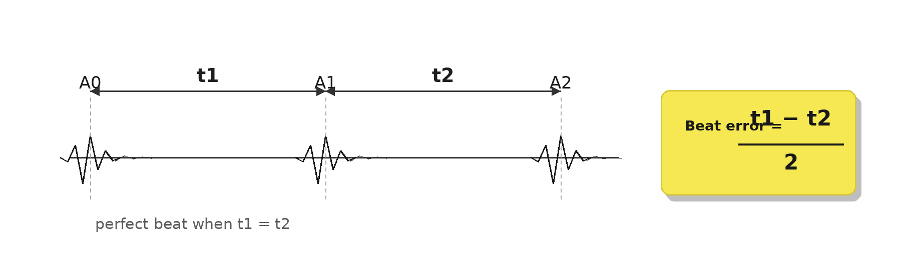

---

## 7. 진폭 수식 / Amplitude Formula

```
Amp = (3600 × λ) / (π × n × t_AC)          [°]

샘플 기반 / Sample-index:
Amp_n = (3600 × λ × f_s) / (π × n × (c_n − a_n))
```
- `λ` : 리프트 각도 / Lift angle (default 52°, 무브먼트별 설정)
- `n` : bph
- `t_AC` : A→C 간격 / A-to-C interval (짧을수록 진폭 큼 / shorter = larger amp)
- 예시 / Example: λ=52°, n=28,800, t_AC=9ms → **Amp ≈ 230°**

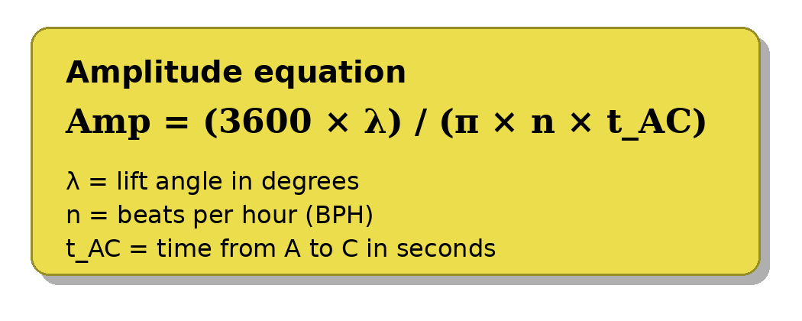

---

## 8. 그래프 패턴 진단 / Graph Pattern Diagnosis

| 트레이스 패턴 | 원인 / Cause | 조치 / Action |
|---|---|---|
| 직선 기울기 / Straight slope | 레이트 오차 / Rate deviation | 레이트 조정 |
| 이중 줄기 / Double line | 비트 오차 과다 / High beat error | 비트 오차 조정 후 레이트 재조정 |
| 수직 위치 변동 큼 | 밸런스 불균형 | 밸런스 교체 |
| 주기적 파형 / Periodic wave | 기어 결함 / Gear defect | 기어트레인 점검 |
| 두껍고 흩어짐 / Thick & scattered | 진폭 부족·노이즈 | 오버홀 |

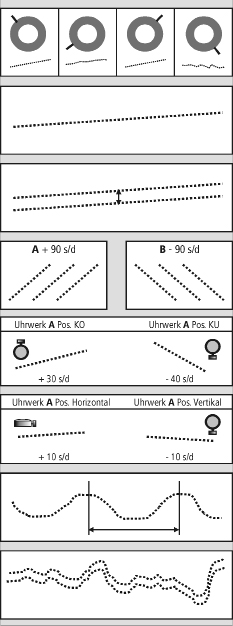 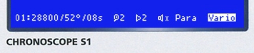

---

## 9. Scope 파형 진단 / Scope Waveform Diagnosis

| 파형 패턴 | 원인 |
|---|---|
| 탈진 피팅 약함 / Fitting too weak | 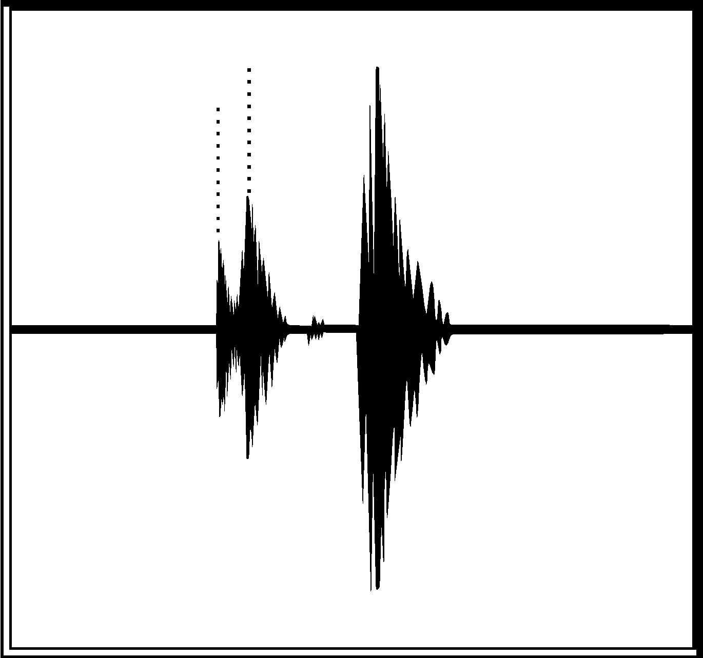 |
| 탈진 피팅 강함 / Fitting too strong | 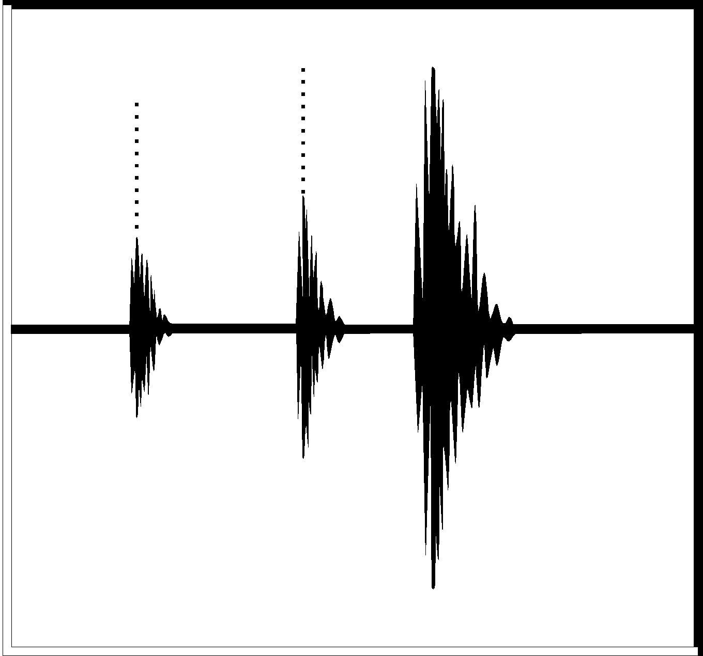 |
| 추가 마찰 / Additional friction | 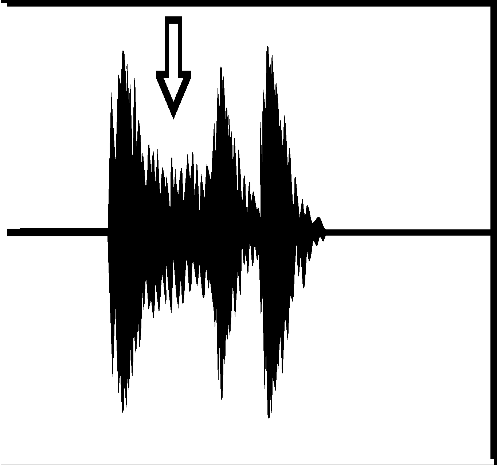 |
| 약한 진폭 / Weak amplitude | 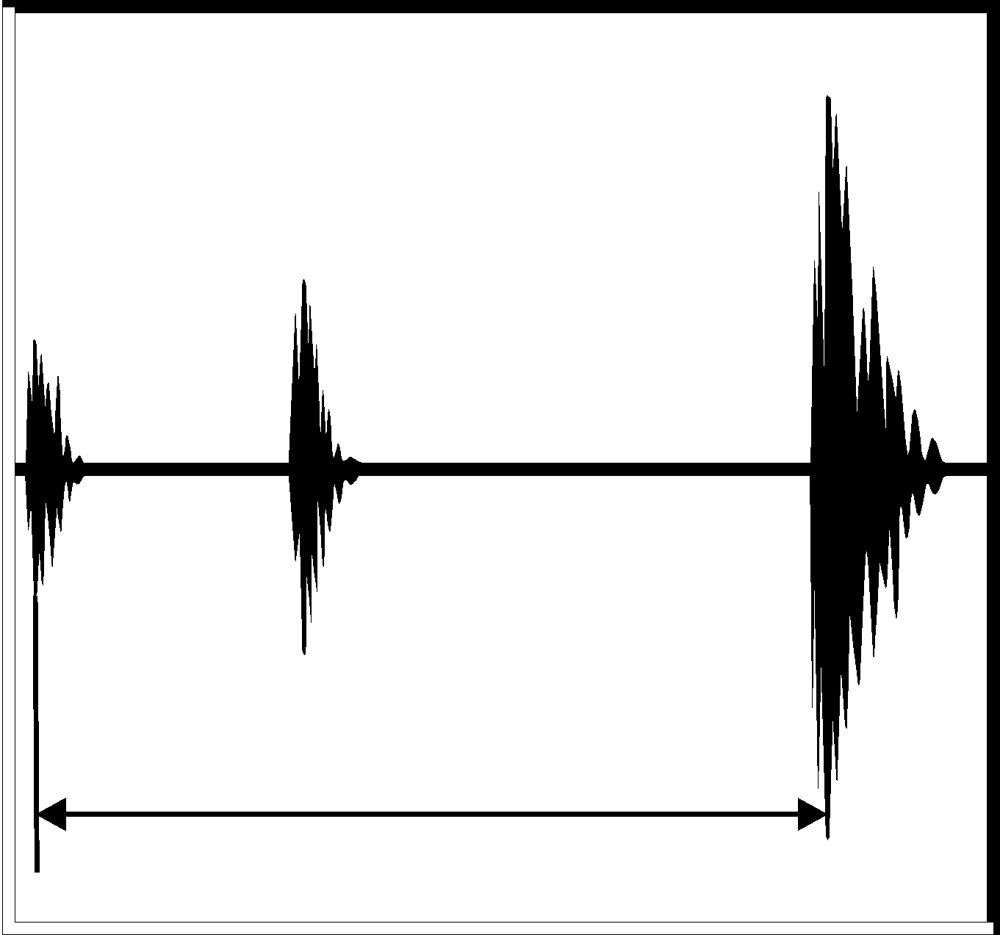 |
| 밸런스 피벗 흔들림 / Axial end shake | 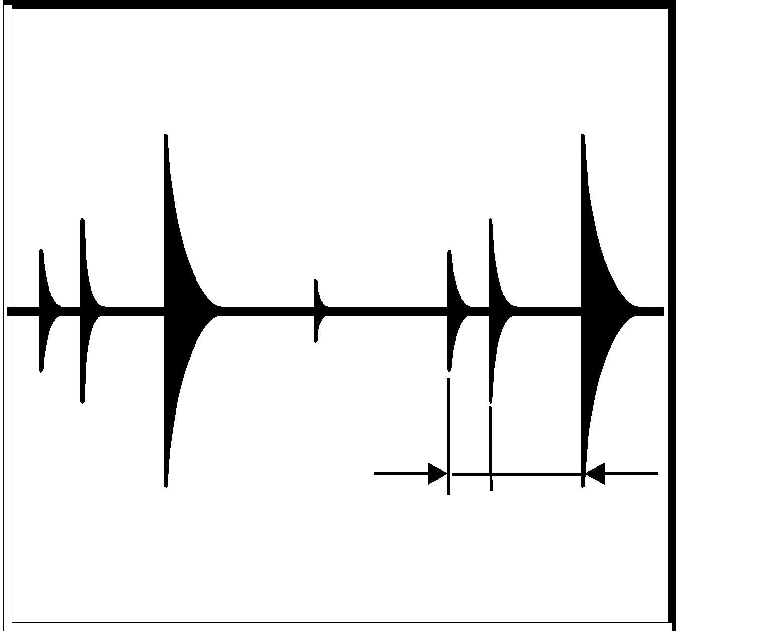 |
| 헤어스프링 접촉 / Grazing hair spring | 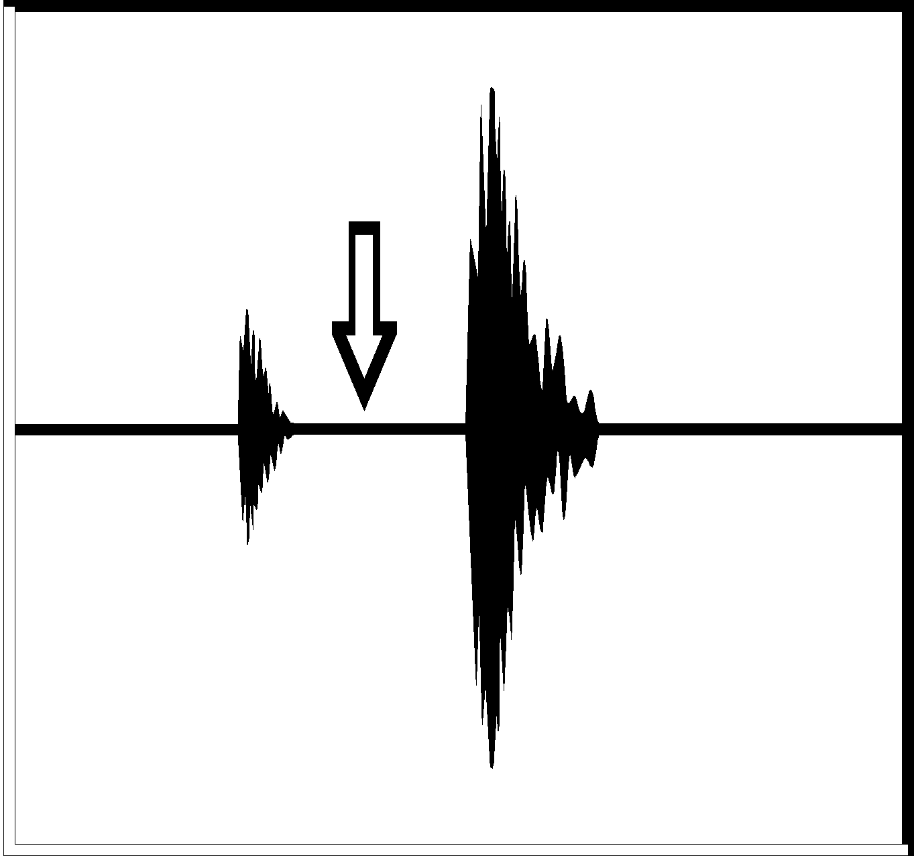 |

---

## 12. 비트 vs 샘플레이트 / Beat vs Sample Rate

| 구분 | 비트 (Beat) | 샘플레이트 (f_s) |
|---|---|---|
| **정의** | 탈진기가 한 번 동작하는 사건 / One escapement click event | ADC가 오디오를 디지털화하는 속도 / Audio digitization rate |
| **단위** | bph (beats/hour) | Hz (samples/sec) |
| **예시** | 28,800 bph = 8 beats/sec | 44,100 Hz, 48,000 Hz |
| **발생 주체** | 시계 무브먼트 / Watch movement | 마이크 + ADC / Microphone + ADC |
| **제어 가능?** | 불가 (시계가 결정) / Fixed by watch | 가능 (소프트웨어 설정) / Configurable |

**핵심 관계 / Key relationship:**

```
비트 간격 [samples] = f_s / (BPH / 3600)
예시: 44,100 Hz / 8 beats/sec = 5,512.5 samples/beat
```

- 비트 이벤트(A/B/C)는 샘플 스트림 안의 **특정 인덱스(n)** 로 감지됨  
  Beat events (A/B/C) are detected as **specific sample indices (n)** within the audio stream
- 타임스탬프 변환: `T = n / f_s` (샘플 인덱스 → 초 / sample index → seconds)
- f_s가 높을수록 타이밍 분해능 향상 / Higher f_s → finer timing resolution
- **비트 레이트 ≠ 샘플레이트**: 28,800 bph 시계를 44,100 Hz로 샘플링해도 비트는 초당 8개만 발생  
  Beat rate ≠ sample rate: a 28,800 bph watch sampled at 44,100 Hz still produces only 8 beats/sec

---

## 수식 요약 / Formula Reference

| 파라미터 | 수식 | 단위 |
|---|---|:---:|
| 순간 오차 | `E_n = T_measured − (T_start + n × I_target)` | s |
| Y 좌표 | `Y_n = E_n mod PlotHeight` | px |
| 레이트 | `Rate = (rate_tic + rate_tac) / 2` | s/day |
| 비트 오차 | `BE = (t1 − t2) / 2` | ms |
| 진폭 | `Amp = (3600 × λ) / (π × n × t_AC)` | ° |
| 주파수 | `F = (A/h) / (2 × 3600)` | Hz |
