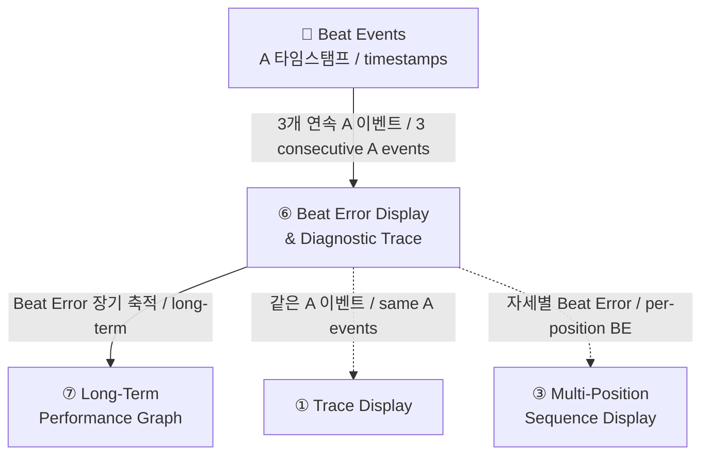
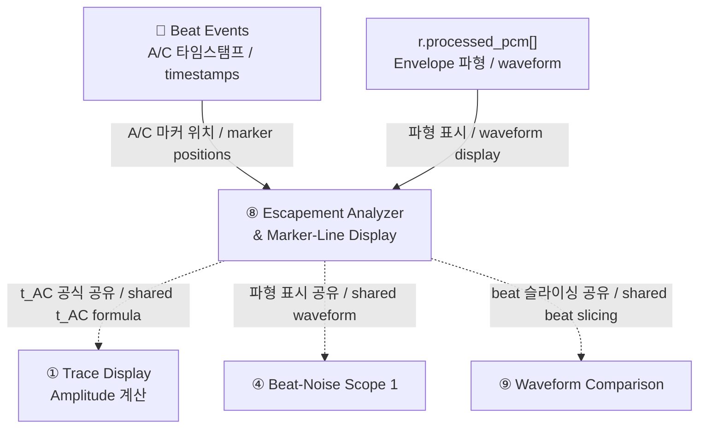
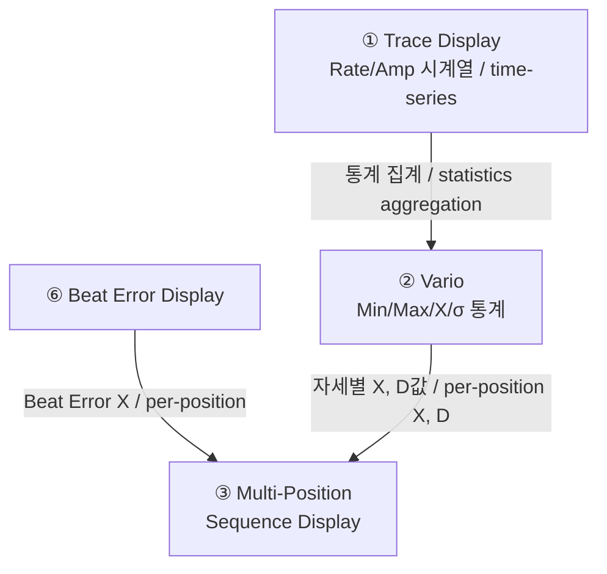

# TimeGrapher 그래프 분석 / Graph Analysis

> 11개 그래프 중 3개 (Beat Error Display & Diagnostic Trace, Escapement Analyzer & Marker-Line Display, Multi-Position Sequence Display) 상세 분석  
> Detailed analysis of 3 out of 11 graphs: Beat Error Display & Diagnostic Trace, Escapement Analyzer & Marker-Line Display, Multi-Position Sequence Display

---

## 3개 그래프 전체 비교 요약 / Overall Comparison

**한국어**

| | Beat Error Display & Diagnostic Trace | Escapement Analyzer & Marker-Line Display | Multi-Position Sequence Display |
|---|---|---|---|
| **목적** | tick/tock 비대칭 실시간 수치화 + 추이 진단 | A/C 이벤트 마커를 파형 위에 표시해 이스케이프먼트 정밀 분석 | 최대 10개 자세별 측정값 비교 요약 |
| **시간 스케일** | 현재 세션 실시간 | 개별 beat 단위 | 자세당 수십 초 ~ 수 분 |
| **표시 방식** | 연속 점 그래프 + 수치 | 파형 + 수직 마커선 + ms 레이블 | 자세별 테이블 (행=자세, 열=측정값) |
| **측정 항목** | Beat Error (ms) | t_AC (ms) + Amplitude (°) | Rate + Amplitude + Beat Error × 자세 수 |
| **진단 질문** | "tick/tock이 균등한가?" | "A→C 간격이 정상인가?" | "자세에 따라 시계 성능이 어떻게 달라지나?" |
| **데이터 소스** | A 이벤트 3개 연속 | A/C 이벤트 쌍 + processed_pcm | Vario 통계 (X, D) × 자세별 누적 |

**English**

| | Beat Error Display & Diagnostic Trace | Escapement Analyzer & Marker-Line Display | Multi-Position Sequence Display |
|---|---|---|---|
| **Purpose** | Real-time tick/tock asymmetry quantification + trend diagnosis | Precise escapement analysis via A/C event markers on waveform | Comparative summary of measurements across up to 10 positions |
| **Time scale** | Current session real-time | Individual beat level | Tens of seconds to minutes per position |
| **Display type** | Continuous dot graph + numeric | Waveform + vertical marker lines + ms labels | Per-position table (rows=positions, columns=metrics) |
| **Metrics** | Beat Error (ms) | t_AC (ms) + Amplitude (°) | Rate + Amplitude + Beat Error × number of positions |
| **Diagnostic question** | "Are tick and tock symmetric?" | "Is the A→C interval normal?" | "How does watch performance vary by position?" |
| **Data source** | 3 consecutive A events | A/C event pairs + processed_pcm | Vario statistics (X, D) accumulated per position |

---

## 1. Beat Error Display & Diagnostic Trace

### 그래프 목적 / Purpose

**한국어**

tick과 tock 사이의 시간 비대칭을 실시간으로 수치화하고 시간 추이를 시각화하여 이스케이프먼트의 조율 상태를 진단하는 그래프.

- Beat Error 수치가 **0.6 ms 이하**인지 판별
- 시간에 따른 Beat Error **변화 추이** 모니터링
- Rate 측정값의 **신뢰도 판단** 보조

> 핵심: Rate가 정상이어도 Beat Error가 클 수 있음 — 두 지표는 독립적

**English**

A graph that quantifies tick/tock time asymmetry in real time and visualizes the trend over time to diagnose the escapement adjustment state.

- Determine whether Beat Error is **below 0.6 ms**
- Monitor **trend changes** in Beat Error over time
- Assist in judging **reliability of Rate measurements**

> Key: Rate can be normal even when Beat Error is large — the two metrics are independent

**화면 구조 / Screen Layout:**

```
┌─────────────────────────────────────────────────────────────────┐
│  BEAT ERROR  0.8 ms                          [Beat Error]       │
├─────────────────────────────────────────────────────────────────┤
│      │                                                          │
│  2.0─│                                                          │
│      │  * *                                                     │
│  1.0─│       *  *                                               │
│  0.6─│─ ─ ─ ─ ─ ─ ─ ─ ─ ─ ─ ─ ─ ─ ─ ─ ─ ─ ─ ─ ─ ─ ─ ─ ─   │  ← 기준선 / baseline
│      │              * * * * * * * * * * * * * * *              │
│  0.0─│                                                          │
│      └──────┬──────┬──────┬──────┬──────┬──────────            │
│           2:00   4:00   6:00   8:00  10:00 min                  │
└─────────────────────────────────────────────────────────────────┘
```

| 축 / Axis | 내용 / Content | 단위 / Unit | 범위 / Range |
|---|---|---|---|
| **X축** | 경과 시간 / Elapsed time | min | 0 ~ N |
| **Y축** | Beat Error | ms | 0 ~ 2.0 ms |
| **기준선** | 정상/비정상 경계 / Normal boundary | ms | 0.6 ms |

---

### 소스 데이터 및 공식 / Source Data and Formulas

**한국어**

**입력 데이터:**

```
r.events[]        ← A 이벤트 (is_onset=1) 3개 연속
r.sync_status     ← SYNCED 상태일 때만 계산
r.detected_bph    ← BPH 표시용
```

**Beat Error 계산:**

```
A 이벤트 3개 연속 수집: A0, A1, A2

t1 = A1.time_seconds - A0.time_seconds   ← tick 구간
t2 = A2.time_seconds - A1.time_seconds   ← tock 구간

Beat Error = |t1 - t2| / 2 × 1000       ← ms 변환
```

**표시값 (이동 평균 / Rolling Average):**

```
RollingAverage(10).Add(BeatErrorMs)
DisplayValue = RollingAverage.GetAverage()
```

**English**

**Input data:**

```
r.events[]        ← A events (is_onset=1), 3 consecutive
r.sync_status     ← compute only when SYNCED
r.detected_bph    ← for BPH display
```

**Beat Error calculation:**

```
Collect 3 consecutive A events: A0, A1, A2

t1 = A1.time_seconds - A0.time_seconds   ← tick interval
t2 = A2.time_seconds - A1.time_seconds   ← tock interval

Beat Error = |t1 - t2| / 2 × 1000       ← convert to ms
```

**Display value:**

```
RollingAverage(10).Add(BeatErrorMs)
DisplayValue = RollingAverage.GetAverage()
```

---

### 그래프 예시 / Graph Examples

#### Case 1: 정상 시계 / Normal Watch

```
Beat Error (ms)
2.0─│
1.0─│
0.6─│─ ─ ─ ─ ─ ─ ─ ─ ─ ─ ─ ─  ← 기준선 / baseline
    │* * * * * * * * * * * * *   ← 기준선 아래 안정 / stable below baseline
0.0─│____________________________
     시간 / time →
```

> 한국어: Beat Error < 0.6 ms, 안정적 수평 유지. 이스케이프먼트 조율 상태 양호  
> English: Beat Error < 0.6 ms, stable horizontal. Escapement well adjusted

#### Case 2: Beat Error 큰 시계 / High Beat Error Watch

```
Beat Error (ms)
2.0─│* *   * *   * *             ← 기준선 훨씬 위 / far above baseline
1.0─│    *      *
0.6─│─ ─ ─ ─ ─ ─ ─ ─ ─ ─ ─ ─  ← 기준선 / baseline
0.0─│____________________________
     시간 / time →
```

> 한국어: Beat Error > 1.0 ms. tick/tock 비대칭 심각 → 이스케이프먼트 조정 필요  
> English: Beat Error > 1.0 ms. Severe tick/tock asymmetry → escapement adjustment required

#### Case 3: 워밍업 후 안정화 / Stabilizing Watch

```
Beat Error (ms)
2.0─│* *                         ← 초기 불안정 / initially unstable
1.0─│     * *
0.6─│─ ─ ─ ─ ─*─*─*─*─*─*─*─  ← 점차 안정화 / gradually stabilizing
0.0─│____________________________
     시간 / time →
```

> 한국어: 시계를 올려놓은 직후 불안정 → 시간이 지나면서 기준선 아래로 안정화  
> English: Unstable immediately after placing watch → stabilizes below baseline over time

#### Case 4: Beat Error 장기 드리프트 / Long-term Drift

```
Beat Error (ms)
2.0─│                        * * ← 장기 증가 / long-term increasing
1.0─│               * * * *
0.6─│─ ─ ─ ─ ─*─*─*─ ─ ─ ─ ─  ← 기준선 / baseline
    │* * * * *
0.0─│____________________________
     시간 / time →
```

> 한국어: Beat Error만 장기적으로 증가 → 충격핀 마모 또는 팔레트 포크 간격 변화 징후  
> English: Beat Error increasing long-term → signs of impulse pin wear or pallet fork gap change

---

### 정상 기준 / Normal Criteria

| Beat Error 값 / Value | 상태 / Status |
|---|---|
| 0.0 ~ 0.6 ms | ✅ 정상 / Normal |
| 0.6 ~ 1.0 ms | ⚠️ 경계 / Borderline |
| 1.0 ms 이상 / above | ❌ 조정 필요 / Adjustment required |

---

### 다른 그래프와의 연관 / Relationship with Other Graphs



| 연관 그래프 / Related Graph | 관계 / Relationship |
|---|---|
| **Trace Display** | 동일한 A 이벤트 사용. Trace는 Rate/Amplitude 시각화; Beat Error는 tick/toc 비대칭 진단 / Same A events. Trace: Rate/Amplitude visualization; Beat Error: tick/toc asymmetry diagnosis |
| **Long-Term Performance Graph** | 같은 BE 공식 공유. Beat Error Display: 단기 실시간; Long-Term: 장기 모니터링 / Shared BE formula. Short-term vs long-term |
| **Multi-Position Sequence Display** | 각 자세에서 Beat Error 값을 수집해 테이블로 요약 / Collects Beat Error per position and summarizes in table |

---

## 2. Escapement Analyzer & Marker-Line Display

### 그래프 목적 / Purpose

**한국어**

한 beat 안에서 발생하는 **A(T1)·C(T3) 이벤트를 파형 위에 마커선으로 표시**하고, A→C 시간 간격(t_AC)을 ms 단위 레이블로 주석 달아 이스케이프먼트의 기계적 동작을 정밀 분석하는 그래프.

- Trace·Beat Error로는 보이지 않는 **이스케이프먼트 내부 타이밍** 시각화
- A→C 간격(t_AC)으로 **Amplitude 계산 근거** 직접 확인
- Beat-Noise Scope의 파형 + Trace의 타이밍 정보를 **결합한 정밀 진단** 뷰

> 핵심: 숫자로만 보던 t_AC를 파형 위에 직접 그려서 기계적 이상을 눈으로 확인

**English**

A graph that places **A(T1)·C(T3) event marker lines on the waveform** within each beat and annotates the A→C time interval (t_AC) in ms labels for precise escapement mechanical analysis.

- Visualizes **escapement internal timing** invisible in Trace or Beat Error graphs
- Directly confirms the **basis for Amplitude calculation** via A→C interval (t_AC)
- A **combined precision diagnostic** view merging Beat-Noise Scope waveform + Trace timing

> Key: draws t_AC directly on the waveform for visual mechanical inspection

**화면 구조 / Screen Layout:**

```
┌─────────────────────────────────────────────────────────────────┐
│  t_AC = 9.2 ms    Amplitude ≈ 248°           [Escapement]       │
├─────────────────────────────────────────────────────────────────┤
│      │    A↓              C↓       A↓              C↓          │
│  진폭│    │   ╭╮          │        │   ╭╮          │           │
│      │────┼─╭╯──╰╮────────┼────────┼─╭╯──╰╮────────┼────       │
│      │    ╭╯      ╰───────╮        ╭╯      ╰───────╮           │
│      │    ←── t_AC ──→                                          │
│      │    │  9.2 ms  │                                          │
│      └──────────────────────────────────────────────── ms →    │
│            ← beat 20ms →      ← beat 20ms →                    │
└─────────────────────────────────────────────────────────────────┘
```

| 축 / Axis | 내용 / Content | 단위 / Unit |
|---|---|---|
| **X축** | beat 내 경과 시간 / Elapsed time within beat | ms |
| **Y축** | 음향 진폭 (envelope) / Acoustic amplitude | 정규화 / normalized |
| **A 마커** | 수직선 + 레이블 / Vertical line + label | sample index → ms |
| **C 마커** | 수직선 + 레이블 / Vertical line + label | sample index → ms |
| **t_AC 레이블** | A→C 간격 주석 / A→C interval annotation | ms |

---

### 소스 데이터 및 공식 / Source Data and Formulas

**한국어**

**입력 데이터:**

```
r.processed_pcm[]        ← HPF + Envelope 처리된 파형
r.events[]               ← A 이벤트 (is_onset=1), C 이벤트 (is_onset=0)
r.events[].time_seconds  ← 마커 위치 계산
r.sync_status            ← SYNCED 상태일 때만 표시
r.detected_bph           ← beat 창 크기 계산 기준
```

**t_AC 계산:**

```
같은 beat의 A, C 이벤트 쌍:

t_AC    = C.time_seconds - A.time_seconds   ← A→C 시간 간격 (초)
t_AC_ms = t_AC × 1000                       ← ms 변환 (레이블 표시용)
```

**Amplitude 계산 (t_AC 기반):**

```
Amplitude = (3600 × λ) / (π × BPH × t_AC)   [°]

λ    = lift angle (°), 보통 52°
BPH  = detected_bph
t_AC = A→C 시간 간격 (초)

예시 (28,800 BPH, λ=52°, t_AC=0.009s):
Amplitude = (3600 × 52) / (π × 28800 × 0.009) ≈ 230°
```

**마커 위치 변환:**

```
marker_x_ms = (event.time_seconds - beat_start_time) × 1000
```

**English**

**Input data:**

```
r.processed_pcm[]        ← HPF + Envelope processed waveform
r.events[]               ← A events (is_onset=1), C events (is_onset=0)
r.events[].time_seconds  ← marker position calculation
r.sync_status            ← display only when SYNCED
r.detected_bph           ← beat window size calculation
```

**t_AC calculation:**

```
Paired A and C events within the same beat:

t_AC    = C.time_seconds - A.time_seconds   ← A→C time interval (seconds)
t_AC_ms = t_AC × 1000                       ← ms conversion for label display
```

**Amplitude calculation:**

```
Amplitude = (3600 × λ) / (π × BPH × t_AC)   [°]

λ    = lift angle (°), typically 52°
BPH  = detected_bph
t_AC = A→C time interval (seconds)
```

---

### 그래프 예시 / Graph Examples

#### Case 1: 정상 시계 / Normal Watch

```
진폭
│    A↓    C↓       A↓    C↓       A↓    C↓
│    │ ╭╮  │        │ ╭╮  │        │ ╭╮  │
│────┼─╯╰──┼────────┼─╯╰──┼────────┼─╯╰──┼───
│    ←9ms→             ←9ms→            ←9ms→
│    t_AC 일정         t_AC 일정        t_AC 일정
└──────────────────────────────── ms →
```

> 한국어: A/C 마커가 일정한 간격으로 반복. t_AC 안정 → Amplitude 안정  
> English: A/C markers repeat at consistent intervals. Stable t_AC → stable Amplitude

#### Case 2: Amplitude 부족 / Low Amplitude

```
진폭
│    A↓        C↓    A↓        C↓
│    │  ╭──╮   │     │  ╭──╮   │
│────┼──╯  ╰───┼─────┼──╯  ╰───┼───
│    ←── 14ms ──→    ←── 14ms ──→
│    t_AC 큼 → Amplitude 낮음
└──────────────────────────────── ms →
```

> 한국어: t_AC가 커짐 → Amplitude 감소. 태엽 부족 또는 윤활 불량  
> English: Larger t_AC → lower Amplitude. Mainspring low or poor lubrication

#### Case 3: 이탈기 피팅 과약 / Escapement Fitting Too Weak

```
진폭
│    A↓C↓            A↓C↓
│    ││ ╭╮            ││ ╭╮
│────┼┼─╯╰────────────┼┼─╯╰───────
│    ←→   A-C 매우 짧음 / abnormally close
└──────────────────────────── ms →
```

> 한국어: A와 C 마커가 비정상적으로 붙어있음 → 이스케이프먼트 피팅 조정 필요  
> English: A and C markers abnormally close → escapement fitting adjustment required

#### Case 4: Tic/Tac t_AC 비대칭 / Tic/Tac t_AC Asymmetry

```
진폭
│    A↓   C↓    A↓      C↓   A↓   C↓
│    │ ╭╮ │     │  ╭──╮  │   │ ╭╮ │
│────┼─╯╰─┼─────┼──╯  ╰──┼───┼─╯╰─┼──
│    ←8ms→       ←12ms→       ←8ms→
│    tic          tac          tic
│    t_AC 교번 불일치 → Beat Error 큼
└──────────────────────────────── ms →
```

> 한국어: tic과 tac의 t_AC가 교번으로 다름 → Beat Error 원인 시각화  
> English: t_AC alternates between tic and tac → visual cause of Beat Error

---

### 정상 기준 / Normal Criteria

| 항목 / Item | 정상 범위 / Normal Range |
|---|---|
| **t_AC (28,800 BPH, λ=52°)** | 약 8~12 ms |
| **t_AC 안정성** | beat 간 편차 작을수록 양호 |
| **Amplitude** | 270~310° (강함), 220~250° (허용) |
| **Tic/Tac t_AC 차이** | 작을수록 Beat Error 낮음 |

---

### 다른 그래프와의 연관 / Relationship with Other Graphs



| 연관 그래프 / Related Graph | 관계 / Relationship |
|---|---|
| **Trace Display** | t_AC 계산 공식 공유. Trace는 Amplitude 수치만; Escapement Analyzer는 t_AC를 파형 위에 직접 시각화 / Shared t_AC formula. Trace shows number only; Escapement Analyzer visualizes on waveform |
| **Beat-Noise Scope 1** | 동일 파형 데이터. Scope 1은 형태(shape) 진단; Escapement Analyzer는 A/C 타이밍 정밀 분석 / Same waveform. Scope 1: shape diagnosis; Escapement Analyzer: precise A/C timing |
| **Beat Error Display** | Beat Error = tic/tac A 이벤트 비대칭. Escapement Analyzer는 그 비대칭이 파형 안 어느 지점인지 시각화 / Visualizes where the Beat Error asymmetry occurs within the waveform |

---

## 3. Multi-Position Sequence Display

### 그래프 목적 / Purpose

**한국어**

시계를 **최대 10개의 서로 다른 자세(position)** 에 놓고 각 자세에서 측정한 Rate·Amplitude·Beat Error를 **하나의 테이블로 비교 요약**하는 그래프.

- 자세(포지션)에 따른 시계 성능 **변화 폭** 파악
- 자세별 평균값(X)과 편차(D = Max − Min)로 **안정성 정량화**
- 조정 전후 비교 또는 다자세 품질 인증에 활용

> 핵심: 단일 자세 측정으로는 보이지 않는 **자세 의존성(position sensitivity)** 을 한눈에 파악

**English**

A graph that places the watch in **up to 10 different positions** and summarizes the Rate·Amplitude·Beat Error measured at each position in **a single comparison table**.

- Identify the **variation range** of watch performance across positions
- **Quantify stability** via per-position mean (X) and deviation (D = Max − Min)
- Use for pre/post-adjustment comparison or multi-position quality certification

> Key: reveals **position sensitivity** invisible from single-position measurement

**화면 구조 / Screen Layout:**

```
┌──────────────────────────────────────────────────────────────────┐
│  RATE +1.5 s/d   AMPLITUDE 297°   BEAT ERROR 0.0 ms   [SEQ]     │
├──────────────────────────────────────────────────────────────────┤
│  Pos  │ Rate(s/d) │ Amplitude(°) │ Beat Error(ms) │ Status      │
│───────┼───────────┼──────────────┼────────────────┼─────────    │
│  CH   │  +1.5     │    299       │     0.1        │  ✅         │
│  CB   │  +1.8     │    301       │     0.0        │  ✅         │
│  9H   │  -0.5     │    278       │     0.2        │  ✅         │
│  6H   │  +3.2     │    270       │     0.3        │  ✅         │
│  3H   │  +2.1     │    275       │     0.1        │  ✅         │
│  12H  │  -1.0     │    271       │     0.2        │  ✅         │
│───────┼───────────┼──────────────┼────────────────┼─────────    │
│  X    │  +1.2     │    282       │     0.2        │  (평균/mean)│
│  D    │   4.2     │     31       │     0.3        │  (편차/dev) │
└──────────────────────────────────────────────────────────────────┘
```

| 요소 / Element | 내용 / Content |
|---|---|
| **각 행 / Each row** | 자세별 측정 결과 / Measurement result per position |
| **X (평균)** | 전체 자세 평균값 / Mean across all positions |
| **D (편차)** | Max − Min / Maximum deviation across positions |
| **DVn** | 불균형에 의한 표준화 rate 차이 / Standardized rate difference due to unbalance |
| **Status** | 허용 범위 내 여부 / Within acceptable range |

**자세(Position) 종류 / Position Types:**

| 자세 코드 | 의미 |
|-----------|------|
| **CH** | 크라운 오른쪽 / Crown Right (수평) |
| **CB** | 크라운 왼쪽 / Crown Left (수평) |
| **9H** | 9시 방향이 아래 / 9 o'clock down (수직) |
| **6H** | 6시 방향이 아래 / 6 o'clock down (수직) |
| **3H** | 3시 방향이 아래 / 3 o'clock down (수직) |
| **12H** | 12시 방향이 아래 / 12 o'clock down (수직) |
| **DU** | 다이얼 위 / Dial Up (수평) |
| **DD** | 다이얼 아래 / Dial Down (수평) |

---

### 소스 데이터 및 공식 / Source Data and Formulas

**한국어**

**입력 데이터:** 각 자세에서 Vario가 집계한 통계값

```
Vario.Rate_X       ← 해당 자세의 Rate 평균 (s/d)
Vario.Rate_D       ← 해당 자세의 Rate 편차 (Max - Min)
Vario.Amp_X        ← 해당 자세의 Amplitude 평균 (°)
Vario.BeatError_X  ← 해당 자세의 Beat Error 평균 (ms)
position_label     ← CH / CB / 9H / 6H / 3H / 12H / DU / DD
```

**X, D 계산:**

```
자세 i의 Rate 측정값 집합: {Rate_1, Rate_2, ..., Rate_N}

X_i = (1/N) × Σ Rate_j          ← 자세 i의 평균
D   = max(X_i) - min(X_i)       ← 전체 자세 편차 (Max - Min)
X   = (1/M) × Σ X_i             ← 전체 자세 평균 (M = 자세 수)
```

**English**

**Input data:** Statistics aggregated by Vario for each position

```
Vario.Rate_X       ← Mean Rate for the position (s/d)
Vario.Rate_D       ← Rate deviation for the position (Max - Min)
Vario.Amp_X        ← Mean Amplitude for the position (°)
Vario.BeatError_X  ← Mean Beat Error for the position (ms)
position_label     ← CH / CB / 9H / 6H / 3H / 12H / DU / DD
```

**X, D calculation:**

```
Set of Rate measurements for position i: {Rate_1, Rate_2, ..., Rate_N}

X_i = (1/N) × Σ Rate_j          ← mean for position i
D   = max(X_i) - min(X_i)       ← overall deviation across positions (Max - Min)
X   = (1/M) × Σ X_i             ← overall mean across positions (M = number of positions)
```

---

### 그래프 예시 / Graph Examples

#### Case 1: 잘 조정된 시계 / Well-adjusted Watch

```
Pos  │ Rate(s/d) │ Amplitude(°) │ Beat Error(ms)
─────┼───────────┼──────────────┼───────────────
CH   │  +1.5     │    299       │     0.1
CB   │  +1.8     │    301       │     0.0
9H   │  +0.5     │    285       │     0.2
6H   │  +2.0     │    282       │     0.1
─────┼───────────┼──────────────┼───────────────
X    │  +1.5     │    292       │     0.1
D    │   1.5     │     19       │     0.2    ← D 작음 / small D
```

> 한국어: D(편차) 작고 X(평균)이 허용 범위 내 → 자세 안정성 양호  
> English: Small D (deviation) and X (mean) within acceptable range → good positional stability

#### Case 2: 수직 자세 Rate 급변 / Vertical Position Rate Jump

```
Pos  │ Rate(s/d) │ 비고
─────┼───────────┼──────────────────
CH   │  +1.5     │ 수평 — 정상
CB   │  +1.8     │ 수평 — 정상
9H   │  -5.2     │ ⚠️ 수직 — 급격히 느려짐
6H   │  +8.5     │ ❌ 수직 — 급격히 빨라짐
3H   │  +6.1     │ ❌ 수직 — 빠름
12H  │  -4.8     │ ⚠️ 수직 — 느림
─────┼───────────┼──────────────────
D    │  13.7     │ ← D 매우 큼 / very large
```

> 한국어: 수평↔수직 간 Rate 차이 큼 → 밸런스 휠 편심 또는 스프링 조정 필요  
> English: Large Rate difference between horizontal and vertical → balance wheel eccentricity or spring adjustment needed

#### Case 3: Amplitude 자세 의존 / Position-Dependent Amplitude

```
Pos  │ Amplitude(°) │ 비고
─────┼──────────────┼──────────────────
CH   │    299       │ 정상
9H   │    252       │ ⚠️ 허용 하한 근접
6H   │    238       │ ❌ 허용 하한 이하
12H  │    245       │ ⚠️ 경계
─────┼──────────────┼──────────────────
D    │     61°      │ ← 자세별 편차 큼
```

> 한국어: 수직 자세에서 Amplitude 급감 → 태엽 부족 또는 마찰 과다  
> English: Amplitude drops sharply in vertical positions → insufficient mainspring or excessive friction

---

### 정상 기준 / Normal Criteria

| 항목 / Item | 정상 범위 / Normal Range |
|---|---|
| **Rate X (평균)** | ±5 s/d 이내 |
| **Rate D (편차)** | 작을수록 양호 (목표 < 10 s/d) |
| **Amplitude X** | 270~310° |
| **Beat Error X** | ≤ 0.6 ms |

---

### 다른 그래프와의 연관 / Relationship with Other Graphs



| 연관 그래프 / Related Graph | 관계 / Relationship |
|---|---|
| **Trace Display** | Trace → Vario 통계 → Multi-Position 테이블로 집계되는 데이터 흐름의 출발점 / Starting point of Trace → Vario → Multi-Position data flow |
| **Vario** | 각 자세에서 Vario를 측정 → X(평균)와 D(Max−Min)를 테이블로 합산 / Measures Vario per position → aggregates X and D into table |
| **Beat Error Display** | 각 자세에서 Beat Error 값 수집 → 테이블의 Beat Error 열로 표시 / Collects Beat Error per position → displayed in Beat Error column of table |
| **Long-Term Performance Graph** | Multi-Position은 자세별 스냅샷; Long-Term은 단일 자세의 시간 추이 / Multi-Position: per-position snapshot; Long-Term: time trend of a single position |
