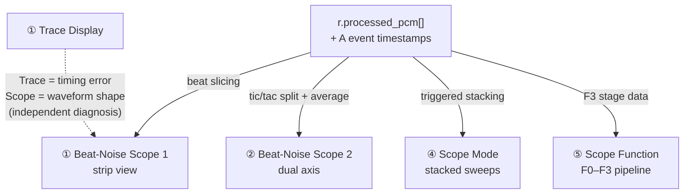
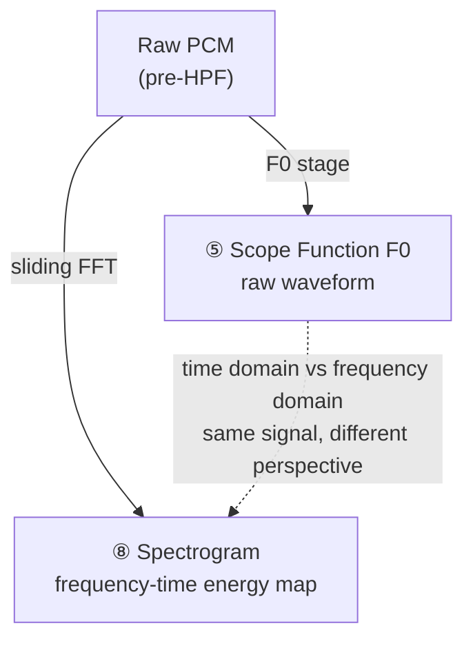
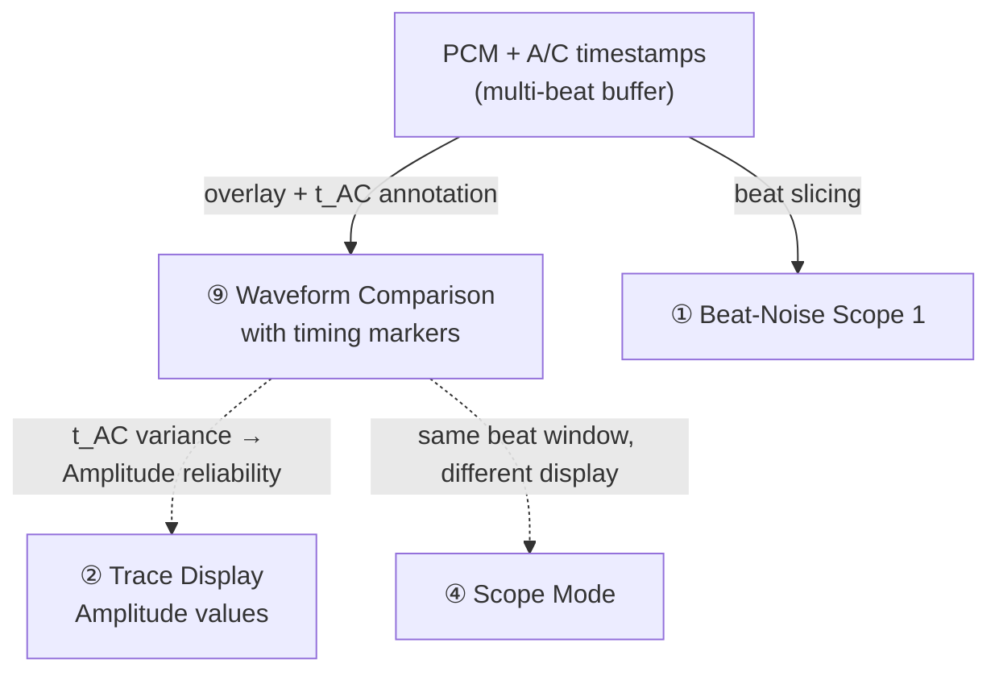
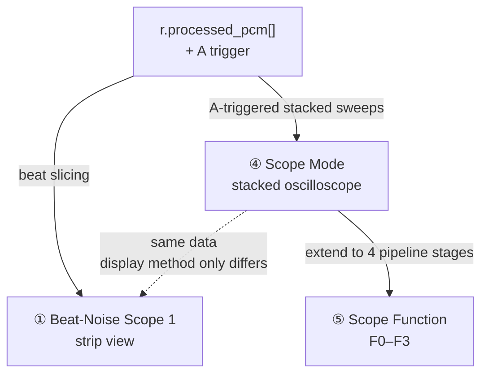
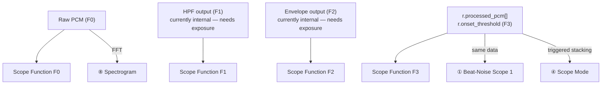

# TimeGrapher Graph Analysis — Scope Family (5 Graphs)

> Detailed analysis of 5 of the 11 graphs: Beat-Noise Scope 1 & 2, Spectrogram, Waveform Comparison, Scope Mode, Scope Function
> Companion: [graph-analysis.md](graph-analysis.md) covers Trace Display, Vario, Long-Term Performance Graph

---

## Overview — Comparison of 5 Graphs

| | Beat-Noise Scope 1 | Beat-Noise Scope 2 | Spectrogram | Waveform Comparison | Scope Mode | Scope Function |
|---|---|---|---|---|---|---|
| **Purpose** | Individual beat waveform (strip) | Tic/Tac separated + averaged | Frequency-energy map over time | Multi-beat overlay with timing labels | Triggered oscilloscope (stacked sweeps) | 4-stage DSP pipeline view |
| **Domain** | Time domain | Time domain | Frequency domain | Time domain | Time domain | Time domain (×4 stages) |
| **Data source** | `r.processed_pcm[]` + A events | `r.processed_pcm[]` + A events | Raw PCM + FFT | PCM + A/C timestamps | `r.processed_pcm[]` + A trigger | PCM at F0/F1/F2/F3 stages |
| **Diagnostic question** | "What does each beat look like?" | "Do tic and tac differ in shape?" | "What frequencies does the watch produce?" | "Are beats consistent over time?" | "How stable is the beat shape?" | "Where in the DSP pipeline does detection happen?" |

---

## 1. Beat-Noise Scope Display (Scope 1 & Scope 2)

### Graph Purpose

Shows the **raw acoustic waveform of individual beats** — not cumulative timing error (that is the Trace graph), but the actual shape of the tick sound.
Primary tool for diagnosing **mechanical defects inside the watch** that are invisible in the Trace graph.

```
Normal beat:
  A↑         C↑          A↑         C↑
  [tic burst]             [tac burst]

Extra peak (friction / dart touching roller):
  [tic burst ↓]           [tac burst]
               ↑ unexpected extra peak

Peaks too close (escapement fitting too weak):
  [tic─tac]  ← A and C abnormally close

Asymmetric burst size (low amplitude):
  [big tic]       [small tac]
```

**Source**: Witschi Training Course pp.16–19

**Scope 1 vs Scope 2:**

| | Scope 1 (Strip View) | Scope 2 (Dual Axis + Averaging) |
|---|---|---|
| Display | Beats shown sequentially as a scrolling strip | Tic and tac separated onto two axes |
| Time range | Switchable: 20 / 200 / 400 ms per beat | Fixed to one beat period |
| Averaging | None — raw per-beat waveform | N-beat average applied (noise suppression) |
| Use | Spot individual anomalous beats | Reveal repeating mechanical pattern |

**Screen Layout:**

```
Scope 1 (Strip View):
┌──────────────────────────────────────────────────────────────────┐
│ ← 20 ms → │ ← 20 ms → │ ← 20 ms → │ ← 20 ms → │ ← 20 ms →   │
│  [tic]    │   [tac]   │   [tic]   │   [tac]   │   [tic]      │
│   ╭╮  ╭╮  │  ╭╮  ╭╮   │  ╭╮  ╭╮  │  ╭╮  ╭╮   │  ╭╮  ╭╮     │
│───╯╰──╯╰──┼──╯╰──╯╰───┼──╯╰──╯╰──┼──╯╰──╯╰───┼──╯╰──╯╰─     │
│     ↑A ↑C │     ↑A ↑C │    ↑A ↑C │    ↑A ↑C  │              │
└──────────────────────────────────────────────────────────────────┘
                                            time →

Scope 2 (Dual Axis):
┌──────────────────────────────────────────────────────────────────┐
│  Tic (N-beat average):                                           │
│      ╭╮              ╭╮                                          │
│  ────╯╰──────────────╯╰────                                      │
├──────────────────────────────────────────────────────────────────┤
│  Tac (N-beat average):                                           │
│      ╭╮              ╭╮                                          │
│  ────╯╰──────────────╯╰────                                      │
└──────────────────────────────────────────────────────────────────┘
```

| Axis | Content |
|---|---|
| X | Elapsed time within the beat (ms) |
| Y | Acoustic amplitude (after envelope processing) |

---

### Source Data and Formulas

**Input data:** `tg_process()` output

```
r.processed_pcm[]         ← HPF + envelope processed waveform
r.events[]                ← A event timestamps (beat alignment / slicing anchor)
mCurrentSamplesPerSecond  ← convert sample index to ms
```

A short **per-beat PCM ring buffer** is required to slice the waveform window around each A event (a few beats deep).

**Scope 2 averaging formula:**

```
Avg_tic[i] = (1/N) × Σ tic_beat_k[i]   (k = 1..N, i = sample position)
Avg_tac[i] = (1/N) × Σ tac_beat_k[i]
```

---

### Graph Examples

#### Case 1: Normal watch

```
Scope 1:
  [tic]  │ ╭╮  ╭╮  [tac]  │ ╭╮  ╭╮  [tic]  │ ╭╮  ╭╮
         │╭╯╰──╯╰─        │╭╯╰──╯╰─         │╭╯╰──╯╰─
          ↑A  ↑C            ↑A  ↑C             ↑A  ↑C
> A and C peaks at consistent positions across all beats
```

#### Case 2: Escapement fitting too weak (A-C too close)

```
Scope 1:
  [tic]  │ ╭╮╭╮     [tac]  │ ╭╮╭╮
         │╭╯╰╯╰─           │╭╯╰╯╰─
          ↑A↑C  ← A-C interval abnormally short
> Action: adjust escapement fitting
```

#### Case 3: Friction / extra impact (extra peak)

```
Scope 1:
  [tic]  │ ╭╮↓ ╭╮   [tac]  │ ╭╮  ╭╮
         │╭╯╰──╯╰─          │╭╯╰──╯╰─
              ↑ downward extra peak = friction or dart contact
> Action: inspect escapement parts
```

#### Case 4: Tic/tac shape mismatch in Scope 2

```
Tic average:  ╭╮      ╭╮   (burst sizes consistent)
              ╯╰──────╯╰
Tac average:  ╭╮    ╭──╮   (C peak broader = irregular pallet drop)
              ╯╰────╯  ╰
> Diagnosis: pallet fork asymmetry
```

---

### Relationship to Other Graphs



| Related graph | Relationship |
|---|---|
| **Trace Display** | Trace shows *when* the beat happened (timing error). Scope shows *what* it sounded like (shape). A clean Trace does not guarantee a clean Scope. |
| **Scope Mode** | Same data source. Scope 1 = sequential strips; Scope Mode = all sweeps stacked on top of each other |
| **Waveform Comparison** | Both compare individual beats, but Waveform Comparison overlays many beats simultaneously and annotates t_AC labels |
| **Scope Function F3** | Same PCM data shown within the 4-stage DSP pipeline frame |

**Legend**

| Arrow | Meaning |
|---|---|
| Solid `→` | A's output is used directly as B's input |
| Dashed `-.->` | No direct data flow, but same analysis goal expressed differently |

---

## 2. Time-Frequency Spectrogram Display

### Graph Purpose

A 2D energy map: **X = time, Y = frequency, color = signal energy**.
Shows which frequencies the watch produces and how they change over time.

```
Frequency (Hz)
  4000 │░░░░░░░░░░░░░░░░░░░░░░░░░░
  2000 │░░░░████░░░░████░░░░████░░  ← dominant tic frequency
  1000 │░░██████░░██████░░██████░░  ← harmonic
   500 │░░░░░░░░░░░░░░░░░░░░░░░░░░
     0 │──────────────────────────
       └─────────────────────────→ time
              ↑tic  ↑tac  ↑tic
```

**Diagnostic use cases:**

| Observation | Meaning |
|---|---|
| Sharp energy band at one frequency | Normal — the watch's resonant frequency |
| Energy band drifts over time | Temperature or lubrication change |
| Broadband noise between beats | Mechanical friction / roughness |
| Harmonic structure changes | Wear in escapement components |
| Energy below 200 Hz | Verifies HPF cutoff correctly removes rumble |

**Screen Layout:**

```
┌─────────────────────────────────────────────────────────────────┐
│ Freq (Hz)                                    [Spectrogram]     │
│  4000 │░░░░░░░░░░░░░░░░░░░░░░░░░░░░░░░░░░░░░░░░░░░░░░░░░░     │
│  2000 │░░░████░░░████░░░████░░░████░░░████░░░████░░░████░░     │
│  1000 │░██████░██████░██████░██████░██████░██████░██████░░     │
│   500 │░░░░░░░░░░░░░░░░░░░░░░░░░░░░░░░░░░░░░░░░░░░░░░░░░░     │
│     0 │────────────────────────────────────────────────────    │
│       └─────────────────────────────────────────────────→ time │
│                                          [low ░ → high █]      │
└─────────────────────────────────────────────────────────────────┘
```

| Axis | Content |
|---|---|
| X | Elapsed time |
| Y | Frequency (Hz) |
| Color | Energy intensity (dB or linear) |

---

### Source Data and Formulas

**Input data:** Raw PCM (float32, selectable before or after HPF)

```
Raw PCM (sliding window)
    │
    ▼ FFT (e.g. 1024–4096 samples per frame)
    │
    ▼ Energy per frequency bin [dB]
    │
    ▼ Rendered as 2D color map
```

**Key implementation gap**: FFTW3 is **commented out** in `CMakeLists.txt`. FFT library selection required:

| Option | Pros | Cons |
|---|---|---|
| Re-enable FFTW3 | Fastest | Adds native dependency |
| Simple DFT self-implemented | No dependency | Slow for long windows |

---

### Graph Examples

#### Case 1: Normal watch

```
Frequency
  2000 │░░████░░████░░████░░████  ← consistent energy band
  1000 │░██████░█████░█████░████
       └──────────────────────→ time
> Same frequency pattern repeating → normal
```

#### Case 2: Lubrication degrading

```
Frequency
  2000 │░░████░░████░░████░▓▓▓▓  ← energy band shifting up
  3000 │░░░░░░░░░░░░░░░░░░░▓▓▓▓  ← high-frequency components appear
       └──────────────────────→ time
                              ↑ change starts here
> Increasing high-frequency content → dry friction beginning
```

#### Case 3: HPF cutoff verification

```
Frequency
   200 │░░░░░░████████████████  ← before HPF (energy below 200 Hz present)
   200 │░░░░░░░░░░░░░░░░░░░░░░  ← after HPF (energy below 200 Hz removed)
       └──────────────────────→ time
> Compare F0 (raw) vs F1 (post-HPF) to verify filter effect
```

---

### Relationship to Other Graphs



| Related graph | Relationship |
|---|---|
| **Scope Function F0** | Scope Function shows the HPF effect in the time domain; Spectrogram shows it in the frequency domain — together they fully verify filter behavior |
| **QAR-01 Real-Time Performance** | FFT computation is heavier than time-domain processing — must profile on RPi |

**Legend**

| Arrow | Meaning |
|---|---|
| Solid `→` | A's output is used directly as B's input |
| Dashed `-.->` | No direct data flow, but same analysis goal expressed differently |

---

## 3. Waveform Comparison Display with Timing Markers

### Graph Purpose

Shows **multiple beats aligned and overlaid** with A/C event markers annotated in milliseconds.
Unlike Scope Mode (visual stacking), this graph explicitly labels t_AC for each beat so beat-to-beat **timing consistency** is quantitatively visible.

```
Time (ms, relative to A event)
  0      5      10     15     20
  │──────│──────│──────│──────│
  │ ╭╮              ╭╮         ← beat n     t_AC = 9.1 ms
  │╭╯╰─────────────╭╯╰──
  │ ╭╮              ╭╮         ← beat n+1   t_AC = 9.0 ms
  │╭╯╰─────────────╭╯╰──
  │ ╭╮                ╭╮       ← beat n+2   t_AC = 9.4 ms ← anomaly
  │╭╯╰───────────────╭╯╰──
       ↑A             ↑C
       │←── t_AC ────→│
```

**Diagnostic value**: if t_AC varies widely across beats, Amplitude calculation is unreliable. Healthy watch → waveforms nearly overlap; worn or dirty watch → waveforms spread apart.

**Screen Layout:**

```
┌──────────────────────────────────────────────────────────────────┐
│  Waveform Comparison (last 20 beats overlaid)                    │
│                                                                  │
│   ╭╮╭╮          ╭╮╭╮  ← waveform spread (instability visible)  │
│  ╭╯╰╯╰──────────╯╰╯╰╮                                           │
│                                                                  │
│  │←── 9.0 ms ──│     │← t_AC annotated per beat                 │
│  ↑A              ↑C                                              │
│                                                                  │
│  t_AC  min: 9.0 ms  max: 9.4 ms  σ: 0.12 ms                    │
└──────────────────────────────────────────────────────────────────┘
```

| Axis | Content |
|---|---|
| X | Elapsed time from A event (ms) |
| Y | Acoustic amplitude |

---

### Source Data and Formulas

**Input data:**

```
PCM buffer aligned to A events (multi-beat ring buffer, ~20–50 beats deep)
A event timestamps   ← horizontal alignment anchor
C event timestamps   ← t_AC calculation and marker display
mCurrentSamplesPerSecond  ← convert to ms labels
```

**t_AC statistics:**

```
t_AC_n  = (C_n - A_n) / fs          (seconds)
t_AC_ms = t_AC_n × 1000             (ms)

min_tAC = min(t_AC_1, ..., t_AC_N)
max_tAC = max(t_AC_1, ..., t_AC_N)
σ_tAC   = sqrt((1/N) × Σ(t_AC_i - mean)²)
```

---

### Graph Examples

#### Case 1: Stable watch

```
  │╭╮──────────╭╮
  │╭╮──────────╭╮   ← all beats nearly identical
  │╭╮──────────╭╮
   ↑A          ↑C
  t_AC: 9.0~9.1 ms  σ=0.05 ms → high Amplitude precision
```

#### Case 2: Irregular C events (Amplitude error amplified)

```
  │╭╮──────────╭╮
  │╭╮──────────────╭╮   ← C position varies beat to beat
  │╭╮────────╭╮
   ↑A        ↑↑↑ C position spread
  t_AC: 8.8~9.5 ms  σ=0.35 ms → Amplitude unreliable
```

#### Case 3: Misdetected A events

```
  │ ╭╮──────────╭╮      ← normal beat
  │  ╭╮─────────────╭╮  ← A event detected late (waveform shifted right)
   ↑A position misaligned → Rate and Beat Error errors
```

---

### Relationship to Other Graphs



| Related graph | Relationship |
|---|---|
| **Beat-Noise Scope 1** | Same per-beat PCM buffer. Scope 1 = sequential strips; Waveform Comparison = overlay with t_AC labels |
| **Trace Display / Vario (Amplitude)** | t_AC consistency here directly determines the noise in Amplitude values shown in Trace and Vario |
| **Escapement Analyzer** | Escapement Analyzer shows A/C markers on a single beat; Waveform Comparison shows the same markers across many beats |
| **Scope Mode** | Scope Mode = visual stacking (stability at a glance); Waveform Comparison = quantitative t_AC analysis |

**Legend**

| Arrow | Meaning |
|---|---|
| Solid `→` | A's output is used directly as B's input |
| Dashed `-.->` | No direct data flow, but same analysis goal expressed differently |

---

## 4. Scope Mode with Synchronized Sweep Display

### Graph Purpose

A **triggered oscilloscope** — every beat is swept left to right in a fixed-width window, triggered (restarted) at each A event. All sweeps are stacked on top of each other (persistence mode).

```
Fixed window = beat period (e.g. 250 ms for 28,800 BPH)

Stable watch — sweeps overlap cleanly:
  │  ╭╮         ╭╮
  │  ╭╮         ╭╮    ← nearly identical
  │  ╭╮         ╭╮
  └───────────────→ 0 to 250 ms
  ↑ trigger = A event

Jittery / defective watch — sweeps spread:
  │   ╭╮        ╭╮
  │  ╭╮          ╭╮   ← horizontal shift = timing jitter
  │    ╭╮       ╭╮
  └───────────────→ 0 to 250 ms
```

**Key distinction from Beat-Noise Scope 1**: Scope 1 shows beats *sequentially* (strip) — you see each beat one after another. Scope Mode shows beats *stacked* — all beats on top of each other. Scope Mode reveals jitter; Scope 1 reveals isolated anomalous beats.

**Screen Layout:**

```
┌──────────────────────────────────────────────────────────────────┐
│  Scope Mode — Synchronized Sweep       [Window: 250 ms]         │
│                                                                  │
│   ╭╮              ╭╮                                            │
│  ╭╯╰╮────────────╭╯╰╮  ← multiple sweeps stacked               │
│ ╭╯  ╰╮──────────╭╯  ╰╮                                         │
│                                                                  │
│ ↑A               ↑C                                             │
│ 0 ms            ~9 ms            250 ms                         │
└──────────────────────────────────────────────────────────────────┘
```

| Axis | Content |
|---|---|
| X | Elapsed time from A event (0 to beat period, ms) |
| Y | Acoustic amplitude |

---

### Source Data and Formulas

**Input data:**

```
r.processed_pcm[]         ← processed waveform (same as Scope 1)
r.events[] A timestamps   ← trigger points (reset X to 0 on each A event)
Window width = 7200 / BPH  seconds (one full beat period, configurable)
```

Same short PCM ring buffer as Beat-Noise Scope is sufficient.

---

### Graph Examples

#### Case 1: Stable watch (sweeps perfectly aligned)

```
  │   ╭──╮          ╭──╮
  │   ╭──╮          ╭──╮  ← sweeps nearly identical
  └───────────────────────→ 0~250 ms
> Appears as a single line → no jitter
```

#### Case 2: Timing jitter (sweeps spread horizontally)

```
  │  ╭──╮           ╭──╮
  │   ╭──╮          ╭──╮  ← shifted from A trigger
  │    ╭──╮         ╭──╮
  └───────────────────────→ 0~250 ms
> Lines thicken → Beat Error or mechanical irregularity
```

#### Case 3: Amplitude variation (sweeps spread vertically)

```
  │   ╭────╮         ╭────╮   ← high-amplitude beat
  │   ╭──╮           ╭──╮     ← low-amplitude beat
  └───────────────────────────→ 0~250 ms
> Lines thicken vertically → mainspring running down or amplitude instability
```

---

### Relationship to Other Graphs



| Related graph | Relationship |
|---|---|
| **Beat-Noise Scope 1** | Same data. Scope 1 = sequential strips (spot individual bad beats); Scope Mode = stacked (see jitter / stability). Use both together to distinguish "isolated bad beat" from "systematic jitter" |
| **Scope Function** | Scope Function = 4 simultaneous Scope Mode views at F0/F1/F2/F3 pipeline stages |
| **Waveform Comparison** | Both overlay beats. Scope Mode = visual persistence (stability); Waveform Comparison = quantitative t_AC analysis |

**Legend**

| Arrow | Meaning |
|---|---|
| Solid `→` | A's output is used directly as B's input |
| Dashed `-.->` | No direct data flow, but same analysis goal expressed differently |

---

## 5. Scope Function with Multiple Filter Views (F0 / F1 / F2 / F3)

### Graph Purpose

Shows **4 simultaneous panels** of the same beat window, each at a different stage of the DSP pipeline. An engineer's diagnostic tool.

| Panel | Stage | Signal |
|---|---|---|
| **F0** | Raw input | Float32 PCM before any filtering — raw microphone signal |
| **F1** | After HPF | DC-blocked waveform (200 Hz high-pass) — low-frequency rumble removed |
| **F2** | After Envelope | Full-wave rectified + LPF smoothed — the energy "blob" shape |
| **F3** | After Detection | Processed waveform + onset threshold line + A/C event markers |

```
┌─────────────────────────────────────────────────────────────────┐
│ F0: Raw PCM                                                     │
│  ~~~~~~~~~~~~~~~~~~~~~~~~~~~~~~~~~~~~~~~~~~~~~~~~~~~            │
├─────────────────────────────────────────────────────────────────┤
│ F1: After HPF (200 Hz)                                          │
│  ~~~/\/\/\/\/\/\/\/\/\/\/\/\/\/\/\/\/\/\/\/\/\~~~               │
├─────────────────────────────────────────────────────────────────┤
│ F2: Envelope                                                    │
│         ╭╮                  ╭╮                                  │
│  ───────╯╰──────────────────╯╰──────                            │
├─────────────────────────────────────────────────────────────────┤
│ F3: Detection (threshold + markers)                             │
│         ╭╮                  ╭╮                                  │
│  ─ ─ ─ ─╯╰─── threshold ───╭╯╰─ ─ ─                            │
│         ↑A                 ↑C                                   │
└─────────────────────────────────────────────────────────────────┘
```

| Axis | Content |
|---|---|
| X (shared) | Elapsed time within the beat (ms) |
| Y (per panel) | Signal amplitude at that DSP stage |

---

### Source Data and Formulas

The hardest of the five to implement — F1 and F2 are currently hidden inside `tg_process()`.

| Panel | Data | Currently accessible? |
|---|---|---|
| F0 | Raw float32 PCM from ring buffer | ✅ Accessible before `tg_process()` |
| F1 | Output of `tg_hpf_process()` | ❌ Internal to `tg_context_t` — **must be exposed** |
| F2 | Output of `tg_envelope_process()` | ❌ Internal to `tg_context_t` — **must be exposed** |
| F3 | `r.processed_pcm[]` + `r.onset_threshold` | ✅ Already in `tg_result_t` |

**Required change**: add `hpf_pcm[]` and `envelope_pcm[]` output buffers to `tg_result_t`, populated inside `tg_process()`.

---

### Graph Examples

#### Case 1: Normal detection

```
F0: ~~~╭╮~~~╭╮~~~  (tic/tac signal clear)
F1: ~~~╭╮~~~╭╮~~~  (after HPF: low-freq removed, shape preserved)
F2:    ╭╮   ╭╮     (envelope: A and C separated)
F3:    ╭╮   ╭╮
    ─ ─╯╰─ ─╯╰─ ─  (threshold correctly crossed)
       ↑A   ↑C      (markers at correct positions)
```

#### Case 2: AGC enabled (signal distorted at F0)

```
F0: ~~╭──────────╮~~  (AGC compresses amplitude → flattened)
F1: ~~╭──────────╮~~  (HPF also sees the distorted signal)
F2:   ╭──────────╮    (A and C merge into one blob)
F3:   ╭──────────╮
    ─ ─ ─ ─ ─ ─ ─ ─   (below threshold → A/C detection fails)
> Action: disable AGC in Raspberry Pi AlsaMixer
```

#### Case 3: HPF cutoff too high (signal cut at F1)

```
F0: ~~~╭╮~~~╭╮~~~   (raw signal normal)
F1: ~~~╭╮~~~ ╮~~~   (HPF clips C peak too)
F2:    ╭╮           (C peak disappears → envelope shows only one blob)
F3:    ╭╮
    ─ ─╯╰─ ─ ─ ─    (A detected only, C missed)
       ↑A   (no C)
> Action: lower HPF cutoff frequency
```

#### Case 4: Envelope LPF too slow (A and C merge at F2)

```
F0: ~~~╭╮ ╭╮~~~    (A and C separated in raw signal)
F1: ~~~╭╮ ╭╮~~~    (separated after HPF too)
F2:    ╭────╮       (LPF too slow → A+C fused into one blob)
F3:    ╭────╮
    ─ ─╯    ╰─ ─   (detected as single event)
       ↑A only
> Action: reduce envelope LPF time constant
```

---

### Relationship to Other Graphs



| Related graph | Relationship |
|---|---|
| **Scope Mode** | Scope Function = 4 simultaneous Scope Mode views at F0/F1/F2/F3 pipeline stages |
| **Beat-Noise Scope 1** | F3 data shared. Beat-Noise Scope shows one pipeline stage; Scope Function shows all four simultaneously |
| **Spectrogram** | Spectrogram shows the frequency picture of F0; Scope Function F0/F1 shows the time-domain picture — together fully verify HPF behavior |
| **QAR-03 Measurement Accuracy** | Directly shows where T1/T3 detection occurs relative to the signal shape — the primary accuracy debugging tool |

**Legend**

| Arrow | Meaning |
|---|---|
| Solid `→` | A's output is used directly as B's input |
| Dashed `-.->` | No direct data flow, but same analysis goal expressed differently |

---

## Data Source Summary

| Graph | Primary data | New buffer needed? | Key implementation gap |
|---|---|---|---|
| Beat-Noise Scope 1 | `r.processed_pcm[]` + A events | Short per-beat ring buffer | Beat slicing + strip renderer |
| Beat-Noise Scope 2 | Same + N-beat averaging | Same | Tic/tac separation + average accumulator |
| Spectrogram | Raw PCM | Sliding FFT buffer | FFT library (FFTW3 removed) |
| Waveform Comparison | PCM + A/C timestamps | Multi-beat PCM history (~50 beats) | Overlay renderer + t_AC annotation |
| Scope Mode | `r.processed_pcm[]` + A trigger | Shared with Beat-Noise Scope | Triggered-sweep rendering |
| Scope Function | F0: raw / F1: HPF out / F2: Env out / F3: `r.processed_pcm[]` | None (reuses existing) | **Expose F1 and F2 from `tg_context_t`** |

---

## Full Data Flow

```
PCM Ring Buffer (raw float32)
    │
    ├─── F0 (Scope Function) ──────────────────────────────────► Spectrogram
    │                                                             Waveform Comparison
    │
    ▼
tg_process()
    │
    ├─── F1: HPF output ─────────────────────────────────────► Scope Function F1
    │         (currently internal — needs exposure)
    │
    ├─── F2: Envelope output ────────────────────────────────► Scope Function F2
    │         (currently internal — needs exposure)
    │
    └─── tg_result_t ──► r.processed_pcm[]  ────────────────► Beat-Noise Scope 1 & 2
                         r.onset_threshold  ────────────────► Scope Function F3
                         r.events[]  ────────────────────────► Scope Mode (trigger)
                           A timestamps                         Waveform Comparison
                           C timestamps                         Beat-Noise Scope (slicing)
```