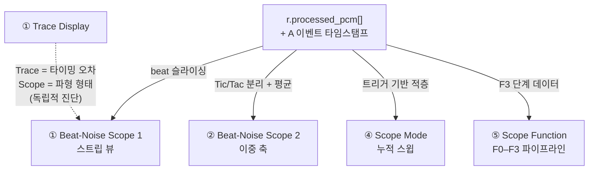
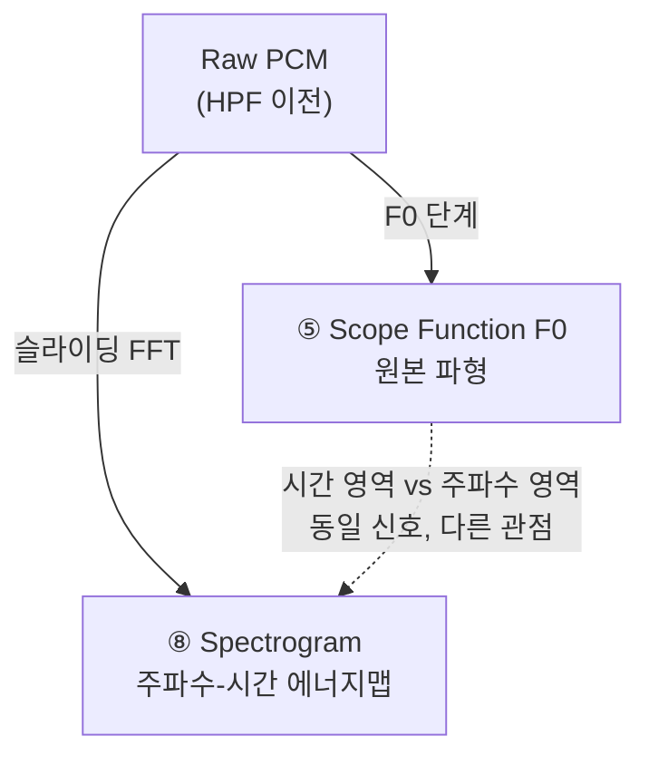
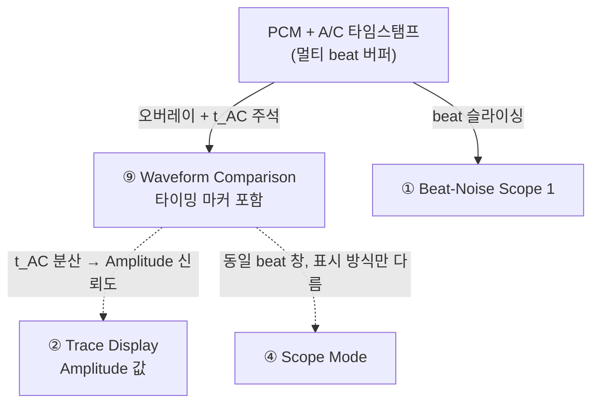
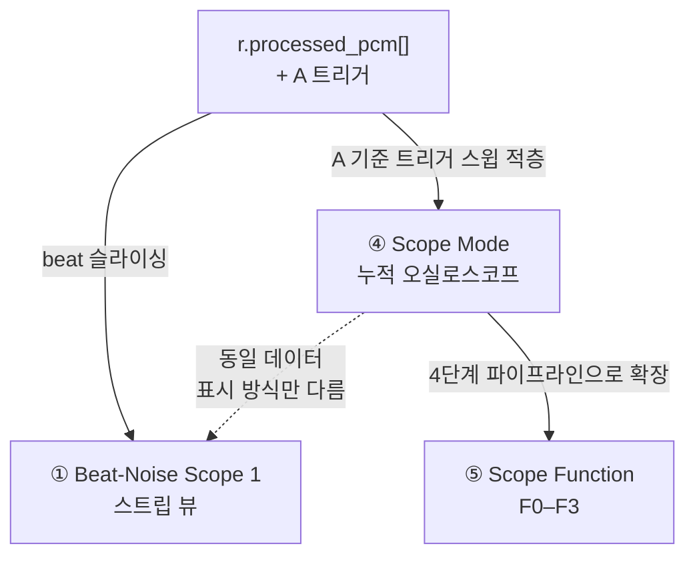
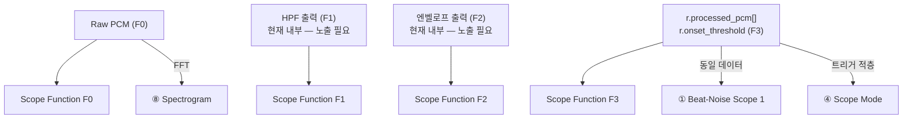

# TimeGrapher 그래프 분석 — Scope 계열 5개

> 11개 그래프 중 5개 (Beat-Noise Scope 1·2, Spectrogram, Waveform Comparison, Scope Mode, Scope Function) 상세 분석
> 연관 문서: [graph-analysis.md](graph-analysis.md) — Trace Display, Vario, Long-Term Performance Graph

---

## 5개 그래프 전체 비교 요약

| | Beat-Noise Scope 1 | Beat-Noise Scope 2 | Spectrogram | Waveform Comparison | Scope Mode | Scope Function |
|---|---|---|---|---|---|---|
| **목적** | 개별 beat 파형 (스트립) | Tic/Tac 분리 + 평균 파형 | 주파수-에너지 지도 | 다중 beat 오버레이 + 타이밍 주석 | 트리거 오실로스코프 (누적) | DSP 4단계 파이프라인 뷰 |
| **도메인** | 시간 영역 | 시간 영역 | 주파수 영역 | 시간 영역 | 시간 영역 | 시간 영역 (×4 단계) |
| **데이터 소스** | `r.processed_pcm[]` + A 이벤트 | `r.processed_pcm[]` + A 이벤트 | Raw PCM + FFT | PCM + A/C 타임스탬프 | `r.processed_pcm[]` + A 트리거 | F0~F3 각 파이프라인 단계 |
| **진단 질문** | "각 beat 파형이 어떻게 생겼나?" | "Tic과 Tac의 파형이 다른가?" | "시계가 어떤 주파수를 내는가?" | "beat들이 시간이 지나도 일정한가?" | "beat 형태가 얼마나 안정적인가?" | "DSP 어느 단계에서 검출이 일어나나?" |

---

## 1. Beat-Noise Scope Display (Scope 1 & Scope 2)

### 그래프 목적

**개별 beat의 실제 음향 파형**을 표시하는 그래프. Trace처럼 타이밍 오차 누적값이 아니라, 틱 소리 자체의 **모양**을 보여준다.

Trace 그래프에서는 보이지 않는 **시계 내부 기계적 결함**을 진단하는 핵심 도구.

```
정상 beat:
  A↑         C↑          A↑         C↑
  [tic 버스트]             [tac 버스트]

여분 피크 (마찰 / 다트가 롤러에 닿음):
  [tic 버스트 ↓]           [tac 버스트]
               ↑ 비정상 추가 피크

피크 간격 너무 좁음 (이탈기 피팅 약함):
  [tic─tac]  ← A와 C가 너무 붙어있음

버스트 크기 비대칭 (진폭 부족):
  [큰 tic]       [작은 tac]
```

**출처**: Witschi Training Course pp.16–19

**Scope 1 vs Scope 2 비교:**

| | Scope 1 (스트립 뷰) | Scope 2 (이중 축 + 평균) |
|---|---|---|
| 표시 방식 | beat를 순차적으로 스크롤 스트립 형태로 표시 | Tic과 Tac을 별도 축으로 분리 |
| 시간 범위 | 전환 가능: beat당 20 / 200 / 400 ms | 1 beat 주기 고정 |
| 평균 처리 | 없음 — beat별 raw 파형 | N-beat 평균 적용 (노이즈 억제) |
| 용도 | 개별 이상 beat 즉시 포착 | 반복되는 기계적 패턴 식별 |

**화면 구조:**

```
Scope 1 (스트립 뷰):
┌──────────────────────────────────────────────────────────────────┐
│ ← 20 ms → │ ← 20 ms → │ ← 20 ms → │ ← 20 ms → │ ← 20 ms →   │
│  [tic]    │   [tac]   │   [tic]   │   [tac]   │   [tic]      │
│   ╭╮  ╭╮  │  ╭╮  ╭╮   │  ╭╮  ╭╮  │  ╭╮  ╭╮   │  ╭╮  ╭╮     │
│───╯╰──╯╰──┼──╯╰──╯╰───┼──╯╰──╯╰──┼──╯╰──╯╰───┼──╯╰──╯╰─     │
│     ↑A ↑C │     ↑A ↑C │    ↑A ↑C │    ↑A ↑C  │              │
└──────────────────────────────────────────────────────────────────┘
                                            시간 →

Scope 2 (이중 축):
┌──────────────────────────────────────────────────────────────────┐
│  Tic (N-beat 평균):                                              │
│      ╭╮              ╭╮                                          │
│  ────╯╰──────────────╯╰────                                      │
├──────────────────────────────────────────────────────────────────┤
│  Tac (N-beat 평균):                                              │
│      ╭╮              ╭╮                                          │
│  ────╯╰──────────────╯╰────                                      │
└──────────────────────────────────────────────────────────────────┘
```

| 축 | 내용 |
|---|---|
| X | beat 내 경과 시간 (ms) |
| Y | 음향 진폭 (envelope 처리 후) |

---

### 소스 데이터 및 공식

**입력 데이터:** `tg_process()` 출력

```
r.processed_pcm[]    ← HPF + 엔벨로프 처리된 파형
r.events[]           ← A 이벤트 타임스탬프 (beat 정렬 / 슬라이싱 기준)
mCurrentSamplesPerSecond  ← 샘플 인덱스 → ms 변환
```

각 A 이벤트를 기준으로 PCM 버퍼에서 beat 창을 잘라내기 위한 **단기 PCM 링 버퍼** 필요 (수 beat 분량).

**Scope 2 평균 공식:**

```
Avg_tic[i] = (1/N) × Σ tic_beat_k[i]   (k = 1..N, i = 샘플 위치)
Avg_tac[i] = (1/N) × Σ tac_beat_k[i]
```

---

### 그래프 예시

#### Case 1: 정상 시계

```
Scope 1:
  [tic]  │ ╭╮  ╭╮  [tac]  │ ╭╮  ╭╮  [tic]  │ ╭╮  ╭╮
         │╭╯╰──╯╰─        │╭╯╰──╯╰─         │╭╯╰──╯╰─
          ↑A  ↑C            ↑A  ↑C             ↑A  ↑C
> 모든 beat의 A, C 피크가 일정한 위치에 있음
```

#### Case 2: 이탈기 피팅 과약 (Escapement fitting too weak)

```
Scope 1:
  [tic]  │ ╭╮╭╮     [tac]  │ ╭╮╭╮
         │╭╯╰╯╰─           │╭╯╰╯╰─
          ↑A↑C  ← A-C 간격 비정상적으로 짧음
> 조치: 이탈기 피팅 조정
```

#### Case 3: 마찰 / 추가 충격 (Extra peak)

```
Scope 1:
  [tic]  │ ╭╮↓ ╭╮   [tac]  │ ╭╮  ╭╮
         │╭╯╰──╯╰─          │╭╯╰──╯╰─
              ↑ 비정상 하향 피크 = 마찰 또는 다트 접촉
> 조치: 이탈기 부품 점검
```

#### Case 4: Scope 2에서 Tic/Tac 형태 불일치

```
Tic 평균:  ╭╮      ╭╮   (버스트 크기 균일)
           ╯╰──────╯╰
Tac 평균:  ╭╮    ╭──╮   (C 피크 넓어짐 = 팔레트 낙하 불규칙)
           ╯╰────╯  ╰
> 진단: 팔레트 포크 비대칭
```

---

### 다른 그래프와의 연관



| 연관 그래프 | 관계 |
|---|---|
| **Trace Display** | Trace는 *언제* beat가 발생했는지(타이밍 오차). Scope는 *어떻게* 들렸는지(파형 모양). Trace가 깨끗해도 Scope는 이상일 수 있음 |
| **Scope Mode** | 동일 데이터. Scope 1 = 순차 스트립; Scope Mode = 전체 beat 누적 적층 |
| **Waveform Comparison** | 둘 다 beat를 비교하지만, Waveform Comparison은 t_AC 레이블이 추가되어 타이밍 정밀도까지 분석 |
| **Scope Function F3** | 동일 PCM 데이터를 4단계 DSP 프레임 안에서 표시 |

**범례**

| 화살표 | 의미 |
|---|---|
| 실선 `→` | A의 데이터가 B의 입력으로 직접 사용됨 |
| 점선 `-.->` | 직접 데이터 흐름은 없으나 동일 분석 목적을 다른 방식으로 표현 |

---

## 2. Time-Frequency Spectrogram Display

### 그래프 목적

2D 에너지 지도: **X = 시간, Y = 주파수, 색상 = 신호 에너지**.
시계가 어떤 주파수 성분을 생성하는지, 시간이 지나면서 어떻게 변하는지를 보여준다.

```
주파수 (Hz)
  4000 │░░░░░░░░░░░░░░░░░░░░░░░░░░
  2000 │░░░░████░░░░████░░░░████░░  ← tic 지배 주파수
  1000 │░░██████░░██████░░██████░░  ← 배음(harmonic)
   500 │░░░░░░░░░░░░░░░░░░░░░░░░░░
     0 │──────────────────────────
       └─────────────────────────→ 시간
              ↑tic  ↑tac  ↑tic
```

**진단 활용:**

| 관찰 | 의미 |
|---|---|
| 특정 주파수에 선명한 에너지 띠 | 정상 — 시계 공진 주파수 |
| 에너지 띠가 시간에 따라 이동 | 온도 또는 윤활 변화 |
| beat 사이에 광대역 노이즈 | 기계적 마찰 / 거칠기 |
| 배음 구조 변화 | 이탈기 부품 마모 |
| 200 Hz 이하 에너지 존재 | HPF 컷오프 검증 (rumble 제거 확인) |

**화면 구조:**

```
┌─────────────────────────────────────────────────────────────────┐
│ 주파수(Hz)                                     [Spectrogram]   │
│  4000 │░░░░░░░░░░░░░░░░░░░░░░░░░░░░░░░░░░░░░░░░░░░░░░░░░░     │
│  2000 │░░░████░░░████░░░████░░░████░░░████░░░████░░░████░░     │
│  1000 │░██████░██████░██████░██████░██████░██████░██████░░     │
│   500 │░░░░░░░░░░░░░░░░░░░░░░░░░░░░░░░░░░░░░░░░░░░░░░░░░░     │
│     0 │────────────────────────────────────────────────────    │
│       └─────────────────────────────────────────────────→ 시간│
│                                              [저에너지 ░ → 고에너지 █] │
└─────────────────────────────────────────────────────────────────┘
```

| 축 | 내용 |
|---|---|
| X | 경과 시간 |
| Y | 주파수 (Hz) |
| 색상 | 에너지 강도 (dB 또는 선형) |

---

### 소스 데이터 및 공식

**입력 데이터:** Raw PCM (float32, HPF 이전 또는 이후 선택 가능)

```
Raw PCM (슬라이딩 윈도우)
    │
    ▼ FFT (예: 1024–4096 샘플 / 프레임)
    │
    ▼ 주파수 빈(bin)별 에너지 벡터 [dB]
    │
    ▼ 2D 컬러맵 렌더링
```

**구현 주요 갭**: `CMakeLists.txt`에서 FFTW3가 **주석 처리**되어 있음. FFT 라이브러리 선택 필요:

| 옵션 | 장점 | 단점 |
|---|---|---|
| FFTW3 재활성화 | 가장 빠름 | 네이티브 의존성 추가 |
| 단순 DFT 자체 구현 | 의존성 없음 | 긴 윈도우에서 느림 |

---

### 그래프 예시

#### Case 1: 정상 시계

```
주파수
  2000 │░░████░░████░░████░░████  ← 일정한 에너지 띠
  1000 │░██████░█████░█████░████
       └──────────────────────→ 시간
> 동일한 주파수 패턴 반복 → 정상
```

#### Case 2: 윤활 불량 진행

```
주파수
  2000 │░░████░░████░░████░▓▓▓▓  ← 에너지 띠 이동 (주파수 상승)
  3000 │░░░░░░░░░░░░░░░░░░░▓▓▓▓  ← 고주파 성분 출현
       └──────────────────────→ 시간
                              ↑ 이 시점부터 변화 시작
> 고주파 성분 증가 → 건조 마찰 시작
```

#### Case 3: HPF 컷오프 검증

```
주파수
   200 │░░░░░░████████████████  ← HPF 이전 (200 Hz 이하 에너지 존재)
   200 │░░░░░░░░░░░░░░░░░░░░░░  ← HPF 이후 (200 Hz 이하 에너지 제거됨)
       └──────────────────────→ 시간
> F0(raw)와 F1(HPF후) 비교로 필터 효과 검증
```

---

### 다른 그래프와의 연관



| 연관 그래프 | 관계 |
|---|---|
| **Scope Function F0** | Scope Function은 시간 영역에서 HPF 효과를 보여주고, Spectrogram은 주파수 영역에서 보여줌 — 함께 사용하면 필터 동작 완전 검증 가능 |
| **QAR-01 Real-Time Performance** | FFT 연산은 시간 영역 처리보다 무거움 — RPi 성능 영향 평가 필요 |

**범례**

| 화살표 | 의미 |
|---|---|
| 실선 `→` | A의 데이터가 B의 입력으로 직접 사용됨 |
| 점선 `-.->` | 직접 데이터 흐름은 없으나 동일 분석 목적을 다른 방식으로 표현 |

---

## 3. Waveform Comparison Display with Timing Markers

### 그래프 목적

**여러 beat를 정렬·오버레이**하고 A/C 이벤트 타이밍을 ms 단위로 주석 표기하는 그래프.

Scope Mode(시각적 누적)와 달리, 각 beat의 t_AC(A→C 간격)를 명시적으로 표기하여 beat 간 **타이밍 일관성**을 정량적으로 확인.

```
A 이벤트 기준 경과 시간 (ms)
  0      5      10     15     20
  │──────│──────│──────│──────│
  │ ╭╮              ╭╮         ← beat n     t_AC = 9.1 ms
  │╭╯╰─────────────╭╯╰──
  │ ╭╮              ╭╮         ← beat n+1   t_AC = 9.0 ms
  │╭╯╰─────────────╭╯╰──
  │ ╭╮                ╭╮       ← beat n+2   t_AC = 9.4 ms  ← 이상치
  │╭╯╰───────────────╭╯╰──
       ↑A             ↑C
       │←── t_AC ────→│
```

**진단 가치**: t_AC가 beat마다 크게 흔들리면 Amplitude 계산 신뢰도 하락. 건강한 시계 → 파형들이 거의 겹침; 마모/오염된 시계 → 파형들이 흩어짐.

**화면 구조:**

```
┌──────────────────────────────────────────────────────────────────┐
│  Waveform Comparison (최근 20 beat 오버레이)   [비교 뷰]        │
│                                                                  │
│   ╭╮╭╮          ╭╮╭╮  ← 파형 퍼짐 (불안정 시각화)              │
│  ╭╯╰╯╰──────────╯╰╯╰╮                                           │
│                                                                  │
│  │←── 9.0 ms ──│     │← beat별 t_AC 주석                        │
│  ↑A              ↑C                                              │
│                                                                  │
│  t_AC  최소: 9.0 ms  최대: 9.4 ms  σ: 0.12 ms                  │
└──────────────────────────────────────────────────────────────────┘
```

| 축 | 내용 |
|---|---|
| X | A 이벤트 기준 경과 시간 (ms) |
| Y | 음향 진폭 |

---

### 소스 데이터 및 공식

**입력 데이터:**

```
A 이벤트 기준으로 정렬된 PCM 버퍼 (멀티 beat 링 버퍼, ~20–50 beat 분량)
A 이벤트 타임스탬프   ← 수평 정렬 기준
C 이벤트 타임스탬프   ← t_AC 계산 및 마커 표시
mCurrentSamplesPerSecond  ← ms 레이블 변환
```

**t_AC 통계:**

```
t_AC_n = (C_n - A_n) / fs          (초 단위)
t_AC_ms = t_AC_n × 1000            (ms 단위)

min_tAC = min(t_AC_1, ..., t_AC_N)
max_tAC = max(t_AC_1, ..., t_AC_N)
σ_tAC   = sqrt((1/N) × Σ(t_AC_i - mean)²)
```

---

### 그래프 예시

#### Case 1: 안정된 시계

```
  │╭╮──────────╭╮
  │╭╮──────────╭╮   ← 모든 beat 거의 일치
  │╭╮──────────╭╮
   ↑A          ↑C
  t_AC: 9.0~9.1 ms  σ=0.05 ms → 높은 Amplitude 정밀도
```

#### Case 2: C 이벤트 불규칙 (Amplitude 오차 확대)

```
  │╭╮──────────╭╮
  │╭╮──────────────╭╮   ← C 위치가 beat마다 달라짐
  │╭╮────────╭╮
   ↑A        ↑↑↑ C 위치 분산
  t_AC: 8.8~9.5 ms  σ=0.35 ms → Amplitude 불신뢰 구간
```

#### Case 3: A 이벤트 오검출 포함

```
  │ ╭╮──────────╭╮      ← 정상 beat
  │  ╭╮─────────────╭╮  ← A 이벤트 늦게 검출됨 (파형 전체 우측 이동)
   ↑A 위치가 불일치 → Rate, Beat Error 오차 유발
```

---

### 다른 그래프와의 연관



| 연관 그래프 | 관계 |
|---|---|
| **Beat-Noise Scope 1** | 동일 per-beat PCM 버퍼 사용. Scope 1 = 순차 스트립; Waveform Comparison = 오버레이 + t_AC 레이블 |
| **Trace Display / Vario (Amplitude)** | t_AC 일관성이 Trace와 Vario에 표시되는 Amplitude 값의 노이즈를 직접 결정 |
| **Escapement Analyzer** | Escapement Analyzer = 단일 beat의 A/C 마커; Waveform Comparison = 수십 beat에 걸친 동일 마커 |
| **Scope Mode** | Scope Mode = 시각적 누적 (안정성 한눈에); Waveform Comparison = t_AC 정량 분석 |

**범례**

| 화살표 | 의미 |
|---|---|
| 실선 `→` | A의 데이터가 B의 입력으로 직접 사용됨 |
| 점선 `-.->` | 직접 데이터 흐름은 없으나 동일 분석 목적을 다른 방식으로 표현 |

---

## 4. Scope Mode with Synchronized Sweep Display

### 그래프 목적

**트리거 오실로스코프**: 매 A 이벤트마다 X축을 0으로 리셋하고, 모든 beat 스윕을 같은 창에 누적 표시.
Beat-Noise Scope 1이 beat를 *순차적*으로 보여준다면, Scope Mode는 beat들을 *적층*하여 안정성을 한눈에 파악.

```
고정 창 = beat 주기 (예: 28,800 BPH → 250 ms)

안정된 시계 — 스윕이 일치:
  │  ╭╮         ╭╮
  │  ╭╮         ╭╮    ← 완전히 겹침
  │  ╭╮         ╭╮
  └───────────────→ 0 ~ 250 ms
  ↑ 트리거 = A 이벤트

지터가 있는 시계 — 스윕이 퍼짐:
  │   ╭╮        ╭╮
  │  ╭╮          ╭╮   ← 수평으로 흔들림 = 타이밍 지터
  │    ╭╮       ╭╮
  └───────────────→ 0 ~ 250 ms
```

**화면 구조:**

```
┌──────────────────────────────────────────────────────────────────┐
│  Scope Mode — Synchronized Sweep    [창 너비: 250 ms]           │
│                                                                  │
│   ╭╮              ╭╮                                            │
│  ╭╯╰╮────────────╭╯╰╮  ← 여러 스윕 누적                        │
│ ╭╯  ╰╮──────────╭╯  ╰╮                                         │
│                                                                  │
│ ↑A               ↑C                                             │
│ 0 ms            ~9 ms            250 ms                         │
└──────────────────────────────────────────────────────────────────┘
```

| 축 | 내용 |
|---|---|
| X | A 이벤트 기준 경과 시간 (0 ~ beat 주기 ms) |
| Y | 음향 진폭 |

---

### 소스 데이터 및 공식

**입력 데이터:**

```
r.processed_pcm[]         ← 처리된 파형 (Scope 1과 동일)
r.events[] A 타임스탬프   ← 트리거 포인트 (A 이벤트마다 X축 리셋)
창 너비 = 7200 / BPH 초   (1 beat 주기, 조정 가능)
```

Beat-Noise Scope와 동일한 단기 PCM 링 버퍼로 충분.

---

### 그래프 예시

#### Case 1: 안정된 시계 (스윕 완전 일치)

```
  │   ╭──╮          ╭──╮
  │   ╭──╮          ╭──╮  ← 스윕들이 거의 완전히 겹침
  └───────────────────────→ 0~250 ms
> 단일 선처럼 보임 → 지터 없음
```

#### Case 2: 타이밍 지터 (스윕 수평 퍼짐)

```
  │  ╭──╮           ╭──╮
  │   ╭──╮          ╭──╮  ← A 기준에서 수평 이동
  │    ╭──╮         ╭──╮
  └───────────────────────→ 0~250 ms
> 선이 두꺼워짐 → Beat Error 또는 기계적 불규칙성
```

#### Case 3: 진폭 변동 (스윕 수직 퍼짐)

```
  │   ╭────╮         ╭────╮   ← 높은 진폭 beat
  │   ╭──╮           ╭──╮     ← 낮은 진폭 beat
  └───────────────────────────→ 0~250 ms
> 선이 수직으로 두꺼워짐 → 태엽 소진 또는 진폭 불안정
```

---

### 다른 그래프와의 연관



| 연관 그래프 | 관계 |
|---|---|
| **Beat-Noise Scope 1** | 동일 데이터. Scope 1 = 순차 스트립 (개별 이상 beat 포착); Scope Mode = 누적 적층 (지터/안정성 파악). 함께 사용하면 "개별 이상 beat" vs "시스템적 지터" 구분 가능 |
| **Scope Function** | Scope Function = Scope Mode를 F0/F1/F2/F3 파이프라인 단계별로 4개 동시 표시 |
| **Waveform Comparison** | 둘 다 beat 오버레이. Scope Mode = 시각적 누적 (안정성); Waveform Comparison = t_AC 정량 분석 |

**범례**

| 화살표 | 의미 |
|---|---|
| 실선 `→` | A의 데이터가 B의 입력으로 직접 사용됨 |
| 점선 `-.->` | 직접 데이터 흐름은 없으나 동일 분석 목적을 다른 방식으로 표현 |

---

## 5. Scope Function with Multiple Filter Views (F0 / F1 / F2 / F3)

### 그래프 목적

**동일한 beat 창을 DSP 파이프라인의 4단계에서 동시에** 보여주는 엔지니어용 진단 도구.

| 패널 | 단계 | 신호 |
|---|---|---|
| **F0** | 원본 입력 | 필터링 전 Raw PCM — 마이크 원신호 |
| **F1** | HPF 이후 | DC 차단 파형 (200 Hz 고역통과) — 저주파 잡음 제거됨 |
| **F2** | 엔벨로프 이후 | 전파 정류 + LPF 스무딩 — 에너지 "덩어리" 형태 |
| **F3** | 검출 이후 | 처리 파형 + 검출 임계값 + A/C 이벤트 마커 |

```
┌─────────────────────────────────────────────────────────────────┐
│ F0: Raw PCM                                                     │
│  ~~~~~~~~~~~~~~~~~~~~~~~~~~~~~~~~~~~~~~~~~~~~~~~~~~~            │
├─────────────────────────────────────────────────────────────────┤
│ F1: HPF 이후 (200 Hz)                                           │
│  ~~~/\/\/\/\/\/\/\/\/\/\/\/\/\/\/\/\/\/\/\/\/\~~~               │
├─────────────────────────────────────────────────────────────────┤
│ F2: 엔벨로프                                                    │
│         ╭╮                  ╭╮                                  │
│  ───────╯╰──────────────────╯╰──────                            │
├─────────────────────────────────────────────────────────────────┤
│ F3: 검출 (임계값 + 마커)                                        │
│         ╭╮                  ╭╮                                  │
│  ─ ─ ─ ─╯╰─── 임계값 ─────╭╯╰─ ─ ─                            │
│         ↑A                 ↑C                                   │
└─────────────────────────────────────────────────────────────────┘
```

| 축 | 내용 |
|---|---|
| X (공통) | beat 내 경과 시간 (ms) |
| Y (각 패널) | 해당 단계의 신호 진폭 |

---

### 소스 데이터 및 공식

5개 그래프 중 구현이 가장 어려움. F1/F2가 현재 `tg_process()` 내부에 은닉되어 있기 때문.

| 패널 | 데이터 | 현재 접근 가능 여부 |
|---|---|---|
| F0 | 링 버퍼의 Raw float32 PCM | ✅ `tg_process()` 호출 전에 접근 가능 |
| F1 | `tg_hpf_process()` 출력 | ❌ `tg_context_t` 내부 — **노출 필요** |
| F2 | `tg_envelope_process()` 출력 | ❌ `tg_context_t` 내부 — **노출 필요** |
| F3 | `r.processed_pcm[]` + `r.onset_threshold` | ✅ 이미 `tg_result_t`에 존재 |

**필요한 변경**: `tg_result_t`에 `hpf_pcm[]`과 `envelope_pcm[]` 출력 버퍼 추가 → `tg_process()` 내부에서 채움.

---

### 그래프 예시

#### Case 1: 정상 검출

```
F0: ~~~╭╮~~~╭╮~~~  (tic/tac 원신호 명확)
F1: ~~~╭╮~~~╭╮~~~  (HPF 후 저주파 제거, 형태 유지)
F2:    ╭╮   ╭╮     (엔벨로프 — A와 C 분리됨)
F3:    ╭╮   ╭╮
    ─ ─╯╰─ ─╯╰─ ─  (임계값 정상 통과)
       ↑A   ↑C      (올바른 위치에 마커)
```

#### Case 2: AGC 활성화 (F0에서 신호 왜곡)

```
F0: ~~╭──────────╮~~  (AGC가 진폭을 압축 → 파형 평탄화)
F1: ~~╭──────────╮~~  (HPF도 왜곡된 신호 그대로)
F2:   ╭──────────╮    (A와 C 경계 없어짐 → 하나의 덩어리)
F3:   ╭──────────╮
    ─ ─ ─ ─ ─ ─ ─ ─   (임계값 아래 → A/C 검출 실패)
> 조치: Raspberry Pi AlsaMixer에서 AGC 비활성화
```

#### Case 3: HPF 컷오프 너무 높음 (F1에서 신호 손실)

```
F0: ~~~╭╮~~~╭╮~~~   (원신호 정상)
F1: ~~~╭╮~~~ ╮~~~   (HPF가 C 피크도 잘라냄)
F2:    ╭╮           (C 피크 소멸 → 엔벨로프에서 하나만 보임)
F3:    ╭╮
    ─ ─╯╰─ ─ ─ ─    (A만 검출, C 미검출)
       ↑A   (C 없음)
> 조치: HPF 컷오프 주파수 낮추기
```

#### Case 4: 엔벨로프 LPF 너무 느림 (F2에서 A/C 합체)

```
F0: ~~~╭╮ ╭╮~~~    (원신호에서 A, C 분리됨)
F1: ~~~╭╮ ╭╮~~~    (HPF 후에도 분리)
F2:    ╭────╮       (LPF가 너무 느려서 A+C가 하나의 덩어리)
F3:    ╭────╮
    ─ ─╯    ╰─ ─   (단일 이벤트로 잘못 검출)
       ↑A only
> 조치: 엔벨로프 LPF 시상수 줄이기
```

---

### 다른 그래프와의 연관



| 연관 그래프 | 관계 |
|---|---|
| **Scope Mode** | Scope Function = Scope Mode를 F0/F1/F2/F3 파이프라인 단계별로 4개 동시 표시 |
| **Beat-Noise Scope 1** | F3 데이터 공유. Scope 1은 단일 파이프라인 단계; Scope Function은 4단계 동시 비교 |
| **Spectrogram** | Spectrogram은 F0의 주파수 영역 관점; Scope Function F0/F1은 시간 영역 관점 — 함께 HPF 동작 완전 검증 |
| **QAR-03 Measurement Accuracy** | T1/T3 검출이 신호 형태 대비 어느 위치에서 일어나는지 직접 보여주는 가장 핵심적인 정확도 디버깅 도구 |

**범례**

| 화살표 | 의미 |
|---|---|
| 실선 `→` | A의 데이터가 B의 입력으로 직접 사용됨 |
| 점선 `-.->` | 직접 데이터 흐름은 없으나 동일 분석 목적을 다른 방식으로 표현 |

---

## 소스 데이터 요약

| 그래프 | 주요 데이터 | 신규 버퍼 필요? | 핵심 구현 갭 |
|---|---|---|---|
| Beat-Noise Scope 1 | `r.processed_pcm[]` + A 이벤트 | 단기 per-beat 링 버퍼 | beat 슬라이싱 + 스트립 렌더러 |
| Beat-Noise Scope 2 | 동일 + N-beat 평균 | 동일 | Tic/Tac 분리 + 평균 누산기 |
| Spectrogram | Raw PCM | 슬라이딩 FFT 버퍼 | FFT 라이브러리 (FFTW3 제거됨) |
| Waveform Comparison | PCM + A/C 타임스탬프 | 멀티 beat PCM 히스토리 (~50 beat) | 오버레이 렌더러 + t_AC 주석 |
| Scope Mode | `r.processed_pcm[]` + A 트리거 | Beat-Noise Scope와 공유 | 트리거 스윕 렌더링 |
| Scope Function | F0: Raw / F1: HPF출력 / F2: Env출력 / F3: `r.processed_pcm[]` | 없음 (기존 재사용) | **F1, F2를 `tg_context_t`에서 노출** |

---

## 전체 데이터 흐름

```
PCM 링 버퍼 (Raw float32)
    │
    ├─── F0 (Scope Function) ────────────────────────────────► Spectrogram
    │                                                           Waveform Comparison
    │
    ▼
tg_process()
    │
    ├─── F1: HPF 출력 ───────────────────────────────────────► Scope Function F1
    │         (현재 내부 — 노출 필요)
    │
    ├─── F2: 엔벨로프 출력 ──────────────────────────────────► Scope Function F2
    │         (현재 내부 — 노출 필요)
    │
    └─── tg_result_t ──► r.processed_pcm[]  ───────────────► Beat-Noise Scope 1 & 2
                         r.onset_threshold  ───────────────► Scope Function F3
                         r.events[]  ────────────────────────► Scope Mode (트리거)
                           A 타임스탬프                        Waveform Comparison
                           C 타임스탬프                        Beat-Noise Scope (슬라이싱)
```