# TimeGrapher 그래프 분석 — 전체 11개 / Graph Analysis — All 11 Graphs

> 전체 11개 그래프 상세 분석  
> Detailed analysis of all 11 required graphs

---

## 신호 처리 기초 개념 / Signal Processing Basics

> 11개 그래프를 이해하기 위한 기초 — PCM / 샘플레이트 / F0~F3 파이프라인  
> Fundamentals for understanding the 11 graphs — PCM / sample rate / F0–F3 pipeline

---

### PCM이란? / What is PCM?

**PCM = Pulse Code Modulation** — 소리를 숫자 배열로 저장하는 가장 기본적인 방식.

**한국어**

마이크가 시계 소리를 받으면, 컴퓨터는 소리의 크기를 일정 간격으로 측정해서 숫자로 저장합니다.

```
시계 틱-톡 소리 (아날로그, 연속적인 파동)
        ↓  일정 간격으로 크기 측정
0.001, 0.003, 0.012, 0.045, 0.023, 0.008, 0.001, ...
        ↑ 이것이 PCM — 매 순간의 소리 크기를 숫자로 나열한 배열
```

압축하지 않은 원본 그대로의 형태. WAV 파일이 PCM입니다.

**English**

When a microphone captures watch sounds, the computer measures the sound level at fixed intervals and stores the values as numbers.

```
Watch tick-tock sound (analog, continuous wave)
        ↓  sampled at fixed intervals
0.001, 0.003, 0.012, 0.045, 0.023, 0.008, 0.001, ...
        ↑ This is PCM — an array of sound amplitude values at each moment
```

Uncompressed raw format. A WAV file is PCM.

---

### 왜 초당 48,000번? / Why 48,000 Times per Second?

**한국어**

사람 귀가 들을 수 있는 최고 주파수는 약 20,000 Hz입니다.  
수학적으로, 어떤 소리를 정확하게 재현하려면 **그 주파수의 2배 이상으로 측정**해야 합니다 (나이퀴스트 정리).

```
사람이 듣는 최고 주파수: 20,000 Hz
        × 2
= 최소 40,000 번/초 필요
→ 48,000은 40,000보다 여유 있는 표준 규격 (전문 오디오 표준)
```

**샘플레이트가 높을수록 A/C 이벤트 타이밍이 더 정밀해집니다:**

```
48,000 Hz  → 타이밍 정밀도: 1/48000  ≈ 0.021 ms
96,000 Hz  → 타이밍 정밀도: 1/96000  ≈ 0.010 ms
192,000 Hz → 타이밍 정밀도: 1/192000 ≈ 0.005 ms
```

높을수록 Rate / Amplitude 측정값이 더 정확해지지만, 처리해야 할 데이터도 더 많아집니다.

**English**

The highest frequency a human ear can hear is approximately 20,000 Hz.  
Mathematically, to accurately reproduce any sound, it must be sampled at **more than twice that frequency** (Nyquist theorem).

```
Highest human-audible frequency: 20,000 Hz
        × 2
= minimum 40,000 samples/sec required
→ 48,000 is a standard professional audio spec with headroom above 40,000
```

**Higher sample rate = more precise A/C event timing:**

```
48,000 Hz  → timing precision: 1/48000  ≈ 0.021 ms
96,000 Hz  → timing precision: 1/96000  ≈ 0.010 ms
192,000 Hz → timing precision: 1/192000 ≈ 0.005 ms
```

Higher rates yield more accurate Rate / Amplitude values, but also require more processing.

---

### 신호 처리 파이프라인: F0 ~ F3 / Signal Processing Pipeline: F0–F3

**한국어**

원본 소리(F0)에서 A/C 이벤트까지 4단계를 거칩니다. 각 단계의 출력을 F0~F3로 부릅니다.

**English**

From raw sound (F0) to A/C events, the signal passes through 4 stages. The output of each stage is labeled F0–F3.

---

#### F0 — 원본 PCM / Raw PCM

마이크에서 온 숫자 그대로. 잡음이 많습니다.

```
F0: ~~~♦♦♦♦♦~~~♦♦♦♦♦~~~
     잡음  틱   잡음  톡  잡음
```

---

#### F1 — HPF 적용 후 / After High-Pass Filter

200 Hz 이하의 저주파 잡음(테이블 진동, 전기 험)을 제거합니다.

```
공식: y[n] = x[n] - x[n-1] + a × y[n-1]   (a = exp(-2π × 200 / fs))

F0: ~~~♦♦♦♦♦~~~♦♦♦♦♦~~~  (저주파 잡음 포함)
        ↓ HPF
F1: ___♦♦♦♦♦___♦♦♦♦♦___  (저주파 제거, 틱/톡 성분만 남음)
```

---

#### F2 — Envelope 적용 후 / After Envelope Detection

위아래로 진동하는 파형을 "봉우리" 모양(외곽선)으로 변환합니다.

```
공식: y[n] = y[n-1] + alpha × (|x[n]| - y[n-1])   (smoothing = 0.15 ms)

F1: ___/\/\/\___/\/\/\___  (위아래 진동)
        ↓ 전파정류 + LPF
F2: ___/‾‾‾\___/‾‾‾\___   (봉우리 2개로 정리)
        ↑A      ↑C
```

봉우리 2개 = 틱 소리의 두 충격 (A: 팔렛 포크 충격, C: 탈진기 잠금)

---

#### F3 — 검출 임계값 + A/C 마커 / After Detection (Threshold + Markers)

봉우리가 임계값을 넘는 순간의 정확한 위치(타임스탬프)를 기록합니다.

```
F2: ___/‾‾‾\___/‾‾‾\___
    ─ ─ ─ ─ ─ ─ ─ ─ ─ ─  ← onset_threshold (임계선)

결과:
  A 이벤트: 타임스탬프 (몇 번째 샘플에서 A 봉우리가 났는가)
  C 이벤트: 타임스탬프 (몇 번째 샘플에서 C 봉우리가 났는가)
```

**현재 베이스코드에서:**

```
F0 → 계산됨 ✅ (mInputBlock — tg_process 전)
F1 → 계산됨 ✅ (ctx->buf_filt — 내부 전용, 외부 노출 안 됨)
F2 → 계산됨 ✅ (ctx->buf_env — 내부 전용, 외부 노출 안 됨)
F3 → 계산됨 ✅ (r.processed_pcm[] — 외부 접근 가능)
A/C 이벤트 → 계산됨 ✅ (r.events[] — 외부 접근 가능)
```

그래프 ⑪ Scope Function을 구현하려면 F1/F2를 외부에 노출해야 합니다 → `tg_result_t`에 버퍼 추가 필요.

---

### 전체 데이터 흐름 한눈에 보기 / Full Pipeline at a Glance

**한국어**

```
시계 소리
    ↓
[마이크] 소리를 숫자로 변환 → PCM 배열 (F0, Raw)
    ↓
[HPF 필터] 저주파 잡음 제거 → F1
    ↓
[Envelope] 봉우리 모양 추출 → F2
    ↓
[Detector] 봉우리 위치 찾기 → A/C 타임스탬프
    ↓
[BPH 감지] 시계 박자 파악 (몇 BPH인지 자동 감지)
    ↓
[계산]
  A 타임스탬프 → Rate, Beat Error
  C 타임스탬프 → Amplitude (t_AC = C - A 간격)
    ↓
[그래프] 11개 그래프로 시각화
```

**English**

```
Watch sound
    ↓
[Microphone] converts sound to numbers → PCM array (F0, Raw)
    ↓
[HPF filter] removes low-frequency noise → F1
    ↓
[Envelope] extracts peak shape → F2
    ↓
[Detector] finds peak positions → A/C timestamps
    ↓
[BPH detection] identifies watch beat rate (auto-detected)
    ↓
[Calculation]
  A timestamps → Rate, Beat Error
  C timestamps → Amplitude (t_AC = C − A interval)
    ↓
[Graphs] visualized as 11 graphs
```

---

### 실시간 처리 제약 / Real-Time Processing Constraint

**한국어**

마이크는 쉬지 않고 데이터를 보냅니다. 코드는 **4,096개씩** 묶어서 처리합니다.

```
48,000 Hz에서 4,096개가 도착하는 간격: 4096 / 48000 = 85.3 ms
→ 이전 묶음 처리를 85.3 ms 안에 끝내야 다음 묶음을 제때 처리 가능
→ 초과하면 데이터가 쌓이다가 유실 → 측정값 오류
```

| 샘플레이트 | 허용 처리 시간 (4096개 기준) |
|-----------|--------------------------|
| 48,000 Hz | 85.3 ms |
| 96,000 Hz | 42.7 ms |
| 192,000 Hz | 21.3 ms |

이 제약이 **Experiment 1 (RPi5 처리 성능 측정)** 의 핵심 기준입니다.

**English**

The microphone sends data continuously. The code processes it in chunks of **4,096 samples**.

```
At 48,000 Hz, 4,096 samples arrive every: 4096 / 48000 = 85.3 ms
→ Each chunk must be processed within 85.3 ms before the next arrives
→ If exceeded, data accumulates and eventually drops → measurement errors
```

| Sample Rate | Processing budget (per 4,096 samples) |
|-------------|--------------------------------------|
| 48,000 Hz | 85.3 ms |
| 96,000 Hz | 42.7 ms |
| 192,000 Hz | 21.3 ms |

This constraint is the core criterion for **Experiment 1 (RPi5 processing performance)**.

---

---

## 전체 비교 요약 / Overall Comparison

**한국어**

| # | 그래프 | 목적 | 시간 스케일 | 도메인 | 주요 데이터 소스 |
|---|---|---|---|---|---|
| ① | Trace Display | 실시간 패턴 진단 | 수 분 | 타이밍 | Beat 이벤트 타임스탬프 |
| ② | Rate & Amplitude Stability (Vario) | 세션 통계 요약 | 현재 세션 누적 | 타이밍 | Trace 시계열 집계 |
| ③ | Multi-Position Sequence Display | 자세별 성능 비교 | 자세당 수 분 | 타이밍 | Vario 자세별 측정값 |
| ④ | Beat-Noise Scope (Scope 1 & 2) | 개별 beat 파형 진단 | ms 단위 | 파형 | processed_pcm + A 이벤트 |
| ⑤ | Beat Error Display & Diagnostic Trace | tic/tac 비대칭 진단 | 실시간 + 단기 추이 | 타이밍 | Beat 이벤트 타임스탬프 |
| ⑥ | Long-Term Performance Graph | 장기 추이 모니터링 | 수 시간~수일 | 타이밍 | Beat 이벤트 (장기 저장) |
| ⑦ | Escapement Analyzer & Marker-Line | A/C 이벤트 ms 정밀 분석 | 단일 beat | 파형 + 타이밍 | PCM + A/C 타임스탬프 |
| ⑧ | Time-Frequency Spectrogram | 주파수-에너지 지도 | 실시간 연속 | 주파수 | Raw PCM + FFT |
| ⑨ | Waveform Comparison Display | 다중 beat 오버레이 + 타이밍 | 수십 beat 비교 | 파형 | PCM + A/C 타임스탬프 |
| ⑩ | Scope Mode (Synchronized Sweep) | 트리거 오실로스코프 | beat 주기 | 파형 | processed_pcm + A 트리거 |
| ⑪ | Scope Function (F0/F1/F2/F3) | DSP 4단계 파이프라인 뷰 | beat 내 | 파형 | 각 DSP 단계 출력 |

**English**

| # | Graph | Purpose | Time scale | Domain | Primary data source |
|---|---|---|---|---|---|
| ① | Trace Display | Real-time pattern diagnosis | Minutes | Timing | Beat event timestamps |
| ② | Rate & Amplitude Stability (Vario) | Session statistics summary | Current session cumulative | Timing | Trace time-series aggregate |
| ③ | Multi-Position Sequence Display | Per-position performance comparison | Minutes per position | Timing | Vario per-position measurements |
| ④ | Beat-Noise Scope (Scope 1 & 2) | Individual beat waveform diagnosis | ms level | Waveform | processed_pcm + A events |
| ⑤ | Beat Error Display & Diagnostic Trace | Tic/tac asymmetry diagnosis | Real-time + short-term trend | Timing | Beat event timestamps |
| ⑥ | Long-Term Performance Graph | Long-term trend monitoring | Hours to days | Timing | Beat events (long-term stored) |
| ⑦ | Escapement Analyzer & Marker-Line | A/C event ms-precision analysis | Single beat | Waveform + timing | PCM + A/C timestamps |
| ⑧ | Time-Frequency Spectrogram | Frequency-energy map | Real-time continuous | Frequency | Raw PCM + FFT |
| ⑨ | Waveform Comparison Display | Multi-beat overlay with timing | Tens of beats | Waveform | PCM + A/C timestamps |
| ⑩ | Scope Mode (Synchronized Sweep) | Triggered oscilloscope | Beat period | Waveform | processed_pcm + A trigger |
| ⑪ | Scope Function (F0/F1/F2/F3) | 4-stage DSP pipeline view | Within beat | Waveform | Each DSP stage output |

---

## 전체 데이터 흐름 / Full Data Flow

```
마이크 (USB 센서) / Microphone (USB sensor)
    │
    ▼
PCM 링 버퍼 (Raw float32) / PCM Ring Buffer
    │
    ├── F0 ──────────────────────────────────────► ⑧ Spectrogram
    │                                              ⑨ Waveform Comparison (raw overlay)
    │
    ▼
tg_process()
    │
    ├── F1: HPF 출력 (내부 — 노출 필요) ──────────► ⑪ Scope Function F1
    │
    ├── F2: 엔벨로프 출력 (내부 — 노출 필요) ──────► ⑪ Scope Function F2
    │
    └── tg_result_t
          ├── r.processed_pcm[] ──────────────────► ④ Beat-Noise Scope 1 & 2
          │                                          ⑩ Scope Mode
          │                                          ⑪ Scope Function F3
          ├── r.onset_threshold ─────────────────► ⑪ Scope Function F3
          └── r.events[]
                ├── A 타임스탬프 ──────────────────► ①②③⑤⑥ (Rate / BE 계산)
                │                                    ④⑦⑨⑩ (beat 슬라이싱 / 트리거)
                └── C 타임스탬프 ──────────────────► ①②③⑤⑥ (Amplitude 계산)
                                                     ⑦⑨ (마커 / 타이밍 레이블)
```

---

## ① Trace Display

### 그래프 목적 / Purpose

**한국어**

시계의 **Rate(오차율)** 와 **Amplitude(진폭)** 를 실시간으로 연속 기록해서, 시계가 빠른지/느린지, 안정적인지, 기계적 결함이 있는지를 **시각적 패턴**으로 진단하는 그래프.

> 핵심: 오디오 진폭이 아니라 **타이밍 오차의 누적값**을 점으로 찍는 것

**English**

A graph that continuously records the watch's **Rate (error rate)** and **Amplitude** in real time, diagnosing whether the watch is fast/slow, stable, or mechanically defective through **visual patterns**.

> Key: plotting **accumulated timing error** as dots, not audio amplitude

**화면 구조 / Screen Layout:**

```
┌─────────────────────────────────────────────────────────────────┐
│  1.5 s/d ✓    0.0 ms ✓    299° ✓              [Trace]          │
├─────────────────────────────────────────────────────────────────┤
│  +6 s/d │                                                       │
│  +4 s/d │  . . . . . . . . . . . . . . . . . . . . . .        │
│  +2 s/d │                                                       │  ← Rate graph
│   0 s/d ├ ─ ─ ─ ─ ─ ─ ─ ─ ─ ─ ─ ─ ─ ─ ─ ─ ─ ─ ─ ─ ─        │
│  -2 s/d │                                                       │
│  -4 s/d │                                                       │
│         └──────┬──────┬──────┬──────┬──────┬──────────         │
│              2:00   4:00   6:00   8:00  10:00 min              │
├─────────────────────────────────────────────────────────────────┤
│   315°  │                                                       │
│   305°  │  . . . . . . . . . . . . . . . . . . . . . .        │  ← Amplitude graph
│   295°  │                                                       │
│   285°  └──────┬──────┬──────┬──────┬──────┬──────────         │
│              2:00   4:00   6:00   8:00  10:00 min              │
└─────────────────────────────────────────────────────────────────┘
```

| 축 / Axis | 내용 / Content |
|---|---|
| X (공통 / common) | 경과 시간 (분) / Elapsed time (minutes) |
| Y (상단 / upper) | Rate 편차 (s/d) / Rate deviation (s/d) |
| Y (하단 / lower) | Balance wheel 진폭 (°) / Balance wheel amplitude (°) |

---

### 소스 데이터 및 공식 / Source Data and Formulas

**한국어**

**입력 데이터:** Beat event 타임스탬프 — T1(A): 틱 정밀 타이밍, T3(C): 진폭 계산용

**Rate 계산:**

```
E_n = T_measured - (T_start + n × I_target)

  T_measured : 실제 beat 감지 시각
  T_start    : 첫 번째 beat 시각 (기준점)
  n          : beat 번호 (0, 1, 2, ...)
  I_target   : 이상적 beat 간격 = 3600 / BPH (초)

m = E_n - E_(n-1)                        ← beat 간 오차 변화량
Rate = -(m / I_target) × 86400  [s/d]
```

**Amplitude 계산:**

```
t_AC = T_C - T_A     ← 같은 beat의 A→C 이벤트 간격 (초)
Amp = (3600 × λ) / (π × BPH × t_AC)  [°]
  λ : lift angle (°), 보통 52°
```

**English**

**Input data:** Beat event timestamps — T1(A): precise tic timing, T3(C): for amplitude calculation

**Rate calculation:**

```
E_n = T_measured - (T_start + n × I_target)

  T_measured : actual beat detection time
  T_start    : first beat time (reference)
  n          : beat index (0, 1, 2, ...)
  I_target   : ideal beat interval = 3600 / BPH (seconds)

m = E_n - E_(n-1)                        ← error change between beats
Rate = -(m / I_target) × 86400  [s/d]
```

**Amplitude calculation:**

```
t_AC = T_C - T_A     ← A→C interval within the same beat (seconds)
Amp = (3600 × λ) / (π × BPH × t_AC)  [°]
  λ : lift angle (°), typically 52°
```

---

### 그래프 예시 / Graph Examples

**실제 샘플 (Witschi Chronoscope X1 G3) / Real Sample:**

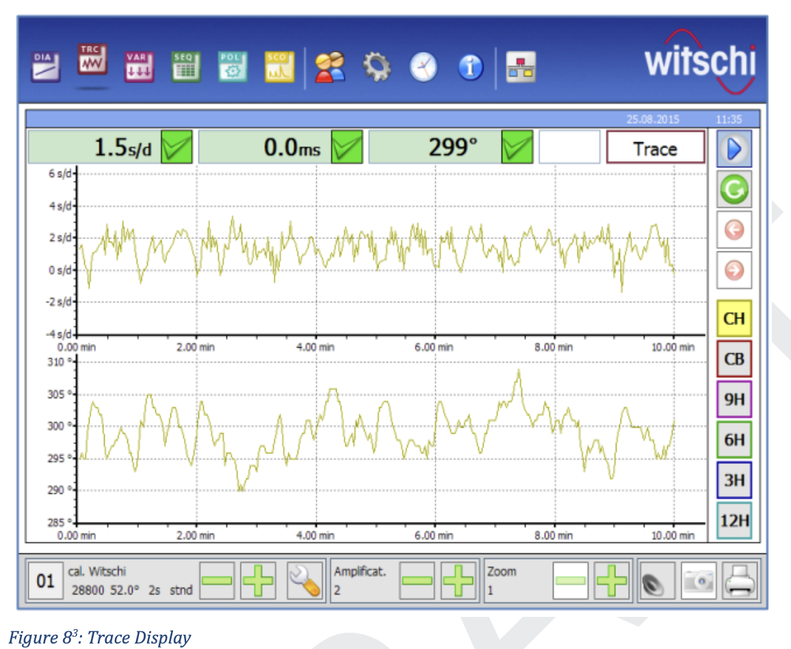

#### Case 1: 정상 시계 / Normal Watch

```
Rate
 +4│  . . . . . . . . . . . . . . . . .
 +2│
  0│──────────────────────────────────── (기준선 / baseline)
 -2│
   └────────────────────────────────── time(min) →

Amplitude
310│  . . . . . . . . . . . . . . . . .
300│
290│
   └────────────────────────────────── time(min) →
```

> 한국어: Rate 점이 수평 띠 안에 안정. Amplitude 270~310° 유지  
> English: Rate dots stable within a horizontal band. Amplitude sustained at 270–310°

#### Case 2: 빠른 시계 / Fast Watch (+90 s/d)

```
Rate
+90│                              . . .
   │                    . . . . .
   │          . . . . .
   │. . . . .
  0│──────────────────────────────────── (기준선 / baseline)
   └────────────────────────────────── time →
```

> 한국어: 점들이 위로 급경사 → 하루 90초 빠름  
> English: Dots trending sharply upward → 90 seconds fast per day

#### Case 3: 느린 시계 / Slow Watch (-90 s/d)

```
Rate
  0│──────────────────────────────────── (기준선 / baseline)
   │. . . . .
   │          . . . . .
   │                    . . . . .
-90│                              . . .
   └────────────────────────────────── time →
```

> 한국어: 점들이 아래로 급경사 → 하루 90초 느림  
> English: Dots trending sharply downward → 90 seconds slow per day

#### Case 4: Beat Error 있음 / Beat Error Present (두 줄 분리 / Two-line split)

```
Rate
   │  . . . . . . . . . . . .   ← tic 위상 / tic phase
   │
   │. . . . . . . . . . . .     ← tac 위상 / tac phase
  0│────────────────────────────
```

> 한국어: tic/tac 두 줄로 분리됨 → Beat Error 존재. 두 줄 간격 = Beat Error × 2. **조치:** Beat Error 먼저 조정 → Rate 재조정  
> English: Split into two lines (tic/tac) → Beat Error present. Gap = Beat Error × 2. **Action:** Adjust Beat Error first → then re-adjust Rate

#### Case 5: Gear Train 결함 / Gear Train Defect (규칙적 사인파 / Regular sine wave)

```
Rate
 +6│      .       .       .
 +3│    .   .   .   .   .   .
  0│──.───────.───────.──────── (기준선 / baseline)
 -3│.   .   .   .   .   .
   └────────────────────────── time →
      ←→ 이 주기 = escape wheel 1회전 / this period = 1 escape wheel revolution
```

> 한국어: 규칙적 사인파 = escape wheel 결함. **조치:** gear train 수리/교체  
> English: Regular sine wave = escape wheel defect. **Action:** repair/replace gear train

#### Case 6: Amplitude 지속 감소 / Sustained Amplitude Drop

```
Amplitude
320│. . .
310│       . . .
300│             . . .
290│                   . . .
270│─ ─ ─ ─ ─ ─ ─ ─ ─ ─ ─ ─ ─  ← 정상 하한 경보선 / lower alarm
   └────────────────────────── time →
```

> 한국어: 단조 감소 → 270° 이하면 GUI 경보. **조치:** 윤활 또는 태엽 점검  
> English: Monotonic decrease → GUI alarm below 270°. **Action:** lubrication or mainspring inspection

#### Case 7: 불규칙 산만한 패턴 / Irregular Scattered Pattern

```
Rate
 +6│  .    .  .     .  .
 +3│.    .      . .      .  .
  0│──────────────────────────
 -3│   .     .    .    .
 -6│       .          .
   └────────────────────────── time →
```

> 한국어: 점이 흩어짐 → 신호 노이즈, 측정 불안정, 진폭 부족. **조치:** 오버홀  
> English: Scattered dots → signal noise, unstable measurement, low amplitude. **Action:** overhaul

---

### 패턴 읽기 요약 / Pattern Reading Summary

| 관찰 내용 / Observation | 진단 / Diagnosis |
|---|---|
| 수평에 가까운 좁은 선 / Narrow near-horizontal line | 정상, 안정적 / Normal, stable |
| 위로 올라가는 기울기 / Upward slope | 시계가 빠름 / Watch running fast |
| 아래로 내려가는 기울기 / Downward slope | 시계가 느림 / Watch running slow |
| 두 선으로 분리 / Two parallel lines | Beat Error 있음 / Beat Error present |
| 사인파 형태 / Sine wave pattern | Gear train / escape wheel 결함 / defect |
| Amplitude 지속 감소 / Amplitude sustained drop | 태엽 소진 또는 윤활 불량 / Mainspring down or poor lubrication |
| 불규칙하게 산만한 점 / Irregular scattered dots | 신호 노이즈, 측정 불안정 / Signal noise, unstable measurement |

---

### 다른 그래프와의 연관 / Relationship with Other Graphs

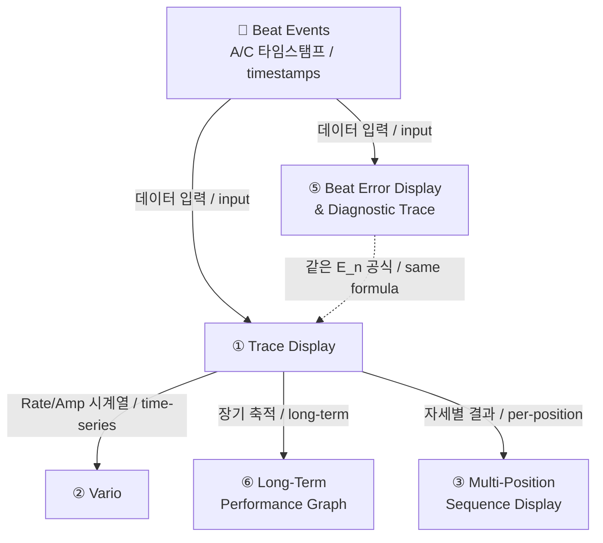
```mermaid
graph TD
    RAW["🎵 Beat Events\nA/C 타임스탬프 / timestamps"]

    RAW -->|"데이터 입력 / input"| TRC["① Trace Display"]
    RAW -->|"데이터 입력 / input"| BED["⑤ Beat Error Display\n& Diagnostic Trace"]

    TRC -->|"Rate/Amp 시계열 / time-series"| VAR["② Vario"]
    TRC -->|"장기 축적 / long-term"| LTP["⑥ Long-Term\nPerformance Graph"]
    TRC -->|"자세별 결과 / per-position"| MPS["③ Multi-Position\nSequence Display"]

    BED -. "같은 E_n 공식 / same formula" .-> TRC
```

| 연관 그래프 / Related Graph | 관계 / Relationship |
|---|---|
| **② Vario** | Trace가 생성하는 Rate/Amp 시계열을 통계(Min/Max/σ)로 집계 / Aggregates Trace time-series into statistics |
| **③ Multi-Position** | 각 자세마다 Trace 측정 후 결과 요약 / Measures Trace per position and summarizes |
| **⑤ Beat Error Display** | 동일한 E_n 공식 사용. Trace는 누적 오차 시각화, BE Display는 tic/tac 비대칭 진단 / Same E_n formula |
| **⑥ Long-Term** | Trace 데이터를 시간 단위로 장기 축적 / Accumulates Trace data over hours |
| **⑦ Escapement Analyzer** | Trace의 A/C 마커를 단일 beat 확대 정밀 분석 / Zooms in on Trace A/C markers |

---

## ② Rate and Amplitude Stability Over Time (Vario)

### 그래프 목적 / Purpose

**한국어**

측정 세션 동안 축적된 Rate/Amplitude 값의 **통계 분포**를 실시간으로 보여주는 가로 막대형 요약 뷰.

순간 값이 아니라 **얼마나 일정하게 유지되는가** — 즉 안정성과 조정 품질을 판단하는 것이 목적.

> Min/Max 폭이 좁을수록 안정적, σ가 작을수록 일관성 높음

**English**

A horizontal bar summary view that shows the **statistical distribution** of accumulated Rate/Amplitude values during the measurement session in real time.

The goal is not instantaneous values but **how consistently values are maintained** — stability and adjustment quality.

> Narrower Min/Max range = more stable; smaller σ = more consistent

**화면 구조 / Screen Layout:**

```
┌─────────────────────────────────────────────────────────────────┐
│  2.0 s/d ✓    0.0 ms ✓    297° ✓    01        [Vario]          │
├─────────────────────────────────────────────────────────────────┤
│                         1:16                                    │
│                                                                 │
│  Rate     Min  -0.8 s/d    X  1.5 s/d    σ  1.0 s/d    Max  3.3 s/d │
│                                                                 │
│  -10  -5    0    5    10   15                                   │
│            [██████████] ↑Min  ↑X  ↑Max                         │
│                                                                 │
│  Amplitude  Min  291°    X  298°    σ  3°    Max  303°          │
│                                                                 │
│  180   210   240   270   300   330                              │
│                     [████] ↑Min  ↑X  ↑Max                      │
└─────────────────────────────────────────────────────────────────┘
```

| 요소 / Element | 의미 / Meaning |
|---|---|
| 초록 영역 / Green range | 허용 범위 / Acceptable range (Rate: ±5~15 s/d, Amplitude: 270~310°) |
| 파란 화살표 / Blue arrows | Min / Max 측정값 위치 / Min/Max positions |
| 빨간 화살표 / Red arrow | 평균값(X) 위치 / Mean (X) position |

---

### 소스 데이터 및 공식 / Source Data and Formulas

**한국어**

**입력 데이터:** Trace Display가 축적한 Rate/Amplitude 시계열

```
Min   = min(Rate_1, ..., Rate_N)
Max   = max(Rate_1, ..., Rate_N)
X     = (1/N) × Σ Rate_i                      ← 평균 / mean
σ     = sqrt((1/N) × Σ(Rate_i - X)²)          ← 표준편차 / std dev
D     = Max - Min                              ← 분포 폭 / spread
동일 공식을 Amplitude에도 적용 / Same formulas applied to Amplitude
```

**English**

**Input data:** Rate/Amplitude time-series accumulated by Trace Display

```
Min   = min(Rate_1, ..., Rate_N)
Max   = max(Rate_1, ..., Rate_N)
X     = (1/N) × Σ Rate_i                      ← mean
σ     = sqrt((1/N) × Σ(Rate_i - X)²)          ← standard deviation
D     = Max - Min                              ← spread (used in Multi-Position)
Same formulas applied to Amplitude
```

---

### 그래프 예시 / Graph Examples

**실제 샘플 (Witschi Chronoscope X1 G3) / Real Sample:**

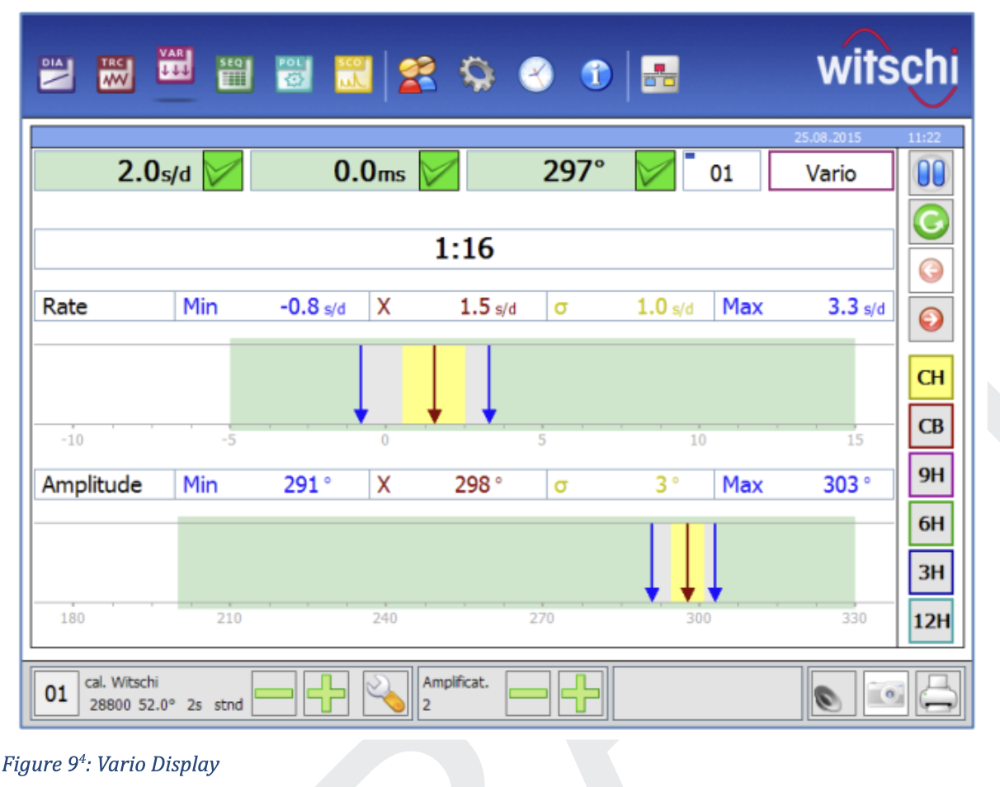

#### Case 1: 잘 조정된 시계 / Well-adjusted Watch

```
Rate 바 / bar
-10   -5    0    5    10   15
            [██████]
              ↑     ↑
           Min=-0.5  Max=+2.0   X=+0.8  σ=0.6
```

> 한국어: Min~Max 폭 좁음, σ 작음 → 안정적, 조정 양호  
> English: Narrow Min–Max range, small σ → stable, well adjusted

#### Case 2: Rate 불안정 / Unstable Rate

```
Rate 바 / bar
-10   -5    0    5    10   15
  [████████████████████████]
  ↑                        ↑
Min=-9.0               Max=+12.0   X=+1.5  σ=5.2
```

> 한국어: Min~Max 폭 매우 넓음, σ 큼 → 불안정, 재조정 필요  
> English: Very wide Min–Max range, large σ → unstable, needs readjustment

#### Case 3: Amplitude 정상 범위 이탈 / Amplitude Out of Normal Range

```
Amplitude 바 / bar
 180   210   240   270   300   330
         [██████]
         ↑             ↑
      Min=230°        Max=255°   ← 270° 정상 하한 아래 / below lower normal
```

> 한국어: Amplitude 전체가 정상 범위(270~310°) 밖 → 경보 표시  
> English: Entire Amplitude range outside normal (270–310°) → alarm displayed

---

### 다른 그래프와의 연관 / Relationship with Other Graphs

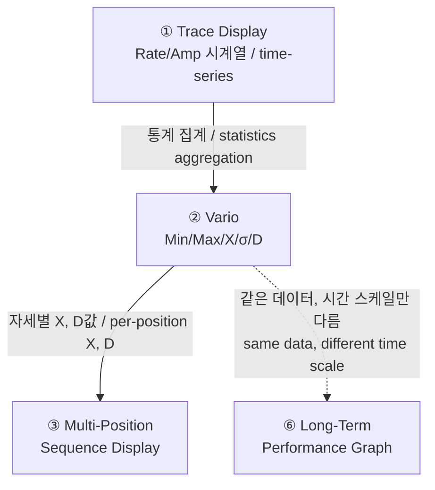
```mermaid
graph TD
    TRC["① Trace Display\nRate/Amp 시계열 / time-series"]
    TRC -->|"통계 집계 / statistics aggregation"| VAR["② Vario\nMin/Max/X/σ/D"]

    VAR -->|"자세별 X, D값 / per-position X, D"| MPS["③ Multi-Position\nSequence Display"]
    VAR -. "같은 데이터, 시간 스케일만 다름\nsame data, different time scale" .-> LTP["⑥ Long-Term\nPerformance Graph"]
```

| 연관 그래프 / Related Graph | 관계 / Relationship |
|---|---|
| **① Trace Display** | Vario의 직접 데이터 소스 / Direct data source. Trace time-series → Vario statistics |
| **③ Multi-Position** | 각 자세에서 Vario를 측정 → X(평균)와 D(Max-Min)를 테이블로 합산 / Measures Vario per position |
| **⑥ Long-Term** | Vario는 현재 세션 통계 스냅샷, Long-Term은 동일 값의 시간 추이 / Vario: snapshot; Long-Term: trend |

---

## ③ Multi-Position Sequence Display

### 그래프 목적 / Purpose

**한국어**

시계를 여러 자세(위치)에 놓고 측정한 Rate와 Amplitude를 **자세별로 비교**하는 테이블/바 차트 뷰.

기계식 시계의 Rate는 자세(중력 방향과 무브먼트의 상대적 관계)에 따라 달라진다. 이 그래프는 어느 자세에서 어떤 편차가 발생하는지를 한눈에 파악하고, 조정사가 자세 민감도를 진단하는 데 사용한다.

> 핵심: 자세별 X(평균 Rate)와 D(Max-Min 폭)를 비교하여 조정 필요 자세 식별

**English**

A table/bar chart view that **compares Rate and Amplitude across multiple positions** (watch orientations).

The Rate of a mechanical watch varies with position (the orientation of the movement relative to gravity). This graph makes it easy to see which positions cause the most deviation, helping a watchmaker diagnose positional sensitivity.

> Key: compare X (mean Rate) and D (Max-Min spread) per position to identify which positions need adjustment

**측정 자세 / Measurement Positions:**

| 코드 / Code | 자세 설명 / Description |
|---|---|
| **CH** | Crown Held (용두 수평) |
| **CB** | Crown Back (용두 뒤) |
| **DU** | Dial Up (문자판 위) |
| **DD** | Dial Down (문자판 아래) |
| **9H** | Crown at 9 o'clock (용두 9시 방향) |
| **6H** | Crown at 6 o'clock (용두 6시 방향) |
| **3H** | Crown at 3 o'clock (용두 3시 방향) |
| **12H** | Crown at 12 o'clock (용두 12시 방향) |

**화면 구조 / Screen Layout:**

```
┌──────────────────────────────────────────────────────────────────────────┐
│  Multi-Position Sequence Display          [자세 수 / positions: 6]       │
├──────────────────────────────────────────────────────────────────────────┤
│  자세  │  Rate X (s/d)  │  Rate D (s/d)  │  Amplitude X (°)  │  비고   │
│  Pos.  │  Mean Rate     │  Rate Spread   │  Mean Amplitude   │  Note  │
├────────┼────────────────┼────────────────┼───────────────────┼─────────┤
│  DU    │    +1.5        │     2.0        │     303°          │   ✓    │
│  DD    │    +3.2        │     2.8        │     298°          │   ✓    │
│  CH    │    -0.5        │     3.1        │     295°          │   ✓    │
│  CB    │    -2.1        │     4.5        │     287°          │   ⚠    │  ← 편차 큼
│  9H    │    +4.8        │     3.2        │     290°          │   ⚠    │  ← 빠름
│  6H    │    -4.2        │     3.6        │     285°          │   ⚠    │  ← 느림
├────────┼────────────────┼────────────────┼───────────────────┼─────────┤
│        │                                                               │
│  Rate 바 차트 / Rate bar chart:                                        │
│  DU │    ▓ +1.5                                                        │
│  DD │      ▓▓ +3.2                                                     │
│  CH │  ▓ -0.5                                                          │
│  CB │ ▓▓ -2.1                                                          │
│  9H │        ▓▓▓▓ +4.8                                                 │
│  6H │▓▓▓▓ -4.2                                                         │
│     ├──────┬──────┬──────┬──────┬──────                               │
│           -5     0     +5                                              │
└──────────────────────────────────────────────────────────────────────────┘
```

| 요소 / Element | 의미 / Meaning |
|---|---|
| X (Rate 평균 / mean) | 해당 자세의 평균 Rate (s/d) / Mean Rate at this position |
| D (Rate 폭 / spread) | Max-Min 폭 — 해당 자세에서의 안정성 / Max-Min range — stability within position |
| ✓ | 정상 범위 내 / Within acceptable range |
| ⚠ | 조정 권장 / Adjustment recommended |

---

### 소스 데이터 및 공식 / Source Data and Formulas

**한국어**

**입력 데이터:** 각 자세에서 수행한 Vario(②) 측정값

```
자세별 측정 절차 / Per-position measurement procedure:
  1. 시계를 해당 자세에 위치 / Place watch in position
  2. 안정화 대기 (약 30~60초) / Wait for stabilization (~30–60 sec)
  3. Trace 데이터 N초 수집 / Collect Trace data for N seconds
  4. Vario 통계 계산 / Compute Vario statistics:
       X_pos  = mean Rate during this position
       D_pos  = Max Rate - Min Rate during this position
       Xamp_pos = mean Amplitude during this position

최종 요약 테이블:
  Position_i → (X_i, D_i, Xamp_i)
  전체 위치 X 값 범위 = 자세 민감도 지표 / Total X range = positional sensitivity index
```

**English**

**Input data:** Vario (②) measurements taken at each watch position

```
Per-position measurement procedure:
  1. Place watch in target position
  2. Wait for stabilization (~30–60 sec)
  3. Collect Trace data for N seconds
  4. Compute Vario statistics:
       X_pos  = mean Rate during this position
       D_pos  = Max Rate - Min Rate during this position
       Xamp_pos = mean Amplitude during this position

Final summary table:
  Position_i → (X_i, D_i, Xamp_i)
  Total X range across all positions = positional sensitivity index
```

---

### 그래프 예시 / Graph Examples

**실제 샘플 (Time Grapher Project Plan, Figure 10) / Real Sample:**

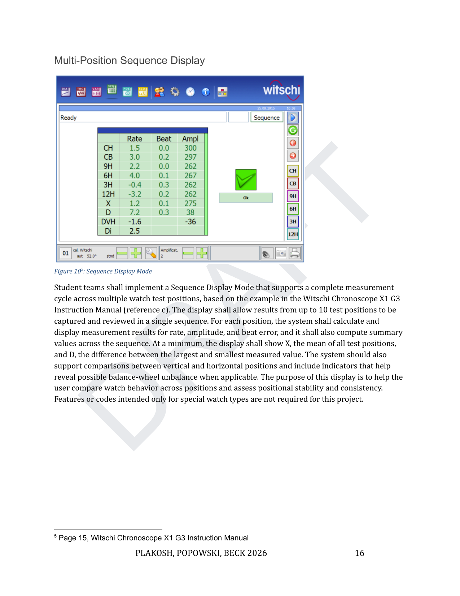

#### Case 1: 자세 민감도 낮음 / Low Positional Sensitivity (잘 조정된 시계)

```
자세 / Pos   Rate X
  DU         +1.5 s/d  │ ▓
  DD         +2.0 s/d  │  ▓
  CH         +0.8 s/d  │▓
  CB         +1.2 s/d  │ ▓
             ──────────┤──────
             전체 범위 / total spread: 1.2 s/d → 우수
```

> 한국어: 자세 간 편차 작음 → 균형 조정 우수  
> English: Low variation between positions → excellent balance adjustment

#### Case 2: 수직 자세 의존성 / Vertical Position Dependency

```
자세 / Pos   Rate X
  DU         +1.5 s/d  │ ▓          ← 수평 자세 안정
  DD         +2.0 s/d  │  ▓         ← 수평 자세 안정
  9H        +12.0 s/d  │             ▓▓▓▓▓ ← 수직 자세 크게 이탈
  6H         -8.0 s/d  ▓▓▓▓         ← 수직 자세 크게 이탈
```

> 한국어: 수직 자세에서만 Rate 크게 변함 → 팔레트 포크 조정 또는 balance staff 마모  
> English: Rate deviates only in vertical positions → pallet fork adjustment or worn balance staff

#### Case 3: Amplitude 자세 의존성 / Amplitude Positional Dependency

```
자세 / Pos   Amplitude X
  DU         303°  ✓
  DD         299°  ✓
  CB         261°  ⚠  ← 270° 하한 아래
  CH         258°  ⚠  ← 270° 하한 아래
```

> 한국어: 특정 수평 자세에서 Amplitude 부족 → 태엽 또는 이탈기 마찰 문제  
> English: Low Amplitude only in certain horizontal positions → mainspring or escapement friction issue

---

### 다른 그래프와의 연관 / Relationship with Other Graphs

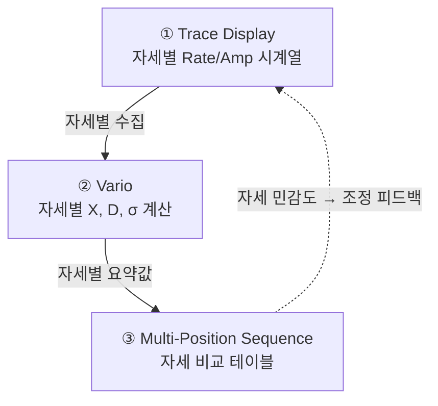
```mermaid
graph TD
    TRC["① Trace Display\n자세별 Rate/Amp 시계열"]
    VAR["② Vario\n자세별 X, D, σ 계산"]
    MPS["③ Multi-Position Sequence\n자세 비교 테이블"]

    TRC -->|"자세별 수집"| VAR
    VAR -->|"자세별 요약값"| MPS

    MPS -. "자세 민감도 → 조정 피드백" .-> TRC
```

| 연관 그래프 / Related Graph | 관계 / Relationship |
|---|---|
| **① Trace Display** | Multi-Position의 원데이터. 각 자세 전환 시 Trace를 새로 수집 / Raw data for each position |
| **② Vario** | 각 자세에서의 Vario 통계(X, D)를 Multi-Position 테이블에 기록 / Per-position Vario statistics feed the table |
| **⑤ Beat Error Display** | Beat Error도 자세별로 달라질 수 있음 (확장 시 추가 가능) / BE can also vary by position |

---

## ④ Beat-Noise Scope Display (Scope 1 & Scope 2)

### 그래프 목적 / Purpose

**한국어**

**개별 beat의 실제 음향 파형**을 표시하는 그래프. Trace처럼 타이밍 오차 누적값이 아니라, 틱 소리 자체의 **모양**을 보여준다.

Trace 그래프에서는 보이지 않는 **시계 내부 기계적 결함**을 진단하는 핵심 도구.

**English**

Shows the **raw acoustic waveform of individual beats** — not cumulative timing error (Trace), but the actual shape of the tick sound.

Primary tool for diagnosing **mechanical defects inside the watch** that are invisible in the Trace graph.

**Scope 1 vs Scope 2 비교 / Comparison:**

| | Scope 1 (스트립 뷰 / Strip View) | Scope 2 (이중 축 + 평균 / Dual Axis + Avg) |
|---|---|---|
| 표시 방식 / Display | beat를 순차적으로 스크롤 / Sequential scrolling strip | Tic과 Tac을 별도 축으로 분리 / Tic and Tac on separate axes |
| 시간 범위 / Time range | 전환 가능: beat당 20/200/400 ms | 1 beat 주기 고정 / Fixed to one beat period |
| 평균 처리 / Averaging | 없음 — beat별 raw 파형 / None — raw per beat | N-beat 평균 적용 / N-beat average applied |
| 용도 / Use | 개별 이상 beat 즉시 포착 / Spot individual anomalous beats | 반복되는 기계적 패턴 식별 / Identify repeating mechanical patterns |

**화면 구조 / Screen Layout:**

```
Scope 1 (스트립 뷰 / Strip View):
┌──────────────────────────────────────────────────────────────────┐
│ ← 20 ms → │ ← 20 ms → │ ← 20 ms → │ ← 20 ms → │ ← 20 ms →   │
│  [tic]    │   [tac]   │   [tic]   │   [tac]   │   [tic]      │
│   ╭╮  ╭╮  │  ╭╮  ╭╮   │  ╭╮  ╭╮  │  ╭╮  ╭╮   │  ╭╮  ╭╮     │
│───╯╰──╯╰──┼──╯╰──╯╰───┼──╯╰──╯╰──┼──╯╰──╯╰───┼──╯╰──╯╰─     │
│     ↑A ↑C │     ↑A ↑C │    ↑A ↑C │    ↑A ↑C  │              │
└──────────────────────────────────────────────────────────────────┘
                                            시간 →

Scope 2 (이중 축 / Dual Axis):
┌──────────────────────────────────────────────────────────────────┐
│  Tic (N-beat 평균 / N-beat average):                             │
│      ╭╮              ╭╮                                          │
│  ────╯╰──────────────╯╰────                                      │
├──────────────────────────────────────────────────────────────────┤
│  Tac (N-beat 평균 / N-beat average):                             │
│      ╭╮              ╭╮                                          │
│  ────╯╰──────────────╯╰────                                      │
└──────────────────────────────────────────────────────────────────┘
```

| 축 / Axis | 내용 / Content |
|---|---|
| X | beat 내 경과 시간 (ms) / Elapsed time within beat (ms) |
| Y | 음향 진폭 (envelope 처리 후) / Acoustic amplitude (after envelope) |

---

### 소스 데이터 및 공식 / Source Data and Formulas

**한국어**

**입력 데이터:** `tg_process()` 출력

```
r.processed_pcm[]    ← HPF + 엔벨로프 처리된 파형
r.events[]           ← A 이벤트 타임스탬프 (beat 슬라이싱 기준)
mCurrentSamplesPerSecond  ← 샘플 인덱스 → ms 변환
```

각 A 이벤트를 기준으로 PCM 버퍼에서 beat 창을 잘라내기 위한 **단기 PCM 링 버퍼** 필요.

**Scope 2 평균 공식:**

```
Avg_tic[i] = (1/N) × Σ tic_beat_k[i]   (k = 1..N, i = 샘플 위치)
Avg_tac[i] = (1/N) × Σ tac_beat_k[i]
```

**English**

**Input data:** `tg_process()` output

```
r.processed_pcm[]         ← HPF + envelope processed waveform
r.events[]                ← A event timestamps (beat slicing anchor)
mCurrentSamplesPerSecond  ← sample index to ms conversion
```

A short **per-beat PCM ring buffer** is required to slice each beat window around A events.

**Scope 2 averaging formula:**

```
Avg_tic[i] = (1/N) × Σ tic_beat_k[i]   (k = 1..N, i = sample position)
Avg_tac[i] = (1/N) × Σ tac_beat_k[i]
```

---

### 그래프 예시 / Graph Examples

**실제 샘플 (Time Grapher Project Plan, Figure 11) / Real Sample:**

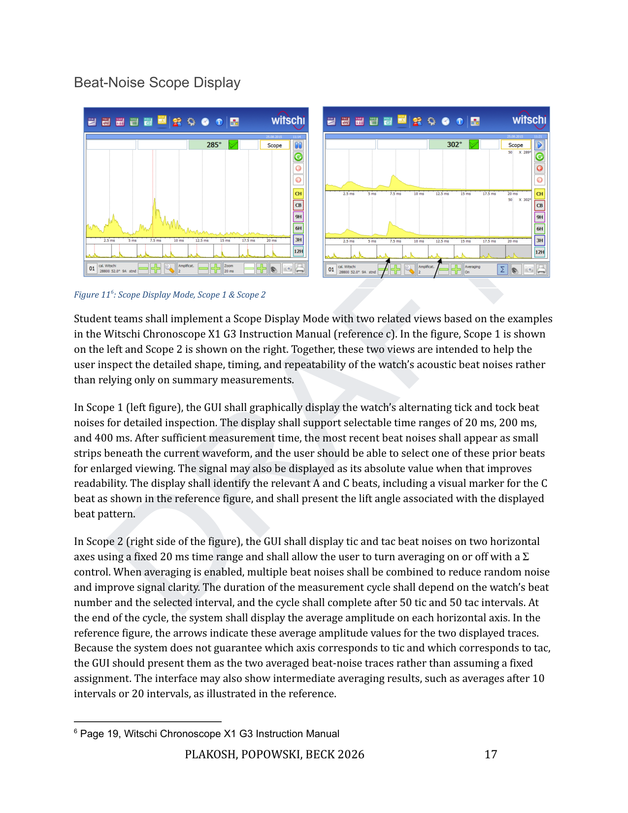

**Scope 기능 결함 패턴 (Witschi Training Course pp.16-17) / Scope Error Patterns:**

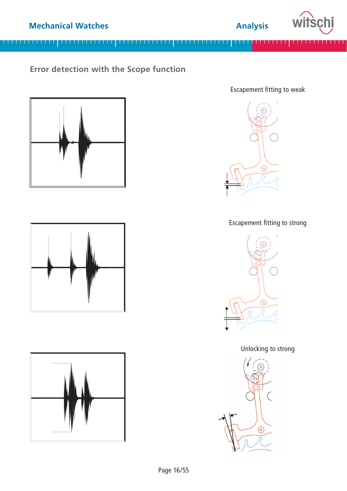

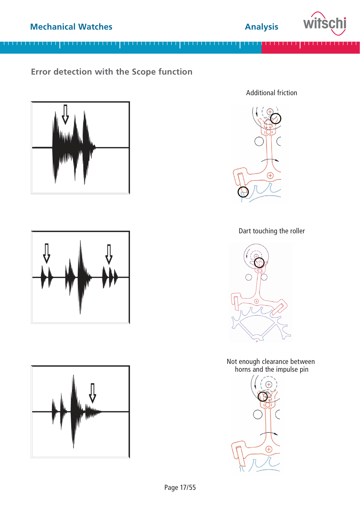

#### Case 1: 정상 시계 / Normal Watch

```
Scope 1:
  [tic]  │ ╭╮  ╭╮  [tac]  │ ╭╮  ╭╮  [tic]  │ ╭╮  ╭╮
         │╭╯╰──╯╰─        │╭╯╰──╯╰─         │╭╯╰──╯╰─
          ↑A  ↑C            ↑A  ↑C             ↑A  ↑C
> 한국어: 모든 beat의 A, C 피크가 일정한 위치
> English: A and C peaks at consistent positions across all beats
```

#### Case 2: 이탈기 피팅 과약 / Escapement Fitting Too Weak (A-C 간격 비정상 / Abnormally Short)

```
Scope 1:
  [tic]  │ ╭╮╭╮     [tac]  │ ╭╮╭╮
         │╭╯╰╯╰─           │╭╯╰╯╰─
          ↑A↑C  ← A-C 간격 비정상적으로 짧음 / abnormally short
> 조치 / Action: 이탈기 피팅 조정 / adjust escapement fitting
```

#### Case 3: 마찰 / 추가 충격 / Friction / Extra Impact (Extra Peak)

```
Scope 1:
  [tic]  │ ╭╮↓ ╭╮   [tac]  │ ╭╮  ╭╮
         │╭╯╰──╯╰─          │╭╯╰──╯╰─
              ↑ 비정상 하향 피크 / unexpected downward peak
> 조치 / Action: 이탈기 부품 점검 / inspect escapement parts
```

#### Case 4: Scope 2에서 Tic/Tac 형태 불일치 / Tic/Tac Shape Mismatch in Scope 2

```
Tic 평균 / avg:  ╭╮      ╭╮   (버스트 크기 균일 / uniform burst)
                 ╯╰──────╯╰
Tac 평균 / avg:  ╭╮    ╭──╮   (C 피크 넓어짐 / C peak wider = irregular pallet drop)
                 ╯╰────╯  ╰
> 진단 / Diagnosis: 팔레트 포크 비대칭 / pallet fork asymmetry
```

---

### 파형 결함 패턴 / Waveform Defect Patterns (Witschi Training Course pp.16-19)

| 관찰 / Observation | 진단 / Diagnosis | 조치 / Action |
|---|---|---|
| A/C 피크 위치 일정 / Consistent A/C peak positions | 정상 / Normal | — |
| A-C 간격 비정상적으로 짧음 / A-C interval too short | 이탈기 피팅 과약 / Escapement fitting too weak | 이탈기 조정 / Adjust escapement |
| 추가 피크 존재 / Extra peak present | 마찰 또는 다트 접촉 / Friction or dart contact | 부품 점검 / Inspect parts |
| Tic과 Tac 크기 비대칭 / Tic/tac size asymmetric | 팔레트 포크 비대칭 / Pallet fork asymmetry | 팔레트 조정 / Adjust pallet |
| C 피크 모양 불규칙 / Irregular C peak shape | 팔레트 낙하 불규칙 / Irregular pallet drop | 오버홀 / Overhaul |

---

### 다른 그래프와의 연관 / Relationship with Other Graphs

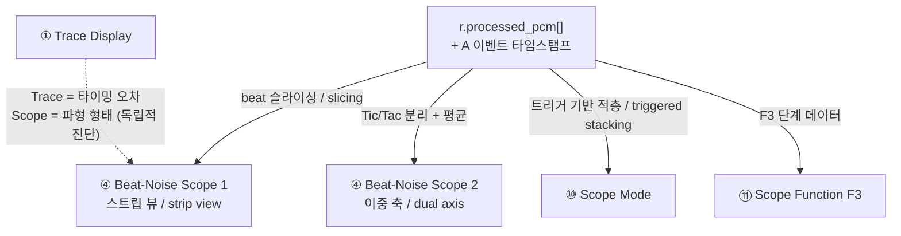
```mermaid
graph TD
    RAW["r.processed_pcm[]\n+ A 이벤트 타임스탬프"]

    RAW -->|"beat 슬라이싱 / slicing"| SC1["④ Beat-Noise Scope 1\n스트립 뷰 / strip view"]
    RAW -->|"Tic/Tac 분리 + 평균"| SC2["④ Beat-Noise Scope 2\n이중 축 / dual axis"]
    RAW -->|"트리거 기반 적층 / triggered stacking"| SCM["⑩ Scope Mode"]
    RAW -->|"F3 단계 데이터"| SCF["⑪ Scope Function F3"]

    TRC["① Trace Display"] -. "Trace = 타이밍 오차\nScope = 파형 형태 (독립적 진단)" .-> SC1
```

| 연관 그래프 / Related Graph | 관계 / Relationship |
|---|---|
| **① Trace Display** | Trace는 *언제* beat가 발생했는지(타이밍), Scope는 *어떻게* 들렸는지(파형). Trace가 깨끗해도 Scope는 이상일 수 있음 / Trace = when; Scope = how it sounded |
| **⑩ Scope Mode** | 동일 데이터. Scope 1 = 순차 스트립; Scope Mode = 전체 beat 누적 적층 / Same data; different display |
| **⑨ Waveform Comparison** | 둘 다 beat 비교. Waveform Comparison은 t_AC 레이블 추가로 타이밍 정밀도까지 분석 / Both compare beats; WFC adds t_AC quantitation |
| **⑪ Scope Function F3** | 동일 PCM 데이터를 4단계 DSP 프레임 안에서 표시 / Same PCM shown within 4-stage DSP frame |

---

## ⑤ Beat Error Display and Diagnostic Trace

### 그래프 목적 / Purpose

**한국어**

시계의 **tic과 tac 사이의 시간 비대칭(Beat Error)** 을 실시간으로 수치화하고, Beat Error가 Trace 그래프에 어떻게 나타나는지(두 줄 분리 패턴)를 함께 보여주는 복합 진단 뷰.

- **Beat Error 수치 패널**: 현재 BE 값(ms)과 추이 그래프
- **진단 Trace 패널**: tic/tac 위상 분리가 시각화된 Trace 패턴

> Beat Error가 0.6 ms 이하이면 정상. 초과 시 조정 필요.

**English**

A combined diagnostic view that **quantifies the tic-tac timing asymmetry (Beat Error)** in real time and shows how Beat Error manifests in the Trace graph (the two-line split pattern).

- **Beat Error value panel**: Current BE (ms) and trend graph
- **Diagnostic Trace panel**: Trace pattern with tic/tac phase separation visible

> Beat Error ≤ 0.6 ms is normal. Exceeding this requires adjustment.

**화면 구조 / Screen Layout:**

```
┌──────────────────────────────────────────────────────────────────┐
│  Beat Error: 1.2 ms  ⚠              [Beat Error Display]        │
├──────────────────────────────────────────────────────────────────┤
│  Beat Error 추이 / Trend:                                        │
│  1.5ms│                                                          │
│  1.0ms│  . . . . . . . . . . . . .  ← 현재 BE / current BE     │
│  0.6ms│─ ─ ─ ─ ─ ─ ─ ─ ─ ─ ─ ─ ─  ← 허용 상한 / upper limit  │
│  0.3ms│                                                          │
│  0.0ms│                                                          │
│       └──────┬──────┬──────┬──────  min →                       │
├──────────────────────────────────────────────────────────────────┤
│  진단 Trace (tic/tac 분리 시각화):                               │
│  +3│  . . . . . . . . . . .     ← tic 위상 / tic phase         │
│  +1│                                                             │
│  -1│                                                             │
│  -3│. . . . . . . . . . .       ← tac 위상 / tac phase         │
│    └──────────────────────  min →                               │
│       ↕ 두 줄 간격 = Beat Error × 2                             │
│       ↕ gap between lines = Beat Error × 2                      │
└──────────────────────────────────────────────────────────────────┘
```

| 요소 / Element | 의미 / Meaning |
|---|---|
| BE 수치 / BE value | 현재 beat 비대칭 (ms) / Current beat asymmetry (ms) |
| BE 추이 / BE trend | 시간에 따른 BE 변화 / BE change over time |
| 두 줄 분리 / Two-line split | Trace의 tic/tac 위상 분리 시각화 / Tic/tac phase separation in Trace |
| 두 줄 간격 / Line gap | Beat Error × 2 와 비례 / Proportional to Beat Error × 2 |

---

### 소스 데이터 및 공식 / Source Data and Formulas

**한국어**

**입력 데이터:** A 이벤트 타임스탬프 연속열

```
t1 = A_1 - A_0   ← 첫 번째 half-beat 간격 (tic → tac)
t2 = A_2 - A_1   ← 두 번째 half-beat 간격 (tac → tic)

BE = |t1 - t2| / 2   [ms]
   = (t1 - t2) / 2   [부호 있는 버전 — tic이 길면 양수]
```

**Trace 두 줄 분리 설명:**
```
tic beat의 E_n:  기준선보다 일정하게 위에 점 찍힘
tac beat의 E_n:  기준선보다 일정하게 아래에 점 찍힘
두 줄 간격 = 2 × BE   (in s/d 환산 단위)
```

**English**

**Input data:** Sequence of A event timestamps

```
t1 = A_1 - A_0   ← first half-beat interval (tic → tac)
t2 = A_2 - A_1   ← second half-beat interval (tac → tic)

BE = |t1 - t2| / 2   [ms]
   = (t1 - t2) / 2   [signed — positive if tic is longer]
```

**Why Trace shows two lines:**
```
tic beat E_n: plotted consistently above baseline
tac beat E_n: plotted consistently below baseline
Two-line gap = 2 × BE  (converted to s/d units)
```

---

### 그래프 예시 / Graph Examples

**실제 샘플 (Time Grapher Project Plan, Figure 12-13) / Real Sample:**

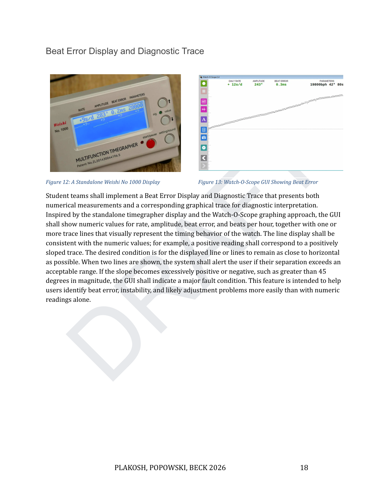

#### Case 1: Beat Error 없음 / No Beat Error (이상적 / Ideal)

```
BE 추이:
  0.0ms│ . . . . . . . . . . . . . . .

진단 Trace:
  0│ . . . . . . . . . . . . . . . . .  ← tic과 tac이 같은 선에 / tic and tac on same line
```

> 한국어: 단일 선 → BE = 0, 완벽한 tic/tac 대칭  
> English: Single line → BE = 0, perfect tic/tac symmetry

#### Case 2: Beat Error 있음 / Beat Error Present (1.2 ms)

```
BE 추이:
  1.2ms│ . . . . . . . . . . . . . . .  ← 허용 0.6ms 초과 / exceeds 0.6ms limit

진단 Trace:
  +3│  . . . . . . . . . . . .          ← tic 위상 / tic phase
  -3│. . . . . . . . . . . .            ← tac 위상 / tac phase
      ↕ 간격 ≈ 2.4 s/d ↔ 1.2ms × 2 × 변환계수
```

> 한국어: 두 줄 분리 → 조정 필요. **조치:** 이탈기 Beat Error 나사 조정  
> English: Two-line split → adjustment needed. **Action:** Adjust escapement beat error screw

#### Case 3: Beat Error 점진 증가 / Gradually Increasing Beat Error

```
BE 추이:
  0.8ms│               . . . .  ← 증가 추세
  0.6ms│─ ─ ─ ─ ─ ─ ─ ─ ─ ─ ─  ← 허용 상한
  0.3ms│ . . . . . .
```

> 한국어: BE가 서서히 증가 → 충격핀 마모 또는 팔레트 포크 간격 변화  
> English: Gradually increasing BE → impulse pin wear or pallet fork gap change

---

### 다른 그래프와의 연관 / Relationship with Other Graphs

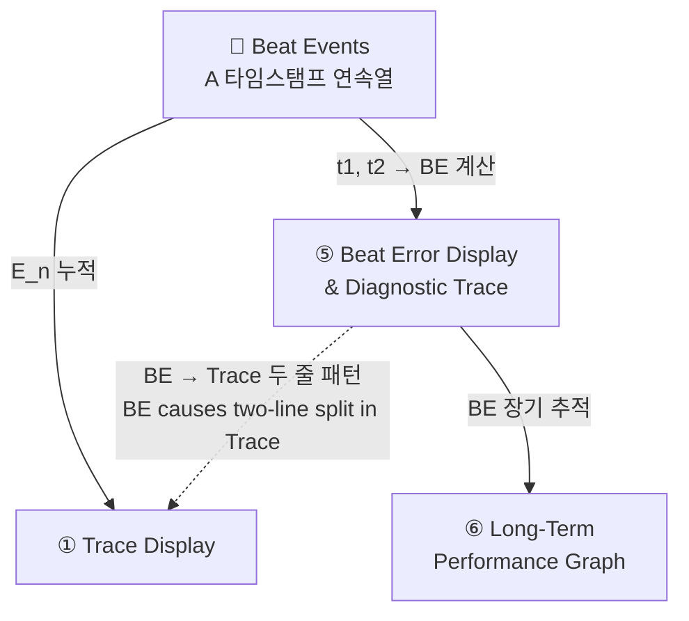
```mermaid
graph TD
    RAW["🎵 Beat Events\nA 타임스탬프 연속열"]

    RAW -->|"t1, t2 → BE 계산"| BED["⑤ Beat Error Display\n& Diagnostic Trace"]
    RAW -->|"E_n 누적"| TRC["① Trace Display"]

    BED -. "BE → Trace 두 줄 패턴\nBE causes two-line split in Trace" .-> TRC
    BED -->|"BE 장기 추적"| LTP["⑥ Long-Term\nPerformance Graph"]
```

| 연관 그래프 / Related Graph | 관계 / Relationship |
|---|---|
| **① Trace Display** | Beat Error가 있으면 Trace에 두 줄 패턴 발생. BE Display는 이 현상의 수치적 원인을 보여줌 / BE causes the two-line pattern in Trace |
| **⑥ Long-Term Performance** | 동일한 BE 공식 사용. Long-Term은 BE를 수 시간 추이로 기록 / Same BE formula used in Long-Term graph |
| **⑦ Escapement Analyzer** | Escapement Analyzer의 A/C 마커 간격 비교가 BE의 기계적 원인 확인에 도움 / Escapement Analyzer confirms mechanical cause of BE |

---

## ⑥ Long-Term Performance Graph

### 그래프 목적 / Purpose

**한국어**

수 시간에 걸쳐 Rate, Amplitude, Beat Error **3개 지표를 동시에** 장기 추이 그래프로 기록.

단기 측정으로는 보이지 않는 현상을 포착:
- 태엽 소진에 따른 Amplitude 점진 감소
- 날짜 변경 기구 충격에 따른 Rate 스파이크
- 온도/자성 변화에 따른 장기 드리프트
- Beat Error의 시간에 따른 변화 추이

**English**

Records Rate, Amplitude, and Beat Error **simultaneously** as a long-term trend graph over hours.

Captures phenomena invisible in short-term measurements:
- Gradual Amplitude decrease as mainspring winds down
- Rate spikes from date-change mechanism shock
- Long-term drift from temperature/magnetic changes
- Beat Error trend changes over time

**화면 구조 / Screen Layout:**

```
┌─────────────────────────────────────────────────────────────────┐
│  DAILY RATE -2.0 s/d    AMPLITUDE 281°    BEAT ERROR 0.6ms     │
│  PARAMETERS  21600bph  51°  60s                                 │
├─────────────────────────────────────────────────────────────────┤
│ [Panel 1 - Daily Rate]                                          │
│  +5│─ ─ ─ ─ ─ ─ ─ ─ ─ ─ ─ ─ ─ ─ ─  ← 허용 상한 / upper limit │
│    │ ~~~~~~~~~~~~~~~~~~~~~~~~~~~~~~~~~~~                        │
│   0│                                                            │
│  -5│─ ─ ─ ─ ─ ─ ─ ─ ─ ─ ─ ─ ─ ─ ─  ← 허용 하한 / lower limit │
│    └──1:00──2:00──3:00──4:00──5:00──6:00──7:00──8:00           │
├─────────────────────────────────────────────────────────────────┤
│ [Panel 2 - Amplitude]                                           │
│ 280│                                                            │
│ 270│─ ─ ─ ─ ─ ─ ─ ─ ─ ─ ─ ─ ─ ─ ─  ← 정상 하한 / lower limit │
│ 260│ ~~~~~~~~~~~~~~~~~~~~~~~~~~~~~~                             │
│    └──1:00──2:00──3:00──4:00──5:00──6:00──7:00──8:00           │
├─────────────────────────────────────────────────────────────────┤
│ [Panel 3 - Beat Error]                                          │
│ 0.9│                                                            │
│ 0.6│─ ─ ─ ─ ─ ─ ─ ─ ─ ─ ─ ─ ─ ─ ─  ← 허용 상한 / upper limit │
│    │ ~~~~~~~~~~~~~~~~~~~~~~~~~~~~~~~~~~                         │
│ 0.3│                                                            │
│    └──1:00──2:00──3:00──4:00──5:00──6:00──7:00──8:00           │
└─────────────────────────────────────────────────────────────────┘
```

---

### 소스 데이터 및 공식 / Source Data and Formulas

**한국어**

**Rate, Amplitude:** Trace Display(①)와 동일한 공식 사용

**Beat Error:**

```
t1 = A_1 - A_0  (첫 번째 half-beat 간격)
t2 = A_2 - A_1  (두 번째 half-beat 간격)
BE = (t1 - t2) / 2  [ms]
```

**장기 표시용 다운샘플링:**

```
update_interval ∝ elapsed_time
  → 처음엔 자주 업데이트
  → 시간이 지날수록 업데이트 주기 늘림
  → 수 시간 데이터도 화면 밀도 유지
```

**English**

**Rate, Amplitude:** Same formulas as Trace Display (①)

**Beat Error:**

```
t1 = A_1 - A_0  (first half-beat interval)
t2 = A_2 - A_1  (second half-beat interval)
BE = (t1 - t2) / 2  [ms]
```

**Downsampling for long-term display:**

```
update_interval ∝ elapsed_time
  → frequent updates at first
  → interval grows over time
  → maintains display density for hours of data
```

---

### 그래프 예시 / Graph Examples

**실제 샘플 (Watch-O-Scope) / Real Sample:**

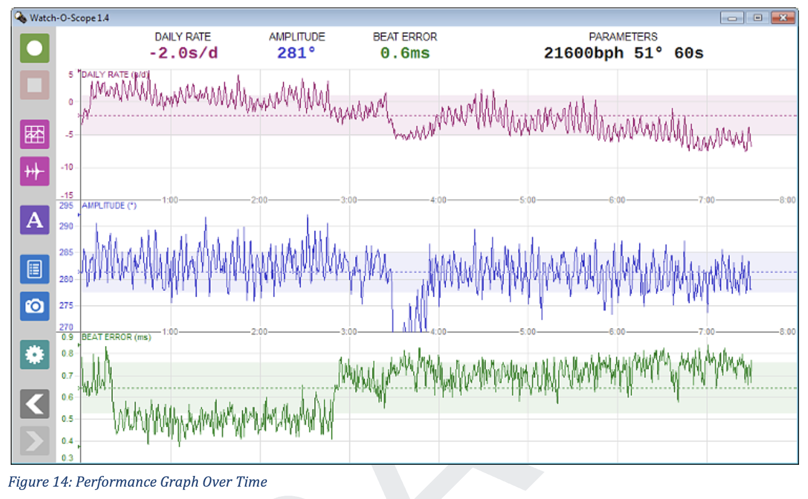

#### Case 1: 건강한 시계 / Healthy Watch (장기 안정 / Long-term Stable)

```
Rate      │ ~ ~ ~ ~ ~ ~ ~ ~ ~ ~ ~ ~ ~ ~ ~ ~  (±2 s/d 내 / within ±2 s/d)
Amplitude │ ~ ~ ~ ~ ~ ~ ~ ~ ~ ~ ~ ~ ~ ~ ~ ~  (295~305° 유지 / sustained)
Beat Err  │ ~ ~ ~ ~ ~ ~ ~ ~ ~ ~ ~ ~ ~ ~ ~ ~  (0.3~0.5 ms)
          └─────────────────────────────── 8시간 / 8 hours
```

> 한국어: 3개 지표 모두 허용 범위 내 안정  
> English: All three metrics stable within acceptable ranges

#### Case 2: 태엽 소진 패턴 / Mainspring Wind-down Pattern

```
Rate      │ ~ ~ ~ ~ ~ ~ ~\↘↘↘  (후반 Rate 악화)
Amplitude │ ~ ~ ~ ~\↘↘↘↘↘↘↘  (점진 감소)
Beat Err  │ ~ ~ ~ ~ ~ ~\↗↗↗  (후반 증가)
          └─────────────────────────────── 8시간 / 8 hours
            ← 완전 태엽 →   ← 소진 →
            ← full wind →  ← rundown →
```

> 한국어: 전형적인 파워 리저브 소진 패턴  
> English: Classic power reserve exhaustion pattern

#### Case 3: 날짜 변경 기구 충격 / Date-Change Mechanism Shock

```
Rate      │ ~ ~ ~ ~ │spike│ ~ ~ ~ ~ ~ ~
Amplitude │ ~ ~ ~ ~ │↘    │ ~ ~ ~ ~ ~ ~  (순간 감소 후 회복)
Beat Err  │ ~ ~ ~ ~ │spike│ ~ ~ ~ ~ ~ ~
          └──────────────────────────── 24시간 / 24 hours
                    ↑
                 자정 / midnight
```

#### Case 4: Beat Error 장기 드리프트 / Long-term Beat Error Drift

```
Rate      │ ~ ~ ~ ~ ~ ~ ~ ~ ~ ~ ~ ~ ~  (안정 / stable)
Amplitude │ ~ ~ ~ ~ ~ ~ ~ ~ ~ ~ ~ ~ ~  (안정 / stable)
Beat Err  │ ~~/↗ ~ ~~/↗ ~ ~~/↗ ~ ~ ~  (서서히 증가)
          └─────────────────────────── 수일 / several days
```

> 한국어: Rate/Amp는 정상이지만 BE만 장기 증가 → 충격핀 마모 또는 팔레트 포크 간격 변화  
> English: Rate/Amp normal but BE increasing long-term → impulse pin wear or pallet fork gap change

---

### 다른 그래프와의 연관 / Relationship with Other Graphs

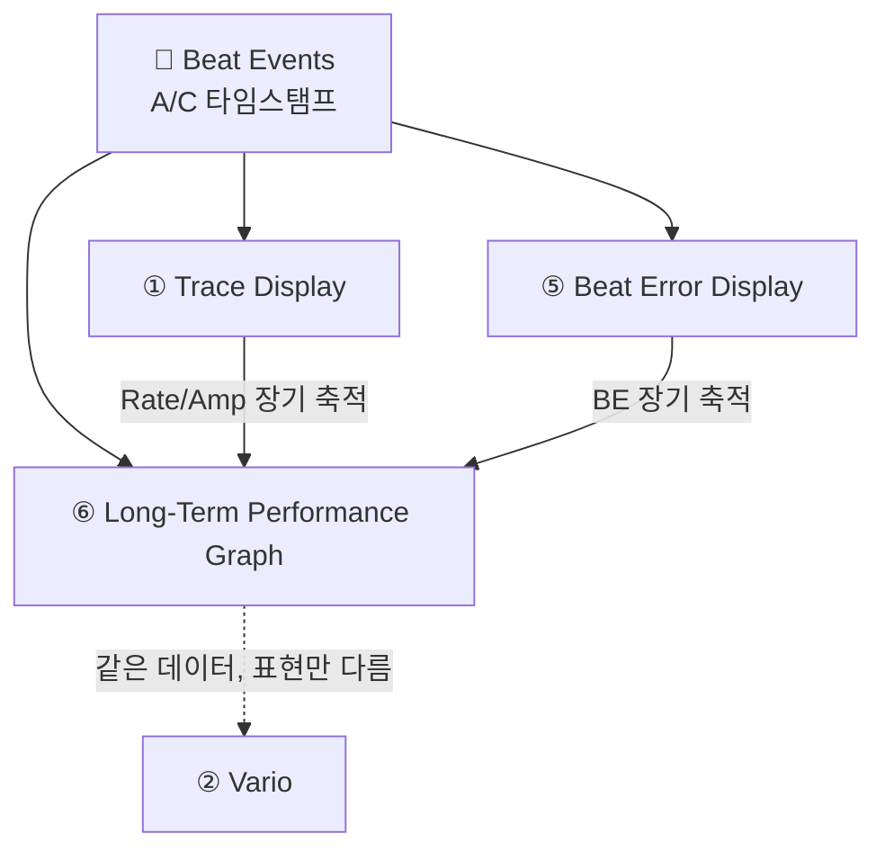
```mermaid
graph TD
    RAW["🎵 Beat Events\nA/C 타임스탬프"]

    RAW --> TRC["① Trace Display"]
    RAW --> BED["⑤ Beat Error Display"]
    RAW --> LTP["⑥ Long-Term Performance Graph"]

    TRC -->|"Rate/Amp 장기 축적"| LTP
    BED -->|"BE 장기 축적"| LTP

    LTP -. "같은 데이터, 표현만 다름" .-> VAR["② Vario"]
```

| 연관 그래프 / Related Graph | 관계 / Relationship |
|---|---|
| **① Trace Display** | 같은 Rate/Amplitude 공식. Trace는 분 단위 실시간, Long-Term은 시간 단위 장기 / Same formulas; different time scales |
| **⑤ Beat Error Display** | 같은 BE 공식 공유. BE Display는 단기 진단, Long-Term은 장기 모니터링 / Shared BE formula |
| **② Vario** | Vario는 현재 세션 통계 스냅샷(Min/Max/σ), Long-Term은 동일 값의 시간 추이 / Vario: snapshot; Long-Term: trend |

---

## ⑦ Escapement Analyzer and Marker-Line Display

### 그래프 목적 / Purpose

**한국어**

개별 beat의 음향 파형에 **A(T1)와 C(T3) 이벤트 마커를 ms 단위 레이블과 함께** 표시하는 정밀 분석 뷰.

Trace나 Vario와 달리, 이탈기(escapement)의 실제 동작 타이밍을 미세한 ms 단위로 분해하여 보여준다. 이탈기 기계 부품의 정밀 진단과 조정 결과 확인에 사용.

> 핵심: A(임펄스 핀 충격), C(이탈기 잠금) 이벤트를 단일 beat 위에 정확히 표시

**English**

A precision analysis view that shows **A (T1) and C (T3) event markers with millisecond labels** on the acoustic waveform of individual beats.

Unlike Trace or Vario, this view breaks down actual escapement timing at the ms level. Used for precise diagnosis of escapement mechanism components and to verify adjustment results.

> Key: precisely marks A (impulse pin contact) and C (escapement lock) events on a single beat

**화면 구조 / Screen Layout:**

```
┌──────────────────────────────────────────────────────────────────┐
│  Escapement Analyzer              BPH: 28800    [Esc. Analyzer] │
├──────────────────────────────────────────────────────────────────┤
│                                                                  │
│   음향 파형 / Acoustic Waveform:                                  │
│                                                                  │
│        ╭╮              ╭╮                                        │
│  ──────╯╰──────────────╯╰────────────────────────               │
│        ↑               ↑                                        │
│        A (T1)          C (T3)                                   │
│        0.000 ms        9.143 ms                                 │
│                                                                  │
│  ←────────── t_AC = 9.143 ms ──────────→                        │
│                                                                  │
│  마커 레이블 / Marker labels:                                     │
│  ┌──────────────────────────────┐                               │
│  │  A (T1)  : 0.000 ms          │  ← 기준 / reference          │
│  │  C (T3)  : 9.143 ms          │                               │
│  │  t_AC    : 9.143 ms          │  ← Amplitude 계산 입력        │
│  │  Amp     : 298.4°            │  ← 이 beat의 Amplitude        │
│  └──────────────────────────────┘                               │
│                                                                  │
│  0 ms    5 ms    10 ms   15 ms   20 ms                          │
│  └──────┴──────┴──────┴──────┘                                  │
└──────────────────────────────────────────────────────────────────┘
```

| 요소 / Element | 의미 / Meaning |
|---|---|
| A 마커 / A marker | T1 이벤트 — 임펄스 핀이 팔레트 포크를 치는 순간 / T1 — impulse pin contacts pallet fork |
| C 마커 / C marker | T3 이벤트 — 이탈기 잠금 + 포크가 뱅킹 핀에 닿는 순간 / T3 — escapement locks + fork reaches banking pin |
| t_AC | A→C 간격 (Amplitude 계산의 핵심 입력) / A→C interval (key input for Amplitude calculation) |
| ms 레이블 / ms labels | 각 이벤트의 beat 시작 기준 경과 시간 / Elapsed time of each event from beat start |

---

### 소스 데이터 및 공식 / Source Data and Formulas

**한국어**

**입력 데이터:**

```
r.processed_pcm[]      ← 처리된 파형 (Beat-Noise Scope와 동일)
r.events[]             ← A 이벤트 타임스탬프 (T1)
                       ← C 이벤트 타임스탬프 (T3)
mCurrentSamplesPerSecond  ← 샘플 → ms 변환
```

**표시 값 계산:**

```
t_A  = 0.0 ms   (A 이벤트를 기준 0으로 설정 / A event as reference zero)
t_C  = (C_timestamp - A_timestamp) / fs × 1000   [ms]
t_AC = t_C - t_A   [ms]

Amp_this_beat = (3600 × λ) / (π × BPH × (t_AC / 1000))   [°]
  λ : lift angle (보통 52° / typically 52°)
```

**English**

**Input data:**

```
r.processed_pcm[]         ← processed waveform (same as Beat-Noise Scope)
r.events[]                ← A event timestamps (T1)
                          ← C event timestamps (T3)
mCurrentSamplesPerSecond  ← sample to ms conversion
```

**Displayed value calculation:**

```
t_A  = 0.0 ms   (A event set as reference zero)
t_C  = (C_timestamp - A_timestamp) / fs × 1000   [ms]
t_AC = t_C - t_A   [ms]

Amp_this_beat = (3600 × λ) / (π × BPH × (t_AC / 1000))   [°]
  λ : lift angle (typically 52°)
```

---

### 그래프 예시 / Graph Examples

**실제 샘플 (Time Grapher Project Plan, Figure 15) / Real Sample:**

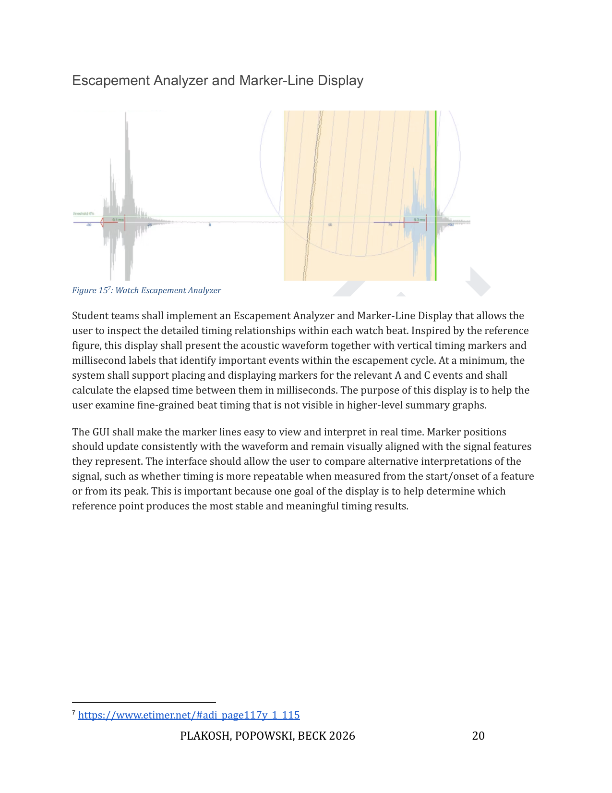

#### Case 1: 정상 시계 / Normal Watch (t_AC 안정)

```
파형 / Waveform:
   ╭╮              ╭╮
───╯╰──────────────╯╰────
   ↑               ↑
   A=0.000ms       C=9.143ms
   
   t_AC = 9.143 ms → Amp = 298°  ✓
```

#### Case 2: t_AC 길어짐 / Increased t_AC (Amplitude 감소)

```
파형 / Waveform:
   ╭╮                    ╭╮
───╯╰────────────────────╯╰────
   ↑                    ↑
   A=0.000ms            C=11.2ms
   
   t_AC = 11.2 ms → Amp = 243°  ⚠ (270° 하한 이탈)
```

> 한국어: t_AC 증가 → Amplitude 부족 → 태엽 소진 또는 윤활 불량  
> English: Increased t_AC → low Amplitude → mainspring down or poor lubrication

#### Case 3: C 이벤트 오검출 / C Event Misdetected

```
파형 / Waveform:
   ╭╮         ╭╮  ╭╮   ← A/C/노이즈 3개 피크
───╯╰─────────╯╰──╯╰────
   ↑           ↑  ↑
   A           C  노이즈 / noise

   → C 이벤트가 노이즈 피크를 C로 잘못 인식하면 t_AC 오차 발생
   → If noise peak misidentified as C, t_AC error occurs
```

---

### 다른 그래프와의 연관 / Relationship with Other Graphs

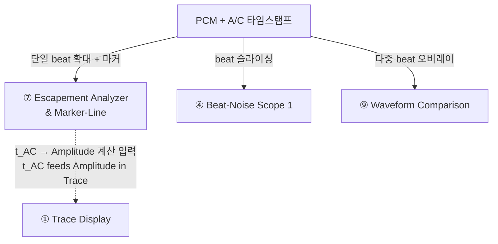
```mermaid
graph TD
    RAW["PCM + A/C 타임스탬프"]

    RAW -->|"단일 beat 확대 + 마커"| EAM["⑦ Escapement Analyzer\n& Marker-Line"]
    RAW -->|"beat 슬라이싱"| SC1["④ Beat-Noise Scope 1"]
    RAW -->|"다중 beat 오버레이"| WFC["⑨ Waveform Comparison"]

    EAM -. "t_AC → Amplitude 계산 입력\nt_AC feeds Amplitude in Trace" .-> TRC["① Trace Display"]
```

| 연관 그래프 / Related Graph | 관계 / Relationship |
|---|---|
| **① Trace Display** | Escapement Analyzer의 t_AC가 Trace에서 사용되는 Amplitude 계산의 원데이터 / t_AC from here feeds Amplitude in Trace |
| **④ Beat-Noise Scope** | 동일한 PCM + 이벤트 데이터. Scope는 전체 파형 모양, Escapement Analyzer는 A/C 마커 정밀 레이블 / Same data; different focus |
| **⑨ Waveform Comparison** | Escapement Analyzer = 단일 beat의 A/C 마커; Waveform Comparison = 수십 beat에 걸친 동일 마커 분포 / Single beat vs multi-beat A/C analysis |
| **⑤ Beat Error Display** | BE Display의 t1, t2도 A 이벤트 간격에서 유래. Escapement Analyzer는 같은 이벤트를 단일 beat 파형 위에 시각화 / Same A events viewed differently |

---

## ⑧ Time-Frequency Spectrogram Display

### 그래프 목적 / Purpose

**한국어**

2D 에너지 지도: **X = 시간, Y = 주파수, 색상 = 신호 에너지**.
시계가 어떤 주파수 성분을 생성하는지, 시간이 지나면서 어떻게 변하는지를 보여준다.

**English**

A 2D energy map: **X = time, Y = frequency, color = signal energy**.
Shows which frequencies the watch produces and how they change over time.

**진단 활용 / Diagnostic Use Cases:**

| 관찰 / Observation | 의미 / Meaning |
|---|---|
| 특정 주파수에 선명한 에너지 띠 / Sharp energy band | 정상 — 시계 공진 주파수 / Normal — watch resonant frequency |
| 에너지 띠가 시간에 따라 이동 / Band drifts over time | 온도 또는 윤활 변화 / Temperature or lubrication change |
| beat 사이에 광대역 노이즈 / Broadband noise between beats | 기계적 마찰 / Mechanical friction |
| 배음 구조 변화 / Harmonic structure changes | 이탈기 부품 마모 / Escapement wear |
| 200 Hz 이하 에너지 / Energy below 200 Hz | HPF 컷오프 검증 필요 / HPF cutoff verification needed |

**화면 구조 / Screen Layout:**

```
┌─────────────────────────────────────────────────────────────────┐
│ 주파수(Hz) / Freq                              [Spectrogram]   │
│  4000 │░░░░░░░░░░░░░░░░░░░░░░░░░░░░░░░░░░░░░░░░░░░░░░░░░░     │
│  2000 │░░░████░░░████░░░████░░░████░░░████░░░████░░░████░░     │
│  1000 │░██████░██████░██████░██████░██████░██████░██████░░     │
│   500 │░░░░░░░░░░░░░░░░░░░░░░░░░░░░░░░░░░░░░░░░░░░░░░░░░░     │
│     0 │────────────────────────────────────────────────────    │
│       └─────────────────────────────────────────────────→ 시간 │
│                                          [저에너지 ░ → 고에너지 █] │
└─────────────────────────────────────────────────────────────────┘
```

| 축 / Axis | 내용 / Content |
|---|---|
| X | 경과 시간 / Elapsed time |
| Y | 주파수 (Hz) / Frequency (Hz) |
| 색상 / Color | 에너지 강도 (dB 또는 선형) / Energy intensity (dB or linear) |

---

### 소스 데이터 및 공식 / Source Data and Formulas

**한국어**

**입력 데이터:** Raw PCM (float32, HPF 이전 또는 이후 선택 가능)

```
Raw PCM (슬라이딩 윈도우)
    │
    ▼ FFT (예: 1024–4096 샘플 / 프레임)
    │
    ▼ 주파수 빈(bin)별 에너지 벡터 [dB]
    │
    ▼ 2D 컬러맵 렌더링
```

**구현 주요 갭**: `CMakeLists.txt`에서 FFTW3가 **주석 처리**되어 있음. FFT 라이브러리 선택 필요.

| 옵션 / Option | 장점 / Pros | 단점 / Cons |
|---|---|---|
| FFTW3 재활성화 / Re-enable FFTW3 | 가장 빠름 / Fastest | 네이티브 의존성 / Native dependency |
| 단순 DFT 자체 구현 / Simple DFT | 의존성 없음 / No dependency | 긴 윈도우에서 느림 / Slow for long windows |

**English**

**Input data:** Raw PCM (float32, selectable before or after HPF)

```
Raw PCM (sliding window)
    │
    ▼ FFT (e.g. 1024–4096 samples per frame)
    │
    ▼ Energy per frequency bin [dB]
    │
    ▼ Rendered as 2D color map
```

**Key implementation gap**: FFTW3 is **commented out** in `CMakeLists.txt`. FFT library selection required.

---

### 그래프 예시 / Graph Examples

**실제 샘플 (Time Grapher Project Plan, Figure 16) / Real Sample:**

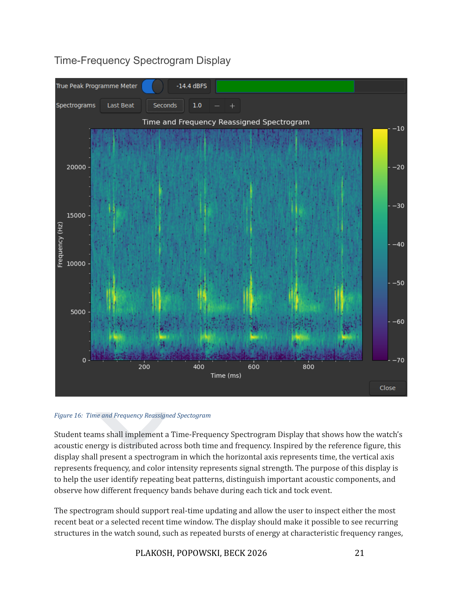

#### Case 1: 정상 시계 / Normal Watch

```
주파수 / Frequency
  2000 │░░████░░████░░████░░████  ← 일정한 에너지 띠 / consistent band
  1000 │░██████░█████░█████░████
       └──────────────────────→ 시간 / time
```

#### Case 2: 윤활 불량 진행 / Lubrication Degrading

```
주파수 / Frequency
  2000 │░░████░░████░░████░▓▓▓▓  ← 에너지 띠 이동 / band shifting up
  3000 │░░░░░░░░░░░░░░░░░░░▓▓▓▓  ← 고주파 성분 출현 / high-freq appears
       └──────────────────────→ 시간 / time
                              ↑ 이 시점부터 변화 / change starts here
```

#### Case 3: HPF 컷오프 검증 / HPF Cutoff Verification

```
주파수 / Frequency
   200 │░░░░░░████████████████  ← HPF 이전 / before HPF (200 Hz 이하 존재)
   200 │░░░░░░░░░░░░░░░░░░░░░░  ← HPF 이후 / after HPF (200 Hz 이하 제거)
       └──────────────────────→ 시간 / time
```

---

### 다른 그래프와의 연관 / Relationship with Other Graphs

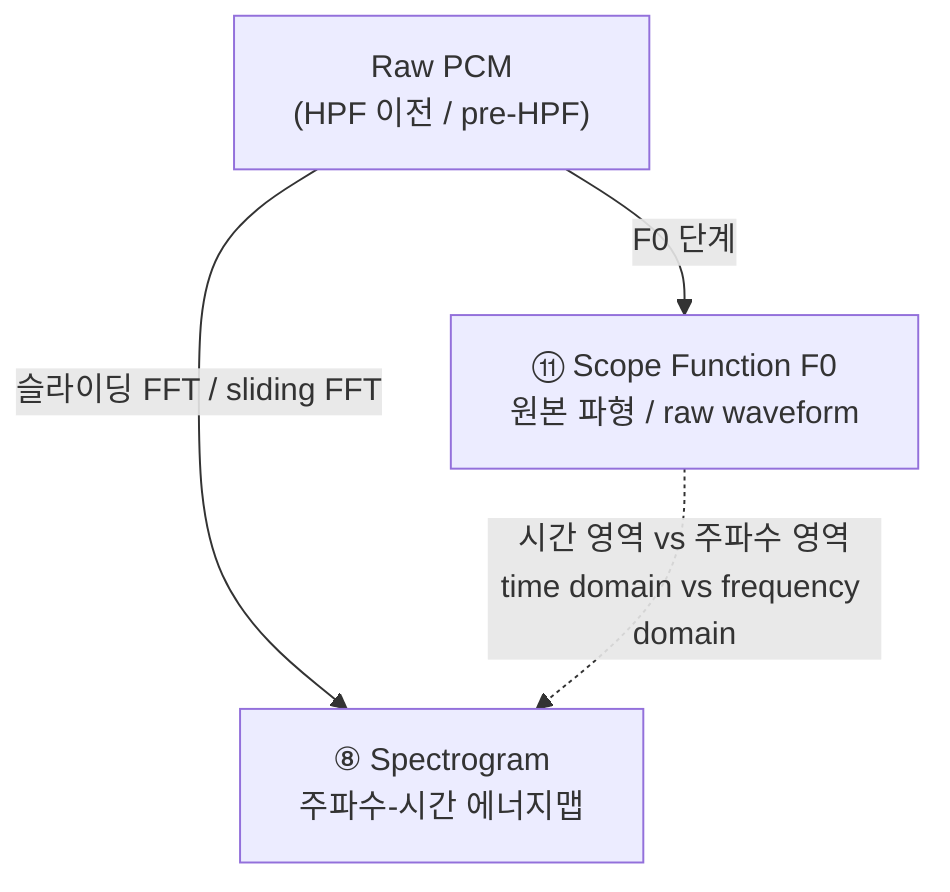
```mermaid
graph TD
    RAW["Raw PCM\n(HPF 이전 / pre-HPF)"]

    RAW -->|"슬라이딩 FFT / sliding FFT"| SPEC["⑧ Spectrogram\n주파수-시간 에너지맵"]
    RAW -->|"F0 단계"| SCF["⑪ Scope Function F0\n원본 파형 / raw waveform"]

    SCF -. "시간 영역 vs 주파수 영역\ntime domain vs frequency domain" .-> SPEC
```

| 연관 그래프 / Related Graph | 관계 / Relationship |
|---|---|
| **⑪ Scope Function F0** | Scope Function은 시간 영역에서 HPF 효과를 보여주고, Spectrogram은 주파수 영역에서 보여줌 / Together fully verify filter behavior |
| **QAR-01 실시간 성능** | FFT 연산은 시간 영역 처리보다 무거움 — RPi 성능 영향 평가 필요 / FFT is heavier — must profile on RPi |

---

## ⑨ Waveform Comparison Display with Timing Markers

### 그래프 목적 / Purpose

**한국어**

**여러 beat를 정렬·오버레이**하고 A/C 이벤트 타이밍을 ms 단위로 주석 표기하는 그래프.

Scope Mode(시각적 누적)와 달리, 각 beat의 t_AC(A→C 간격)를 명시적으로 표기하여 beat 간 **타이밍 일관성**을 정량적으로 확인.

> 건강한 시계 → 파형들이 거의 겹침; 마모/오염된 시계 → 파형들이 흩어짐

**English**

Shows **multiple beats aligned and overlaid** with A/C event markers annotated in milliseconds.

Unlike Scope Mode (visual stacking), this graph explicitly labels t_AC for each beat so beat-to-beat **timing consistency** is quantitatively visible.

> Healthy watch → waveforms nearly overlap; worn or dirty watch → waveforms spread apart

**화면 구조 / Screen Layout:**

```
┌──────────────────────────────────────────────────────────────────┐
│  Waveform Comparison (최근 20 beat 오버레이 / last 20 overlaid)  │
│                                                                  │
│   ╭╮╭╮          ╭╮╭╮  ← 파형 퍼짐 / waveform spread            │
│  ╭╯╰╯╰──────────╯╰╯╰╮                                           │
│                                                                  │
│  │←── 9.0 ms ──│     │← beat별 t_AC 주석 / per-beat t_AC label  │
│  ↑A              ↑C                                              │
│                                                                  │
│  t_AC  최소/min: 9.0 ms  최대/max: 9.4 ms  σ: 0.12 ms          │
└──────────────────────────────────────────────────────────────────┘
```

| 축 / Axis | 내용 / Content |
|---|---|
| X | A 이벤트 기준 경과 시간 (ms) / Elapsed time from A event (ms) |
| Y | 음향 진폭 / Acoustic amplitude |

---

### 소스 데이터 및 공식 / Source Data and Formulas

**한국어**

```
A 이벤트 기준으로 정렬된 PCM 버퍼 (멀티 beat 링 버퍼, ~20–50 beat 분량)
A 이벤트 타임스탬프   ← 수평 정렬 기준
C 이벤트 타임스탬프   ← t_AC 계산 및 마커 표시

t_AC_n = (C_n - A_n) / fs × 1000   [ms]

min_tAC = min(t_AC_1, ..., t_AC_N)
max_tAC = max(t_AC_1, ..., t_AC_N)
σ_tAC   = sqrt((1/N) × Σ(t_AC_i - mean)²)
```

**English**

```
PCM buffer aligned to A events (multi-beat ring buffer, ~20–50 beats deep)
A event timestamps   ← horizontal alignment anchor
C event timestamps   ← t_AC calculation and marker display

t_AC_n  = (C_n - A_n) / fs × 1000   [ms]

min_tAC = min(t_AC_1, ..., t_AC_N)
max_tAC = max(t_AC_1, ..., t_AC_N)
σ_tAC   = sqrt((1/N) × Σ(t_AC_i - mean)²)
```

---

### 그래프 예시 / Graph Examples

**실제 샘플 (Time Grapher Project Plan, Figure 17) / Real Sample:**

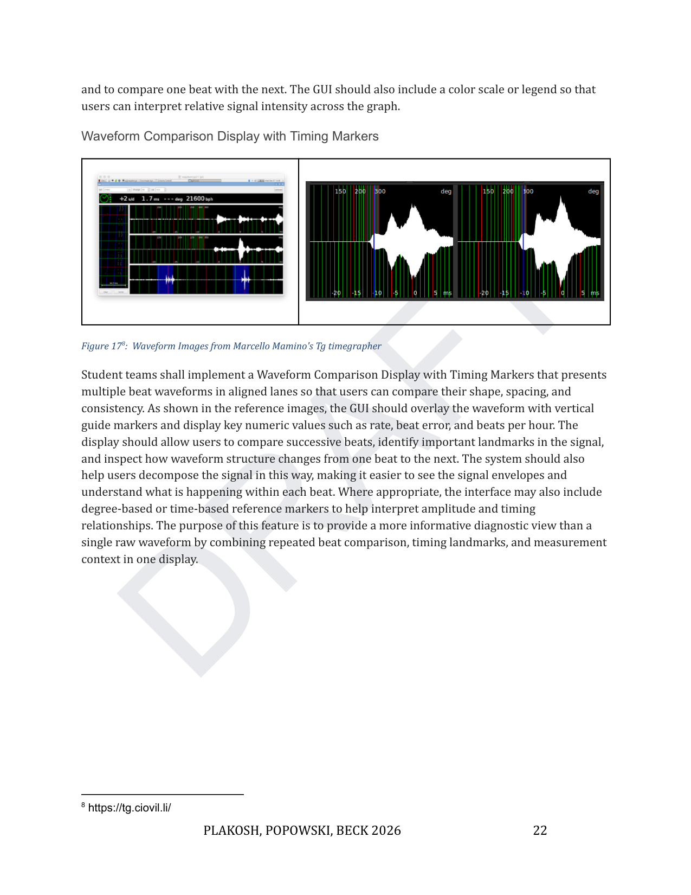

#### Case 1: 안정된 시계 / Stable Watch

```
  │╭╮──────────╭╮
  │╭╮──────────╭╮   ← 모든 beat 거의 일치 / all beats nearly identical
  │╭╮──────────╭╮
   ↑A          ↑C
  t_AC: 9.0~9.1 ms  σ=0.05 ms → 높은 Amplitude 정밀도 / high Amplitude precision
```

#### Case 2: C 이벤트 불규칙 / Irregular C Events

```
  │╭╮──────────╭╮
  │╭╮──────────────╭╮   ← C 위치가 beat마다 달라짐 / C position varies per beat
  │╭╮────────╭╮
   ↑A        ↑↑↑ C 위치 분산 / C position spread
  t_AC: 8.8~9.5 ms  σ=0.35 ms → Amplitude 신뢰도 하락 / Amplitude unreliable
```

#### Case 3: A 이벤트 오검출 / Misdetected A Events

```
  │ ╭╮──────────╭╮      ← 정상 beat / normal beat
  │  ╭╮─────────────╭╮  ← A 이벤트 늦게 검출됨 / A event detected late
   ↑A 위치가 불일치 → Rate, Beat Error 오차 유발 / A misaligned → Rate and BE errors
```

---

### 다른 그래프와의 연관 / Relationship with Other Graphs

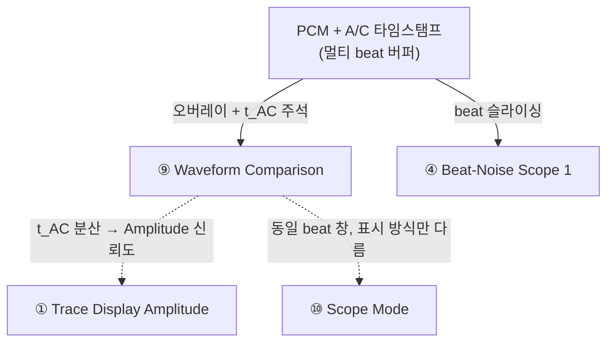
```mermaid
graph TD
    RAW["PCM + A/C 타임스탬프\n(멀티 beat 버퍼)"]

    RAW -->|"오버레이 + t_AC 주석"| WFC["⑨ Waveform Comparison"]
    RAW -->|"beat 슬라이싱"| SC1["④ Beat-Noise Scope 1"]

    WFC -. "t_AC 분산 → Amplitude 신뢰도" .-> TRC["① Trace Display Amplitude"]
    WFC -. "동일 beat 창, 표시 방식만 다름" .-> SCM["⑩ Scope Mode"]
```

| 연관 그래프 / Related Graph | 관계 / Relationship |
|---|---|
| **④ Beat-Noise Scope 1** | 동일 per-beat PCM 버퍼 사용. Scope 1 = 순차 스트립; Waveform Comparison = 오버레이 + t_AC 레이블 / Same buffer; different visualization |
| **① Trace / ② Vario (Amplitude)** | t_AC 일관성이 Trace와 Vario에 표시되는 Amplitude 값의 노이즈를 직접 결정 / t_AC consistency directly determines Amplitude noise |
| **⑦ Escapement Analyzer** | Escapement Analyzer = 단일 beat의 A/C 마커; Waveform Comparison = 수십 beat에 걸친 동일 마커 / Single beat vs multi-beat |
| **⑩ Scope Mode** | Scope Mode = 시각적 누적(안정성); Waveform Comparison = t_AC 정량 분석 / Visual vs quantitative |

---

## ⑩ Scope Mode with Synchronized Sweep Display

### 그래프 목적 / Purpose

**한국어**

**트리거 오실로스코프**: 매 A 이벤트마다 X축을 0으로 리셋하고, 모든 beat 스윕을 같은 창에 누적 표시.

Beat-Noise Scope 1이 beat를 *순차적*으로 보여준다면, Scope Mode는 beat들을 *적층*하여 안정성을 한눈에 파악.

```
고정 창 = beat 주기 (예: 28,800 BPH → 250 ms)

안정된 시계 — 스윕이 일치:           지터 있는 시계 — 스윕이 퍼짐:
  │  ╭╮         ╭╮                    │   ╭╮        ╭╮
  │  ╭╮         ╭╮  ← 겹침            │  ╭╮          ╭╮  ← 수평 흔들림
  │  ╭╮         ╭╮                    │    ╭╮       ╭╮
  └───────────────→ 0~250 ms          └───────────────→ 0~250 ms
```

**English**

A **triggered oscilloscope** — every beat is swept left to right in a fixed window, triggered (restarted) at each A event. All sweeps are stacked (persistence mode).

Beat-Noise Scope 1 shows beats *sequentially*; Scope Mode shows beats *stacked* to reveal stability at a glance.

**화면 구조 / Screen Layout:**

```
┌──────────────────────────────────────────────────────────────────┐
│  Scope Mode — Synchronized Sweep    [창 너비 / Window: 250 ms]  │
│                                                                  │
│   ╭╮              ╭╮                                            │
│  ╭╯╰╮────────────╭╯╰╮  ← 여러 스윕 누적 / multiple sweeps stacked│
│ ╭╯  ╰╮──────────╭╯  ╰╮                                         │
│                                                                  │
│ ↑A               ↑C                                             │
│ 0 ms            ~9 ms            250 ms                         │
└──────────────────────────────────────────────────────────────────┘
```

| 축 / Axis | 내용 / Content |
|---|---|
| X | A 이벤트 기준 경과 시간 (0 ~ beat 주기 ms) / Elapsed time from A event |
| Y | 음향 진폭 / Acoustic amplitude |

---

### 소스 데이터 및 공식 / Source Data and Formulas

**한국어 / English**

```
r.processed_pcm[]         ← 처리된 파형 (Scope 1과 동일 / same as Scope 1)
r.events[] A 타임스탬프   ← 트리거 포인트 (A 이벤트마다 X축 리셋)
창 너비 = 7200 / BPH 초   (1 beat 주기, 조정 가능 / one beat period, configurable)

r.processed_pcm[]         ← processed waveform
A timestamps              ← trigger points (reset X to 0 on each A event)
Window width = 7200 / BPH seconds
```

Beat-Noise Scope와 동일한 단기 PCM 링 버퍼로 충분 / Same short PCM ring buffer as Beat-Noise Scope.

---

### 그래프 예시 / Graph Examples

**실제 샘플 (Time Grapher Project Plan, Figure 18) / Real Sample:**

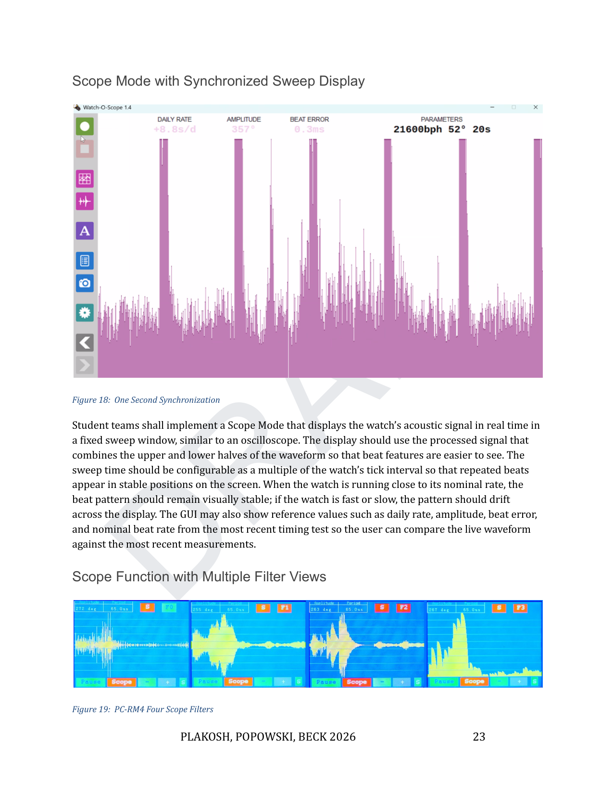

#### Case 1: 안정된 시계 / Stable Watch (스윕 완전 일치 / Sweeps Aligned)

```
  │   ╭──╮          ╭──╮
  │   ╭──╮          ╭──╮  ← 스윕들이 거의 완전히 겹침 / sweeps nearly identical
  └───────────────────────→ 0~250 ms
> 단일 선처럼 보임 → 지터 없음 / Appears as single line → no jitter
```

#### Case 2: 타이밍 지터 / Timing Jitter (스윕 수평 퍼짐 / Sweeps Spread Horizontally)

```
  │  ╭──╮           ╭──╮
  │   ╭──╮          ╭──╮  ← A 기준에서 수평 이동 / shifted from A trigger
  │    ╭──╮         ╭──╮
  └───────────────────────→ 0~250 ms
> 선이 두꺼워짐 → Beat Error 또는 기계적 불규칙성 / Line thickens → BE or mechanical irregularity
```

#### Case 3: 진폭 변동 / Amplitude Variation (스윕 수직 퍼짐 / Sweeps Spread Vertically)

```
  │   ╭────╮         ╭────╮   ← 높은 진폭 beat / high amplitude
  │   ╭──╮           ╭──╮     ← 낮은 진폭 beat / low amplitude
  └───────────────────────────→ 0~250 ms
> 선이 수직으로 두꺼워짐 → 태엽 소진 또는 진폭 불안정 / Thickens vertically → mainspring down
```

---

### 다른 그래프와의 연관 / Relationship with Other Graphs

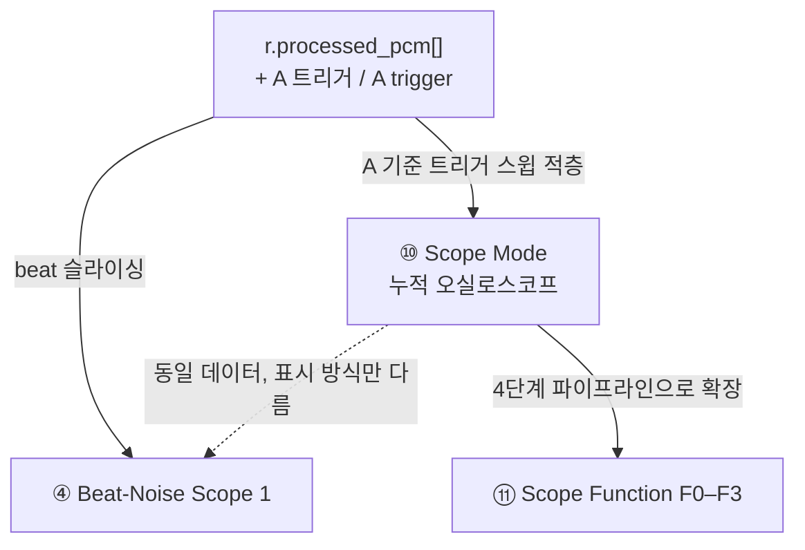
```mermaid
graph TD
    RAW["r.processed_pcm[]\n+ A 트리거 / A trigger"]

    RAW -->|"A 기준 트리거 스윕 적층"| SCM["⑩ Scope Mode\n누적 오실로스코프"]
    RAW -->|"beat 슬라이싱"| SC1["④ Beat-Noise Scope 1"]

    SCM -. "동일 데이터, 표시 방식만 다름" .-> SC1
    SCM -->|"4단계 파이프라인으로 확장"| SCF["⑪ Scope Function F0–F3"]
```

| 연관 그래프 / Related Graph | 관계 / Relationship |
|---|---|
| **④ Beat-Noise Scope 1** | 동일 데이터. Scope 1 = 순차 스트립(개별 이상 beat); Scope Mode = 누적 적층(지터/안정성). 함께 사용하면 "개별 이상 beat" vs "시스템적 지터" 구분 가능 |
| **⑪ Scope Function** | Scope Function = Scope Mode를 F0/F1/F2/F3 파이프라인 단계별로 4개 동시 표시 |
| **⑨ Waveform Comparison** | 둘 다 beat 오버레이. Scope Mode = 시각적 누적(안정성); Waveform Comparison = t_AC 정량 분석 |

---

## ⑪ Scope Function with Multiple Filter Views (F0 / F1 / F2 / F3)

### 그래프 목적 / Purpose

**한국어**

**동일한 beat 창을 DSP 파이프라인의 4단계에서 동시에** 보여주는 엔지니어용 진단 도구.

| 패널 / Panel | 단계 / Stage | 신호 / Signal |
|---|---|---|
| **F0** | 원본 입력 / Raw input | 필터링 전 Raw PCM — 마이크 원신호 |
| **F1** | HPF 이후 / After HPF | DC 차단 파형 (200 Hz 고역통과) |
| **F2** | 엔벨로프 이후 / After Envelope | 전파 정류 + LPF 스무딩 |
| **F3** | 검출 이후 / After Detection | 처리 파형 + 검출 임계값 + A/C 이벤트 마커 |

**English**

Shows **4 simultaneous panels** of the same beat window at each DSP pipeline stage. An engineer's diagnostic tool.

| Panel | Stage | Signal |
|---|---|---|
| **F0** | Raw input | Float32 PCM before any filtering — raw microphone |
| **F1** | After HPF | DC-blocked waveform (200 Hz high-pass) |
| **F2** | After Envelope | Full-wave rectified + LPF smoothed |
| **F3** | After Detection | Processed waveform + onset threshold + A/C markers |

**화면 구조 / Screen Layout:**

```
┌─────────────────────────────────────────────────────────────────┐
│ F0: Raw PCM                                                     │
│  ~~~~~~~~~~~~~~~~~~~~~~~~~~~~~~~~~~~~~~~~~~~~~~~~~~~            │
├─────────────────────────────────────────────────────────────────┤
│ F1: HPF 이후 (200 Hz) / After HPF                               │
│  ~~~/\/\/\/\/\/\/\/\/\/\/\/\/\/\/\/\/\/\/\/\/\~~~               │
├─────────────────────────────────────────────────────────────────┤
│ F2: 엔벨로프 / Envelope                                         │
│         ╭╮                  ╭╮                                  │
│  ───────╯╰──────────────────╯╰──────                            │
├─────────────────────────────────────────────────────────────────┤
│ F3: 검출 / Detection (임계값 + 마커 / threshold + markers)       │
│         ╭╮                  ╭╮                                  │
│  ─ ─ ─ ─╯╰─── threshold ───╭╯╰─ ─ ─                            │
│         ↑A                 ↑C                                   │
└─────────────────────────────────────────────────────────────────┘
```

---

### 소스 데이터 및 공식 / Source Data and Formulas

**한국어**

5개 그래프 중 구현이 가장 어려움. F1/F2가 현재 `tg_process()` 내부에 은닉되어 있음.

| 패널 | 데이터 | 현재 접근 가능 여부 |
|---|---|---|
| F0 | 링 버퍼의 Raw float32 PCM | ✅ `tg_process()` 호출 전 접근 가능 |
| F1 | `tg_hpf_process()` 출력 | ❌ `tg_context_t` 내부 — **노출 필요** |
| F2 | `tg_envelope_process()` 출력 | ❌ `tg_context_t` 내부 — **노출 필요** |
| F3 | `r.processed_pcm[]` + `r.onset_threshold` | ✅ 이미 `tg_result_t`에 존재 |

**필요한 변경**: `tg_result_t`에 `hpf_pcm[]`과 `envelope_pcm[]` 출력 버퍼 추가 → `tg_process()` 내부에서 채움.

**English**

The hardest of the scope graphs to implement — F1 and F2 are currently hidden inside `tg_process()`.

| Panel | Data | Currently accessible? |
|---|---|---|
| F0 | Raw float32 PCM from ring buffer | ✅ Accessible before `tg_process()` |
| F1 | Output of `tg_hpf_process()` | ❌ Internal to `tg_context_t` — **must be exposed** |
| F2 | Output of `tg_envelope_process()` | ❌ Internal to `tg_context_t` — **must be exposed** |
| F3 | `r.processed_pcm[]` + `r.onset_threshold` | ✅ Already in `tg_result_t` |

**Required change**: add `hpf_pcm[]` and `envelope_pcm[]` output buffers to `tg_result_t`, populated inside `tg_process()`.

---

### 그래프 예시 / Graph Examples

**실제 샘플 (Time Grapher Project Plan, Figure 19) / Real Sample:**

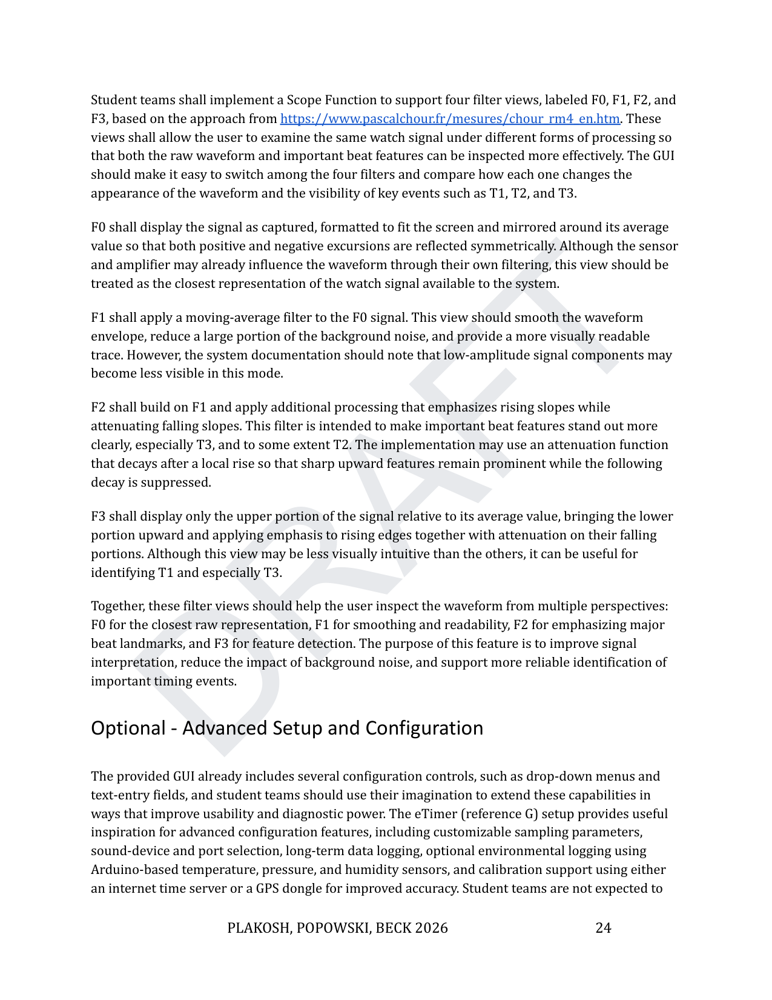

#### Case 1: 정상 검출 / Normal Detection

```
F0: ~~~╭╮~~~╭╮~~~  (tic/tac 원신호 명확 / tic/tac signal clear)
F1: ~~~╭╮~~~╭╮~~~  (HPF 후 저주파 제거, 형태 유지 / low-freq removed, shape preserved)
F2:    ╭╮   ╭╮     (엔벨로프 — A와 C 분리됨 / A and C separated)
F3:    ╭╮   ╭╮
    ─ ─╯╰─ ─╯╰─ ─  (임계값 정상 통과 / threshold correctly crossed)
       ↑A   ↑C      (올바른 위치에 마커 / markers at correct positions)
```

#### Case 2: AGC 활성화 / AGC Enabled (신호 왜곡 / Signal Distorted at F0)

```
F0: ~~╭──────────╮~~  (AGC가 진폭을 압축 → 파형 평탄화 / AGC compresses amplitude)
F1: ~~╭──────────╮~~  (HPF도 왜곡된 신호 그대로 / HPF sees distorted signal)
F2:   ╭──────────╮    (A와 C 경계 없어짐 / A and C merge into one blob)
F3:   ╭──────────╮
    ─ ─ ─ ─ ─ ─ ─ ─   (임계값 아래 → A/C 검출 실패 / below threshold → detection fails)
> 조치 / Action: RPi AlsaMixer에서 AGC 비활성화 / disable AGC in AlsaMixer
```

#### Case 3: HPF 컷오프 너무 높음 / HPF Cutoff Too High (F1에서 신호 손실)

```
F0: ~~~╭╮~~~╭╮~~~   (원신호 정상 / raw signal normal)
F1: ~~~╭╮~~~ ╮~~~   (HPF가 C 피크도 잘라냄 / HPF clips C peak)
F2:    ╭╮           (C 피크 소멸 / C peak disappears)
F3:    ╭╮
    ─ ─╯╰─ ─ ─ ─    (A만 검출, C 미검출 / A detected, C missed)
> 조치 / Action: HPF 컷오프 주파수 낮추기 / lower HPF cutoff frequency
```

#### Case 4: 엔벨로프 LPF 너무 느림 / Envelope LPF Too Slow (A/C 합체 at F2)

```
F0: ~~~╭╮ ╭╮~~~    (A, C 분리 / A and C separated)
F1: ~~~╭╮ ╭╮~~~    (HPF 후에도 분리 / separated after HPF)
F2:    ╭────╮       (LPF가 너무 느려서 A+C가 하나의 덩어리 / LPF too slow → merged blob)
F3:    ╭────╮
    ─ ─╯    ╰─ ─   (단일 이벤트로 잘못 검출 / misdetected as single event)
       ↑A only
> 조치 / Action: 엔벨로프 LPF 시상수 줄이기 / reduce envelope LPF time constant
```

---

### 다른 그래프와의 연관 / Relationship with Other Graphs

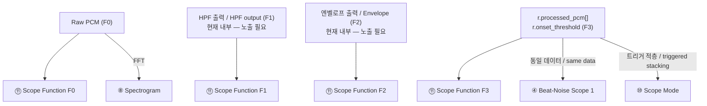
```mermaid
graph TD
    RAW["Raw PCM (F0)"]
    HPF["HPF 출력 / HPF output (F1)\n현재 내부 — 노출 필요"]
    ENV["엔벨로프 출력 / Envelope (F2)\n현재 내부 — 노출 필요"]
    RES["r.processed_pcm[]\nr.onset_threshold (F3)"]

    RAW --> SCF_F0["⑪ Scope Function F0"]
    HPF --> SCF_F1["⑪ Scope Function F1"]
    ENV --> SCF_F2["⑪ Scope Function F2"]
    RES --> SCF_F3["⑪ Scope Function F3"]

    RAW -->|"FFT"| SPEC["⑧ Spectrogram"]
    RES -->|"동일 데이터 / same data"| SC1["④ Beat-Noise Scope 1"]
    RES -->|"트리거 적층 / triggered stacking"| SCM["⑩ Scope Mode"]
```

| 연관 그래프 / Related Graph | 관계 / Relationship |
|---|---|
| **⑩ Scope Mode** | Scope Function = Scope Mode를 F0/F1/F2/F3 파이프라인 단계별로 4개 동시 표시 |
| **④ Beat-Noise Scope 1** | F3 데이터 공유. Scope 1은 단일 단계; Scope Function은 4단계 동시 비교 / Shared F3 data; Scope 1 shows one stage, Scope Function shows all four |
| **⑧ Spectrogram** | Spectrogram은 F0의 주파수 영역 관점; Scope Function F0/F1은 시간 영역 관점 / Frequency vs time domain views of same signal |
| **QAR-03 측정 정확도** | T1/T3 검출이 신호 형태 대비 어느 위치에서 일어나는지 직접 보여주는 가장 핵심적인 정확도 디버깅 도구 / Primary accuracy debugging tool |

---

## 소스 데이터 요약 / Data Source Summary

| # | 그래프 / Graph | 주요 데이터 / Primary Data | 신규 버퍼 / New Buffer | 핵심 구현 갭 / Key Gap |
|---|---|---|---|---|
| ① | Trace Display | A/C 타임스탬프 | 없음 / None | 기존 구현 확인 / Verify existing |
| ② | Vario | Trace 시계열 | 없음 / None | 통계 집계 + 바 렌더러 / Stats + bar renderer |
| ③ | Multi-Position | 자세별 Vario 값 | 자세 데이터 저장 / Per-position storage | 자세 전환 UI + 비교 테이블 / Position UI + comparison table |
| ④ | Beat-Noise Scope 1&2 | `r.processed_pcm[]` + A 이벤트 | 단기 per-beat 링 버퍼 / Short per-beat ring buffer | beat 슬라이싱 + 스트립 렌더러 / Beat slicing + strip renderer |
| ⑤ | Beat Error Display | A 타임스탬프 연속열 | 없음 / None | BE 계산 + tic/tac 분리 Trace / BE calc + tic/tac split trace |
| ⑥ | Long-Term Performance | A/C 타임스탬프 (장기) | 장기 다운샘플 버퍼 / Long-term downsample buffer | 다운샘플링 + 3패널 렌더러 / Downsampling + 3-panel renderer |
| ⑦ | Escapement Analyzer | `r.processed_pcm[]` + A/C 타임스탬프 | 단기 per-beat 링 버퍼 / Short per-beat ring buffer | 마커 라인 + ms 레이블 렌더러 / Marker lines + ms label renderer |
| ⑧ | Spectrogram | Raw PCM | 슬라이딩 FFT 버퍼 / Sliding FFT buffer | FFT 라이브러리 (FFTW3 제거됨 / removed) |
| ⑨ | Waveform Comparison | PCM + A/C 타임스탬프 | 멀티 beat PCM 히스토리 (~50 beat) | 오버레이 렌더러 + t_AC 주석 / Overlay renderer + t_AC annotation |
| ⑩ | Scope Mode | `r.processed_pcm[]` + A 트리거 | Beat-Noise Scope와 공유 / Shared | 트리거 스윕 렌더링 / Triggered sweep rendering |
| ⑪ | Scope Function | F0: Raw / F1: HPF출력 / F2: Env출력 / F3: `r.processed_pcm[]` | 없음 (기존 재사용) / None | **F1, F2를 `tg_context_t`에서 노출 / Expose F1, F2** |

---

## 범례 / Legend

| 화살표 / Arrow | 의미 / Meaning |
|---|---|
| 실선 `→` / Solid | A의 계산 결과가 B의 입력 데이터로 사용됨 / A's output is used as B's input |
| 점선 `-.->` / Dashed | 직접 데이터를 주고받지 않지만 동일 공식 또는 동일 데이터를 다른 방식으로 표현 / No direct data flow, but same formula or data expressed differently |

---

## 베이스코드 현황 분석 / Baseline Code Analysis (TimeGrapher_v10.5)

> 베이스코드를 직접 실행(시뮬레이션 모드)하여 확인한 현재 구현 상태와 11개 요구 그래프와의 비교  
> Analysis of the current implementation confirmed by running the baseline in simulation mode, compared against the 11 required graphs

### 현재 구현 구조 / Current Implementation Structure

현재 베이스코드는 **2개 탭, 3개 시각적 출력**으로 구성된다.  
The current baseline consists of **2 tabs with 3 visual outputs**.

```
Tab 1: Rate/Scope
  ├── RatePlot  (상단 / upper) — QCustomPlot scatter
  └── ScopePlot (하단 / lower) — QCustomPlot line + markers

Tab 2: Sound Print
  └── SoundImage — SoundImageRenderer (custom 2D image)
```

---

### Tab 1 — Rate/Scope 실행 화면 / Running Screenshot


#### 상단: RatePlot / Upper: RatePlot

**한국어**

- Graph 0 (빨간 점): Tic beat 타이밍 오차
- Graph 1 (파란 점): Toc beat 타이밍 오차
- Y축: 타이밍 오차 ms (±10 ms로 wrap), X축: beat 번호 (0~250 순환)
- 현재 화면: 점들이 아래로 기울어짐 → RATE -15.3 s/d (느린 시계)

**English**

- Graph 0 (red dots): Tic beat timing error
- Graph 1 (blue dots): Toc beat timing error
- Y-axis: timing error in ms (wrapped to ±10 ms), X-axis: beat index (0–250 circular)
- Current screen: dots slope downward → RATE -15.3 s/d (slow watch)

#### 하단: ScopePlot / Lower: ScopePlot

**한국어**

- 파란선 = `r.processed_pcm[]` — HPF + envelope 처리된 파형
- 빨간선 = `r.onset_threshold` — 검출 임계값
- A 이벤트: 초록 수직 점선 + A-A 간격 수평 화살표 + ms 레이블 (예: 166.71 ms)
- C 이벤트: 빨간 수직 점선 + `t_AC (ms)` + `Amplitude (°)` 텍스트 (예: 9.6 ms / 289°)
- 연속 스크롤 방식 — beat 단위 분리 없음

**English**

- Blue line = `r.processed_pcm[]` — HPF + envelope processed waveform
- Red line = `r.onset_threshold` — detection threshold
- A events: green vertical dashed line + A-A interval horizontal arrow + ms label (e.g. 166.71 ms)
- C events: red vertical dashed line + `t_AC (ms)` + `Amplitude (°)` text (e.g. 9.6 ms / 289°)
- Continuous scroll mode — no per-beat slicing

---

### Tab 2 — Sound Print 실행 화면 / Running Screenshot


**한국어**

- 2D 이미지: 열(column) = 1 beat 주기, 행(row) = beat 내 시간축
- 빨간 픽셀 강도 = 신호 세기 (자동 peak 정규화 + gamma 보정)
- 초록 3×3 마커 = A 이벤트, 파란 3×3 마커 = C 이벤트
- BPH 검출 전: 렌더링 없음 (샘플 카운트만 진행)
- 요구 11개 그래프 목록에 없는 Sound Print 고유 형식

**English**

- 2D image: column = one beat period, row = time within beat
- Red pixel intensity = signal strength (auto peak normalization + gamma correction)
- Green 3×3 marker = A event, Blue 3×3 marker = C event
- Before BPH lock: no rendering (sample count only)
- Unique Sound Print format not listed in the 11 required graphs

---

### 베이스코드 ↔ 11개 그래프 매핑 / Baseline ↔ 11-Graph Mapping

| 현재 / Current | 관련 요구 그래프 / Related Required Graph | 주요 갭 / Key Gap |
|---|---|---|
| RatePlot (ms, beat 번호) | ① Trace Display — Rate 부분 | 단위 ms → s/d 변환, X축 beat번호 → 경과 시간(분), Amplitude 서브플롯 없음 |
| ScopePlot (연속 스크롤) | ⑦ Escapement Analyzer (가장 유사) | beat 단위 슬라이싱 없음, X축이 A 기준 0 ms가 아닌 절대 샘플 인덱스 |
| ScopePlot (processed_pcm + threshold) | ⑪ Scope Function **F3 패널 단독** | F0/F1/F2 3개 패널 없음 |
| ScopePlot (beat 슬라이싱 추가 시) | ④ Beat-Noise Scope, ⑩ Scope Mode | per-beat PCM 링 버퍼 미구현 |
| SoundImage | ④ Beat-Noise Scope와 목적 유사 | 요구 목록에 없는 Sound Print 형식; beat strip 방향 다름 |
| 계산만 존재 (텍스트 표시) | ②③⑤⑥⑦ | Rate/BE/Amplitude 공식은 동작 중 — 그래프 레이어만 없음 |
| 미구현 | ⑧ Spectrogram | Raw PCM → FFT 경로 없음; FFTW3 주석 처리됨 |
| 미구현 | ⑨ Waveform Comparison | 멀티 beat PCM 히스토리 버퍼 없음 |

**핵심 관찰 / Key Observation**

**한국어**

계산 로직(Rate / Beat Error / Amplitude 공식)은 이미 `MainWindow.cpp`에서 동작 중이다.  
구현 과제의 본질은 **새로운 공식이 아니라 새로운 그래프 레이어 추가**이다.  
단, 모든 계산이 `ProcessSamples()` 하나에 집중되어 있어 Extensibility QA 위험이 있다.

**English**

The computation logic (Rate / Beat Error / Amplitude formulas) already works inside `MainWindow.cpp`.  
The implementation task is fundamentally about **adding new graph layers, not new formulas**.  
However, all computation is concentrated in a single `ProcessSamples()` function — an Extensibility QA risk.

---

### Scope Function F0~F3 상세 분석 / Scope Function F0–F3 Detail Analysis

> Figure 19 (PC-RM4 Four Scope Filters) 레퍼런스 이미지 기반 분석  
> Analysis based on Figure 19 (PC-RM4 Four Scope Filters) reference image


각 패널의 실제 파형 특징 / Observed waveform characteristics per panel:

| 패널 / Panel | 실제 파형 특징 / Observed Waveform | 데이터 접근 가능 여부 / Data Accessibility |
|---|---|---|
| **F0** Raw PCM | 노이즈 많음, 복잡한 고주파 성분, beat 버스트 구분 어려움 / Noisy, rich high-freq content, burst hard to distinguish | ✅ `tg_process()` 전 `mInputBlock` |
| **F1** HPF 후 | DC 제거로 0 기준 정렬, A/C 버스트 보이기 시작, 진동 풍부 / DC removed, A/C bursts emerge, still oscillatory | ❌ `tg_context_t` 내부 은닉 / hidden inside `tg_context_t` |
| **F2** Envelope 후 | A/C 두 피크 명확히 분리, 매끄러운 단방향 파형 / A/C peaks clearly separated, smooth unipolar waveform | ❌ `tg_context_t` 내부 은닉 / hidden inside `tg_context_t` |
| **F3** Detection 후 | 임계값 라인 + A/C 마커, 가장 깔끔한 두 피크 / Threshold line + A/C markers, cleanest two peaks | ✅ `r.processed_pcm[]` + `r.onset_threshold` |

**현재 ScopePlot = F3 패널 단독을 연속 스크롤로 표시**  
**Current ScopePlot = F3 panel only, shown as continuous scroll**

**F1/F2 노출을 위한 필요 변경 / Required change to expose F1/F2:**

```cpp
// Timegrapher.h — tg_result_t에 추가 필요 / fields to add to tg_result_t
typedef struct {
    /* ... 기존 필드 / existing fields ... */
    float    *processed_pcm;      // F3 ✅ 이미 존재 / already present
    size_t    processed_pcm_len;

    float    *hpf_pcm;            // F1 ❌ 추가 필요 / must add
    size_t    hpf_pcm_len;

    float    *envelope_pcm;       // F2 ❌ 추가 필요 / must add
    size_t    envelope_pcm_len;
} tg_result_t;
```

`Timegrapher.cpp` 내부 `tg_process()`에서 HPF 및 Envelope 처리 시 해당 버퍼에 복사하는 로직 추가 필요.  
Inside `Timegrapher.cpp`, `tg_process()` must copy HPF and Envelope outputs into these new buffers at each processing stage.
