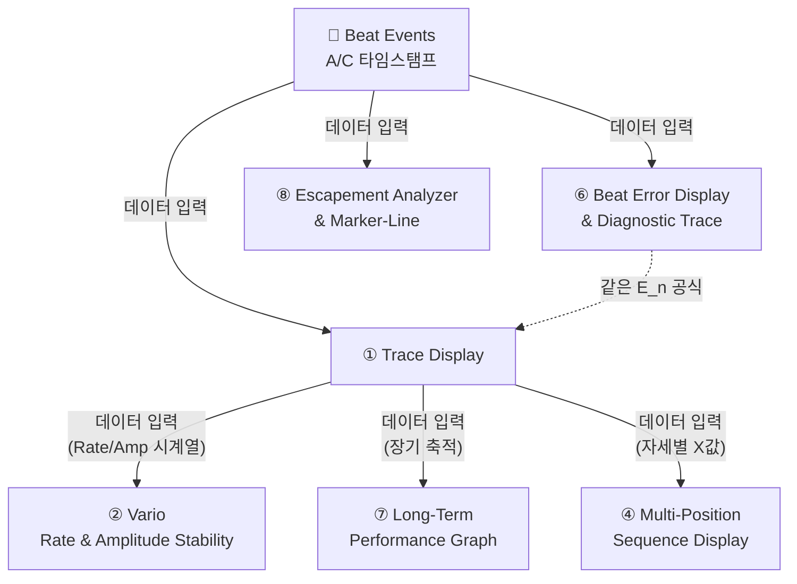
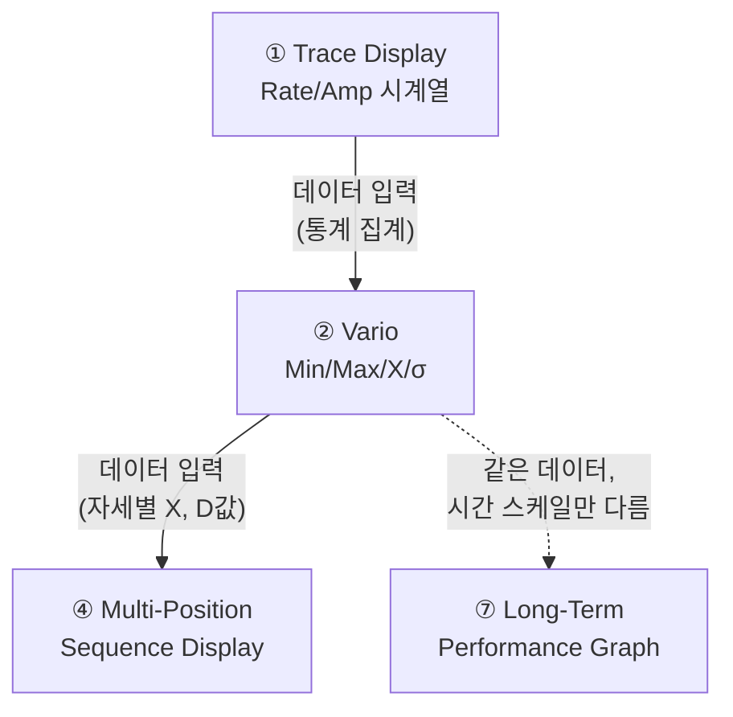
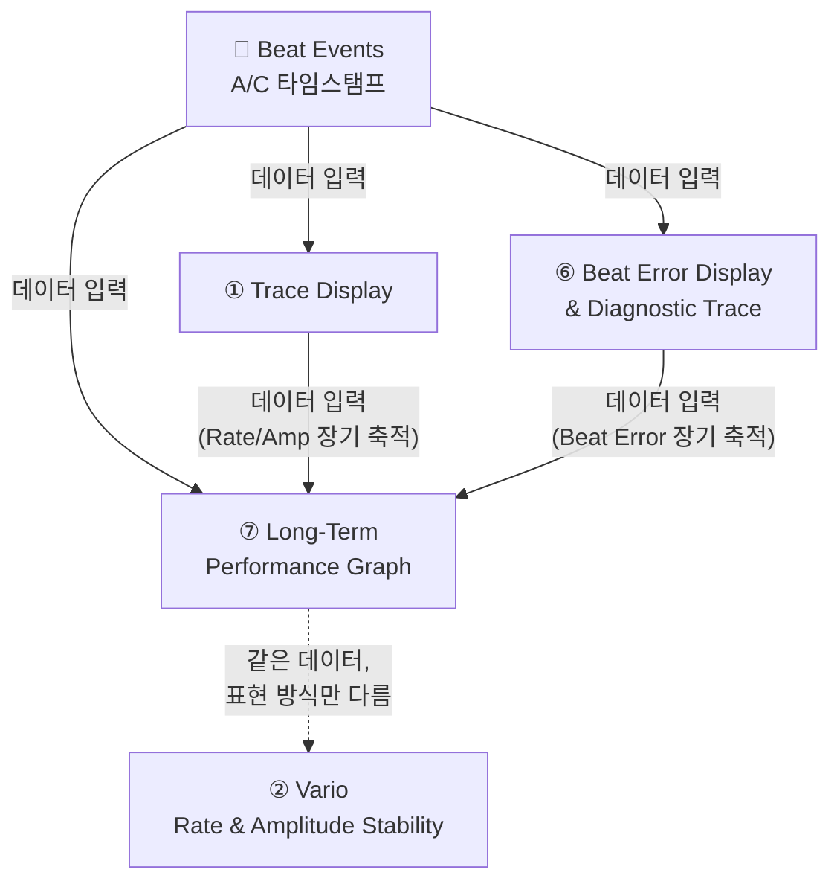

# TimeGrapher 그래프 분석

> 11개 그래프 중 3개 (Trace Display, Vario, Long-Term Performance Graph) 상세 분석

---

## 3개 그래프 전체 비교 요약

| | Trace Display | Vario | Long-Term Performance Graph |
|---|---|---|---|
| **목적** | 실시간 패턴 진단 | 세션 통계 요약 | 장기 추이 모니터링 |
| **시간 스케일** | 수 분 | 현재 세션 누적 | 수 시간~수일 |
| **표시 방식** | 연속 점 그래프 | 가로 막대 + 통계 수치 | 3단 시계열 |
| **측정 항목** | Rate + Amplitude | Rate + Amplitude | Rate + Amplitude + **Beat Error** |
| **진단 질문** | "지금 어떤 패턴인가?" | "얼마나 일정한가?" | "시간이 지나며 어떻게 변하나?" |
| **데이터 소스** | Beat event 직접 | Trace 시계열 집계 | Beat event 직접 (장기 저장) |

---

## 1. Trace Display

### 그래프 목적

시계의 **Rate(오차율)** 와 **Amplitude(진폭)** 를 실시간으로 연속 기록해서, 시계가 빠른지/느린지, 안정적인지, 기계적 결함이 있는지를 **시각적 패턴**으로 진단하는 그래프.

> 핵심: 오디오 진폭이 아니라 **타이밍 오차의 누적값**을 점으로 찍는 것

**화면 구조:**

```
┌─────────────────────────────────────────────────────────────────┐
│  1.5 s/d ✓    0.0 ms ✓    299° ✓              [Trace]          │
├─────────────────────────────────────────────────────────────────┤
│  +6 s/d │                                                       │
│  +4 s/d │  . . . . . . . . . . . . . . . . . . . . . .        │
│  +2 s/d │                                                       │  ← Rate 그래프
│   0 s/d ├ ─ ─ ─ ─ ─ ─ ─ ─ ─ ─ ─ ─ ─ ─ ─ ─ ─ ─ ─ ─ ─        │
│  -2 s/d │                                                       │
│  -4 s/d │                                                       │
│         └──────┬──────┬──────┬──────┬──────┬──────────         │
│              2:00   4:00   6:00   8:00  10:00 min              │
├─────────────────────────────────────────────────────────────────┤
│   315°  │                                                       │
│   310°  │                                                       │
│   305°  │  . . . . . . . . . . . . . . . . . . . . . .        │  ← Amplitude 그래프
│   300°  │                                                       │
│   295°  │                                                       │
│   290°  │                                                       │
│   285°  └──────┬──────┬──────┬──────┬──────┬──────────         │
│              2:00   4:00   6:00   8:00  10:00 min              │
└─────────────────────────────────────────────────────────────────┘
```

| 축 | 내용 |
|---|---|
| X (공통) | 경과 시간 (분) |
| Y (상단) | Rate 편차 (s/d) |
| Y (하단) | Balance wheel 진폭 (°) |

---

### 소스 데이터 및 공식

**입력 데이터:** Beat event 타임스탬프 — T1(A): 틱 정밀 타이밍, T3(C): 진폭 계산용

**Rate 계산:**

```
E_n = T_measured - (T_start + n × I_target)

  T_measured : 실제 beat 감지 시각
  T_start    : 첫 번째 beat 시각 (기준점)
  n          : beat 번호 (0, 1, 2, ...)
  I_target   : 이상적 beat 간격 = 3600 / BPH (초)

m = E_n - E_(n-1)                        ← beat 간 오차 변화량
Rate = -(m / I_target) × 86400  [s/d]
```

**Amplitude 계산:**

```
t_AC = T_C - T_A     ← 같은 beat의 A→C 이벤트 간격 (초)

Amp = (3600 × λ) / (π × BPH × t_AC)  [°]

  λ   : lift angle (°), 보통 52°
  BPH : beats per hour
```

**화면 Y좌표 (Wrap 처리):**

```
Y_screen = E_n  mod  PlotHeight
```

---

### 그래프 예시

#### Case 1: 정상 시계

```
Rate
 +4│  . . . . . . . . . . . . . . . . .
 +2│
  0│──────────────────────────────────── (기준선)
 -2│
   └────────────────────────────────── time(min) →

Amplitude
310│  . . . . . . . . . . . . . . . . .
300│
290│
   └────────────────────────────────── time(min) →
```
> Rate 점이 수평 띠 안에 안정. Amplitude 270~310° 유지

#### Case 2: 빠른 시계 (+90 s/d)

```
Rate
+90│                              . . .
   │                    . . . . .
   │          . . . . .
   │. . . . .
  0│──────────────────────────────────── (기준선)
   └────────────────────────────────── time →
```
> 점들이 위로 급경사 → 하루 90초 빠름

#### Case 3: 느린 시계 (-90 s/d)

```
Rate
  0│──────────────────────────────────── (기준선)
   │. . . . .
   │          . . . . .
   │                    . . . . .
-90│                              . . .
   └────────────────────────────────── time →
```
> 점들이 아래로 급경사 → 하루 90초 느림

#### Case 4: Beat Error 있음 (두 줄 분리)

```
Rate
   │  . . . . . . . . . . . .   ← tic 위상
   │
   │. . . . . . . . . . . .     ← tac 위상
  0│────────────────────────────
```
> tic/tac 두 줄로 분리됨 → Beat Error 존재  
> 두 줄 간격 = Beat Error × 2  
> **조치:** Beat Error 먼저 조정 → Rate 재조정

#### Case 5: Gear Train 결함 (규칙적 사인파)

```
Rate
 +6│      .       .       .
 +3│    .   .   .   .   .   .
  0│──.───────.───────.──────── (기준선)
 -3│.   .   .   .   .   .
   └────────────────────────── time →
      ←→ 이 주기 = escape wheel 1회전
```
> 규칙적 사인파 = escape wheel 결함  
> **조치:** gear train 수리/교체

#### Case 6: Amplitude 지속 감소 (윤활 부족 / 태엽 소진)

```
Amplitude
320│. . .
310│       . . .
300│             . . .
290│                   . . .
270│─ ─ ─ ─ ─ ─ ─ ─ ─ ─ ─ ─ ─  ← 정상 하한 경보선
   └────────────────────────── time →
```
> 단조 감소 → 270° 이하로 내려가면 GUI 경보  
> **조치:** 윤활 또는 태엽 점검

#### Case 7: 불규칙 산만한 패턴

```
Rate
 +6│  .    .  .     .  .
 +3│.    .      . .      .  .
  0│──────────────────────────
 -3│   .     .    .    .
 -6│       .          .
   └────────────────────────── time →
```
> 점이 흩어짐 → 신호 노이즈, 측정 불안정, 진폭 부족  
> **조치:** 오버홀

---

### 패턴 읽기 요약

| 관찰 내용 | 진단 |
|---|---|
| 수평에 가까운 좁은 선 | 정상, 안정적 |
| 위로 올라가는 기울기 | 시계가 빠름 (Fast) |
| 아래로 내려가는 기울기 | 시계가 느림 (Slow) |
| 두 선으로 분리 | Beat Error 있음 |
| 사인파 형태 | Gear train / escape wheel 결함 |
| Amplitude 지속 감소 | 태엽 소진 또는 윤활 불량 |
| 불규칙하게 산만한 점 | 신호 노이즈, 측정 불안정 |

---

### 다른 그래프와의 연관



| 연관 그래프 | 관계 |
|---|---|
| **Beat Error Display & Diagnostic Trace** | 동일한 `E_n` 공식 사용. Trace는 누적 오차 시각화, Beat Error는 tic/tac 비대칭 진단 |
| **Rate & Amplitude Stability (Vario)** | Trace가 생성하는 Rate/Amp 시계열을 실시간 통계(Min/Max/σ)로 집계 |
| **Long-Term Performance Graph** | Trace 데이터를 장시간 축적하여 수 시간 추이로 표시. Beat Error까지 추가 |
| **Multi-Position Sequence Display** | 각 자세(CH, CB, 9H…)마다 Trace를 측정 후 결과를 하나의 표로 요약 |
| **Escapement Analyzer & Marker-Line** | Trace의 A/C 마커를 확대해서 ms 단위로 정밀 분석하는 하위 뷰 |

**범례**

| 화살표 | 의미 |
|---|---|
| 실선 `→` | A의 계산 결과가 B의 입력 데이터로 사용됨 |
| 점선 `-.->` | 직접 데이터를 주고받지 않지만, 동일 공식 또는 동일 데이터를 다른 방식으로 표현 |

---

## 2. Rate and Amplitude Stability Over Time (Vario)

### 그래프 목적

측정 세션 동안 축적된 Rate/Amplitude 값의 **통계 분포**를 실시간으로 보여주는 가로 막대형 요약 뷰.

순간 값이 아니라 **얼마나 일정하게 유지되는가** — 즉 안정성과 조정 품질을 판단하는 것이 목적.

> Min/Max 폭이 좁을수록 안정적, σ가 작을수록 일관성 높음

**화면 구조:**

```
┌─────────────────────────────────────────────────────────────────┐
│  2.0 s/d ✓    0.0 ms ✓    297° ✓    01        [Vario]          │
├─────────────────────────────────────────────────────────────────┤
│                         1:16                                    │  ← 경과 시간
│                                                                 │
│  Rate     Min  -0.8 s/d    X  1.5 s/d    σ  1.0 s/d    Max  3.3 s/d │
│                                                                 │
│  -10  -5    0    5    10   15                                   │
│            [██████████] ↑Min  ↑X  ↑Max                         │
│             green range                                         │
│                                                                 │
│  Amplitude  Min  291°    X  298°    σ  3°    Max  303°          │
│                                                                 │
│  180   210   240   270   300   330                              │
│                     [████] ↑Min  ↑X  ↑Max                      │
│                      green range                                │
└─────────────────────────────────────────────────────────────────┘
```

| 요소 | 의미 |
|---|---|
| X축 | Rate(s/d) 또는 Amplitude(°) 값 범위 |
| 초록 영역 | 허용 범위 (Rate: ±5~15 s/d, Amplitude: 270~310°) |
| 파란 화살표 | Min / Max 측정값 위치 |
| 빨간 화살표 | 평균값(X) 위치 |
| 상단 숫자 | 경과 시간 (예: 1:16 = 1분 16초 측정) |

---

### 소스 데이터 및 공식

**입력 데이터:** Trace Display가 축적한 Rate/Amplitude 시계열 `{Rate_1, ..., Rate_N}`, `{Amp_1, ..., Amp_N}`

```
Min   = min(Rate_1, ..., Rate_N)
Max   = max(Rate_1, ..., Rate_N)
X     = (1/N) × Σ Rate_i                      ← 평균
σ     = sqrt((1/N) × Σ(Rate_i - X)²)          ← 표준편차

동일 공식을 Amplitude에도 적용
```

---

### 그래프 예시

#### Case 1: 잘 조정된 시계

```
Rate 바
-10   -5    0    5    10   15
            [██████]
              ↑     ↑
           Min=-0.5  Max=+2.0   X=+0.8  σ=0.6
```
> Min~Max 폭 좁음, σ 작음 → 안정적, 조정 양호

#### Case 2: Rate 불안정 (조정 필요)

```
Rate 바
-10   -5    0    5    10   15
  [████████████████████████]
  ↑                        ↑
Min=-9.0               Max=+12.0   X=+1.5  σ=5.2
```
> Min~Max 폭 매우 넓음, σ 큼 → 불안정, 재조정 필요

#### Case 3: 자세 변화에 민감한 시계

```
자세 1 (Crown-Up):   Rate 바   [██]       Min=+1, Max=+3
자세 2 (Crown-Down): Rate 바   [████████] Min=-8, Max=+2
```
> 자세별 Min/Max 차이 큼 → balance wheel 편심 또는 무브먼트 문제

#### Case 4: Amplitude 정상 범위 이탈

```
Amplitude 바
 180   210   240   270   300   330
         [██████]
         ↑             ↑
      Min=230°        Max=255°   ← 270° 정상 하한 아래
```
> Amplitude 전체가 정상 범위(270~310°) 밖 → 경보 표시

---

### 다른 그래프와의 연관



| 연관 그래프 | 관계 |
|---|---|
| **Trace Display** | Vario의 직접 데이터 소스. Trace 시계열 → Vario 통계 |
| **Multi-Position Sequence Display** | 각 자세에서 Vario를 측정 → X(평균)와 D(Max-Min)를 테이블로 합산 |
| **Long-Term Performance Graph** | Vario는 현재 세션 통계 스냅샷, Long-Term은 동일 값의 시간 추이 |

**범례**

| 화살표 | 의미 |
|---|---|
| 실선 `→` | A의 계산 결과가 B의 입력 데이터로 사용됨 |
| 점선 `-.->` | 직접 데이터를 주고받지 않지만, 동일 공식 또는 동일 데이터를 다른 방식으로 표현 |

---

## 3. Long-Term Performance Graph

### 그래프 목적

수 시간에 걸쳐 Rate, Amplitude, Beat Error **3개 지표를 동시에** 장기 추이 그래프로 기록.

단기 측정으로는 보이지 않는 현상을 포착하는 것이 목적:
- 태엽 소진에 따른 Amplitude 점진 감소
- 날짜 변경 기구 충격에 따른 Rate 스파이크
- 온도/자성 변화에 따른 장기 드리프트
- Beat Error의 시간에 따른 변화 추이

**화면 구조:**

```
┌─────────────────────────────────────────────────────────────────┐
│  DAILY RATE -2.0 s/d    AMPLITUDE 281°    BEAT ERROR 0.6ms     │
│  PARAMETERS  21600bph  51°  60s                                 │
├─────────────────────────────────────────────────────────────────┤
│ [1단 - Daily Rate]                         (분홍/빨간 라인)    │
│  +5│─ ─ ─ ─ ─ ─ ─ ─ ─ ─ ─ ─ ─ ─ ─  ← 허용 상한             │
│    │ ~~~~~~~~~~~~~~~~~~~~~~~~~~~~~~~~~~~                        │
│   0│                                                            │
│  -5│─ ─ ─ ─ ─ ─ ─ ─ ─ ─ ─ ─ ─ ─ ─  ← 허용 하한             │
│    └──1:00──2:00──3:00──4:00──5:00──6:00──7:00──8:00           │
├─────────────────────────────────────────────────────────────────┤
│ [2단 - Amplitude]                          (파란 라인)         │
│ 280│                                                            │
│ 270│─ ─ ─ ─ ─ ─ ─ ─ ─ ─ ─ ─ ─ ─ ─  ← 정상 하한             │
│ 260│ ~~~~~~~~~~~~~~~~~~~~~~~~~~~~~~                             │
│    └──1:00──2:00──3:00──4:00──5:00──6:00──7:00──8:00           │
├─────────────────────────────────────────────────────────────────┤
│ [3단 - Beat Error]                         (초록 라인)         │
│ 0.9│                                                            │
│ 0.6│─ ─ ─ ─ ─ ─ ─ ─ ─ ─ ─ ─ ─ ─ ─  ← 허용 상한             │
│    │ ~~~~~~~~~~~~~~~~~~~~~~~~~~~~~~~~~~                         │
│ 0.3│                                                            │
│    └──1:00──2:00──3:00──4:00──5:00──6:00──7:00──8:00           │
└─────────────────────────────────────────────────────────────────┘
```

| 축 | 내용 |
|---|---|
| X (공통) | 경과 시간 (시간 단위) |
| Y 1단 | Rate 편차 (s/d) |
| Y 2단 | Amplitude (°) |
| Y 3단 | Beat Error (ms) |

---

### 소스 데이터 및 공식

**입력 데이터:** Beat event로부터 실시간 계산된 `(Rate_i, Amp_i, BE_i)` 시계열

**Rate, Amplitude:** Trace Display와 동일한 공식 사용

**Beat Error:**

```
t1 = A_1 - A_0  (첫 번째 half-beat 간격)
t2 = A_2 - A_1  (두 번째 half-beat 간격)

BE = (t1 - t2) / 2  [ms]

sample index 기반:
  t1 = (n_1 - n_0) / fs
  t2 = (n_2 - n_1) / fs
  BE_0 = ((n_1 - n_0) - (n_2 - n_1)) / (2 × fs)
```

**장기 표시용 다운샘플링:**

```
표시 포인트 = 시간 윈도우 평균값

update_interval ∝ elapsed_time
  → 처음엔 자주 업데이트
  → 시간이 지날수록 업데이트 주기 늘림
  → 수 시간 데이터도 화면 밀도 유지
```

---

### 그래프 예시

#### Case 1: 건강한 시계 (장기 안정)

```
Rate      │ ~ ~ ~ ~ ~ ~ ~ ~ ~ ~ ~ ~ ~ ~ ~ ~  (±2 s/d 내)
Amplitude │ ~ ~ ~ ~ ~ ~ ~ ~ ~ ~ ~ ~ ~ ~ ~ ~  (295~305° 유지)
Beat Err  │ ~ ~ ~ ~ ~ ~ ~ ~ ~ ~ ~ ~ ~ ~ ~ ~  (0.3~0.5 ms)
          └─────────────────────────────── 8시간
```
> 3개 지표 모두 허용 범위 내 안정

#### Case 2: 태엽 소진 패턴

```
Rate      │ ~ ~ ~ ~ ~ ~ ~\↘↘↘  (후반에 Rate 악화)
Amplitude │ ~ ~ ~ ~\↘↘↘↘↘↘↘  (점진 감소)
Beat Err  │ ~ ~ ~ ~ ~ ~\↗↗↗  (후반에 증가)
          └─────────────────────────────── 8시간
            ← 완전 태엽 →   ← 소진 →
```
> Amplitude 감소 → Rate 불안정 → Beat Error 증가  
> 전형적인 **파워 리저브 소진** 패턴

#### Case 3: 날짜 변경 기구 충격

```
Rate      │ ~ ~ ~ ~ │spike│ ~ ~ ~ ~ ~ ~
Amplitude │ ~ ~ ~ ~ │↘    │ ~ ~ ~ ~ ~ ~  (순간 감소 후 회복)
Beat Err  │ ~ ~ ~ ~ │spike│ ~ ~ ~ ~ ~ ~
          └──────────────────────────── 24시간
                    ↑
                 자정 (날짜 변경 기구 작동)
```
> 자정에 Rate/Amplitude 순간 변화 → 날짜 기구가 balance wheel에 부하  
> 정상 시계는 빠르게 회복됨

#### Case 4: Beat Error 장기 드리프트

```
Rate      │ ~ ~ ~ ~ ~ ~ ~ ~ ~ ~ ~ ~ ~  (안정)
Amplitude │ ~ ~ ~ ~ ~ ~ ~ ~ ~ ~ ~ ~ ~  (안정)
Beat Err  │ ~~/↗ ~ ~~/↗ ~ ~~/↗ ~ ~ ~  (서서히 증가 추세)
          └─────────────────────────── 수일
```
> Rate/Amp는 정상이지만 Beat Error만 장기적으로 증가  
> → 충격핀 마모 또는 팔레트 포크 간격 변화 징후

---

### 다른 그래프와의 연관



| 연관 그래프 | 관계 |
|---|---|
| **Trace Display** | 같은 Rate/Amplitude 공식. Trace는 분 단위 실시간, Long-Term은 시간 단위 장기 |
| **Beat Error Display & Diagnostic Trace** | 같은 BE 공식 공유. Beat Error Display는 단기 진단, Long-Term은 장기 모니터링 |
| **Rate & Amplitude Stability (Vario)** | Vario는 현재 세션 통계 스냅샷(Min/Max/σ), Long-Term은 동일 값의 시간 추이 |

**범례**

| 화살표 | 의미 |
|---|---|
| 실선 `→` | A의 계산 결과가 B의 입력 데이터로 사용됨 |
| 점선 `-.->` | 직접 데이터를 주고받지 않지만, 동일 공식 또는 동일 데이터를 다른 방식으로 표현 |
