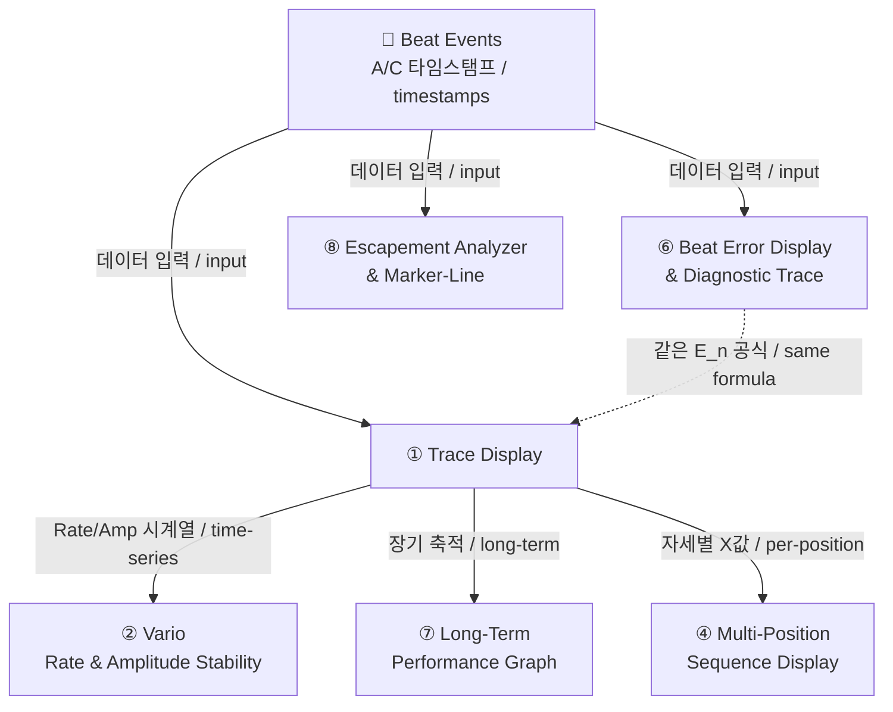
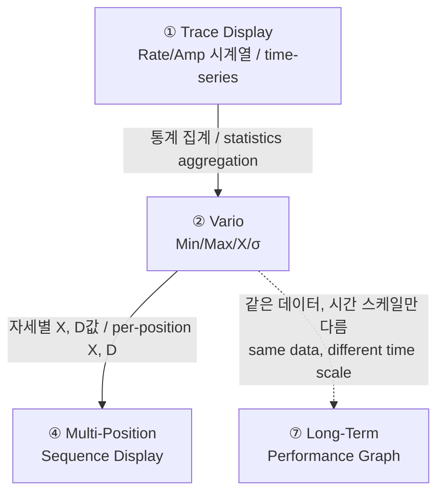
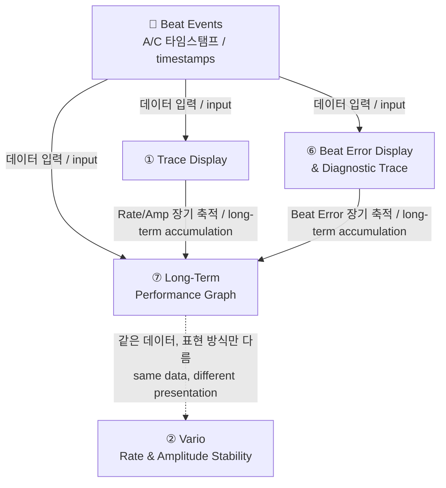

# TimeGrapher 그래프 분석 / Graph Analysis

> 11개 그래프 중 3개 (Trace Display, Vario, Long-Term Performance Graph) 상세 분석  
> Detailed analysis of 3 out of 11 graphs: Trace Display, Vario, Long-Term Performance Graph

---

## 3개 그래프 전체 비교 요약 / Overall Comparison

**한국어**

| | Trace Display | Vario | Long-Term Performance Graph |
|---|---|---|---|
| **목적** | 실시간 패턴 진단 | 세션 통계 요약 | 장기 추이 모니터링 |
| **시간 스케일** | 수 분 | 현재 세션 누적 | 수 시간~수일 |
| **표시 방식** | 연속 점 그래프 | 가로 막대 + 통계 수치 | 3단 시계열 |
| **측정 항목** | Rate + Amplitude | Rate + Amplitude | Rate + Amplitude + **Beat Error** |
| **진단 질문** | "지금 어떤 패턴인가?" | "얼마나 일정한가?" | "시간이 지나며 어떻게 변하나?" |
| **데이터 소스** | Beat event 직접 | Trace 시계열 집계 | Beat event 직접 (장기 저장) |

**English**

| | Trace Display | Vario | Long-Term Performance Graph |
|---|---|---|---|
| **Purpose** | Real-time pattern diagnosis | Session statistics summary | Long-term trend monitoring |
| **Time scale** | Minutes | Current session cumulative | Hours to days |
| **Display type** | Continuous dot graph | Horizontal bar + statistics | 3-panel time series |
| **Metrics** | Rate + Amplitude | Rate + Amplitude | Rate + Amplitude + **Beat Error** |
| **Diagnostic question** | "What pattern right now?" | "How consistent is it?" | "How does it change over time?" |
| **Data source** | Beat events directly | Trace time-series aggregate | Beat events directly (long-term storage) |

---

## 1. Trace Display

### 그래프 목적 / Purpose

**한국어**

시계의 **Rate(오차율)** 와 **Amplitude(진폭)** 를 실시간으로 연속 기록해서, 시계가 빠른지/느린지, 안정적인지, 기계적 결함이 있는지를 **시각적 패턴**으로 진단하는 그래프.

> 핵심: 오디오 진폭이 아니라 **타이밍 오차의 누적값**을 점으로 찍는 것

**English**

A graph that continuously records the watch's **Rate (error rate)** and **Amplitude** in real time, diagnosing whether the watch is fast/slow, stable, or mechanically defective through **visual patterns**.

> Key: plotting **accumulated timing error** as dots, not audio amplitude

**화면 구조 / Screen Layout:**

```
┌─────────────────────────────────────────────────────────────────┐
│  1.5 s/d ✓    0.0 ms ✓    299° ✓              [Trace]          │
├─────────────────────────────────────────────────────────────────┤
│  +6 s/d │                                                       │
│  +4 s/d │  . . . . . . . . . . . . . . . . . . . . . .        │
│  +2 s/d │                                                       │  ← Rate graph
│   0 s/d ├ ─ ─ ─ ─ ─ ─ ─ ─ ─ ─ ─ ─ ─ ─ ─ ─ ─ ─ ─ ─ ─        │
│  -2 s/d │                                                       │
│  -4 s/d │                                                       │
│         └──────┬──────┬──────┬──────┬──────┬──────────         │
│              2:00   4:00   6:00   8:00  10:00 min              │
├─────────────────────────────────────────────────────────────────┤
│   315°  │                                                       │
│   310°  │                                                       │
│   305°  │  . . . . . . . . . . . . . . . . . . . . . .        │  ← Amplitude graph
│   300°  │                                                       │
│   295°  │                                                       │
│   290°  │                                                       │
│   285°  └──────┬──────┬──────┬──────┬──────┬──────────         │
│              2:00   4:00   6:00   8:00  10:00 min              │
└─────────────────────────────────────────────────────────────────┘
```

| 축 / Axis | 내용 / Content |
|---|---|
| X (공통 / common) | 경과 시간 (분) / Elapsed time (minutes) |
| Y (상단 / upper) | Rate 편차 (s/d) / Rate deviation (s/d) |
| Y (하단 / lower) | Balance wheel 진폭 (°) / Balance wheel amplitude (°) |

---

### 소스 데이터 및 공식 / Source Data and Formulas

**한국어**

**입력 데이터:** Beat event 타임스탬프 — T1(A): 틱 정밀 타이밍, T3(C): 진폭 계산용

**Rate 계산:**

```
E_n = T_measured - (T_start + n × I_target)

  T_measured : 실제 beat 감지 시각
  T_start    : 첫 번째 beat 시각 (기준점)
  n          : beat 번호 (0, 1, 2, ...)
  I_target   : 이상적 beat 간격 = 3600 / BPH (초)

m = E_n - E_(n-1)                        ← beat 간 오차 변화량
Rate = -(m / I_target) × 86400  [s/d]
```

**Amplitude 계산:**

```
t_AC = T_C - T_A     ← 같은 beat의 A→C 이벤트 간격 (초)
Amp = (3600 × λ) / (π × BPH × t_AC)  [°]
  λ : lift angle (°), 보통 52°
```

**English**

**Input data:** Beat event timestamps — T1(A): precise tic timing, T3(C): for amplitude calculation

**Rate calculation:**

```
E_n = T_measured - (T_start + n × I_target)

  T_measured : actual beat detection time
  T_start    : first beat time (reference)
  n          : beat index (0, 1, 2, ...)
  I_target   : ideal beat interval = 3600 / BPH (seconds)

m = E_n - E_(n-1)                        ← error change between beats
Rate = -(m / I_target) × 86400  [s/d]
```

**Amplitude calculation:**

```
t_AC = T_C - T_A     ← A→C interval within the same beat (seconds)
Amp = (3600 × λ) / (π × BPH × t_AC)  [°]
  λ : lift angle (°), typically 52°
```

---

### 그래프 예시 / Graph Examples

#### Case 1: 정상 시계 / Normal Watch

```
Rate
 +4│  . . . . . . . . . . . . . . . . .
 +2│
  0│──────────────────────────────────── (기준선 / baseline)
 -2│
   └────────────────────────────────── time(min) →

Amplitude
310│  . . . . . . . . . . . . . . . . .
300│
290│
   └────────────────────────────────── time(min) →
```

> 한국어: Rate 점이 수평 띠 안에 안정. Amplitude 270~310° 유지  
> English: Rate dots stable within a horizontal band. Amplitude sustained at 270–310°

#### Case 2: 빠른 시계 / Fast Watch (+90 s/d)

```
Rate
+90│                              . . .
   │                    . . . . .
   │          . . . . .
   │. . . . .
  0│──────────────────────────────────── (기준선 / baseline)
   └────────────────────────────────── time →
```

> 한국어: 점들이 위로 급경사 → 하루 90초 빠름  
> English: Dots trending sharply upward → 90 seconds fast per day

#### Case 3: 느린 시계 / Slow Watch (-90 s/d)

```
Rate
  0│──────────────────────────────────── (기준선 / baseline)
   │. . . . .
   │          . . . . .
   │                    . . . . .
-90│                              . . .
   └────────────────────────────────── time →
```

> 한국어: 점들이 아래로 급경사 → 하루 90초 느림  
> English: Dots trending sharply downward → 90 seconds slow per day

#### Case 4: Beat Error 있음 / Beat Error Present (두 줄 분리 / Two-line split)

```
Rate
   │  . . . . . . . . . . . .   ← tic 위상 / tic phase
   │
   │. . . . . . . . . . . .     ← tac 위상 / tac phase
  0│────────────────────────────
```

> 한국어: tic/tac 두 줄로 분리됨 → Beat Error 존재. 두 줄 간격 = Beat Error × 2. **조치:** Beat Error 먼저 조정 → Rate 재조정  
> English: Split into two lines (tic/tac) → Beat Error present. Gap between lines = Beat Error × 2. **Action:** Adjust Beat Error first → then re-adjust Rate

#### Case 5: Gear Train 결함 / Gear Train Defect (규칙적 사인파 / Regular sine wave)

```
Rate
 +6│      .       .       .
 +3│    .   .   .   .   .   .
  0│──.───────.───────.──────── (기준선 / baseline)
 -3│.   .   .   .   .   .
   └────────────────────────── time →
      ←→ 이 주기 = escape wheel 1회전 / this period = 1 escape wheel revolution
```

> 한국어: 규칙적 사인파 = escape wheel 결함. **조치:** gear train 수리/교체  
> English: Regular sine wave = escape wheel defect. **Action:** repair/replace gear train

#### Case 6: Amplitude 지속 감소 / Sustained Amplitude Drop (윤활 부족 / 태엽 소진)

```
Amplitude
320│. . .
310│       . . .
300│             . . .
290│                   . . .
270│─ ─ ─ ─ ─ ─ ─ ─ ─ ─ ─ ─ ─  ← 정상 하한 경보선 / lower limit alarm
   └────────────────────────── time →
```

> 한국어: 단조 감소 → 270° 이하면 GUI 경보. **조치:** 윤활 또는 태엽 점검  
> English: Monotonic decrease → GUI alarm below 270°. **Action:** lubrication or mainspring inspection

#### Case 7: 불규칙 산만한 패턴 / Irregular Scattered Pattern

```
Rate
 +6│  .    .  .     .  .
 +3│.    .      . .      .  .
  0│──────────────────────────
 -3│   .     .    .    .
 -6│       .          .
   └────────────────────────── time →
```

> 한국어: 점이 흩어짐 → 신호 노이즈, 측정 불안정, 진폭 부족. **조치:** 오버홀  
> English: Scattered dots → signal noise, unstable measurement, insufficient amplitude. **Action:** overhaul

---

### 패턴 읽기 요약 / Pattern Reading Summary

| 관찰 내용 / Observation | 진단 / Diagnosis |
|---|---|
| 수평에 가까운 좁은 선 / Narrow near-horizontal line | 정상, 안정적 / Normal, stable |
| 위로 올라가는 기울기 / Upward slope | 시계가 빠름 / Watch running fast |
| 아래로 내려가는 기울기 / Downward slope | 시계가 느림 / Watch running slow |
| 두 선으로 분리 / Two parallel lines | Beat Error 있음 / Beat Error present |
| 사인파 형태 / Sine wave pattern | Gear train / escape wheel 결함 / defect |
| Amplitude 지속 감소 / Amplitude sustained drop | 태엽 소진 또는 윤활 불량 / Mainspring exhausted or poor lubrication |
| 불규칙하게 산만한 점 / Irregular scattered dots | 신호 노이즈, 측정 불안정 / Signal noise, unstable measurement |

---

### 다른 그래프와의 연관 / Relationship with Other Graphs



| 연관 그래프 / Related Graph | 관계 / Relationship |
|---|---|
| **Beat Error Display & Diagnostic Trace** | 동일한 `E_n` 공식 사용 / Same `E_n` formula. Trace: accumulated error visualization; Beat Error: tic/tac asymmetry diagnosis |
| **Rate & Amplitude Stability (Vario)** | Trace가 생성하는 Rate/Amp 시계열을 실시간 통계(Min/Max/σ)로 집계 / Aggregates Trace-generated Rate/Amp time-series into real-time statistics (Min/Max/σ) |
| **Long-Term Performance Graph** | Trace 데이터를 장시간 축적 / Accumulates Trace data over extended time. Adds Beat Error panel |
| **Multi-Position Sequence Display** | 각 자세마다 Trace를 측정 후 결과 요약 / Measures Trace per position and summarizes results in a table |
| **Escapement Analyzer & Marker-Line** | Trace의 A/C 마커를 확대해서 ms 단위 정밀 분석 / Zooms in on Trace A/C markers for ms-level precision analysis |

---

## 2. Rate and Amplitude Stability Over Time (Vario)

### 그래프 목적 / Purpose

**한국어**

측정 세션 동안 축적된 Rate/Amplitude 값의 **통계 분포**를 실시간으로 보여주는 가로 막대형 요약 뷰.

순간 값이 아니라 **얼마나 일정하게 유지되는가** — 즉 안정성과 조정 품질을 판단하는 것이 목적.

> Min/Max 폭이 좁을수록 안정적, σ가 작을수록 일관성 높음

**English**

A horizontal bar summary view that shows the **statistical distribution** of accumulated Rate/Amplitude values during the measurement session in real time.

The goal is not to show instantaneous values but to judge **how consistently the values are maintained** — stability and adjustment quality.

> Narrower Min/Max range = more stable; smaller σ = more consistent

**화면 구조 / Screen Layout:**

```
┌─────────────────────────────────────────────────────────────────┐
│  2.0 s/d ✓    0.0 ms ✓    297° ✓    01        [Vario]          │
├─────────────────────────────────────────────────────────────────┤
│                         1:16                                    │  ← 경과 시간 / elapsed time
│                                                                 │
│  Rate     Min  -0.8 s/d    X  1.5 s/d    σ  1.0 s/d    Max  3.3 s/d │
│                                                                 │
│  -10  -5    0    5    10   15                                   │
│            [██████████] ↑Min  ↑X  ↑Max                         │
│                                                                 │
│  Amplitude  Min  291°    X  298°    σ  3°    Max  303°          │
│                                                                 │
│  180   210   240   270   300   330                              │
│                     [████] ↑Min  ↑X  ↑Max                      │
└─────────────────────────────────────────────────────────────────┘
```

| 요소 / Element | 의미 / Meaning |
|---|---|
| 초록 영역 / Green range | 허용 범위 / Acceptable range (Rate: ±5~15 s/d, Amplitude: 270~310°) |
| 파란 화살표 / Blue arrows | Min / Max 측정값 위치 / Min/Max measurement positions |
| 빨간 화살표 / Red arrow | 평균값(X) 위치 / Mean (X) position |

---

### 소스 데이터 및 공식 / Source Data and Formulas

**한국어**

**입력 데이터:** Trace Display가 축적한 Rate/Amplitude 시계열

```
Min   = min(Rate_1, ..., Rate_N)
Max   = max(Rate_1, ..., Rate_N)
X     = (1/N) × Σ Rate_i                      ← 평균
σ     = sqrt((1/N) × Σ(Rate_i - X)²)          ← 표준편차
동일 공식을 Amplitude에도 적용
```

**English**

**Input data:** Rate/Amplitude time-series accumulated by Trace Display

```
Min   = min(Rate_1, ..., Rate_N)
Max   = max(Rate_1, ..., Rate_N)
X     = (1/N) × Σ Rate_i                      ← mean
σ     = sqrt((1/N) × Σ(Rate_i - X)²)          ← standard deviation
Same formulas applied to Amplitude
```

---

### 그래프 예시 / Graph Examples

#### Case 1: 잘 조정된 시계 / Well-adjusted Watch

```
Rate 바 / bar
-10   -5    0    5    10   15
            [██████]
              ↑     ↑
           Min=-0.5  Max=+2.0   X=+0.8  σ=0.6
```

> 한국어: Min~Max 폭 좁음, σ 작음 → 안정적, 조정 양호  
> English: Narrow Min–Max range, small σ → stable, well adjusted

#### Case 2: Rate 불안정 / Unstable Rate (조정 필요 / Adjustment Required)

```
Rate 바 / bar
-10   -5    0    5    10   15
  [████████████████████████]
  ↑                        ↑
Min=-9.0               Max=+12.0   X=+1.5  σ=5.2
```

> 한국어: Min~Max 폭 매우 넓음, σ 큼 → 불안정, 재조정 필요  
> English: Very wide Min–Max range, large σ → unstable, needs readjustment

#### Case 3: Amplitude 정상 범위 이탈 / Amplitude Out of Normal Range

```
Amplitude 바 / bar
 180   210   240   270   300   330
         [██████]
         ↑             ↑
      Min=230°        Max=255°   ← 270° 정상 하한 아래 / below lower normal limit
```

> 한국어: Amplitude 전체가 정상 범위(270~310°) 밖 → 경보 표시  
> English: Entire Amplitude range outside normal (270–310°) → alarm displayed

---

### 다른 그래프와의 연관 / Relationship with Other Graphs



| 연관 그래프 / Related Graph | 관계 / Relationship |
|---|---|
| **Trace Display** | Vario의 직접 데이터 소스 / Direct data source for Vario. Trace time-series → Vario statistics |
| **Multi-Position Sequence Display** | 각 자세에서 Vario를 측정 → X(평균)와 D(Max-Min)를 테이블로 합산 / Measures Vario per position → aggregates X (mean) and D (Max−Min) into a table |
| **Long-Term Performance Graph** | Vario는 현재 세션 통계 스냅샷, Long-Term은 동일 값의 시간 추이 / Vario is a current-session statistics snapshot; Long-Term shows the time trend of the same values |

---

## 3. Long-Term Performance Graph

### 그래프 목적 / Purpose

**한국어**

수 시간에 걸쳐 Rate, Amplitude, Beat Error **3개 지표를 동시에** 장기 추이 그래프로 기록.

단기 측정으로는 보이지 않는 현상을 포착하는 것이 목적:
- 태엽 소진에 따른 Amplitude 점진 감소
- 날짜 변경 기구 충격에 따른 Rate 스파이크
- 온도/자성 변화에 따른 장기 드리프트
- Beat Error의 시간에 따른 변화 추이

**English**

Records Rate, Amplitude, and Beat Error **simultaneously** as a long-term trend graph over hours.

Designed to capture phenomena invisible in short-term measurements:
- Gradual Amplitude decrease as mainspring winds down
- Rate spikes from date-change mechanism shock
- Long-term drift from temperature/magnetic changes
- Beat Error trend changes over time

**화면 구조 / Screen Layout:**

```
┌─────────────────────────────────────────────────────────────────┐
│  DAILY RATE -2.0 s/d    AMPLITUDE 281°    BEAT ERROR 0.6ms     │
│  PARAMETERS  21600bph  51°  60s                                 │
├─────────────────────────────────────────────────────────────────┤
│ [Panel 1 - Daily Rate]                     (pink/red line)     │
│  +5│─ ─ ─ ─ ─ ─ ─ ─ ─ ─ ─ ─ ─ ─ ─  ← 허용 상한 / upper limit  │
│    │ ~~~~~~~~~~~~~~~~~~~~~~~~~~~~~~~~~~~                        │
│   0│                                                            │
│  -5│─ ─ ─ ─ ─ ─ ─ ─ ─ ─ ─ ─ ─ ─ ─  ← 허용 하한 / lower limit  │
│    └──1:00──2:00──3:00──4:00──5:00──6:00──7:00──8:00           │
├─────────────────────────────────────────────────────────────────┤
│ [Panel 2 - Amplitude]                      (blue line)         │
│ 280│                                                            │
│ 270│─ ─ ─ ─ ─ ─ ─ ─ ─ ─ ─ ─ ─ ─ ─  ← 정상 하한 / lower limit  │
│ 260│ ~~~~~~~~~~~~~~~~~~~~~~~~~~~~~~                             │
│    └──1:00──2:00──3:00──4:00──5:00──6:00──7:00──8:00           │
├─────────────────────────────────────────────────────────────────┤
│ [Panel 3 - Beat Error]                     (green line)        │
│ 0.9│                                                            │
│ 0.6│─ ─ ─ ─ ─ ─ ─ ─ ─ ─ ─ ─ ─ ─ ─  ← 허용 상한 / upper limit  │
│    │ ~~~~~~~~~~~~~~~~~~~~~~~~~~~~~~~~~~                         │
│ 0.3│                                                            │
│    └──1:00──2:00──3:00──4:00──5:00──6:00──7:00──8:00           │
└─────────────────────────────────────────────────────────────────┘
```

---

### 소스 데이터 및 공식 / Source Data and Formulas

**한국어**

**Rate, Amplitude:** Trace Display와 동일한 공식 사용

**Beat Error:**

```
t1 = A_1 - A_0  (첫 번째 half-beat 간격)
t2 = A_2 - A_1  (두 번째 half-beat 간격)
BE = (t1 - t2) / 2  [ms]
```

**장기 표시용 다운샘플링:**

```
update_interval ∝ elapsed_time
  → 처음엔 자주 업데이트
  → 시간이 지날수록 업데이트 주기 늘림
  → 수 시간 데이터도 화면 밀도 유지
```

**English**

**Rate, Amplitude:** Same formulas as Trace Display

**Beat Error:**

```
t1 = A_1 - A_0  (first half-beat interval)
t2 = A_2 - A_1  (second half-beat interval)
BE = (t1 - t2) / 2  [ms]
```

**Downsampling for long-term display:**

```
update_interval ∝ elapsed_time
  → frequent updates at first
  → update interval grows over time
  → maintains display density even for hours of data
```

---

### 그래프 예시 / Graph Examples

#### Case 1: 건강한 시계 / Healthy Watch (장기 안정 / Long-term Stable)

```
Rate      │ ~ ~ ~ ~ ~ ~ ~ ~ ~ ~ ~ ~ ~ ~ ~ ~  (±2 s/d 내 / within ±2 s/d)
Amplitude │ ~ ~ ~ ~ ~ ~ ~ ~ ~ ~ ~ ~ ~ ~ ~ ~  (295~305° 유지 / sustained)
Beat Err  │ ~ ~ ~ ~ ~ ~ ~ ~ ~ ~ ~ ~ ~ ~ ~ ~  (0.3~0.5 ms)
          └─────────────────────────────── 8시간 / 8 hours
```

> 한국어: 3개 지표 모두 허용 범위 내 안정  
> English: All three metrics stable within acceptable ranges

#### Case 2: 태엽 소진 패턴 / Mainspring Wind-down Pattern

```
Rate      │ ~ ~ ~ ~ ~ ~ ~\↘↘↘  (후반 Rate 악화 / Rate deteriorates in latter half)
Amplitude │ ~ ~ ~ ~\↘↘↘↘↘↘↘  (점진 감소 / gradual decrease)
Beat Err  │ ~ ~ ~ ~ ~ ~\↗↗↗  (후반 증가 / increases in latter half)
          └─────────────────────────────── 8시간 / 8 hours
            ← 완전 태엽 →   ← 소진 →
            ← full wind →  ← rundown →
```

> 한국어: 전형적인 **파워 리저브 소진** 패턴  
> English: Classic **power reserve exhaustion** pattern

#### Case 3: 날짜 변경 기구 충격 / Date-Change Mechanism Shock

```
Rate      │ ~ ~ ~ ~ │spike│ ~ ~ ~ ~ ~ ~
Amplitude │ ~ ~ ~ ~ │↘    │ ~ ~ ~ ~ ~ ~  (순간 감소 후 회복 / brief dip then recovery)
Beat Err  │ ~ ~ ~ ~ │spike│ ~ ~ ~ ~ ~ ~
          └──────────────────────────── 24시간 / 24 hours
                    ↑
                 자정 / midnight (날짜 변경 기구 작동 / date mechanism activates)
```

> 한국어: 자정에 Rate/Amplitude 순간 변화 → 날짜 기구가 balance wheel에 부하  
> English: Instantaneous change in Rate/Amplitude at midnight → date mechanism loading balance wheel

#### Case 4: Beat Error 장기 드리프트 / Long-term Beat Error Drift

```
Rate      │ ~ ~ ~ ~ ~ ~ ~ ~ ~ ~ ~ ~ ~  (안정 / stable)
Amplitude │ ~ ~ ~ ~ ~ ~ ~ ~ ~ ~ ~ ~ ~  (안정 / stable)
Beat Err  │ ~~/↗ ~ ~~/↗ ~ ~~/↗ ~ ~ ~  (서서히 증가 추세 / gradually increasing trend)
          └─────────────────────────── 수일 / several days
```

> 한국어: Rate/Amp는 정상이지만 Beat Error만 장기적으로 증가 → 충격핀 마모 또는 팔레트 포크 간격 변화 징후  
> English: Rate/Amp normal but Beat Error increasing long-term → signs of impulse pin wear or pallet fork gap change

---

### 다른 그래프와의 연관 / Relationship with Other Graphs



| 연관 그래프 / Related Graph | 관계 / Relationship |
|---|---|
| **Trace Display** | 같은 Rate/Amplitude 공식. Trace는 분 단위 실시간, Long-Term은 시간 단위 장기 / Same Rate/Amplitude formulas. Trace: minutes real-time; Long-Term: hours long-term |
| **Beat Error Display & Diagnostic Trace** | 같은 BE 공식 공유. Beat Error Display는 단기 진단, Long-Term은 장기 모니터링 / Shared BE formula. Beat Error Display: short-term diagnosis; Long-Term: long-term monitoring |
| **Rate & Amplitude Stability (Vario)** | Vario는 현재 세션 통계 스냅샷(Min/Max/σ), Long-Term은 동일 값의 시간 추이 / Vario: current-session statistics snapshot (Min/Max/σ); Long-Term: time trend of the same values |

**범례 / Legend**

| 화살표 / Arrow | 의미 / Meaning |
|---|---|
| 실선 `→` / Solid | A의 계산 결과가 B의 입력 데이터로 사용됨 / A's output is used as B's input |
| 점선 `-.->` / Dashed | 직접 데이터를 주고받지 않지만 동일 공식 또는 동일 데이터를 다른 방식으로 표현 / No direct data exchange, but same formula or data expressed differently |
