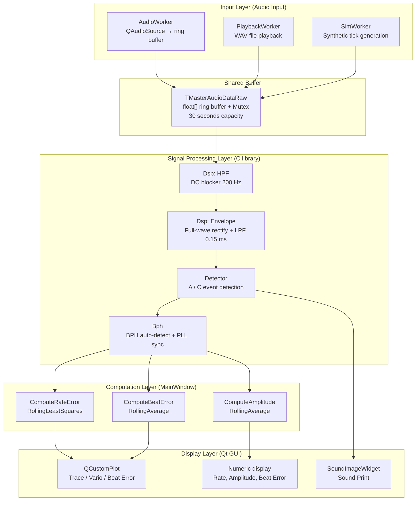
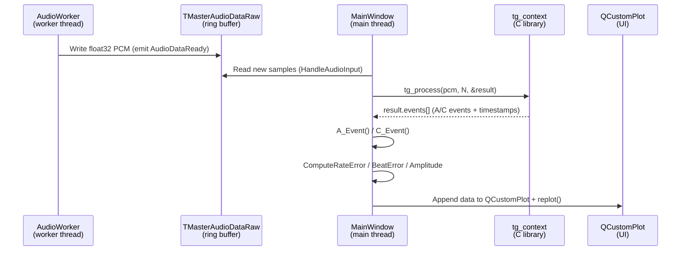

# Presentation A — Codebase Analysis: Qt Module Structure + Signal Processing Pipeline

> **Presenter**: (assign name)  
> **Date**: 2026-06-01 (Mon) Kickoff Workshop  
> **Source**: [`src/`](../../../src/) directory  
> **Goal**: Give the whole team a shared mental model of the existing code structure and signal flow — the common starting point for architecture analysis and extension work

---

## Slide 1 — File Map at a Glance

```
src/
├── Main.cpp                   App entry point
├── MainWindow.h/.cpp          UI + central orchestrator (key file)
│
├── AudioWorker.h/.cpp         Microphone capture thread (QAudioSource)
├── PlaybackWorker.h/.cpp      WAV file playback thread
├── SimWorker.h/.cpp           Simulated audio thread
├── SharedAudio.h              Cross-thread shared ring-buffer struct
│
├── Timegrapher.h/.cpp         Signal-processing C library (public API)
├── Dsp.h/.cpp                 HPF + Envelope DSP primitives
├── Detector.h/.cpp            Onset / Peak event detector
├── Bph.h/.cpp                 BPH auto-detection + PLL sync tracker
│
├── RollingLeastSquares.h/.cpp Rolling least-squares for Rate
├── RollingAverage.h/.cpp      Rolling average for Beat Error / Amplitude
│
├── SoundImageRenderer.h/.cpp  Sound Print renderer (direct bitmap)
├── SoundImageWidget.h/.cpp    Sound Print Qt widget
├── WavStreamWriter.h/.cpp     Record session → WAV file
├── WatchSynthStream.h/.cpp    Synthetic watch-tick generator
├── WaveHeader.h               WAV file header struct
├── LinuxAudio.h/.cpp          Linux ALSA audio device helpers
├── WindowsAudio.h/.cpp        Windows audio device helpers
└── qcustomplot.h/.cpp         Third-party graph rendering library
```

> **37 files total** — excluding qcustomplot, the core codebase is ~20 files

---

## Slide 2 — Four-Layer Architecture



---

## Slide 3 — Input Layer: Three Input Modes

**`MainWindow` routes all three input modes through the same pipeline**

| Mode | Class | Role |
|------|-------|------|
| **Live** | `AudioWorker` | QAudioSource → float32 PCM → ring buffer |
| **Playback** | `PlaybackWorker` | Read WAV file → ring buffer |
| **Simulation** | `SimWorker` | `WatchSynthStream` tick synthesis → ring buffer |

**Shared ring buffer (`TMasterAudioDataRaw`)**
```cpp
// SharedAudio.h
typedef struct {
    QMutex   Mutex;
    float   *Samples;               // float32 mono PCM
    int      NumberOfAudioSamples;  // ~30 seconds capacity
    unsigned int WriteIndex;
    uint64_t TotalSamplesWritten;
    // ...
} TMasterAudioDataRaw;
```

- AudioWorker thread → writes to ring buffer
- MainWindow (main thread) → reads from ring buffer + processes
- Mutex ensures thread safety

---

## Slide 4 — Signal Processing Pipeline (C Library)

**Stages executed in a single `tg_process()` call:**

```
PCM (float32 mono, e.g. 96 kHz)
  │
  ▼ [Dsp.cpp] tg_hpf_process()
  HPF (DC blocker, f_c = 200 Hz)
  → removes low-frequency rumble / AC hum
  │
  ▼ [Dsp.cpp] tg_envelope_process()
  Envelope (full-wave rectify + one-pole LPF, 0.15 ms)
  → converts tick waveform into an "energy blob"
  │
  ▼ [Detector.cpp] tg_detector_process()
  Onset / Peak detection
  → A event (escape unlock, onset crossing)
  → C event (pallet drop, envelope peak)
  → sub-sample accurate timestamps for both
  │
  ▼ [Bph.cpp] Rayleigh phase score → BPH auto-detection
  PLL sync (tracks beat period + A→C offset)
  │
  ▼ returns tg_result_t
  (events[], sync_status, detected_bph, ...)
```

> **Key design choice**: this pipeline uses **no bandpass filter**  
> Reason: a bandpass filter creates 3–5 ms ringing that merges A and C events into one blob

---

## Slide 5 — Event Detection: A Event vs C Event

**Two event types emitted by the Detector** (connects to domain concepts in Presentation B)

```
Microphone signal (Scope waveform):

    A (unlock)             C (drop / lock)
       │                       │
  [tic burst]     :      [toc burst]
  ↑ onset                 ↑ peak
  (envelope rises          (envelope maximum,
   past threshold)         sub-sample via parabolic
                           interpolation)
```

| Item | A Event | C Event |
|------|---------|---------|
| Physical meaning | Escape wheel unlock | Pallet drop / lock |
| Timing anchor | Envelope onset (rising crossing) | Envelope peak |
| Precision | Linear interpolation | Parabolic interpolation |
| Used for | Rate, Beat Error | Amplitude |

**Threshold design** — no per-recording tuning required:
- `noise_floor` = 75th percentile of silence-region envelope (256-slot ring buffer)
- `reference_peak` = median of last 16 accepted burst peaks
- Onset threshold = `noise + 0.03 × (ref_peak − noise)`

---

## Slide 6 — BPH Auto-Detection + PLL Sync

**BPH detection flow** (`Bph.cpp`)

```
1. Collect A-event timestamps (~1.5 s)
       ↓
2. tg_phase_score() — Rayleigh circular mean
   Sweep candidate BPH list [12000, 14400, 18000, 21600, 28800, 36000 ...]
   Select BPH with best phase alignment score
       ↓
3. BPH confirmed → tg_sync_lock()
       ↓
4. PLL tracking — beat_period and A→C offset updated continuously
   period_gain = 0.01 / ac_gain = 0.05
```

**Sync states**

| State | Meaning |
|-------|---------|
| `NOT_SYNCED` | BPH detection in progress (pre-sync events — not used in calculations) |
| `SYNCED` | BPH confirmed — measurement values are valid |
| `MISMATCH` | Manual BPH setting does not match actual signal |

---

## Slide 7 — Computation Layer: Rate / Beat Error / Amplitude

**Once A and C events arrive in `MainWindow`:**

```cpp
// MainWindow.cpp
void MainWindow::A_Event(double A_EventTime, bool haveValidBPH, double BPH) {
    ComputeRateError(A_EventTime, haveValidBPH, BPH);
    ComputeBeatError(A_EventTime, haveValidBPH, BPH);
    ComputeAmplitude(A_EventTime, haveValidBPH, BPH);
}
void MainWindow::C_Event(double C_EventTime, bool haveValidBPH, double BPH) {
    // C event → Amplitude (T1 → T3 interval)
}
```

| Metric | Class | Struct |
|--------|-------|--------|
| **Rate** | `RollingLeastSquares` | `TRateErrorEvents` |
| **Beat Error** | `RollingAverage` | `TBeatErrorEvents` |
| **Amplitude** | `RollingAverage` | `TAmplitudeErrorEvents` |

**Rate computation** (`TRateErrorEvents`):
- Separate `RollingLeastSquares` applied to tic phase and toc phase independently
- `RlsRate = (RlsTicRate + RlsTocRate) / 2` — matches the tic/tac split formula in Presentation B

---

## Slide 8 — Display Layer: QCustomPlot + SoundImageWidget

**Graph rendering**

| Display element | Class | Data source |
|----------------|-------|-------------|
| Trace Display (Rate error dots) | `QCustomPlot` | `TRateErrorEvents.xTic/yTic/xToc/yToc` |
| Beat Error | `QCustomPlot` | `TBeatErrorEvents.BeatErrorMs` |
| Sound Print (Scope waveform) | `SoundImageWidget` | `SoundImageRenderer` (direct bitmap) |
| Numeric readouts (Rate, Amp, BE) | Qt Label | `DisplayResults()` |

**SoundImageRenderer — notable design:**
- Uses **direct bitmap rendering**, not QCustomPlot
- Real-time waveform scroll: shifts bitmap one column at a time
- `mSoundRenderHasBPH` flag distinguishes pre-sync vs post-sync rendering

---

## Slide 9 — Full Data Flow (One Cycle)



**Processing cadence**: driven by `AudioDataReady` signal — fired approximately **every 50 ms**  
→ `mBackgroundLastFPS` / `mForegroundFPS` track performance

---

## Slide 10 — Extension Points (Architecture Perspective)

We need to add 11 mandatory graphs + Enhanced features — **what will we actually touch?**

| Addition | Current code location | Change required |
|----------|-----------------------|-----------------|
| New graph (Trace family) | `MainWindow.cpp` + QCustomPlot | Can reuse existing Rate/Beat Error data |
| New graph (Scope family) | `SoundImageRenderer` | Renderer extension needed |
| Pause / time-axis navigation | Ring buffer + plot control | Buffer sizing + playback logic |
| Long-term graph | `TRateErrorEvents` capacity | Increase `MaxTicTocDataPoints` |
| Position Testing | New multi-measurement storage | New data structure needed |

**Key observation from the current codebase**:
- `MainWindow` handles **UI + computation + pipeline control all in one place** → God Object tendency
- Every new graph currently requires editing `MainWindow.cpp`
- **Core Extensibility QA challenge**: we need a design that prevents MainWindow from growing unbounded

---

## Slide 11 — Codebase Analysis Checklist (Week 1)

> Reference checklist for individual analysis work this week

- [ ] Trace the call flow: `tg_process()` → `HandleAudioInput()` → `A_Event()` / `C_Event()`
- [ ] Understand `TRateErrorEvents` — how are tic/toc data vectors populated?
- [ ] Understand `RollingLeastSquares` Rate calculation — compare with Equations Part II
- [ ] Understand `SoundImageRenderer` — performance characteristics of bitmap approach
- [ ] Understand `AddOrOverwrite()` — ring-buffer style graph update logic
- [ ] Check `MaxTicTocDataPoints` current value and memory impact
- [ ] Confirm which audio path (`LinuxAudio` vs `WindowsAudio`) runs on RPi

---

## References

| File | Key content |
|------|-------------|
| [`src/Timegrapher.h`](../../../src/Timegrapher.h) | C library public API + full pipeline description (header comments) |
| [`src/Detector.h`](../../../src/Detector.h) | A/C event detection algorithm (detailed comments) |
| [`src/MainWindow.h`](../../../src/MainWindow.h) | Computation function list (`ComputeRateError`, `ComputeBeatError`, `ComputeAmplitude`) |
| [`src/Dsp.h`](../../../src/Dsp.h) | HPF + Envelope formulas |
| [`src/Bph.h`](../../../src/Bph.h) | BPH auto-detection + PLL structure |
| [`src/SharedAudio.h`](../../../src/SharedAudio.h) | Cross-thread ring buffer structure |
