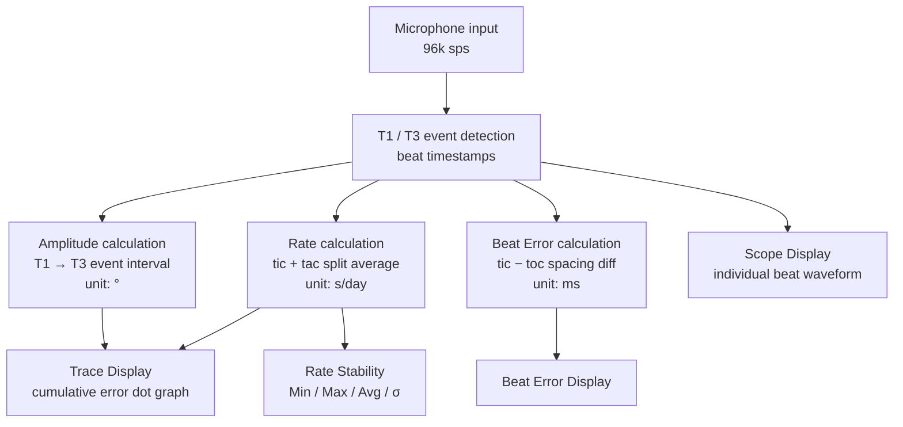

# Presentation B — Domain Documents: Key Concepts

> **Presenter**: (assign name)  
> **Date**: 2026-06-01 (Mon) Kickoff Workshop  
> **Source 1**: [Witschi Training Course.pdf](../../../.claude/skills/time-grapher/assets/Witschi-Training-Course.pdf) — pp.14-19  
> **Source 2**: [TimeGrapher Equations_v0.docx.pdf](../../../.claude/skills/time-grapher/assets/TimeGrapher%20Equations_v0.docx.pdf) — full document  
> **Goal**: Make sure the whole team understands what we are measuring and how those values are calculated in code

---

## Slide 1 — Why This Presentation Comes First

You cannot analyze code (Presentation A) without domain knowledge first.

> "If you don't know what the code is computing, the code won't make sense."

This presentation covers:
1. **What** TimeGrapher measures from a watch (3 metrics)
2. **How** measured values appear on the graphs (trace interpretation)
3. **How** those values are computed mathematically (code connection points)

---

## Slide 2 — The 3 Core Watch Metrics

| Metric | Meaning | Healthy range (gent's watch) |
|--------|---------|------------------------------|
| **Rate** | How fast or slow the watch runs (s/day) | -5 to +15 s/d |
| **Amplitude** | Balance wheel swing arc (°) | H: 250–330° / V: 220–270° |
| **Beat Error** | Asymmetry of tic-toc spacing (ms) | 0.0 to 0.5 ms |

> **Source**: Witschi p.14 — reference value table for healthy movements  
> **Code connection**: all three are computed and displayed via `MainWindow` + `AudioProcessor`

---

## Slide 3 — How to Read a Trace Graph (Essential!)

A trace graph plots **cumulative timing error as dots** — one dot per beat.

```
  ↑ (fast)
  |   .  .  .
  |  .  .  .        → sloped straight line = constant Rate error (normal)
  | .  .  .
  |_________________→ beat number
  
  flat line   = watch matches target interval exactly
  thick/scattered = noise or irregular beats
```

| Trace pattern | Meaning | Action |
|---------------|---------|--------|
| Steeply sloped straight line | Large Rate deviation | Readjust rate |
| Two parallel lines | High Beat Error (≈3 ms) | Fix beat error first, then rate |
| Regular wave | Gear train defect | Replace gear train parts |
| Irregular wave | Insufficient amplitude | Overhaul |
| Vertical-position divergence | Position-dependent Rate difference | Center / balance the regulator |

> **Source**: Witschi pp.14-15

---

## Slide 4 — How to Read a Scope Graph

Scope = **individual beat waveform** (the raw acoustic signal)  
→ Used to diagnose **internal mechanical defects** not visible in the trace

```
Normal:        [tic burst]       [toc burst]
                ↑ small peak      ↑ large peak (T1 = impulse)

Peaks too close  → Escapement fitting too weak
Peaks too far    → Escapement fitting too strong
Extra peak (↓)   → Friction / mechanical collision
```

| Scope anomaly pattern | Cause | Source |
|-----------------------|-------|--------|
| Peaks too close together | Escapement fitting too weak | p.16 |
| Peaks too far apart | Escapement fitting too strong | p.16 |
| Extra peak (↓ marker) | Friction / collision (Dart, Fork horn, etc.) | pp.17-18 |
| Small signal between beats | Excessive axial end-shake in balance pivot | p.18 |
| Asymmetric burst sizes | Weak amplitude | p.18 |

> **Source**: Witschi pp.16-19  
> **T1/T3 events**: T1 (impulse) = large peak, T3 (lock+banking) = second peak  
> → These are the primary detection targets for QA 4 **Measurement Accuracy**

---

## Slide 5 — Rate Formula (Part I): Instantaneous Error

**Core formula** — instantaneous error for beat n:

$$E_n = T_{measured} - (T_{start} + n \times I_{target})$$

- `T_measured`: actual timestamp when the microphone detects the beat
- `T_start`: timestamp of the very first beat (anchor for the sequence)
- `n`: beat number (0, 1, 2, …)
- `I_target`: ideal beat interval = `3600 / BPH` (seconds)  
  e.g. 28,800 bph → `I_target = 125 ms`

**Why the trace slopes**: `E_n` grows (or shrinks) by approximately the same amount each beat → forms a straight sloped line

> **Source**: Equations pp.1-3

---

## Slide 6 — Rate Formula (Part II): Tic/Tac Split

In practice, **tic phase and tac phase are computed separately** then averaged:

$$\text{rate}_{tic} = 86400 \left(\frac{T_{nom,same-phase}}{T_{tic}} - 1\right)$$

$$\text{rate}_{tac} = 86400 \left(\frac{T_{nom,same-phase}}{T_{tac}} - 1\right)$$

$$\boxed{Rate = \frac{\text{rate}_{tic} + \text{rate}_{tac}}{2}}$$

- `T_nom,same-phase` = `7200 / BPH` (seconds) — for 28,800 bph → 250 ms
- **Why split?** When Beat Error is present, tic and toc are asymmetric → averaging contaminated rates inflates the error

```
[From sample indices]:
T_tic = (n_{2k+2} − n_{2k}) / f_s
T_tac = (n_{2k+3} − n_{2k+1}) / f_s
```

> **Source**: Equations pp.4-5  
> **Code connection**: the Rate computation logic in `AudioProcessor` should implement this formula

---

## Slide 7 — Computation Flow for All 3 Metrics



> **Key takeaway**: every displayed value traces back to the **accuracy of T1/T3 event detection**

---

## Slide 8 — Code Analysis Checklist (Connects to Presentation A)

Points to verify in the code, armed with this domain knowledge:

| Check item | Related formula / concept | Expected code location |
|------------|--------------------------|------------------------|
| `I_target` (beat interval) computation | `3600 / BPH` | AudioProcessor |
| `T_start` anchor initialization | Part I §4 | AudioProcessor |
| Tic / tac phase separation | Part II §1 | Rate computation function |
| T1 / T3 event detection algorithm | Scope pp.16-19 | Signal processing |
| Rate display unit conversion | `86400 × (...)` | Display layer |
| Beat Error computation | tic − toc spacing difference | Beat Error function |

---

## Slide 9 — Team Discussion Points

**Things to confirm before we move on**

1. **What is the BPH of our watch?** → determines `I_target` (28,800 bph = 125 ms)
2. **T1 vs T3 event definition** — how does the code distinguish them?
3. Does the whole team understand the difference between **Scope graph** and **Trace graph**?
4. **Beat Error 0.5 ms threshold** — how will we validate this in our implementation?

> Coordinate with Presentation A (code analysis) lead: identify exactly where `T_start`, `I_target`, and tic/tac separation happen in the code

---

## References

| Document | Content | Location |
|----------|---------|----------|
| Witschi Training Course | Trace graph patterns + diagnosis guide | pp.14-15 |
| Witschi Training Course | Scope waveform + mechanical defect diagnosis | pp.16-19 |
| TimeGrapher Equations | Instantaneous error formula (E_n) | Part I (pp.1-3) |
| TimeGrapher Equations | Rate tic/tac split calculation | Part II (pp.4-5) |
