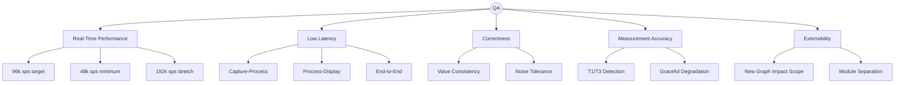
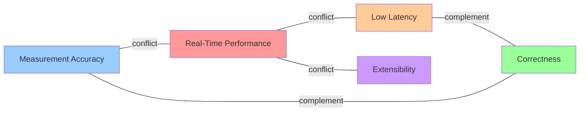

# Presentation D — QA 정의 & 평가 기준 개요

> **발표자**: (담당자 이름 입력)  
> **일시**: 2026-06-01 (Mon) Kickoff Workshop  
> **원본**: [Time Grapher Project Plan (Draft).pdf](../../../.claude/skills/time-grapher/assets/Time%20Grapher%20Project%20Plan%20(Draft).pdf) — p.25-26 (QA), p.32-33 (평가기준)  
> **목적**: 팀 전체가 QA 정의를 공유하고, 정량 목표를 합의하기 위한 기반 제공

---

## 슬라이드 1 — Why QA Matters

우리가 만드는 건 단순히 "동작하는 코드"가 아니라,  
**품질 속성(Quality Attributes)을 충족하는 아키텍처**다.

> "The as-is code functions, but Solvit Inc believes the software architecture may be significantly improved."  
> — Project Plan

- QA가 아키텍처 결정을 이끈다 (어떤 패턴? 어떤 트레이드오프?)
- QA가 실험 설계의 기준이 된다
- QA가 최종 데모의 평가 척도가 된다

---

## 슬라이드 2 — 5가지 Quality Attributes 개요



---

## 슬라이드 3 — QA 1: Real-Time Performance

**정의**: 시스템은 Raspberry Pi에서 실시간으로 음향 데이터를 수집·처리·분석·표시해야 한다.

| 목표 수준 | 샘플레이트 | 비고 |
|----------|-----------|------|
| Minimum (최소 허용) | **48,000 sps** | 이 이하면 프로젝트 실패 |
| Target (목표) | **96,000 sps** | 우리가 설계할 기준점 |
| Stretch (도전 목표) | **192,000 sps** | 여유 있을 때 도전 |

**아키텍처 시사점**
- RPi 5 메모리 관리 필수 (메모리 부족 → 전체 처리 지연)
- 실시간 처리 파이프라인 구조 필요
- **개발 PC에서만 검증하면 안 됨 — RPi에서 반드시 검증**

> **오늘 합의 필요**: 우리 팀의 Target sps를 96k로 설정하는가?

---

## 슬라이드 4 — QA 2: Low Latency

**정의**: 마이크 음향 포착 → GUI 표시까지의 end-to-end 지연을 최소화해야 한다.

**측정해야 할 3구간**

```
[마이크 캡처] ──①──> [Beat Detection/계산] ──②──> [GUI 표시]
                 ①: Capture→Process latency
                                              ②: Process→Display latency
[마이크 캡처] ─────────────────────────────> [GUI 표시]
                 end-to-end latency (= ① + ②)
```

**필수 보고 항목** (Final Demo에서 수치로 제시)
- 구간별 지연: ① + ② + end-to-end (ms)
- 각 항목의 **평균값 + 최악값(worst-case)**
- Dropped audio block 수
- Missed beat detection 수

> **오늘 합의 필요**: 각 구간 latency 목표치 (ms) 설정 — 아직 비어 있음. Week 2 Experiment 결과 기반으로 확정 예정.

---

## 슬라이드 5 — QA 3: Correctness

**정의**: 계산된 watch 성능 지표가 정확하고 일관되어야 하며, GUI 전체에서 동일한 데이터 기반으로 표시되어야 한다.

**핵심 요구사항**
- Rate, Amplitude, Beat Error 값이 GUI 어디서든 동일한 기저 데이터로 계산
- 장기 요약 그래프와 실시간 표시값이 일치
- 주변 소음(ambient noise)에도 beat detection이 안정적

**왜 어려운가?**
- Trace Display, Rate Stability, Beat Error View, Sequence Display 등 다수 그래프가 동시에 동일 데이터를 봐야 함
- 아키텍처에서 "데이터 소스 단일화" 설계가 핵심

---

## 슬라이드 6 — QA 4: Measurement Accuracy

**정의**: T1(impulse) / T3(lock+banking) 이벤트를 정확히 검출해야 한다.

**왜 중요한가?**

```
T1 (Impulse pin → Pallet fork)    → Rate / Beat Error 계산의 기준
T3 (Escape wheel lock + Banking)  → Amplitude 계산에 사용
T2 (Escape wheel → Pallet stone)  → 불규칙, 계산에 미사용
```

- 아주 작은 타이밍 차이에서 Rate, Beat Error, Amplitude가 도출됨
- 샘플 1개 오차도 측정값에 영향 가능

**비교 기준**: WeiShi No.1000 Standalone Timegrapher
- 동일한 시계, 동일한 조건에서 우리 값 vs WeiShi 값 비교 → Experiment 3

**Graceful Degradation**: 신호 약하거나 노이즈 많을 때 → 불안정한 값 대신 **명확한 실패 표시**

---

## 슬라이드 7 — QA 5: Extensibility

**정의**: 새로운 그래프·필터·측정 기능을 기존 코드 대규모 수정 없이 추가할 수 있어야 한다.

**배경**: 우리가 추가해야 할 필수 그래프가 11개 + Enhanced 기능들
→ 매번 전체 코드를 뜯어고치면 일정이 무너진다

**측정 방법**
> "새 그래프 1개 추가 시 변경되는 파일 수"를 아키텍처 평가 지표로 사용

**아키텍처 패턴 예시**
- Plugin / Observer 패턴 → Extensibility
- Pipeline 구조 → 각 처리 단계 독립
- Signal Acquisition ↔ Processing ↔ Presentation 분리

> **Final Demo에서 설명 필요**: "새 그래프를 추가할 때 기존 코드에 얼마나 영향이 갔는가?"

---

## 슬라이드 8 — QA 트레이드오프 구조



**오늘 팀이 결정해야 할 것**  
→ 어떤 QA를 최우선으로 설계하는가? (트레이드오프 명시)

---

## 슬라이드 9 — Milestone 3 발표 기준 (20분)

> 원본: Project Plan p.32

| 발표 항목 | 내용 |
|----------|------|
| **QA Requirements** | 우선순위 높은 QA 선택 + 아키텍처에 미친 영향 |
| **Architecture** | Architecture Views + 핵심 접근법 + 설계 근거 |
| **Experiments & Evaluation** | 실험 결과 + 아키텍처 평가 활동 |
| **Lessons Learned** | 잘 된 것 / 잘못된 것 / 다시 한다면 |

**⚠️ 20분 = 모든 걸 다 말할 수 없다**  
→ 각 항목에서 1~2개 핵심만 선택해서 집중 발표

---

## 슬라이드 10 — Final Demo 평가 기준

> 원본: Project Plan p.32-33

| 품질 속성 | 데모에서 보여야 할 증거 |
|----------|----------------------|
| **Low Latency** | 구간별 지연 수치 (ms) — 평균 + 최악값 |
| **Real-Time Performance** | RPi에서 실시간 동작 확인 |
| **Correctness / Consistency** | 동일 시계·조건에서 값 안정성 |
| **Measurement Accuracy** | WeiShi 1000과 값 비교 |
| **Extensibility** | 새 그래프 추가 시 기존 코드 영향 범위 설명 |

**추가 데모 요구사항**
- 새로 추가한 그래프·컨트롤 전체 시연
- 각 기능이 사용자에게 무엇을 보여주는지 설명
- "별도 프로토타입이 아닌 기존 앱에 통합된 형태"임을 강조

---

## 슬라이드 11 — 채점 루브릭 관련 공지

> 원본: Project Plan p.33

**⚠️ 주의**: TimeGrapher 전용 채점 루브릭은 **Week 2 또는 Week 3에 배포 예정**

- assets에 있는 "LG SW Architect Final Demo Grading Score Sheet" → **ADS-B 과제용** (우리 과제 아님)
- 루브릭 받으면 즉시 팀 공유 필요

---

## 슬라이드 12 — 오늘 팀 합의 사항 (Action Items)

> Kickoff Workshop 종료 전 합의 완료 목표

| # | 합의 항목 | 옵션 |
|---|----------|------|
| 1 | **Target sps** | 96k (Project Plan 기준) / 다른 값? |
| 2 | **Low Latency 목표값 (ms)** | Experiment 결과 후 확정 / 임시 목표값 설정? |
| 3 | **Extensibility 측정 기준** | "변경 파일 수" 기준 / 다른 지표? |
| 4 | **QA 우선순위 순서** | 어떤 QA를 아키텍처 설계의 1순위로? |
| 5 | **WeiShi 1000 비교 기준값** | Experiment 3 설계 시 오차 허용 범위 |

합의 결과는 **06/02 (Tue) 오후 QA 초안 공유** 시 반영 예정

---

## 참고 링크

| 문서 | 내용 | 위치 |
|------|------|------|
| Time Grapher Project Plan | QA 정의 전문 | p.25-26 |
| Time Grapher Project Plan | 발표/데모 기준 | p.32-33 |
| Witschi Training Course | 그래프 해석 | pp.14-19 |
| TimeGrapher Equations v0 | Rate/Amplitude/Beat Error 수식 | 전체 |
