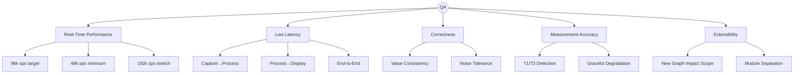
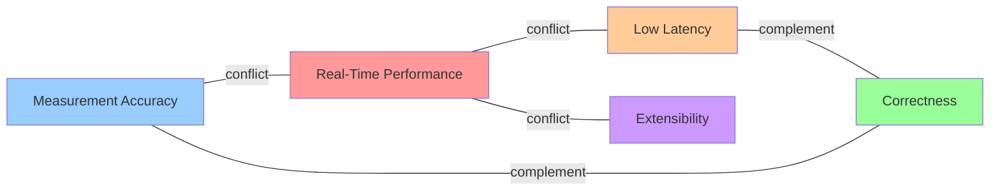

# Presentation D — QA Definitions & Grading Criteria Overview

> **Presenter**: (assign name)  
> **Date**: 2026-06-01 (Mon) Kickoff Workshop  
> **Source**: [Time Grapher Project Plan (Draft).pdf](../../../.claude/skills/time-grapher/assets/Time%20Grapher%20Project%20Plan%20(Draft).pdf) — p.25-26 (QA), p.32-33 (grading criteria)  
> **Goal**: Give the whole team a shared understanding of QA definitions and provide the foundation for agreeing on quantitative targets

---

## Slide 1 — Why QA Matters

What we're building is not just "working code" —  
it's an **architecture that satisfies Quality Attributes**.

> "The as-is code functions, but Solvit Inc believes the software architecture may be significantly improved."  
> — Project Plan

- QAs drive architecture decisions (which patterns? which trade-offs?)
- QAs define the criteria for experiment design
- QAs are the evaluation standard at the Final Demo

---

## Slide 2 — Overview: 5 Quality Attributes



---

## Slide 3 — QA 1: Real-Time Performance

**Definition**: The system must capture, process, analyze, and display acoustic data in real time on Raspberry Pi.

| Target level | Sample rate | Note |
|-------------|-------------|------|
| Minimum (required) | **48,000 sps** | Below this = project failure |
| Target (design basis) | **96,000 sps** | The number we design for |
| Stretch (aspirational) | **192,000 sps** | Attempt if time allows |

**Architecture implications**
- RPi 5 memory management is critical (memory pressure → global processing delay)
- A real-time processing pipeline structure is required
- **Validation on PC alone is not sufficient — must verify on RPi**

> **Needs team consensus today**: do we set our target sps at 96k?

---

## Slide 4 — QA 2: Low Latency

**Definition**: End-to-end latency from microphone capture to GUI display must be minimized.

**Three segments to measure**

```
[Mic capture] ──①──> [Beat detection / computation] ──②──> [GUI display]
                ①: Capture→Process latency
                                                      ②: Process→Display latency
[Mic capture] ─────────────────────────────────────> [GUI display]
                End-to-end latency (= ① + ②)
```

**Required reporting items** (must present as numbers at Final Demo)
- Per-segment latency: ① + ② + end-to-end (ms)
- **Average + worst-case** for each
- Dropped audio block count
- Missed beat detection count

> **Needs team consensus today**: latency targets (ms) per segment — not yet set. To be finalized after Week 2 Experiment results.

---

## Slide 5 — QA 3: Correctness

**Definition**: Computed watch performance metrics must be accurate, consistent, and based on the same underlying data across all GUI views.

**Core requirements**
- Rate, Amplitude, Beat Error values are derived from the same data source wherever shown in the GUI
- Long-term summary graphs and real-time displays must agree
- Beat detection must remain stable under ambient noise

**Why it's hard**
- Trace Display, Rate Stability, Beat Error View, Sequence Display, and others must all read from the same data simultaneously
- "Single data source" architectural design is the key decision

---

## Slide 6 — QA 4: Measurement Accuracy

**Definition**: T1 (impulse) and T3 (lock+banking) events must be detected accurately.

**Why it matters**

```
T1 (Impulse pin → Pallet fork)    → basis for Rate and Beat Error
T3 (Escape wheel lock + banking)  → used for Amplitude
T2 (Escape wheel → Pallet stone)  → irregular, not used in calculations
```

- Even a single-sample timing error affects Rate, Beat Error, and Amplitude
- Small timing differences are where all three metrics originate

**Reference baseline**: WeiShi No.1000 Standalone Timegrapher  
- Same watch, same conditions: compare our values vs WeiShi → Experiment 3

**Graceful Degradation**: when signal is weak or noisy → show a **clear failure indicator** instead of unstable values

---

## Slide 7 — QA 5: Extensibility

**Definition**: New graphs, filters, and measurement features must be addable without large-scale modifications to existing code.

**Background**: we need to add 11 mandatory graphs + Enhanced features  
→ If every addition requires a full codebase rework, the schedule will break

**How we measure it**
> "Number of files changed when adding one new graph" — used as an architecture evaluation metric

**Example architecture patterns**
- Plugin / Observer pattern → Extensibility
- Pipeline structure → independent processing stages
- Separation of Signal Acquisition ↔ Processing ↔ Presentation

> **Required at Final Demo**: explain "how much did existing code need to change when we added a new graph?"

---

## Slide 8 — QA Trade-off Map



**What the team must decide today**  
→ Which QA is the top architectural priority? (make the trade-offs explicit)

---

## Slide 9 — Milestone 3 Presentation Criteria (20 min)

> Source: Project Plan p.32

| Section | Content |
|---------|---------|
| **QA Requirements** | Select highest-priority QAs + explain their impact on architecture |
| **Architecture** | Architecture Views + key approaches + design rationale |
| **Experiments & Evaluation** | Experiment results + architecture evaluation activities |
| **Lessons Learned** | What went well / what went wrong / what we'd do differently |

**20 minutes = you cannot cover everything**  
→ Select only 1–2 key points per section and go deep on those

---

## Slide 10 — Final Demo Evaluation Criteria

> Source: Project Plan p.32-33

| Quality Attribute | Evidence required at demo |
|-------------------|---------------------------|
| **Low Latency** | Per-segment latency numbers (ms) — average + worst-case |
| **Real-Time Performance** | Confirm real-time operation on RPi |
| **Correctness / Consistency** | Value stability — same watch, same conditions |
| **Measurement Accuracy** | Value comparison against WeiShi No.1000 |
| **Extensibility** | Explain scope of impact on existing code when adding a new graph |

**Additional demo requirements**
- Demonstrate all newly added graphs and controls
- Explain what each added feature shows the user
- Emphasize that all features are integrated into the existing app, not a separate prototype

---

## Slide 11 — Grading Rubric Notice

> Source: Project Plan p.33

**Warning**: the TimeGrapher-specific grading rubric will be **distributed in Week 2 or Week 3**

- The "LG SW Architect Final Demo Grading Score Sheet" in assets → **that is for the ADS-B assignment** (not ours)
- When we receive the rubric, share it with the team immediately

---

## Slide 12 — Today's Team Consensus Items (Action Items)

> Target: reach consensus before Kickoff Workshop ends

| # | Item | Options |
|---|------|---------|
| 1 | **Target sps** | 96k (Project Plan baseline) / other value? |
| 2 | **Low Latency target values (ms)** | Confirm after Experiment results / set provisional targets? |
| 3 | **Extensibility metric** | "Number of files changed" / other indicator? |
| 4 | **QA priority order** | Which QA drives architectural design at rank 1? |
| 5 | **WeiShi No.1000 comparison baseline** | Acceptable error margin for Experiment 3 design |

Consensus outcomes will be incorporated into the **06/02 (Tue) afternoon QA draft share**

---

## References

| Document | Content | Location |
|----------|---------|----------|
| Time Grapher Project Plan | Full QA definitions | pp.25-26 |
| Time Grapher Project Plan | Presentation and demo criteria | pp.32-33 |
| Witschi Training Course | Graph interpretation | pp.14-19 |
| TimeGrapher Equations v0 | Rate / Amplitude / Beat Error formulas | full document |
