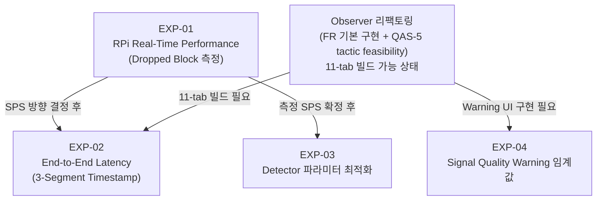
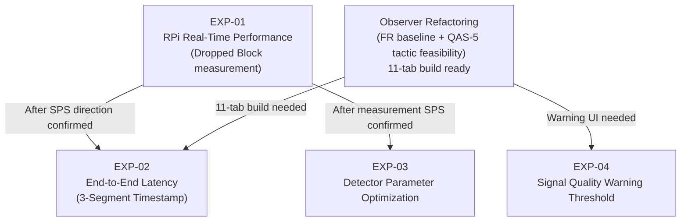

# 실험 실행 계획 (Week 2) / Experiment Execution Plan (Week 2)

> **작성일 / Date**: 2026-06-10  
> **기간 / Period**: 2026-06-10 (Mon) ~ 2026-06-14 (Fri)

---

## 1. 통신 아키텍처 컨텍스트 / Communication Architecture Context

**한국어**

실험을 이해하려면 먼저 어떤 컴포넌트 사이에서 어떤 채널로 데이터가 흐르는지 파악해야 한다. 실험 대상인 Ring Buffer와 Signal-Slot은 아래 경계에 위치한다.

```
[Audio Hardware]
      │ ALSA callback (OS interrupt, ~10ms period at 96k sps)
      ▼
[AudioCapture Thread]   ← Real-time thread (SCHED_RR 적용 대상)
      │ Lock-Free Ring Buffer  ← EXP-01 측정 대상 (overflow = Dropped Block)
      ▼                         Ring Buffer는 AudioCapture ↔ DSP 사이의 경계
[DSP Thread]
  (filter → T1/T3 detection → Rate/Amplitude/Beat Error 계산)
      │ Qt Signal-Slot (queued connection, thread boundary crossing)
      ▼                         Signal-Slot은 DSP ↔ GUI 사이의 경계
[Qt Main Thread (GUI)]
  (11개 탭 paintEvent) ← EXP-02 TS3 측정 대상
```

- **EXP-01 검증 구간**: AudioCapture → DSP (Ring Buffer overflow = Dropped Block)
- **EXP-02 검증 구간**: TS1(ALSA callback) → TS2(DSP 완료) → TS3(paintEvent 완료)
- Ring Buffer 메모리 사이즈는 overflow 발생 여부를 결정하지만, **overflow의 근본 원인은 DSP 처리 시간이 callback 주기를 초과하는 것**이다. 메모리 사이즈 단독으로는 해결되지 않는다.

**English**

To understand the experiments, it's essential to know which components exchange data through which channel. The Ring Buffer and Signal-Slot under test are located at these boundaries:

```
[Audio Hardware]
      │ ALSA callback (OS interrupt, ~10ms period at 96k sps)
      ▼
[AudioCapture Thread]   ← Real-time thread (target for SCHED_RR)
      │ Lock-Free Ring Buffer  ← EXP-01 measurement target (overflow = Dropped Block)
      ▼                         Ring Buffer sits at AudioCapture ↔ DSP boundary
[DSP Thread]
  (filter → T1/T3 detection → Rate/Amplitude/Beat Error calculation)
      │ Qt Signal-Slot (queued connection, crosses thread boundary)
      ▼                         Signal-Slot sits at DSP ↔ GUI boundary
[Qt Main Thread (GUI)]
  (11-tab paintEvent) ← EXP-02 TS3 measurement target
```

- **EXP-01 scope**: AudioCapture → DSP (Ring Buffer overflow = Dropped Block)
- **EXP-02 scope**: TS1 (ALSA callback) → TS2 (DSP done) → TS3 (paintEvent done)
- Ring Buffer memory size determines whether overflow occurs, but **the root cause of overflow is DSP processing time exceeding the callback period** — memory size alone does not resolve it.

---

## 2. 실험 의존성 / Experiment Dependencies

**한국어**



| 선행 조건 / Prerequisite | 해제되는 실험 / Unblocked Experiment |
|:------------------------:|:------------------------------------:|
| EXP-01 완료 (SPS 확정) | EXP-02, EXP-03 |
| Observer 리팩토링 완료 | EXP-02 (11-tab 빌드), EXP-04 (Warning UI) |

**English**



---

## 3. 일별 실행 계획 / Daily Execution Plan

**한국어**

6/10(수)~6/12(금) 3일이 실제 근무일이며, 6/13(토)~6/14(일)은 주말이다. EXP-01은 모든 실험의 블로커이므로 6/10(수) 첫 번째 작업으로 즉시 착수한다. EXP-04는 Warning UI 의존성 때문에 6/15(월) 오전으로 일부 넘어갈 수 있다.

| 날짜 / Date | 코드 개발팀 (신성호·홍손통·이지민) | 실험팀 (경진신·반규대·송태준·신동호) | 완료 기준 / Done Criteria |
|:-----------:|-------------------------------------|--------------------------------------|--------------------------|
| **6/10 (수)** | **Observer 리팩토링 착수**: 기존 God Object에서 Signal-Slot 구조로 분리 시작. *목적 이중: ① FR-05~08 기본 구현 가능 상태 확보 ② QAS-5 tactic(Layered Architecture + Restrict Dependencies + Observer) 실현 가능성 검증* | **EXP-01 착수 + 완료 목표**: RPi 환경 세팅 + `dropped_block_count` 주입 + 48k/96k/192k sps 측정 + Priority Scheduling(`SCHED_RR`) 전후 비교 → SPS 방향 결정 + QAS-1 Response Measure 확정 | EXP-01 결과 테이블 완료, SPS 확정 |
| **6/11 (목)** | **Observer 리팩토링 완료**: ≤3-file 제약 충족 여부 수동 검증 (기존 Rate·Amplitude·Beat Error 값 비교). *Tactic feasibility 판정: "실제로 ≤3-file 안에서 신규 탭 추가가 가능한가?" → 가능하면 QAS-5 tactic 채택, 불가능하면 아키텍처 재검토*. **FR-08 Warning UI 구현 착수**: EXP-04 선행 조건 확보 | **EXP-02 착수**: TS1/TS2/TS3 timestamp 주입 + 1-tab 구성 측정 + 11-tab 구성 측정 + Lazy Rendering 필요성 판단. **EXP-03 착수**: grid search Low→Medium→High noise 순차 진행 | EXP-02 결과 테이블 완료, EXP-03 최적 파라미터 확정 |
| **6/12 (금)** | **FR-08 Warning UI 완료**: EXP-04 착수 가능 상태 인계. **코드 통합**: EXP 결과 반영 준비, ADR 초안 작성 지원 | **EXP-03 완료** (오전, 잔여분). **EXP-04 착수**: Warning threshold Part A(N·M 값) + Part B(Noisy signal 임계값) — Warning UI 완료 즉시 착수. *미완료 시 6/15(월) 오전 마감* | EXP-03 완료, EXP-04 가능한 한 완료 |
| **6/13–14 (토·일)** | — 주말 버퍼 — | — 주말 버퍼 (EXP-04 미완료 시 6/15 오전 마감) — | — |

**English**

6/10 (Wed) ~ 6/12 (Fri) are the 3 actual working days; 6/13 (Sat) ~ 6/14 (Sun) are the weekend. EXP-01 blocks all other experiments — start immediately on 6/10 (Wed). EXP-04 may partially carry over to 6/15 (Mon) morning due to its Warning UI dependency.

| Date | Code Dev Team (Sungho·HungSon·Jimin) | Experiment Team (Gyeongjin·Kyudae·Taejoon·DongHo) | Done Criteria |
|:----:|---------------------------------------|---------------------------------------------|---------------|
| **6/10 (Wed)** | **Observer refactoring start**: Begin decomposing God Object into Signal-Slot structure. *Dual purpose: ① Prepare FR-05~08 baseline implementation ② Verify tactic feasibility for QAS-5 (Layered Architecture + Restrict Dependencies + Observer)* | **EXP-01 start + complete (target)**: RPi env setup + inject `dropped_block_count` + 48k/96k/192k sps measurement + Priority Scheduling (`SCHED_RR`) before/after comparison → SPS direction decided + QAS-1 Response Measure finalized | EXP-01 result table written, SPS confirmed |
| **6/11 (Thu)** | **Observer refactoring complete**: Verify ≤3-file constraint manually (compare Rate·Amplitude·Beat Error values). *Tactic feasibility verdict: "Can a new tab actually be added within ≤3 files?" → Yes: QAS-5 tactic adopted; No: architecture re-examined*. **FR-08 Warning UI start**: Unblock EXP-04 prerequisite | **EXP-02 start**: Inject TS1/TS2/TS3 timestamps + 1-tab measurement + 11-tab measurement + Lazy Rendering necessity decision. **EXP-03 start**: Grid search Low→Medium→High noise in sequence | EXP-02 result table complete, EXP-03 optimal params confirmed |
| **6/12 (Fri)** | **FR-08 Warning UI complete**: Hand off EXP-04-ready build. **Code integration**: Incorporate EXP results, assist with ADR drafting | **EXP-03 complete** (morning, remaining). **EXP-04 start**: Warning threshold Part A (N·M values) + Part B (Noisy signal threshold) — start immediately once Warning UI is ready. *If incomplete: hard deadline 6/15 (Mon) morning* | EXP-03 complete, EXP-04 as far as possible |
| **6/13–14 (Sat–Sun)** | — Weekend buffer — | — Weekend buffer (EXP-04 hard deadline: 6/15 Mon morning if not done) — | — |

---

## 4. 각 실험의 아키텍처 결정 연결 / Architectural Decision Link per Experiment

**한국어**

실험이 끝난 뒤 어떤 아키텍처 결정이 확정되는지 명시한다. 이 결정들이 6/15 이후 ADD 스프린트의 입력이 된다.

| 실험 / Experiment | 확정되는 아키텍처 결정 / Decision Confirmed | 결정 안 되면 / If not decided |
|:-----------------:|----------------------------------------------|-------------------------------|
| **Observer 리팩토링** | **QAS-5 tactic feasibility**: Layered Architecture + Restrict Dependencies + Observer 패턴으로 ≤3-file 신규 탭 추가가 실제로 가능한지 확인. 가능하면 tactic 채택 확정; 불가능하면 아키텍처 재검토 | Extensibility 구조 미확정 → S3 그래프 병렬 개발 불가 |
| **EXP-01** | Lock-Free Ring Buffer 필수 여부, 최종 SPS(96k or 48k), Graceful Degradation 발동 조건 | QAS-1 미달 → 모든 후속 QA 목표가 의미 없음 |
| **EXP-02** | Lazy Rendering 적용 여부, Thread 분리 확정, QAS-2 BPH별 latency target | Latency tactic 결정 불가 → S2 스프린트 방향 미정 |
| **EXP-03** | `Detector.cpp` default 파라미터 확정, Adaptive threshold 유효성 검증 | QAS-3 Response Measure 미확정 → S3 스프린트 기준 미정 |
| **EXP-04** | Heartbeat N·M 초 확정, Noisy signal 임계값 코드 상수화 | QAS-4 Response Measure 미확정 → S4 스프린트 기준 미정 |

**English**

After each experiment, the following architectural decisions are confirmed. These become the inputs to ADD sprints starting 6/15.

| Experiment | Architectural Decision Confirmed | If Not Decided |
|:----------:|----------------------------------|----------------|
| **Observer Refactoring** | **QAS-5 tactic feasibility**: Confirms whether Layered Architecture + Restrict Dependencies + Observer pattern actually allows new-tab addition within ≤3 files. Yes → tactic adopted; No → architecture re-examined | Extensibility structure unconfirmed → S3 parallel graph development impossible |
| **EXP-01** | Lock-Free Ring Buffer required/optional, final SPS (96k or 48k), Graceful Degradation trigger condition | QAS-1 unmet → all subsequent QA targets become meaningless |
| **EXP-02** | Lazy Rendering apply/skip, thread separation confirmed, QAS-2 BPH-based latency targets | Cannot decide latency tactic → S2 sprint direction undefined |
| **EXP-03** | `Detector.cpp` default params confirmed, Adaptive threshold validity verified | QAS-3 Response Measure unresolved → S3 sprint baseline undefined |
| **EXP-04** | Heartbeat N·M seconds confirmed, Noisy signal threshold hardened as code constant | QAS-4 Response Measure unresolved → S4 sprint baseline undefined |

---

## 5. 실패 시 대응 / Contingency

**한국어**

| 시나리오 / Scenario | 대응 / Response |
|:--------------------|:----------------|
| EXP-01이 6/11까지 미완료 | EXP-02/03를 48k sps 가정으로 선착수 (Graceful Degradation 결정 후); EXP-01 결과로 사후 보정 |
| Observer 리팩토링이 6/11까지 미완료 | EXP-02를 1-tab 단독 빌드로 먼저 실행; 11-tab 측정은 리팩토링 완료 후 추가 |
| EXP-03/04가 6/14까지 미완료 | S3/S4 스프린트 시작 시 최선 추정값(best estimate)으로 진행; 실험 완료 즉시 ADR 갱신 |

**English**

| Scenario | Response |
|:---------|:---------|
| EXP-01 not complete by 6/11 | Start EXP-02/03 assuming 48k sps (post Graceful Degradation decision); retroactively adjust with EXP-01 results |
| Observer refactoring not complete by 6/11 | Run EXP-02 on 1-tab build first; add 11-tab measurement after refactoring completes |
| EXP-03/04 not complete by 6/14 | Start S3/S4 sprints with best-estimate values; update ADR immediately when experiments conclude |
