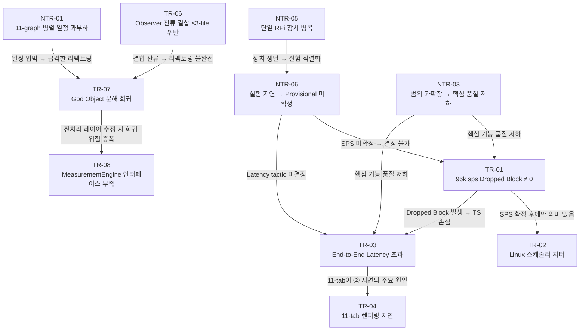
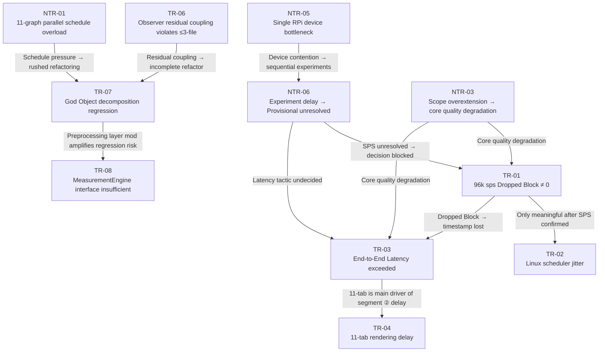

# Risk 관계 및 우선순위 / Risk Relationships & Priority

> **작성일 / Date**: 2026-06-10  
> **참고 / Reference**: [`../milestone1/final/03-risk-assessment.md`](../milestone1/final/03-risk-assessment.md)

---

## 1. 리스크 우선순위 재정렬 / Risk Priority Re-ranking

**한국어**

리스크 우선순위는 **발생 가능성(Prob) × 영향도(Impact)** 기준이다. QA 중요도 순이 아님에 유의한다. 발생 가능성이 낮거나 영향도가 낮으면 우선도가 내려간다.

| 우선순위 | ID | Risk | Prob | Impact | 우선순위 근거 |
|:--------:|----|----|:----:|:------:|------------|
| **1** | TR-01 | RPi 5가 96k sps에서 Dropped Block = 0 미달 | H | H | 발생 시 모든 측정 불가 → 프로젝트 전체 붕괴 |
| **2** | TR-03 | End-to-End latency가 beat period 초과 | H | H | 실시간 표시 붕괴 → 수리 결정 불가 |
| **3** | NTR-01 | 11개 그래프 병렬 구현 일정 과부하 | H | H | 일정 초과 → 데모 미완성 |
| **4** | NTR-03 | 범위 과확장 — 11개 그래프 구현이 핵심 품질 저하 | H | M | 핵심 측정 기능(QAS-1~3) 품질 저하 |
| **5** | NTR-02 | 코딩/아키텍처 경계 불명확 — 설계 결정 미반영 | H | M | 모든 QA tactic이 코드에 반영 안 될 위험 |
| **6** | TR-07 | God Object 분해 중 기존 그래프 회귀 | M | H | 회귀 → 롤백 → QAS-5(Extensibility) 포기 |
| **7** | TR-02 | Linux 스케줄러 지터 → 간헐적 Dropped Block | M | H | 장기 Rate 오차 누적; TR-01과 연동 |
| **8** | NTR-04 | 영어 소통 오버헤드 — 설계 결정 전달 누락 | M | H | 평가 점수 직결, 영어권 팀원 맥락 누락 |
| **9** | TR-04 | 11-tab 렌더링 → ② process→display > 30ms | M | M | TR-03의 하위 시나리오; Lazy Rendering으로 완화 가능 |
| **10** | TR-05 | Detector 기본 파라미터가 소음 환경에서 실패 | M | M | 부분적 측정 저하; 적응형 임계값으로 완화 가능 |
| **11** | TR-06 | Observer 리팩토링 후 잔류 결합 → ≤3-file 위반 | M | M | 그래프 추가 비용 증가; TR-07과 연동 |
| **12** | NTR-05 | RPi 5 단일 장치 → 실험 병목 | M | M | 실험 지연 → NTR-06 유발 |
| **13** | NTR-06 | 실험 지연으로 Provisional 값 미확정 | M | M | NTR-05의 결과; ADD 결정 지연 |
| **14** | TR-08 | 새 그래프가 MeasurementEngine 미제공 데이터 필요 | L | M | 발생 가능성 낮음; 사전 인터페이스 확장으로 예방 |
| **15** | TR-09 | Signal quality warning 임계값 실환경 불일치 | M | L | 측정 정확도 무관; UX 저하만 |

**English**

Risk priority is based on **Probability × Impact** — not QA importance order. Risks with low probability or low impact rank lower.

| Priority | ID | Risk | Prob | Impact | Rationale |
|:--------:|----|----|:----:|:------:|-----------|
| **1** | TR-01 | RPi 5 cannot achieve Dropped Block = 0 at 96k sps | H | H | Occurs → all measurement impossible → full project collapse |
| **2** | TR-03 | End-to-end latency exceeds beat period | H | H | Real-time display breakdown → repair decisions impossible |
| **3** | NTR-01 | Schedule overload for 11-graph parallel implementation | H | H | Schedule overrun → incomplete demo |
| **4** | NTR-03 | Scope overextension — 11 graphs degrade core quality | H | M | Core measurement quality (QAS-1~3) degrades |
| **5** | NTR-02 | Coding/architecture boundary unclear | H | M | All QA tactics risk not being reflected in code |
| **6** | TR-07 | Regression in existing graphs during God Object decomposition | M | H | Regression → rollback → QAS-5 (Extensibility) abandoned |
| **7** | TR-02 | Linux scheduler jitter → intermittent Dropped Blocks | M | H | Long-term Rate error accumulation; linked to TR-01 |
| **8** | NTR-04 | English communication overhead — design decisions not conveyed | M | H | Direct evaluation impact, English-speaking member loses context |
| **9** | TR-04 | 11-tab rendering pushes ② process→display > 30ms | M | M | Sub-scenario of TR-03; mitigable by Lazy Rendering |
| **10** | TR-05 | Detector default params fail under ambient noise | M | M | Partial measurement degradation; mitigable by adaptive threshold |
| **11** | TR-06 | Residual coupling after Observer refactoring violates ≤3-file | M | M | Graph addition cost grows; linked to TR-07 |
| **12** | NTR-05 | Single RPi 5 device creates experiment bottleneck | M | M | Experiment delays → triggers NTR-06 |
| **13** | NTR-06 | Delayed experiments → Provisional values unresolved | M | M | Result of NTR-05; delays ADD decisions |
| **14** | TR-08 | New graph needs data not provided by MeasurementEngine | L | M | Low probability; preventable by pre-expanding interface |
| **15** | TR-09 | Signal quality warning thresholds mismatched to real environment | M | L | Unrelated to measurement accuracy; UX degradation only |

---

## 2. Risk 전파 관계 / Risk Propagation Relationships

**한국어**

Risk들은 독립적이지 않다. 하나의 Risk가 발생하면 연쇄적으로 다른 Risk의 발생 가능성을 높인다.



**English**

Risks are not independent. When one risk occurs, it increases the probability of others cascading.



---

## 3. 관계 요약 / Relationship Summary

**한국어**

| 관계 유형 / Relationship Type | Risk 쌍 / Risk Pair | 설명 / Description |
|:-----------------------------:|:-------------------:|-------------------|
| **순차 의존** | NTR-05 → NTR-06 → TR-01/03 | 단일 장치 병목이 실험 지연을 낳고, 지연이 성능 리스크를 미해소 상태로 유지 |
| **전제 조건** | TR-01 → TR-02 | TR-01이 해소(96k 달성)된 경우에만 TR-02(지터)가 의미 있는 리스크 |
| **포함 관계** | TR-03 ⊃ TR-04 | TR-04는 TR-03의 특수 케이스 (11-tab이 latency 위반의 한 원인) |
| **공동 발생** | TR-06 + TR-07 | 잔류 결합(TR-06)이 있을수록 리팩토링 중 회귀(TR-07) 확률 증가 |
| **증폭** | NTR-01 → TR-07 | 일정 압박이 증가할수록 급격한 리팩토링 → 회귀 위험 증폭 |
| **공통 원인** | NTR-03 → TR-01, TR-03 | 범위 과확장이 핵심 기능 구현 시간을 빼앗아 성능 리스크 완화 작업 미착수 |

**English**

| Relationship Type | Risk Pair | Description |
|:-----------------:|:---------:|-------------|
| **Sequential dependency** | NTR-05 → NTR-06 → TR-01/03 | Single device bottleneck causes experiment delay, keeping performance risks unresolved |
| **Prerequisite** | TR-01 → TR-02 | TR-02 (jitter) is only a meaningful risk once TR-01 is resolved (96k achieved) |
| **Containment** | TR-03 ⊃ TR-04 | TR-04 is a specific scenario of TR-03 (11-tab rendering is one cause of latency violation) |
| **Co-occurrence** | TR-06 + TR-07 | More residual coupling (TR-06) → higher probability of regression (TR-07) during refactoring |
| **Amplification** | NTR-01 → TR-07 | As schedule pressure increases, rushed refactoring amplifies regression risk |
| **Common cause** | NTR-03 → TR-01, TR-03 | Scope overextension steals time from core feature work, leaving performance risk mitigations unstarted |

---

## 4. 핵심 완화 경로 / Critical Mitigation Path

**한국어**

가장 높은 우선순위 리스크(TR-01, TR-03)는 모두 **EXP-01 → EXP-02** 실험 체인이 해소한다. 따라서 Week 2의 최우선 과제는 EXP-01 즉시 착수이다.

```
EXP-01 완료
  → TR-01 확정 (SPS 결정)
  → TR-02 완화 (Priority Scheduling 검증)
  → EXP-02 착수 가능
     → TR-03 확정 (Latency 실측)
     → TR-04 완화 결정 (Lazy Rendering 필요 여부)

Observer 리팩토링 완료
  → TR-06 완화 (≤3-file 검증)
  → TR-07 위험 감소 (점진적 리팩토링 + 기준값 테스트)
  → NTR-01 완화 (병렬 개발 가능 구조 확보)
```

**English**

The two highest-priority risks (TR-01, TR-03) are both resolved by the **EXP-01 → EXP-02** experiment chain. Therefore, the top priority for Week 2 is starting EXP-01 immediately.

```
EXP-01 complete
  → TR-01 confirmed (SPS decided)
  → TR-02 mitigated (Priority Scheduling verified)
  → EXP-02 unblocked
     → TR-03 confirmed (Latency measured)
     → TR-04 mitigation decided (Lazy Rendering necessity determined)

Observer refactoring complete
  → TR-06 mitigated (≤3-file verified)
  → TR-07 risk reduced (incremental refactoring + baseline tests)
  → NTR-01 mitigated (parallel-development-ready structure secured)
```
