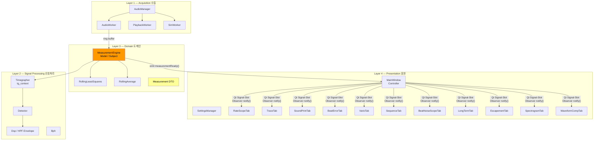
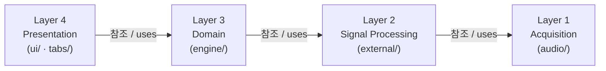
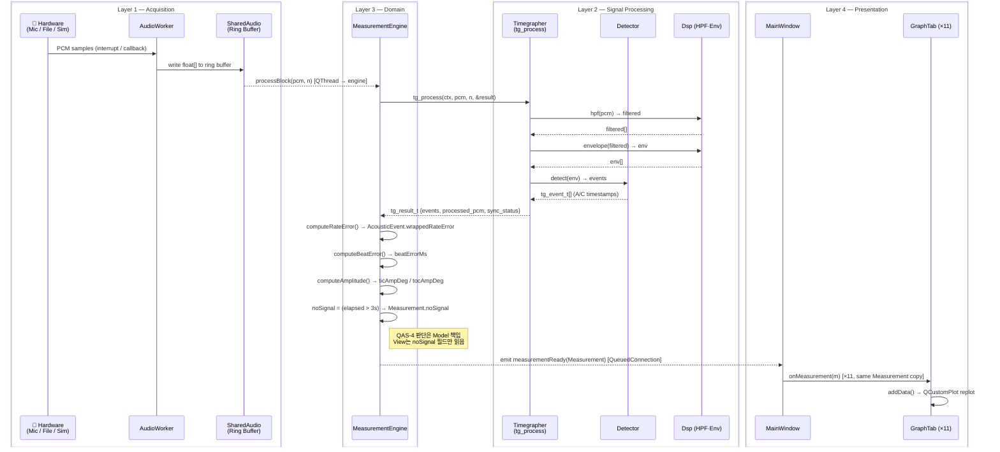
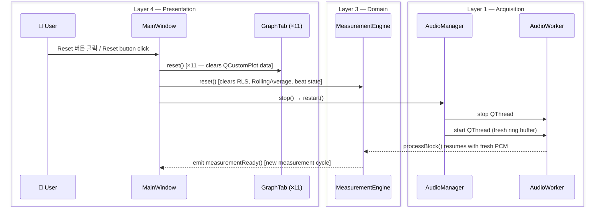
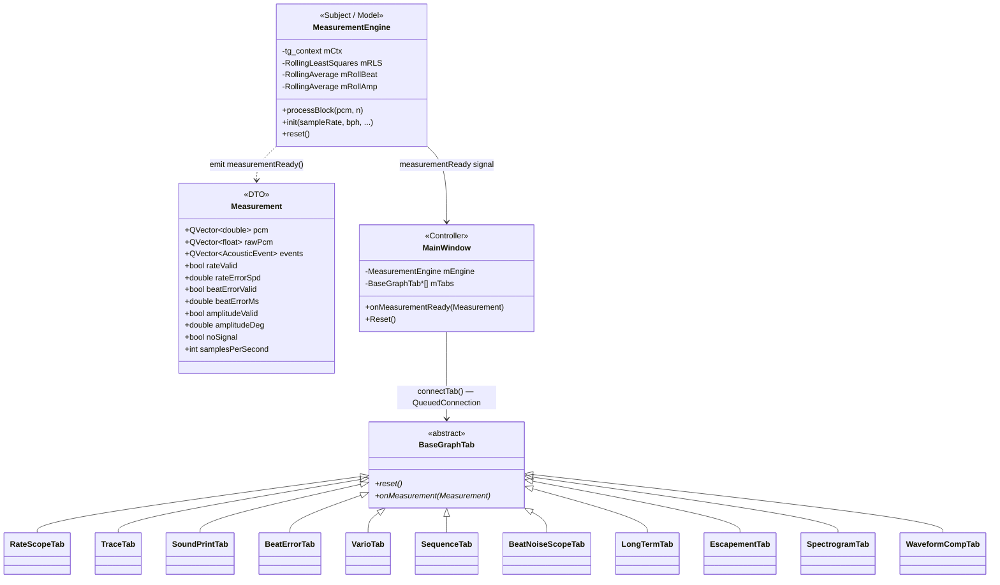

# God Object 분해 설계 (Week 2 갱신) / God Object Decomposition Design (Week 2 Update)

> **작성일 / Date**: 2026-06-10  
> **최종 갱신 / Last Updated**: 2026-06-11 — MVC 역할 경계 리팩토링 반영  
> **브랜치 / Branch**: `feature/layer`
> **출처 / Source**: `src/` 실제 구현 코드 기준

---

## 목차 / Table of Contents

1. [한눈에 보기 — 전체 그림](#1-한눈에-보기--big-picture)
2. [레이어 뷰 — 4계층 구조](#2-레이어-뷰--layered-view)
3. [파이프-필터 뷰 — 신호 처리 흐름](#3-파이프-필터-뷰--pipe-and-filter-view)
4. [시퀀스 뷰 — 레이어 간 제어 흐름](#4-시퀀스-뷰--sequence-view)
5. [컴포넌트 뷰 — 모듈별 역할](#5-컴포넌트-뷰--component-view)
6. [클래스 뷰 — Observer 패턴](#6-클래스-뷰--observer-pattern-class-view)
7. [데이터 뷰 — Measurement DTO](#7-데이터-뷰--measurement-dto)
8. [11개 탭 상세](#8-11개-탭-상세--11-graph-tabs-detail)
9. [QAS 대응 전술](#9-qas-대응-전술--qas-tactics)
10. [디렉토리 구조](#10-디렉토리-구조--directory-structure)

---

## 1. 한눈에 보기 / Big Picture

**한국어**

원본 1,540줄짜리 `MainWindow.cpp` (God Object) 를 **4개 레이어, 20개 이상의 클래스**로 분해했습니다.
핵심 원칙은 두 가지입니다.

- **단방향 의존**: 상위 레이어만 하위 레이어를 알 수 있습니다 (역방향 금지)
- **단일 발행원**: `MeasurementEngine` 이 `Measurement` 를 한 번만 발행 → 모든 탭이 동일한 데이터를 받아 일관성 보장 (QAS-3)

**English**

The original 1,540-line `MainWindow.cpp` (God Object) was decomposed into **4 layers and 20+ classes**.
Two core principles:

- **One-way dependency**: upper layers may only reference lower layers (reverse forbidden)
- **Single publication source**: `MeasurementEngine` publishes `Measurement` once → all tabs receive identical data, ensuring consistency (QAS-3)



---

## 2. 레이어 뷰 / Layered View

**한국어**

각 레이어는 **바로 아래 레이어만** 사용합니다. 레이어를 건너뛰거나 역방향 참조는 금지됩니다.

**English**

Each layer uses **only the layer immediately below** it. Cross-layer skipping and reverse references are forbidden.



| 레이어 번호 / Layer # | 이름 / Name | 디렉토리 / Directory | 핵심 책임 / Core Responsibility |
|:---:|---|---|---|
| **4** | Presentation | `src/ui/` `src/tabs/` | UI 표시, 사용자 이벤트, 그래프 렌더링 |
| **3** | Domain | `src/engine/` | 측정값 계산 (Rate·Beat·Amplitude), 상태 관리 |
| **2** | Signal Processing | `src/external/` | HPF, Envelope, Beat 검출 (DSP 파이프라인) |
| **1** | Acquisition | `src/audio/` | 마이크·파일·시뮬레이터 PCM 수집, 링버퍼 |

> **Legend (범례)**
> - `src/ui/` → MainWindow, SettingsManager
> - `src/tabs/` → 11개 그래프 탭 (BaseGraphTab 하위 클래스)
> - `src/engine/` → MeasurementEngine, Measurement DTO, RLS, RollingAverage
> - `src/external/` → Timegrapher(tg_*), Detector, Dsp, SoundImageRenderer, Kiss FFT
> - `src/audio/` → AudioManager, AudioWorker, PlaybackWorker, SimWorker

---

## 3. 파이프-필터 뷰 / Pipe-and-Filter View

**한국어**

원본 PCM이 왼쪽에서 오른쪽으로 단방향 변환됩니다. 각 **필터(Filter)**는 입력만 받고 다음 단계로만 넘겨줍니다. 역방향 데이터 흐름이 없으므로 각 단계를 독립적으로 교체·테스트할 수 있습니다.

**English**

Raw PCM flows left-to-right through a unidirectional chain. Each **filter** only receives input and passes output to the next stage. Because there is no reverse flow, each stage can be replaced or tested independently.

```mermaid
graph LR
    MIC["🎤 마이크 / Mic\n(AudioWorker)"]
    HPF["HPF\n고역통과 필터\n(Dsp.cpp)"]
    ENV["Envelope\n포락선 검출\n(Dsp.cpp)"]
    DET["Detector\n비트 검출\n(Detector.cpp)"]
    EVT["AcousticEvent\nA/C 이벤트"]
    ME["MeasurementEngine\nRate·Beat·Amplitude 계산"]
    DTO["Measurement DTO\n(단일 발행)"]
    TABS["11개 그래프 탭\n(Observer)"]

    MIC -->|"raw PCM float[]"| HPF
    HPF -->|"filtered PCM"| ENV
    ENV -->|"envelope PCM"| DET
    DET -->|"tg_event_t[]"| EVT
    EVT -->|"계산 입력"| ME
    ME -->|"emit measurementReady()"| DTO
    DTO -->|"Qt QueuedConnection"| TABS
```



| 단계 / Stage | 입력 / Input | 출력 / Output | 구현 파일 / File |
|---|---|---|---|
| HPF (고역통과 필터) | `float[]` raw PCM | `float[]` filtered | `external/Dsp.cpp` |
| Envelope (포락선) | `float[]` filtered | `float[]` envelope | `external/Dsp.cpp` |
| Detector (비트 검출) | `float[]` envelope | `tg_event_t[]` | `external/Detector.cpp` |
| MeasurementEngine (계산) | `tg_event_t[]` | `Measurement` struct | `engine/MeasurementEngine.cpp` |
| 11개 탭 (렌더링) | `Measurement` | QCustomPlot 갱신 | `tabs/*.cpp` |

> **Legend (범례)**
> - **HPF**: High-Pass Filter — 저주파 노이즈 제거 (시계 소리 = 고주파 성분만 통과)
> - **Envelope**: 신호의 포락선(진폭 외곽선) 추출
> - **Detector**: 포락선에서 T1(A-event) / T3(C-event) 비트 타임스탬프 검출
> - **tg_event_t**: Timegrapher C 라이브러리의 이벤트 구조체
> - **QueuedConnection**: GUI 스레드와 오디오 스레드 분리를 위한 Qt 비동기 연결

---

## 4. 시퀀스 뷰 / Sequence View

**한국어**

시퀀스 다이어그램은 두 가지 주요 흐름을 보여줍니다.

- **정상 측정 흐름**: 마이크 PCM이 레이어를 순서대로 통과해 그래프까지 도달하는 경로
- **리셋 흐름**: 사용자가 리셋 버튼을 누를 때 각 레이어가 순서대로 초기화되는 경로

각 참여자(participant)에는 소속 레이어가 명시되어 있어 레이어 경계에서 어떤 인터페이스가 사용되는지 한눈에 확인할 수 있습니다.

**English**

The sequence diagrams show two major flows:

- **Normal measurement flow**: how raw PCM from the microphone passes through each layer in order and arrives at the graph tabs
- **Reset flow**: how each layer is cleared in sequence when the user presses Reset

Each participant is annotated with its layer so that the interface crossing each layer boundary is visible at a glance.

### 4.1 정상 측정 흐름 / Normal Measurement Flow



### 4.2 리셋 흐름 / Reset Flow



> **Legend (범례)**
>
> | 표기 / Notation | 의미 / Meaning |
> |---|---|
> | `box Layer N` | 해당 레이어에 소속된 참여자 그룹 |
> | `->>` | 동기 호출 / Synchronous call |
> | `-->>` | 반환값 또는 시그널 / Return value or Qt signal |
> | `[QueuedConnection]` | Qt 이벤트 루프를 통한 스레드 경계 전달 |
> | `×11` | 11개 탭 모두 동일하게 호출됨 |
> | `computeXxx()` | MeasurementEngine 내부 private 메서드 (레이어 외부 미노출) |

---

## 5. 컴포넌트 뷰 / Component View

**한국어**

각 컴포넌트의 역할, 의존 관계, 핵심 인터페이스를 정리합니다.

**English**

Responsibilities, dependencies, and key interfaces for each component.

### 4.1 Acquisition Layer

| 컴포넌트 / Component | 역할 / Role | 주요 메서드 / Key Method | 의존 / Depends On |
|---|---|---|---|
| `AudioManager` | 오디오 모드 전환 총괄 (Live/Playback/Sim) | `startLive()` `startPlayback()` `startSim()` | AudioWorker, PlaybackWorker, SimWorker |
| `AudioWorker` | 마이크 실시간 PCM 수집, 링버퍼 기록 | `run()` (QThread) | `SharedAudio` ring buffer |
| `PlaybackWorker` | WAV 파일 재생, 링버퍼 기록 | `run()` | `SharedAudio` |
| `SimWorker` | WatchSynthStream으로 합성 비트 생성 | `run()` | `WatchSynthStream` |

### 4.2 Signal Processing Layer

| 컴포넌트 / Component | 역할 / Role | 핵심 API | 비고 / Note |
|---|---|---|---|
| `Timegrapher` | DSP 파이프라인 총괄 C 라이브러리 | `tg_init()` `tg_process()` `tg_cleanup()` | 외부 라이브러리 (수정 불가) |
| `Dsp` | HPF + Envelope 구현 | `hpf()` `envelope()` | `Timegrapher` 내부 호출 |
| `Detector` | 비트 피크 검출, 임계값 관리 | `detect()` | onset / peak 두 가지 모드 |
| `Bph` | BPH ↔ Hz 변환 유틸리티 | `bphToHz()` | 순수 계산 |
| `SoundImageRenderer` | PCM → 비트맵 렌더링 | `processSamples()` `markAEvent()` | SoundPrintTab이 소유 |
| `Kiss FFT` | 경량 FFT 라이브러리 (C) | `kiss_fft_alloc()` `kiss_fft()` | SpectrogramTab이 사용 |

### 4.3 Domain Layer

| 컴포넌트 / Component | 역할 / Role | 핵심 API | 패턴 |
|---|---|---|---|
| `MeasurementEngine` | Model + Observer Subject — Rate·Beat·Amplitude 계산 및 QAS-4 noSignal 판단 포함 | `processBlock()` → `emit measurementReady()` | MVC Model, Observer Subject |
| `Measurement` | 측정 결과 DTO | 데이터 구조체 (메서드 없음) | DTO (Data Transfer Object) |
| `AcousticEvent` | 단일 A/C 이벤트 정보 | 데이터 구조체 | DTO |
| `RollingLeastSquares` | Rate 계산용 슬라이딩 회귀 | `Add()` `GetSlope()` | Strategy |
| `RollingAverage` | Beat Error / Amplitude 평균 | `Add()` `GetAverage()` | Strategy |

### 4.4 Presentation Layer

| 컴포넌트 / Component | 역할 / Role | 핵심 API | 패턴 |
|---|---|---|---|
| `MainWindow` | Controller — 탭 생성·연결·리셋 | `onMeasurementReady()` `Reset()` | MVC Controller |
| `SettingsManager` | QSettings 래퍼, BPH 저장/복원 | `loadBph()` `saveBph()` | Façade |
| `BaseGraphTab` | 11개 탭의 공통 인터페이스 | `reset()` `onMeasurement()` | Observer (abstract) |
| 11개 Tab 클래스 | 각 그래프 렌더링 | `onMeasurement(Measurement)` | Observer ConcreteObserver |

> **Legend (범례)**
> - **DTO**: 계산 로직 없이 데이터만 담는 구조체
> - **MVC**: Model-View-Controller 패턴
> - **Observer Subject**: 상태 변경을 구독자에게 통보하는 역할
> - **Observer ConcreteObserver**: Subject의 통보를 받아 화면 갱신

### 5.5 MVC 역할 경계 / MVC Role Boundaries

**한국어**

MVC 세 역할이 이 프로젝트에서 어떻게 대응되는지, 그리고 각 역할이 **하면 안 되는 것**을 명시합니다.

**English**

Shows how MVC roles map to this project and what each role must **not** do.

| MVC 역할 / Role | 이 프로젝트 구현체 / Implementation | 해야 할 것 / Must Do | 하면 안 되는 것 / Must NOT Do |
|:---:|---|---|---|
| **Model** | `MeasurementEngine` + `Measurement` DTO | Rate·Beat·Amplitude 계산, `noSignal` 판단, 상태 관리 | `QLabel`, `setText()` 등 UI 코드 참조 |
| **View** | 11개 `GraphTab` + `MainWindow::DisplayResults()` | `Measurement` 필드를 읽어 화면에 표시, 문자열 포맷 | `elapsed > 3000` 같은 도메인 판단, 계산 |
| **Controller** | `MainWindow` (탭 연결·생성·리셋) | 사용자 입력 → `mEngine` 호출, 탭 등록 | 비즈니스 로직, 렌더링 코드 |

**리팩토링 전후 비교 / Before vs After**

| 항목 / Item | Before (위반) | After (수정) |
|---|---|---|
| noSignal 판단 위치 | `MainWindow::DisplayResults()` — Controller | `MeasurementEngine::processBlock()` — Model ✅ |
| noSignal 전달 방식 | Controller가 직접 `QElapsedTimer` 보유·판단 | `Measurement.noSignal` 필드로 발행, View가 읽기만 함 ✅ |
| DisplayResults() 책임 | 판단 + 포맷 혼재 | 포맷(View 로직)만 담당 ✅ |

---

## 6. 클래스 뷰 / Observer Pattern Class View

**한국어**

`MeasurementEngine`(Subject)이 `measurementReady` 시그널을 발행하면, Qt Signal-Slot 메커니즘이 Observer 패턴의 `notify()`를 대체합니다. 모든 탭은 **동일한 `Measurement` 객체의 복사본**을 받습니다.

**English**

When `MeasurementEngine` (Subject) emits `measurementReady`, Qt Signal-Slot replaces the Observer `notify()`. All tabs receive **a copy of the same `Measurement` object**.



**탭 연결 코드 / Tab Connection Code** (`MainWindow.cpp`)

```cpp
// Observer 패턴: Subject → ConcreteObserver 등록 (3줄)
auto connectTab = [&](BaseGraphTab *tab) {
    QObject::connect(mEngine, &MeasurementEngine::measurementReady,
                     tab, &BaseGraphTab::onMeasurement,
                     Qt::QueuedConnection);  // GUI 스레드 보호
};
connectTab(mRateScopeTab);  // 11개 탭 모두 동일 방식
```

> **QueuedConnection이 중요한 이유 / Why QueuedConnection matters**
>
> 오디오 처리는 별도 스레드에서 실행됩니다. `Qt::QueuedConnection`을 사용하면
> 시그널이 Qt 이벤트 루프를 통해 GUI 스레드로 안전하게 전달되어 스레드 충돌(race condition)이 방지됩니다.

---

## 7. 데이터 뷰 / Measurement DTO

**한국어**

`Measurement` 구조체는 한 번의 블록 처리 결과를 모든 탭에 전달하는 **유일한 데이터 통로**입니다. 모든 탭은 동일한 `Measurement`를 받기 때문에 탭 간 값 불일치가 구조적으로 불가능합니다 (QAS-3 Correctness).

**English**

The `Measurement` struct is the **sole data channel** conveying one block's results to all tabs. Because every tab receives the same `Measurement`, value mismatches between tabs are structurally impossible (QAS-3 Correctness).

### Measurement 필드 / Fields

| 필드 / Field | 타입 / Type | 의미 / Meaning | 사용 탭 / Used By |
|---|---|---|---|
| `pcm` | `QVector<double>` | 필터링된 PCM (envelope 출력) | RateScopeTab |
| `threshold` | `QVector<double>` | Detector 임계값 | RateScopeTab |
| `rawPcm` | `QVector<float>` | 원본 PCM (필터 전) | SoundPrintTab, WaveformCompTab, SpectrogramTab |
| `graphTickStart` | `uint64_t` | 블록 첫 샘플의 절대 인덱스 | WaveformCompTab (블록 경계 계산) |
| `graphTickEnd` | `uint64_t` | 블록 마지막 샘플의 절대 인덱스 | RateScopeTab |
| `events` | `QVector<AcousticEvent>` | 이 블록의 A/C 이벤트 목록 | 대부분의 탭 |
| `synced` | `bool` | BPH 동기화 완료 여부 | SoundPrintTab, RateScopeTab |
| `detectedBph` | `int` | 검출된 BPH 값 | SoundPrintTab |
| `rateValid` | `bool` | Rate 계산값 유효 여부 | TraceTab, LongTermTab |
| `rateErrorSpd` | `double` | Rate 오차 (s/day) | TraceTab, LongTermTab |
| `beatErrorValid` | `bool` | Beat Error 유효 여부 | BeatErrorTab |
| `beatErrorMs` | `double` | Beat Error 롤링 평균 (ms) | BeatErrorTab |
| `amplitudeValid` | `bool` | Amplitude 유효 여부 | VarioTab |
| `amplitudeDeg` | `double` | Amplitude 롤링 평균 (°) | VarioTab (참고용) |
| `noSignal` | `bool` | A-event 3초 이상 미수신 (QAS-4) — **Engine이 판단, View가 읽기만 함** | MainWindow (ResultsLabel) |
| `samplesPerSecond` | `int` | 현재 샘플레이트 (Hz) | 모든 탭 (시간 환산) |

### AcousticEvent 필드 / Fields

| 필드 / Field | 타입 / Type | 의미 / Meaning | 유효 조건 / Valid When |
|---|---|---|---|
| `samplePos` | `double` | 이벤트 절대 샘플 인덱스 (소수점 정밀도) | 항상 |
| `isA` | `bool` | `true` = T1(A, Tic), `false` = T3(C, Toc) | 항상 |
| `peakValue` | `float` | 이벤트 피크 진폭 | 항상 |
| `hasRatePoint` | `bool` | Rate scatter 포인트 유효 여부 | A-event & synced |
| `wrappedRateError` | `double` | Rate 오차 (ms, wrapped) | `hasRatePoint == true` |
| `isTic` | `bool` | Tic (짝수 비트) / Toc (홀수 비트) | A-event |
| `hasEscapementMs` | `bool` | T1→T3 간격 유효 여부 | C-event & mHaveLastA |
| `escapementMs` | `double` | T1→T3 간격 (ms) | `hasEscapementMs == true` |
| `hasAmpSplit` | `bool` | Tic/Toc 분리 amplitude 유효 여부 | C-event & ticValid |
| `ticAmpDeg` | `double` | Tic amplitude (°) | `hasAmpSplit == true` |
| `tocAmpDeg` | `double` | Toc amplitude (°) | `hasAmpSplit == true` |

---

## 8. 11개 탭 상세 / 11 Graph Tabs Detail

**한국어**

모든 탭은 `BaseGraphTab::onMeasurement(const Measurement &m)` 하나만 구현하면 됩니다. `MainWindow`에서 3줄(생성 + addTab + connectTab)로 등록됩니다 (AP-3 ≤3 files rule).

**English**

Every tab only needs to implement `BaseGraphTab::onMeasurement(const Measurement &m)`. Registration in `MainWindow` takes 3 lines (create + addTab + connectTab), satisfying AP-3 (≤3 files rule).

| # | 탭 클래스 / Tab Class | 그래프 이름 / Graph Name | X축 / X-Axis | Y축 / Y-Axis | 핵심 데이터 / Key Data | FR |
|:---:|---|---|---|---|---|---|
| 1 | `RateScopeTab` | Rate Error + Scope | 절대 샘플 인덱스 | Rate(ms) · Amplitude | `pcm`, `threshold`, `events`, `wrappedRateError` | FR-01/02 |
| 2 | `TraceTab` | Rate 시계열 | 경과 시간(s) | Rate Error(s/day) | `rateErrorSpd` | FR-05 |
| 3 | `SoundPrintTab` | Sound Print (비트맵) | 열(beat 주기) | 행(샘플) | `rawPcm` + A/C 마커 | — |
| 4 | `BeatErrorTab` | Beat Error 시계열 | 경과 시간(s) | Beat Error(ms) | `beatErrorMs` | FR-07 |
| 5 | `VarioTab` | Amplitude Tic/Toc | Beat # | Amplitude(°) | `ticAmpDeg`, `tocAmpDeg` | FR-06 |
| 6 | `SequenceTab` | Beat 간격 scatter | Beat # | A-A 간격(ms) | `events[isA].samplePos` | FR-12 |
| 7 | `BeatNoiseScopeTab` | 피크 진폭 scatter | Beat # | Peak Amplitude | `events[].peakValue` | FR-11 |
| 8 | `LongTermTab` | 장기 Rate 추이 | 경과 시간(s) | Rate Error(s/day) | `rateErrorSpd` | FR-13 |
| 9 | `EscapementTab` | T1→T3 간격 | Beat # | Escapement(ms) | `escapementMs` | FR-14 |
| 10 | `SpectrogramTab` | 주파수 스펙트럼 | 주파수(Hz) | 정규화 Magnitude | `rawPcm` + Kiss FFT | FR-15 |
| 11 | `WaveformCompTab` | Tic vs Toc 파형 비교 | 샘플 오프셋 | Amplitude | `rawPcm` 윈도우 추출 | FR-16 |

### 탭별 구현 특이사항 / Implementation Notes

| 탭 / Tab | 핵심 설계 결정 / Key Design Decision | 해결한 문제 / Problem Solved |
|---|---|---|
| `SoundPrintTab` | `SoundImageRenderer`를 탭이 직접 소유 (Ownership Transfer) | MainWindow God Object에서 렌더러 분리 |
| `SpectrogramTab` | Lazy Pull — `isVisible()` 시에만 FFT 계산 | FFT를 실시간 경로에 넣으면 QAS-1/2 위반 |
| `WaveformCompTab` | A-event 파형을 멤버에 복사 (블록 경계 fix) | A/C가 다른 블록에 있을 때 파형 손실 방지 |
| `VarioTab` | C-event의 `hasAmpSplit`으로 Tic/Toc 분리 | `amplitudeDeg`(롤링 평균)는 Tic/Toc 구분 불가 |

---

## 9. QAS 대응 전술 / QAS Tactics

**한국어**

각 품질 속성 시나리오가 코드에서 어떻게 구현되었는지 추적합니다.

**English**

Traces how each Quality Attribute Scenario is implemented in code.

| QAS | 품질 속성 / Quality Attr. | 전술 / Tactic | 구현 위치 / Where in Code |
|:---:|---|---|---|
| **QAS-1** | Real-Time Performance | Lock-Free Ring Buffer | `SharedAudio.h` — mutex 없이 인덱스만 교환 |
| **QAS-1** | Real-Time Performance | Lazy Pull (FFT) | `SpectrogramTab::onMeasurement()` — `isVisible()` 가드 |
| **QAS-2** | Low Latency | Thread Separation | `Qt::QueuedConnection` — 오디오 스레드 ↔ GUI 스레드 분리 |
| **QAS-2** | Low Latency | Reduce Overhead | `rpQueuedReplot` — 프레임당 1회만 replot |
| **QAS-3** | Correctness | Observer Pattern | `MeasurementEngine::emit measurementReady()` 단일 발행 |
| **QAS-3** | Correctness | Pipe-and-Filter | `Dsp` → `Detector` → `MeasurementEngine` 단방향 |
| **QAS-4** | Usability | Heartbeat | `MeasurementEngine::processBlock()` — A-event 3초 미수신 시 `Measurement.noSignal = true` 세팅; View는 필드만 읽어 표시 |
| **QAS-5** | Extensibility | Split Module | God Object → 4계층, 20+ 클래스 분리 |
| **QAS-5** | Extensibility | Observer/Signal-Slot | 새 탭 = BaseGraphTab 상속 + 3줄 등록 |
| **QAS-5** | Extensibility | Restrict Dependencies | Presentation → Domain 단방향 (Signal Processing 직접 참조 금지) |

---

## 10. 디렉토리 구조 / Directory Structure

**한국어**

디렉토리 구조가 레이어 구조와 1:1로 대응됩니다.

**English**

The directory structure maps 1:1 to the layered architecture.

```
src/
├── audio/              ← Layer 1: Acquisition
│   ├── AudioManager.h/cpp    싱글 진입점 — Live/Playback/Sim 전환
│   ├── AudioWorker.h/cpp     마이크 실시간 수집 (QThread)
│   ├── PlaybackWorker.h/cpp  WAV 재생 (QThread)
│   ├── SimWorker.h/cpp       합성 비트 생성 (QThread)
│   └── SharedAudio.h         Ring buffer 구조체 (Lock-Free)
│
├── external/           ← Layer 2: Signal Processing (수정 불가 외부 코드)
│   ├── Timegrapher.h/cpp     DSP 파이프라인 C 라이브러리
│   ├── Detector.h/cpp        비트 검출 (threshold 기반)
│   ├── Dsp.h/cpp             HPF + Envelope 필터
│   ├── Bph.h/cpp             BPH 단위 변환 유틸
│   ├── SoundImageRenderer.h  PCM → 비트맵 변환
│   ├── SoundImageWidget.h    비트맵 표시 Qt 위젯
│   ├── kiss_fft.h/c          경량 FFT 라이브러리 (BSD-3)
│   └── qcustomplot.h/cpp     그래프 렌더링 라이브러리
│
├── engine/             ← Layer 3: Domain
│   ├── Measurement.h         Measurement + AcousticEvent DTO
│   ├── MeasurementEngine.h/cpp  Model + Observer Subject
│   ├── RollingLeastSquares.h/cpp  Rate 계산 (슬라이딩 회귀)
│   └── RollingAverage.h/cpp  Beat Error / Amplitude 롤링 평균
│
├── tabs/               ← Layer 4: Presentation (Graph Tabs)
│   ├── BaseGraphTab.h        Observer 인터페이스 (추상 클래스)
│   ├── RateScopeTab.h/cpp    ① Rate scatter + Scope 파형
│   ├── TraceTab.h/cpp        ② Rate 시계열
│   ├── SoundPrintTab.h/cpp   ③ Sound Print 비트맵
│   ├── BeatErrorTab.h/cpp    ④ Beat Error 시계열
│   ├── VarioTab.h/cpp        ⑤ Amplitude Tic/Toc 분리
│   ├── SequenceTab.h/cpp     ⑥ Beat 간격 scatter
│   ├── BeatNoiseScopeTab.h/cpp  ⑦ 피크 진폭 scatter
│   ├── LongTermTab.h/cpp     ⑧ 장기 Rate 추이
│   ├── EscapementTab.h/cpp   ⑨ T1→T3 Escapement
│   ├── SpectrogramTab.h/cpp  ⑩ 주파수 스펙트럼 (Kiss FFT)
│   └── WaveformCompTab.h/cpp ⑪ Tic vs Toc 파형 비교
│
├── ui/                 ← Layer 4: Presentation (Controller)
│   ├── MainWindow.h/cpp      Controller — 탭 생성·연결·리셋
│   ├── MainWindow.ui         Qt Designer UI 레이아웃
│   └── SettingsManager.h/cpp QSettings 래퍼
│
└── tests/              ← Unit Tests
    └── test_graph_tabs.cpp   Qt Test — 17 cases (TraceTab/BeatErrorTab/VarioTab)
```

> **Legend (범례)**
>
> | 기호 / Symbol | 의미 / Meaning |
> |---|---|
> | `h/cpp` | 헤더와 구현 파일 한 쌍 |
> | `←` | 해당 디렉토리의 레이어 역할 |
> | `(QThread)` | 별도 스레드에서 실행됨 |
> | `(Lock-Free)` | 뮤텍스 없이 인덱스 교환으로 동기화 |
> | `(수정 불가 외부 코드)` | 학생 코드 범위 밖, 인터페이스만 사용 |
> | `(BSD-3)` | BSD 3-Clause 라이선스 오픈소스 |
