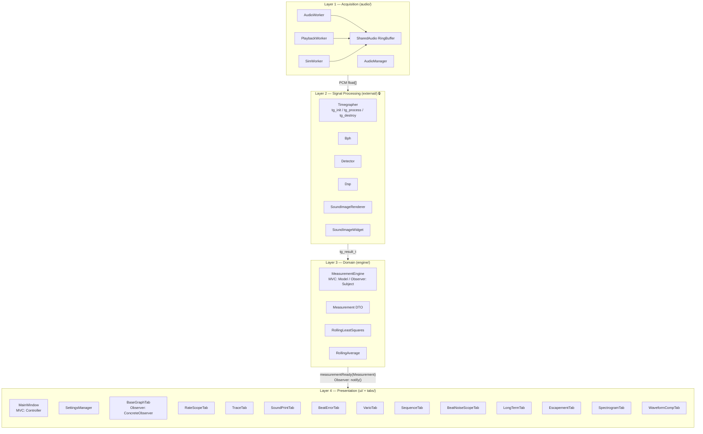
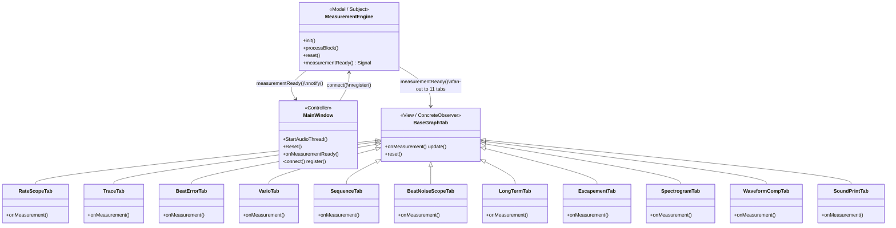

# God Object 분해 설계 / God Object Decomposition Design

> **작성일 / Date**: 2026-06-10  
> **출처 / Source**: MainWindow.cpp 리팩토링 설계 실습

---

## 1. 배경 및 문제 정의 / Background & Problem Statement

**한국어**

원본 `MainWindow.cpp`(1,540줄)는 단일 클래스 안에 아래 5가지 책임이 혼재한 **God Object**였습니다.

| 책임 / Responsibility | 증상 / Symptom |
|-----------------------|----------------|
| 오디오 스레드 관리 | `StartAudioThread`, `StopAudioThread` 직접 구현 |
| DSP / 신호 처리 | `tg_process` 호출 및 버퍼 복사 |
| Rate·Beat·Amplitude 계산 | RLS, Rolling Average 직접 보유 |
| 그래프 렌더링 (11개) | QCustomPlot 조작 코드 분산 |
| UI 상태 관리 | QSettings 직접 읽기/쓰기 |

**English**

The original `MainWindow.cpp` (1,540 lines) was a **God Object** mixing five responsibilities in a single class.

| 책임 / Responsibility | 증상 / Symptom |
|-----------------------|----------------|
| Audio thread lifecycle | `StartAudioThread` / `StopAudioThread` implemented inline |
| DSP / signal processing | Direct `tg_process` calls and buffer copies |
| Rate · Beat · Amplitude calculation | RLS and Rolling Average owned directly |
| Graph rendering (11 tabs) | QCustomPlot manipulation scattered throughout |
| UI state persistence | QSettings read/write inline |

---

## 2. 아키텍처 목표 / Architecture Goals

**한국어**

- **병렬 개발**: 11개 그래프를 여러 팀원이 독립적으로 작업
- **AP-3 ≤3-파일 규칙**: 새 그래프 추가 = `NewTab.h` + `NewTab.cpp` + `MainWindow.cpp` 3줄
- **레이어 분리**: 의존성이 항상 아래 방향(Acquisition → Domain → Presentation)

**English**

- **Parallel development**: 11 graph tabs developed independently by separate team members
- **AP-3 ≤3-file rule**: Adding a new graph = `NewTab.h` + `NewTab.cpp` + 3 lines in `MainWindow.cpp`
- **Layer separation**: Dependencies always flow downward (Acquisition → Domain → Presentation)

---

## 3. 적용 아키텍처 패턴 / Applied Architecture Patterns

**한국어**

세 가지 패턴을 중첩 적용했습니다.

| 패턴 / Pattern | 역할 / Role |
|----------------|------------|
| **Layered Architecture** | 4개 레이어로 책임 분리 |
| **MVC** | Model(Engine) → Controller(MainWindow) → View(11 Tabs) |
| **Observer** | Engine이 Subject, 11개 탭이 ConcreteObserver |
| **Pipe-and-Filter** | PCM → HPF → Envelope → Detector → Events → Measurement |

**English**

Three patterns are applied in combination.

| 패턴 / Pattern | 역할 / Role |
|----------------|------------|
| **Layered Architecture** | Four layers with clear responsibility boundaries |
| **MVC** | Model (Engine) → Controller (MainWindow) → View (11 Tabs) |
| **Observer** | Engine is Subject; 11 tabs are ConcreteObservers |
| **Pipe-and-Filter** | PCM → HPF → Envelope → Detector → Events → Measurement |

---

## 4. 레이어 아키텍처 다이어그램 / Layered Architecture Diagram



---

## 5. Pipe-and-Filter 다이어그램 / Pipe-and-Filter Diagram

**한국어**

오디오 취득부터 측정값 생성까지 단방향 파이프라인입니다. 각 단계는 이전 단계의 출력만 소비합니다.

**English**

A one-way pipeline from audio acquisition to measurement output. Each stage consumes only the output of the previous stage.

```mermaid
graph LR
    MIC[🎙 Microphone\nPCM float32]
    HPF[HPF Filter\nexternal/Dsp]
    ENV[Envelope Filter\nexternal/Dsp]
    DET[Adaptive Detector\nexternal/Detector]
    EVT[A/C Events\ntg_event_t]
    CALC[Rate · Beat · Amplitude\nengine/MeasurementEngine]
    DTO[Measurement DTO\nengine/Measurement.h]

    MIC -->|"raw float[]"| HPF
    HPF -->|"filtered float[]"| ENV
    ENV -->|"rectified float[]"| DET
    DET -->|"tg_result_t"| EVT
    EVT -->|"AcousticEvent[]"| CALC
    CALC -->|"measurementReady()"| DTO
```



---

## 6. MVC + Observer 다이어그램 / MVC + Observer Diagram

**한국어**

MVC의 Model이 동시에 Observer의 Subject입니다. `measurementReady()` Qt Signal이 `notify()`에 해당하고, `QObject::connect()`가 `register()`에 해당합니다.

**English**

The MVC Model is simultaneously the Observer Subject. The `measurementReady()` Qt Signal acts as `notify()`, and `QObject::connect()` acts as `register()`.



---

## 7. 패키지 다이어그램 / Package Diagram

**한국어**

C++에는 `package` 키워드가 없으므로 디렉토리 + CMake `target_include_directories`로 레이어를 강제합니다.

**English**

C++ has no `package` keyword, so layers are enforced via directory structure and CMake `target_include_directories`.

```mermaid
graph TD
    subgraph src["src/"]
        subgraph audio["audio/ — Layer 1"]
            AudioWorker
            PlaybackWorker
            SimWorker
            SharedAudio
            AudioManager
        end

        subgraph external["external/ 🔒 — Layer 2\n(수정 금지 / Do Not Modify)"]
            Timegrapher
            Bph
            Detector
            Dsp
            SoundImageRenderer
            SoundImageWidget
            qcustomplot
        end

        subgraph engine["engine/ — Layer 3"]
            MeasurementEngine
            Measurement
            RollingLeastSquares
            RollingAverage
        end

        subgraph tabs["tabs/ — Layer 4"]
            BaseGraphTab
            RateScopeTab
            TraceTab
            SoundPrintTab
            BeatErrorTab
            VarioTab
            SequenceTab
            BeatNoiseScopeTab
            LongTermTab
            EscapementTab
            SpectrogramTab
            WaveformCompTab
        end

        subgraph ui["ui/ — Layer 4"]
            MainWindow
            SettingsManager
        end
    end

    audio -->|"float PCM"| external
    external -->|"tg_result_t"| engine
    engine -->|"Measurement DTO"| tabs
    engine -->|"Measurement DTO"| ui
```



---

## 8. 디렉토리 구조 / Directory Structure

**한국어**

각 디렉토리가 하나의 아키텍처 레이어에 대응합니다. `external/`은 외부 라이브러리이므로 수정하지 않습니다.

**English**

Each directory maps to one architectural layer. `external/` contains third-party libraries and must not be modified.

```
src/
├── Main.cpp
├── CMakeLists.txt
│
├── audio/                    ← Layer 1: Acquisition
│   ├── AudioWorker.h/.cpp
│   ├── PlaybackWorker.h/.cpp
│   ├── SimWorker.h/.cpp
│   ├── SharedAudio.h
│   └── AudioManager.h/.cpp   ← NEW: thread lifecycle manager
│
├── external/                 ← Layer 2: Signal Processing 🔒 (수정 금지)
│   ├── Timegrapher.h/.cpp    (tg_init / tg_process / tg_destroy)
│   ├── Bph.h/.cpp
│   ├── Detector.h/.cpp
│   ├── Dsp.h/.cpp
│   ├── SoundImageRenderer.h/.cpp
│   ├── SoundImageWidget.h/.cpp
│   ├── qcustomplot.h/.cpp
│   ├── WatchSynthStream.h/.cpp
│   ├── WavStreamWriter.h/.cpp
│   ├── WaveHeader.h
│   ├── LinuxAudio.h/.cpp
│   └── WindowsAudio.h/.cpp
│
├── engine/                   ← Layer 3: Domain
│   ├── Measurement.h         (DTO: AcousticEvent + Measurement struct)
│   ├── MeasurementEngine.h/.cpp  (MVC Model / Observer Subject)
│   ├── RollingLeastSquares.h/.cpp
│   └── RollingAverage.h/.cpp
│
├── tabs/                     ← Layer 4: Presentation — 11 graph tabs
│   ├── BaseGraphTab.h        (MVC View interface / Observer interface)
│   ├── RateScopeTab.h/.cpp   (Graph 1: Rate scatter + Scope waveform)
│   ├── TraceTab.h/.cpp       (Graph 2: Rate error trace over time)
│   ├── SoundPrintTab.h/.cpp  (Graph 3: Sound print bitmap)
│   ├── BeatErrorTab.h/.cpp   (Graph 4: Beat error ms)
│   ├── VarioTab.h/.cpp       (Graph 5: Amplitude degrees)
│   ├── SequenceTab.h/.cpp    (Graph 6: Beat interval sequence)
│   ├── BeatNoiseScopeTab.h/.cpp  (Graph 7: A/C peak amplitude scope)
│   ├── LongTermTab.h/.cpp    (Graph 8: Long-term rate trace)
│   ├── EscapementTab.h/.cpp  (Graph 9: T1→T3 escapement interval)
│   ├── SpectrogramTab.h/.cpp (Graph 10: Spectrogram — placeholder)
│   └── WaveformCompTab.h/.cpp (Graph 11: Tic vs Toc waveform overlay)
│
└── ui/                       ← Layer 4: Presentation — controller + settings
    ├── MainWindow.h/.cpp     (MVC Controller)
    ├── MainWindow.ui
    └── SettingsManager.h/.cpp  ← NEW: QSettings persistence
```

---

## 9. 핵심 인터페이스 / Key Interfaces

### 9-1. Measurement DTO

**한국어**

모든 11개 탭이 소비하는 공유 데이터 구조체입니다. MeasurementEngine이 생산하고 Qt Signal로 전달합니다.

**English**

The shared data structure consumed by all 11 tabs. Produced by MeasurementEngine and delivered via Qt Signal.

```cpp
struct AcousticEvent {
    double samplePos;          // 이벤트 위치 / event sample position
    bool   isA;                // true = A(T1), false = C(T3)
    float  peakValue;
    bool   hasRatePoint;
    double wrappedRateError;   // [-10, +10] ms
    bool   isTic;
    bool   hasEscapementMs;
    double escapementMs;       // T1→T3 interval (ms)
};

struct Measurement {
    QVector<double>       pcm;           // 처리된 PCM / processed PCM
    QVector<double>       threshold;
    QVector<float>        rawPcm;        // 원본 PCM (SoundPrintTab용) / raw PCM for SoundPrintTab
    QVector<AcousticEvent> events;
    uint64_t              graphTickStart, graphTickEnd;
    bool   synced;      int detectedBph;
    bool   rateValid;   double rateErrorSpd;   // s/day
    bool   beatErrorValid; double beatErrorMs;
    bool   amplitudeValid; double amplitudeDeg;
    int    samplesPerSecond;
};
```

### 9-2. BaseGraphTab 인터페이스 / BaseGraphTab Interface

**한국어**

AP-3 규칙의 핵심: 새 탭은 이 인터페이스만 구현하면 됩니다.

**English**

The core of the AP-3 rule: a new tab only needs to implement this interface.

```cpp
class BaseGraphTab : public QWidget {
    Q_OBJECT
public:
    virtual void reset() = 0;
public slots:
    virtual void onMeasurement(const Measurement &m) = 0;  // Observer: update()
};
```

### 9-3. Observer 연결 패턴 / Observer Connection Pattern

**한국어**

MainWindow 생성자에서 모든 탭을 일괄 등록합니다. 탭 추가 시 `connectTab(mNewTab)` 한 줄만 추가합니다.

**English**

All tabs are registered in bulk inside the MainWindow constructor. Adding a tab requires only one call: `connectTab(mNewTab)`.

```cpp
// MainWindow::MainWindow() — Observer: register()
auto connectTab = [&](BaseGraphTab *tab) {
    QObject::connect(mEngine, &MeasurementEngine::measurementReady,
                     tab, &BaseGraphTab::onMeasurement,
                     Qt::QueuedConnection);  // thread-safe across Worker→Main
};
connectTab(mRateScopeTab);
connectTab(mTraceTab);
// ... 11개 전부 / all 11 tabs
```

---

## 10. 새 그래프 탭 추가 방법 (AP-3) / How to Add a New Graph Tab (AP-3)

**한국어**

≤3개 파일 변경으로 새 그래프를 추가할 수 있습니다.

**English**

A new graph can be added with ≤3 file changes.

| 단계 / Step | 작업 / Action | 파일 / File |
|-------------|--------------|------------|
| 1 | `BaseGraphTab` 상속 클래스 헤더 작성 | `tabs/NewTab.h` (신규 / new) |
| 2 | `onMeasurement()`, `reset()` 구현 | `tabs/NewTab.cpp` (신규 / new) |
| 3 | MainWindow에 포인터 선언 + `connectTab()` + `addTab()` | `ui/MainWindow.h/.cpp` (3줄) |

```cpp
// MainWindow.h — 1줄 추가 / add 1 line
NewTab *mNewTab = nullptr;

// MainWindow.cpp constructor — 2줄 추가 / add 2 lines
mNewTab = new NewTab(this);
connectTab(mNewTab);
ui->GraphicsTabWidget->addTab(mNewTab, "New Graph");
```

---

## 11. CMake include 전략 / CMake Include Strategy

**한국어**

모든 서브디렉토리를 include path에 추가해 `#include "File.h"` 형식(경로 없이)을 사용합니다. `external/`의 수정 금지 파일들이 include 경로를 바꾸지 않아도 됩니다.

**English**

All subdirectories are added to the include path so every file uses `#include "File.h"` (no path prefix). Files in `external/` that must not be modified do not need include path changes.

```cmake
target_include_directories(TimeGrapher PRIVATE
    ${CMAKE_CURRENT_SOURCE_DIR}          # src/
    ${CMAKE_CURRENT_SOURCE_DIR}/audio
    ${CMAKE_CURRENT_SOURCE_DIR}/engine
    ${CMAKE_CURRENT_SOURCE_DIR}/external
    ${CMAKE_CURRENT_SOURCE_DIR}/tabs
    ${CMAKE_CURRENT_SOURCE_DIR}/ui
)
```
