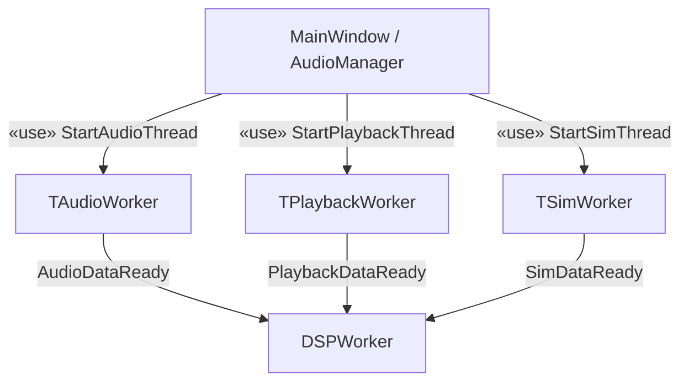
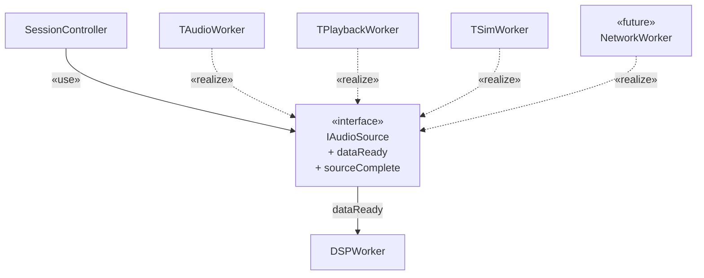
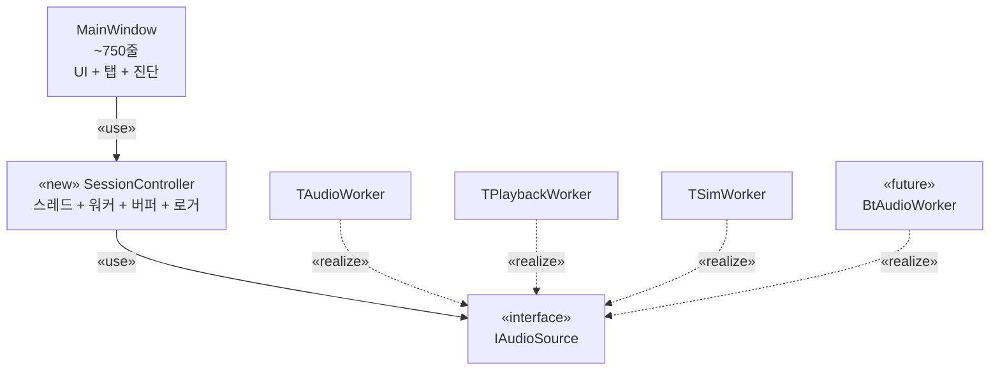
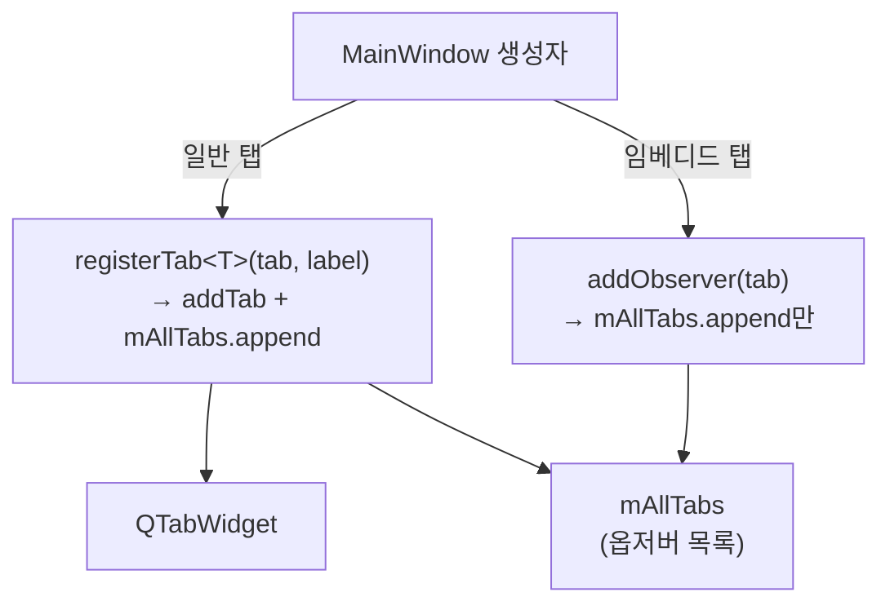
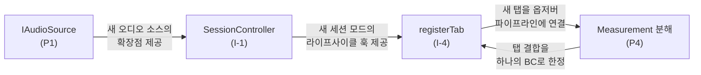

# 확장성 전술 종합 문서

> **참고:** 이 문서는 발표 준비용 한국어 요약본입니다.  
> 공식 아키텍처 산출물은 `docs/milestone2/extensibility/extensibility-tactics-synthesis.md` (영문)를 기준으로 합니다.

---

## 개요

Milestone 2 리팩터링에서 적용한 확장성 전술 중 효과성이 가장 큰 4가지를 선별합니다. 각 전술은 TimeGrapher 요구사항에서 직접 도출한 확장 시나리오(새로운 오디오 소스 추가, 새 그래프 탭 추가, 새 세션 모드 추가)를 보호합니다. 이 전술들은 레이어드 구조로 맞물려 각 확장 경로의 수정 범위(blast radius)를 최소화합니다.

---

## 전술 1 — 의존성 역전: `IAudioSource` 인터페이스 (P1)

### 확장 시나리오

> "네트워크 스트림 오디오 소스를 추가하여 원격 시계 분석을 지원한다."

### AS-IS



`MainWindow`가 세 개의 구체 워커 타입에 직접 의존했습니다. 워커마다 시그널 이름이 달라(`AudioDataReady`, `PlaybackDataReady`, `SimDataReady`) `connect()` 블록이 세 벌 복사되어 있었고, 네 번째 소스를 추가하려면 `MainWindow`와 `AudioManager` 모두를 수정해야 했습니다.

### TO-BE



`SessionController`는 `IAudioSource*` 하나만 보유하고 통합된 `dataReady` / `sourceComplete` 시그널에 연결합니다. 새 소스 추가 시:

1. 새 워커 클래스에서 `IAudioSource`를 구현 (신규 파일)
2. `SessionController::startNetwork()` 메서드 추가 (한 곳)
3. **다른 어떤 파일도 수정하지 않음**

### 모듈 뷰

| 모듈 | 역할 | 의존 대상 |
|------|------|----------|
| `IAudioSource` | 추상 오디오 소스 계약 | Qt 시그널 인프라 |
| `TAudioWorker`, `TPlaybackWorker`, `TSimWorker` | 구체 소스 구현 | `IAudioSource` |
| `SessionController` | 소스 라이프사이클 관리 | `IAudioSource` (추상) |
| `DSPWorker` | PCM 소비자 | `IAudioSource::dataReady` 시그널 |

### Rationale

**의존성 역전 원칙(DIP)** — 고수준 정책(세션 관리)이 저수준 상세(어떤 오디오 하드웨어/파일 포맷)에 의존하지 않습니다. `SessionController`는 추상에만 의존합니다.

**개방/폐쇄 원칙(OCP)** — `IAudioSource`를 구현하는 신규 워커를 추가해도 `SessionController`는 수정되지 않습니다. 시그널 통합으로 `connect()` 블록이 세 벌에서 한 벌로 줄어, 복사-붙여넣기 발산 버그를 원천 차단합니다.

**이 전술이 없으면:** 네 번째 소스 추가 시 `MainWindow`, `AudioManager`, 신규 `connect()` 블록 — 파일 3개, 분기 3군데 수정. **이 전술 적용 후:** 신규 파일 1개.

---

## 전술 2 — 경계 컨텍스트 분해: `Measurement` 구조체 분해 (P4)

### 확장 시나리오

> "시계 레이트(rate) 추세를 시간 축으로 표시하는 새 그래프 탭을 추가한다."

### AS-IS

`Measurement`는 PCM 신호 데이터, 어쿠스틱 이벤트, 동기화 상태, 시계 메트릭(bool + double 쌍)을 한 flat struct에 담은 God-struct였습니다. 13개 탭 모두 같은 `const Measurement &m`을 수신하며 4개 관심사 전체의 내부 레이아웃에 암묵적으로 결합되어 있었습니다.

### TO-BE

`Measurement`가 두 경계 컨텍스트에 정렬된 Value Object를 담는 얇은 컨테이너로 재구성됩니다:

```cpp
struct SignalFrame {              // 신호 처리 컨텍스트
    QVector<double> pcm, threshold;
    QVector<float>  hpfPcm, rawPcm;
    uint64_t        tickStart = 0, tickEnd = 0;
    int             samplesPerSecond = 48000;
};

struct WatchMetrics {             // 시계 분석 컨텍스트
    std::optional<double> rate;       // s/day
    std::optional<double> amplitude;  // degrees
    std::optional<double> beatError;  // ms
};

struct Measurement {
    SignalFrame            signal;
    QVector<AcousticEvent> events;
    bool                   synced      = false;
    int                    detectedBph = 0;
    WatchMetrics           metrics;
};
```

### 모듈 뷰 — 탭 소비자 분류

| 탭 그룹 | 사용 컨텍스트 | 접근 필드 |
|---------|-------------|---------|
| `BeatNoiseScopeTab`, `EscapementTab`, `FilterScopeTab`, `SoundPrintTab` | 신호만 | `signal`, `events` |
| `SequenceTab`, `LongTermTab`, `TraceTab`, `VarioTab` | 분석만 | `metrics` |
| `RateScopeTab`, `SpectrogramTab`, `BeatErrorTab`, `SweepScopeTab` | 둘 다 | `signal` + `events` + `metrics` |
| `MainWindow` | 동기화 + 분석 | `noSignal`, `synced`, `detectedBph`, `metrics` |

### 새 탭 추가 예시

rate 추세 탭은 `m.metrics.rate`만 읽으면 됩니다 — PCM 필드와 완전히 분리:

```cpp
void RateTrendTab::update(const Measurement &m) {
    if (!m.metrics.rate) return;
    mSeries->append(mFrameIndex++, *m.metrics.rate);
}
```

기존 파일 수정 없음. `registerTab()`으로 등록하면 `MeasurementEngine`이 자동으로 옵저버 목록에 포함합니다.

### Rationale

**경계 컨텍스트 정렬(DDD)** — TimeGrapher 도메인은 두 개의 독립된 언어 체계를 가집니다: 신호 처리("sample", "tick", "onset", "HPF")와 시계 분석("rate s/day", "amplitude °", "beat error ms"). 구조체 경계가 컨텍스트 경계와 일치하면 탭 작성자는 자신이 속한 컨텍스트만 이해하면 됩니다.

**`std::optional` 도입** — AS-IS의 `bool rateValid + double rateErrorSpd` 패턴은 컴파일러가 유효성 미확인 읽기를 막지 못했습니다. `std::optional<double>`는 `has_value()` 확인을 강제하므로 잘못된 읽기가 컴파일 에러가 됩니다. 새 메트릭 추가도 필드 하나로 끝납니다 — `bool` 플래그 추가 없음.

**이 전술이 없으면:** 새 메트릭마다 `bool + double` 필드 2개 추가, 모든 소비자 수정. **이 전술 적용 후:** `Measurement.h` + `MeasurementEngine.cpp` 2개 파일.

---

## 전술 3 — 관심사 분리: `SessionController` 추출 (I-1) + 탭 등록 헬퍼 (I-4)

### 확장 시나리오

> "Bluetooth 오디오 세션 모드와 전용 표시 탭을 추가한다."

두 전술이 맞물려 동작합니다: I-1은 세션 모드 확장점을, I-4는 탭 등록 확장점을 각각 국소화합니다.

### I-1: SessionController 모듈 뷰



Bluetooth 세션 추가 시:
- `BtAudioWorker`가 `IAudioSource` 구현 (신규 파일)
- `SessionController::startBluetooth()` — 한 메서드
- `MainWindow`는 UI 버튼 추가 후 `mSession->startBluetooth(...)` 호출만 — **스레드 로직 없음**

링 버퍼 할당, 로거 초기화, 옵저버 연결은 `SessionController::initRawAudio()`와 `startSourceThread()` 안에 한 번만 작성되어 있으므로, 신규 모드는 이를 그대로 재사용합니다.

### I-4: 탭 등록 헬퍼 모듈 뷰



새 Bluetooth 표시 탭 추가:
- `BtScopeTab`이 `BaseGraphTab` 구현 (신규 파일)
- `mBtScopeTab = registerTab(new BtScopeTab(this), "BT Scope");` — 한 줄
- **`MainWindow` 생성자에 한 줄 추가; 기존 로직 무수정**

### Rationale

**단일 책임 원칙(I-1)** — AS-IS `MainWindow`는 UI 상태, 세션 라이프사이클, 탭 구성, 진단 표시를 동시에 담당했습니다. 각 관심사는 독립적인 변경 이유를 가지므로 SRP를 위반했습니다. `SessionController` 추출로 각 클래스가 하나의 변경 이유만 갖게 됩니다.

**DRY — 링 버퍼 및 로거 초기화(I-1)** — AS-IS에서 `StartAudioThread`, `StartPlaybackThread`, `StartSimThread`가 각각 동일한 `#ifdef ENABLE_LOGGING` 블록과 링 버퍼 `new/delete` 시퀀스를 복사했습니다. `SessionController::initRawAudio()`가 단일 위치가 됩니다 — 신규 모드는 프로토콜을 복사 없이 재사용합니다.

**변경 국소성(I-4)** — AS-IS에서 탭 추가는 `MainWindow` 생성자 내 세 개 블록(생성, 탭 위젯 등록, 옵저버 목록)을 동시에 수정해야 했습니다. `mAllTabs.append`를 빠뜨려도 컴파일 에러가 없었고 탭이 `pause()`/`reset()` 호출을 놓쳤습니다. `registerTab<T>()`로 세 동작이 한 호출로 통합되어 누락이 불가능합니다.

---

## 종합: 전술 → 확장 시나리오 매핑

| 전술 | 보호하는 확장 시나리오 | 추가 파일 | 수정 파일 |
|------|---------------------|---------|---------|
| P1: `IAudioSource` 인터페이스 | 새 오디오 소스 타입 | 1개 (워커) | 1개 (`SessionController::startXxx`) |
| P4: `Measurement` 분해 | 새 그래프 탭 / 새 메트릭 | 1개 (탭) | 2개 (`Measurement.h`, `MeasurementEngine.cpp`) |
| I-1: `SessionController` 추출 | 새 세션 모드 | 1개 (워커) | 1개 (`SessionController`) |
| I-4: 탭 등록 헬퍼 | 새 일반 탭 | 1개 (탭) | 1줄 (`MainWindow` 생성자) |

### 전술 간 연계 구조



각 전술이 서로 다른 수정 비용 범주를 제거합니다:
- **P1**: 인터페이스 산포 제거 (새 소스 = 파일 1개, 기존 3개 파일 수정 불필요)
- **P4**: 구조체 결합 제거 (새 메트릭 = 필드 1개, 모든 소비자 수정 불필요)
- **I-1**: 코드 중복 제거 (새 모드는 init 재사용, 복붙 불필요)
- **I-4**: 산재 등록 제거 (새 탭 = 호출 1번, 3군데 수정 불필요)

이 전술들이 함께 Supplementary Specification의 목표를 달성합니다:
**새로운 측정 모드, 필터, 그래프, 디스플레이를 기존 모듈의 대규모 재설계 없이 추가할 수 있습니다.**
