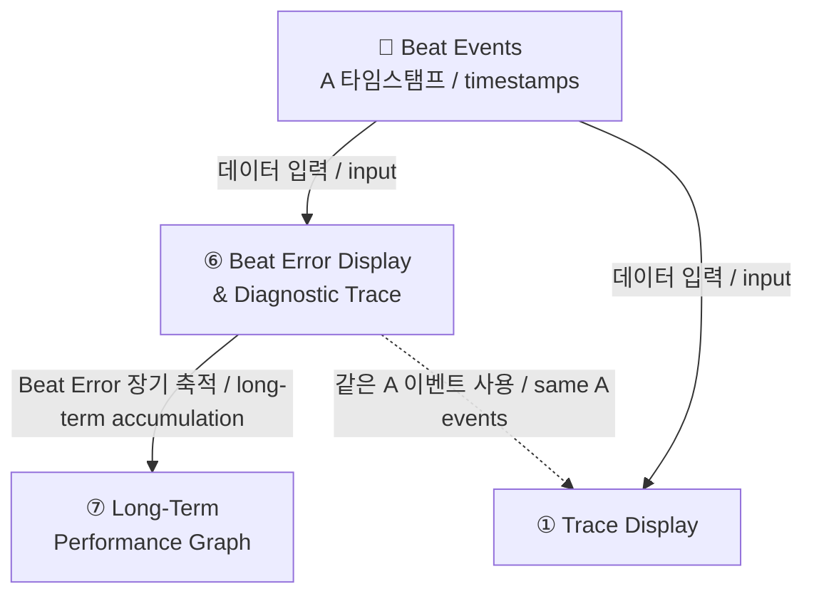

# Beat Error Display & Diagnostic Trace

---

## 그래프 목적 / Purpose

**한국어**

tick과 tock 사이의 시간 비대칭을 실시간으로 수치화하고 시간 추이를 시각화하여
이스케이프먼트의 조율 상태를 진단하는 그래프.

- Beat Error 수치가 **0.6 ms 이하**인지 판별
- 시간에 따른 Beat Error **변화 추이** 모니터링
- Rate 측정값의 **신뢰도 판단** 보조

> 핵심: Rate가 정상이어도 Beat Error가 클 수 있음 — 두 지표는 독립적

**English**

A graph that quantifies tick/tock time asymmetry in real time and visualizes the trend over time
to diagnose the escapement adjustment state.

- Determine whether Beat Error is **below 0.6 ms**
- Monitor **trend changes** in Beat Error over time
- Assist in judging **reliability of Rate measurements**

> Key: Rate can be normal even when Beat Error is large — the two metrics are independent

**화면 구조 / Screen Layout:**

```
┌─────────────────────────────────────────────────────────────────┐
│  BEAT ERROR  0.8 ms                          [Beat Error]       │
├─────────────────────────────────────────────────────────────────┤
│      │                                                          │
│  2.0─│                                                          │
│      │                                                          │
│  1.0─│  * *                                                     │  ← Beat Error 점 / dots
│      │       *  *                                               │
│  0.6─│─ ─ ─ ─ ─ ─ ─ ─ ─ ─ ─ ─ ─ ─ ─ ─ ─ ─ ─ ─ ─ ─ ─ ─ ─   │  ← 기준선 / baseline
│      │              * * * * * * * * * * * * * * *              │
│  0.0─│                                                          │
│      └──────┬──────┬──────┬──────┬──────┬──────────            │
│           2:00   4:00   6:00   8:00  10:00 min                  │
└─────────────────────────────────────────────────────────────────┘
```

| 축 / Axis | 내용 / Content | 단위 / Unit | 범위 / Range |
|---|---|---|---|
| **X축** | 경과 시간 / Elapsed time | min | 0 ~ N |
| **Y축** | Beat Error | ms | 0 ~ 2.0 ms |
| **기준선** | 정상/비정상 경계 / Normal boundary | ms | 0.6 ms |

---

## 소스 데이터 및 공식 / Source Data and Formulas

**한국어**

**입력 데이터:** Beat event 타임스탬프 — A 이벤트 (is_onset = 1) 3개 연속

```
tg_result_t.events[]        ← A 이벤트 (is_onset = 1)
tg_result_t.sync_status     ← SYNCED 상태일 때만 계산
tg_result_t.detected_bph    ← BPH 표시용
```

**Beat Error 계산:**

```
A 이벤트 3개 연속 수집:
  A0, A1, A2

t1 = A1.time_seconds - A0.time_seconds   ← tick 구간 (첫 번째 half-beat)
t2 = A2.time_seconds - A1.time_seconds   ← tock 구간 (두 번째 half-beat)

Beat Error = |t1 - t2| / 2 × 1000       ← ms 변환
```

**표시값 (이동 평균 / Rolling Average):**

```
RollingAverage(10).Add(BeatErrorMs)
DisplayValue = RollingAverage.GetAverage()
```

**English**

**Input data:** Beat event timestamps — 3 consecutive A events (is_onset = 1)

```
tg_result_t.events[]        ← A events (is_onset = 1)
tg_result_t.sync_status     ← compute only when SYNCED
tg_result_t.detected_bph    ← for BPH display
```

**Beat Error calculation:**

```
Collect 3 consecutive A events:
  A0, A1, A2

t1 = A1.time_seconds - A0.time_seconds   ← tick interval (first half-beat)
t2 = A2.time_seconds - A1.time_seconds   ← tock interval (second half-beat)

Beat Error = |t1 - t2| / 2 × 1000       ← convert to ms
```

**Display value (Rolling Average):**

```
RollingAverage(10).Add(BeatErrorMs)
DisplayValue = RollingAverage.GetAverage()
```

---

## 그래프 예시 / Graph Examples

### Case 1: 정상 시계 / Normal Watch

```
Beat Error (ms)
2.0─│
    │
1.0─│
0.6─│─ ─ ─ ─ ─ ─ ─ ─ ─ ─ ─ ─ ─ ─  ← 기준선 / baseline
    │* * * * * * * * * * * * * * *   ← 기준선 아래 안정 / stable below baseline
0.0─│________________________________
     시간 / time →
```

> 한국어: Beat Error < 0.6 ms, 안정적으로 수평 유지. 이스케이프먼트 조율 상태 양호  
> English: Beat Error < 0.6 ms, stable horizontal. Escapement well adjusted

---

### Case 2: Beat Error 큰 시계 / High Beat Error Watch

```
Beat Error (ms)
2.0─│
    │* *   * *   * *   * *           ← 기준선 훨씬 위 / far above baseline
1.0─│    *      *      *
0.6─│─ ─ ─ ─ ─ ─ ─ ─ ─ ─ ─ ─ ─ ─  ← 기준선 / baseline
    │
0.0─│________________________________
     시간 / time →
```

> 한국어: Beat Error > 1.0 ms. tick/tock 비대칭 심각 → 이스케이프먼트 조정 필요  
> English: Beat Error > 1.0 ms. Severe tick/tock asymmetry → escapement adjustment required

---

### Case 3: 워밍업 후 안정화 / Stabilizing Watch

```
Beat Error (ms)
2.0─│
    │* *                             ← 초기 불안정 / initially unstable
1.0─│     * *
0.6─│─ ─ ─ ─ ─*─*─*─*─*─*─*─*─*─  ← 점차 안정화 / gradually stabilizing
    │
0.0─│________________________________
     시간 / time →
```

> 한국어: 시계를 올려놓은 직후 불안정 → 시간이 지나면서 기준선 아래로 안정화  
> English: Unstable immediately after placing watch → stabilizes below baseline over time

---

### Case 4: Beat Error 장기 드리프트 / Long-term Beat Error Drift

```
Beat Error (ms)
2.0─│
    │                        * *     ← 장기 증가 추세 / long-term increasing
1.0─│               * * * *
0.6─│─ ─ ─ ─ ─*─*─*─ ─ ─ ─ ─ ─ ─  ← 기준선 / baseline
    │* * * * *
0.0─│________________________________
     시간 / time →
```

> 한국어: Rate/Amplitude는 정상이지만 Beat Error만 장기적으로 증가 → 충격핀 마모 또는 팔레트 포크 간격 변화 징후  
> English: Rate/Amplitude normal but Beat Error increasing long-term → signs of impulse pin wear or pallet fork gap change

---

## 정상 기준 / Normal Criteria

| Beat Error 값 / Value | 상태 / Status |
|---|---|
| 0.0 ~ 0.6 ms | ✅ 정상 / Normal |
| 0.6 ~ 1.0 ms | ⚠️ 경계 / Borderline |
| 1.0 ms 이상 / above | ❌ 조정 필요 / Adjustment required |

---

## 다른 그래프와의 연관 / Relationship with Other Graphs



| 연관 그래프 / Related Graph | 관계 / Relationship |
|---|---|
| **Trace Display** | 동일한 A 이벤트 사용. Trace는 Rate/Amplitude 누적 오차 시각화, Beat Error Display는 tick/tock 비대칭 진단 / Same A events used. Trace: accumulated error visualization; Beat Error: tick/tock asymmetry diagnosis |
| **Long-Term Performance Graph** | 같은 BE 공식 공유. Beat Error Display는 단기 실시간 진단, Long-Term은 장기 모니터링 / Shared BE formula. Beat Error Display: short-term real-time diagnosis; Long-Term: long-term monitoring |
